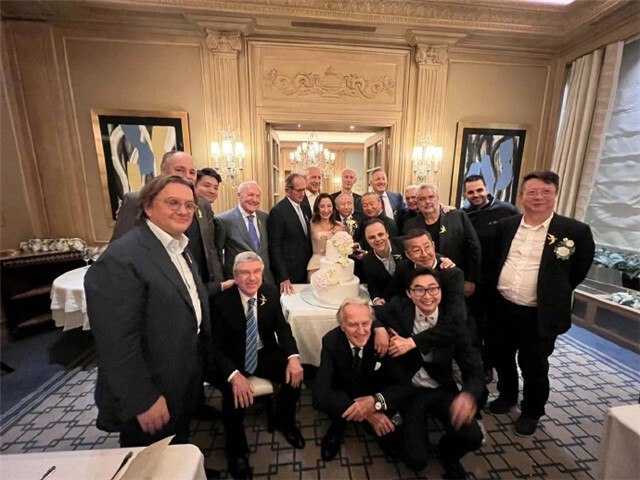

# 61岁杨紫琼与74岁男友举行婚礼，恋爱长跑19年终于修成正果

7月27日，杨紫琼和男友托德Todt举行婚礼，两人正式结婚，有参加婚宴的亲友曝光了婚礼现场照片。

杨紫琼和男友托德激动相拥，两人的脸紧紧地贴在一起，眼神里充满了对彼此的爱意，让人非常羡慕这样的感情。旁边的奥斯卡小金人非常醒目，这也是杨紫琼演艺生涯获得的最大成就。在杨紫琼之前，好莱坞从来不敢想会有亚裔女性可以获得奥斯卡影后，总感觉那是遥不可及的事情，但随着魔幻的政治正确，相信会有越来越多的亚裔拿到这个荣誉。

杨紫琼和托德的婚礼请柬曝光，两人从2004年相识，到今年结婚，已经恋爱长跑19年，时间见证了他们的爱情，感情一直很稳定，特别是在这个年纪，还步入婚姻的殿堂，也能相信他们的爱情是至死不渝的。

杨紫琼和托德的婚礼没有大操大办，仅仅是双方邀请亲朋好友到场，然后进行简单的婚礼仪式，完成婚礼手续，就算正式夫妻了。

杨紫琼1983年当选马来西亚小姐进入演艺圈。直到凭借《瞬息全宇宙》获得奥斯卡金像奖最佳女主角，杨紫琼的演艺事业非常成功。而托德的身份地位更加显赫，他执掌法拉利多年，还是国际汽联的主席，身家远超杨紫琼。

托德有过婚姻还有一个儿子，但他对杨紫琼的爱很真诚，托德和杨紫琼刚恋爱没多久就求婚，可杨紫琼因为自身原因，没有答应。托德没有放弃，求婚多年才让杨紫琼答应订婚。外界一直误会杨紫琼和托德已经结婚，其实是他们之前有结婚的打算。2015年杨紫琼曾说会和托德办婚礼，但后来就忙得不了了之了。

杨紫琼年轻时有过一段婚姻，她26岁时嫁给香港富豪潘迪生，潘迪生在片场认识杨紫琼就对她一见钟情疯狂追求，杨紫琼也陷入爱情的陷阱，很快两人就结婚。但这段婚姻仅仅持续三年，最后就感情不和而离婚。

杨紫琼在这段婚姻里得到的教训是深刻的，她婚后就安心在家“相夫教子”，照顾好丈夫，同时也要培养好和继女的感情。杨紫琼为了婚姻放弃事业，最后还是惨淡收场。离婚后的杨紫琼，花费数年时间，才回到原来娱乐圈的地位，付出了许多努力，而成为武打女星，更是让她身上伤痕累累。

杨紫琼后来有过多段恋情，但她不再为着男人转，从来没有放弃过事业。后来即使杨紫琼和美国医生Alan订婚，对方要求杨紫琼婚后做全职太太，这和杨紫琼的理念不合，双方也取消了订婚。直到遇见托德，对方不干涉杨紫琼的事业，还对杨紫琼非常体贴，正是托德这种难能可贵的品质，杨紫琼和他恋爱19年，从来曝出过什么大的矛盾。

杨紫琼此前多次表示自己不是那种传统的女性，婚姻对她来讲，就是一张纸。

如今杨紫琼和托德结婚，或许她是想自己的人生更加完美一些，毕竟托德当了19年男友，也该有个名分了。

