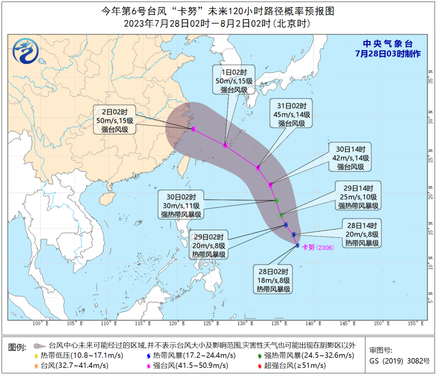
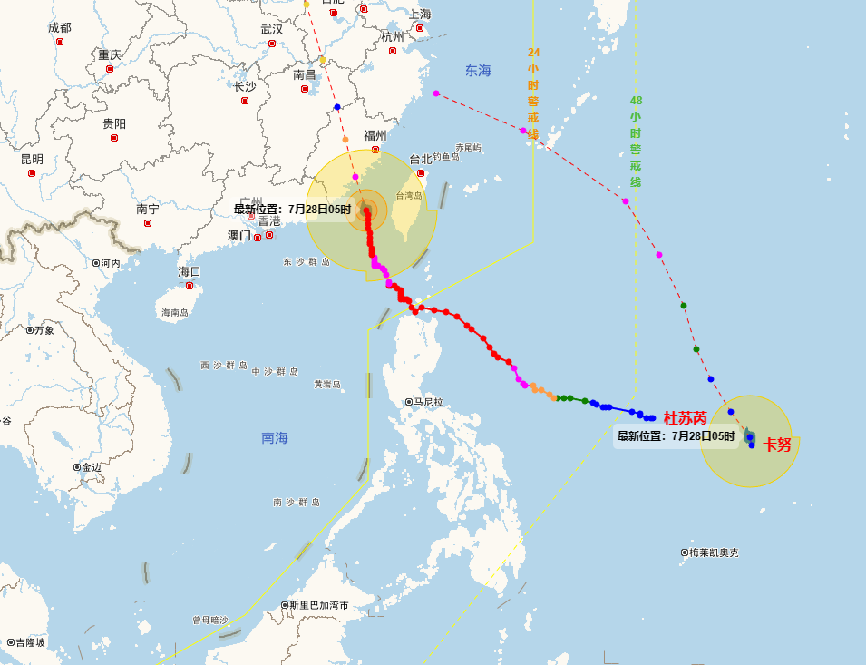
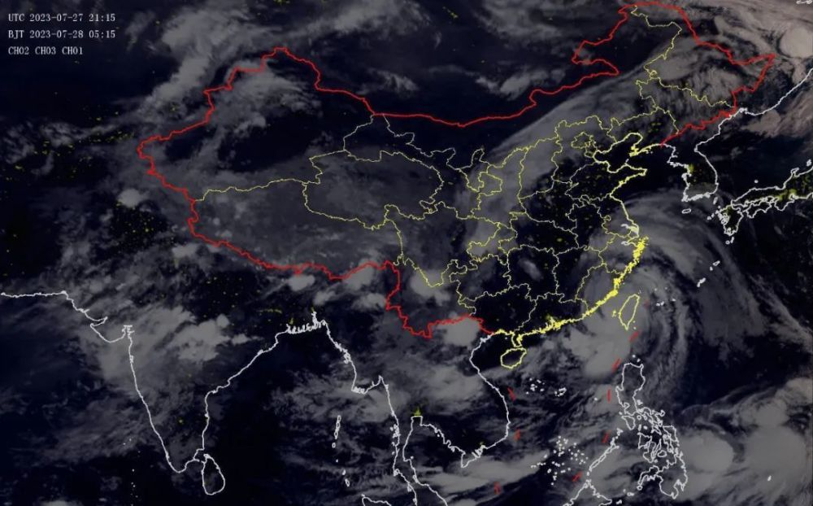

# 中央气象台：今年第6号台风“卡努”已生成，目前为热带风暴级

7月28日凌晨，今年第6号台风“卡努”（Khanun）正式编号。

28日2时，“卡努”位于菲律宾以东洋面距离菲律宾马尼拉偏东方向约1810公里中心附近，最大风力为18米/秒，8级，目前为热带风暴级。

预计“卡努”将以每小时15公里左右的速度，向北偏西方向移动，强度逐渐增强。

“卡努”的名字来自泰国气象部门，意思是热带水果菠萝蜜，那么，“卡努”与“杜苏芮”之间，是否会有相互影响？

中央气象台台风与海洋气象预报中心高级工程师聂高臻表示，目前从两者距离及路径上看，可能不会出现明显的双台风互旋作用，但“卡努”北侧的偏东风未来可能会为“杜苏芮”减弱后的低压环流提供充沛水汽，有助于“杜苏芮”残余环流的维持和陆地上降水的增加。

**来源** ：中央气象台

**编辑** ：段昊书

