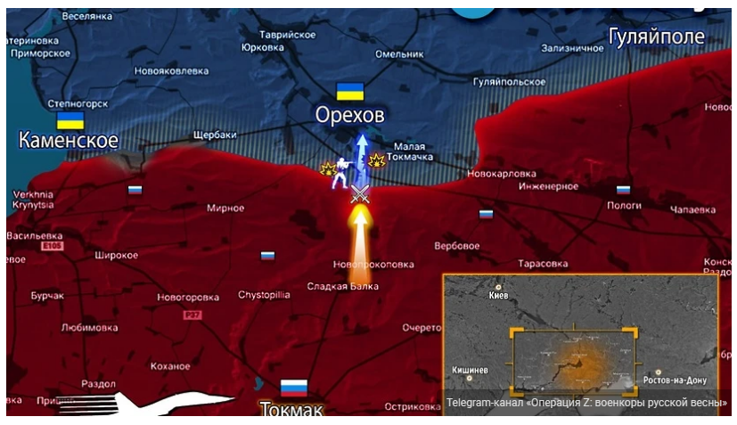
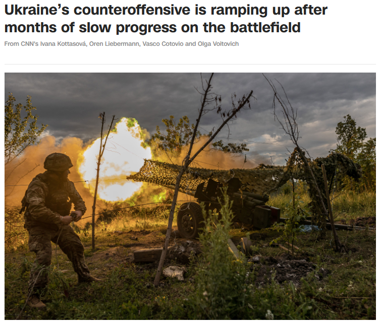
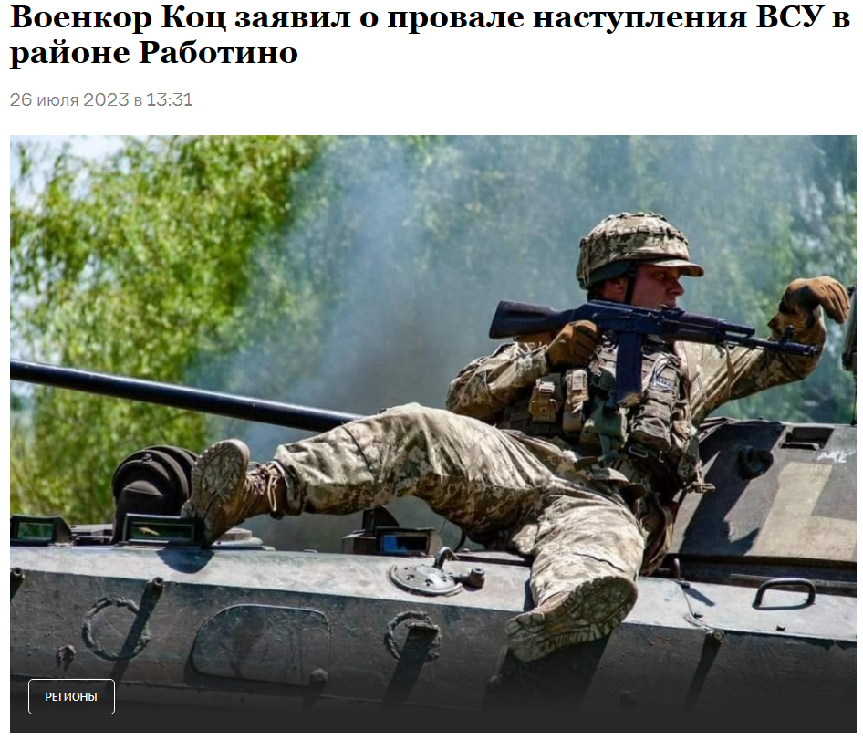
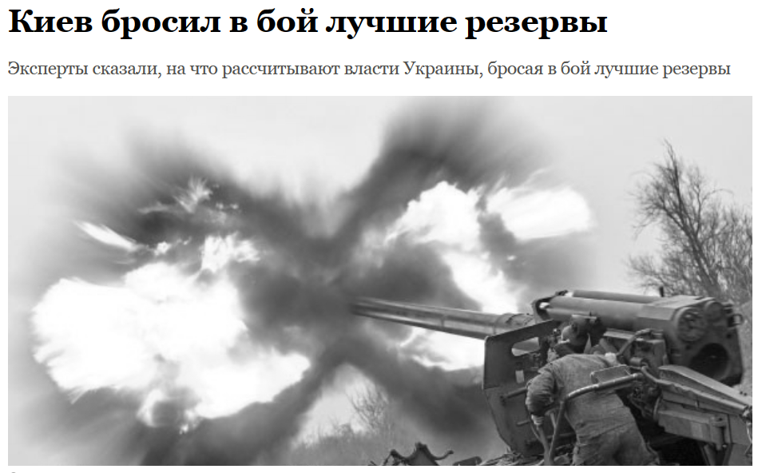

# 反攻进入第二阶段！乌军在扎波罗热猛攻，突破俄方一道防线

就在西方抱怨乌军反攻进展缓慢之际，乌军突然在南部扎波罗热地区发起大规模的猛攻，据称已经把俄方的第一道防线撕开了一个口子。虽然俄乌对战况的描述大不相同，但都认为，乌军的反攻进入第二阶段。

最早发出乌军加大反攻力度消息的是俄方。

据俄罗斯媒体26日介绍，电报频道“Z行动：俄罗斯之春的军事记者”报道称，由北约装备起来的乌军大型装甲集群正试图在扎波罗热地区的罗博季涅村寻求突破。

当天凌晨 4时左右，乌克兰武装部队用直升机发动空袭，有多达 50 辆装甲车投入战斗，以突破俄罗斯武装部队第 291 团的防御。在血腥的战斗中，多达 10
辆布拉德利步兵战车和坦克被俄罗斯武装部队方面摧毁。乌军的部分装备开始撤退，但乌军指挥部又将新的装甲群投入战斗。

其他俄罗斯方面的消息源也报道了乌军的这些猛攻。

“乌克兰武装部队在扎波罗热方向的第二波反攻已经开始，”俄罗斯任命的扎波罗热高级官员弗拉基米尔·罗戈夫周三称，“敌人派出了最大的力量试图在奥列霍夫方向突破我们的防御。”

罗戈夫补充说：“今天清晨，经过大规模的炮兵准备和空袭，乌克兰人对罗博季涅村附近的阵地展开进攻。”他说，乌克兰已楔入俄罗斯的第一道防线。

俄罗斯军事博主雷巴尔描述了南部战线的类似情况。

他们写道：“在一个榴弹炮师和空中力量进行火力准备后，乌克兰军队的突击分队俯冲下来攻击罗博季涅村东北部，”
有数十辆坦克或装甲车参与攻击，“敌人设法渗透到三个区域，”雷巴尔还说。“现在这个地区正在进行激烈的战斗。”

稍后，乌克兰方面和美军官员都证实了乌军取得的重大进展。

据美国有线电视新闻网报道，按乌克兰的说法，在扎波罗热南部地区，特别是在罗博季涅村周围，激烈的战斗仍在继续，乌克兰军队一直试图突破俄罗斯布满地雷的防线。

“我们接近了罗博季涅，但尚未进入定居点。”参与攻势的乌克兰第 47 独立机械化旅告诉美国有线电视新闻网，战斗仍在罗博季涅附近的战壕继续进行。

乌国防部副部长汉娜·马利亚尔说，乌克兰军队也在梅利托波尔和别尔江斯克方向 “逐步推进”。她补充说，在更远的东部，乌克兰正在 “取得进展”
并巩固其在斯塔罗马奥尔斯克地区的地位。

马利亚尔还补充说，俄罗斯试图在库皮扬斯克和利曼方向袭击乌克兰军队，但乌克兰已经
“稳定住了战况”。乌克兰军方总参谋部26日还表示，俄罗斯试图向利曼方向发动袭击，但被挫败。

美国官员则对乌军的进展表示肯定。

美国有线电视新闻网报道称，两名美国官员表示，经过近两个月的缓慢进展，乌克兰在东南部投入了更多部队进行反攻——这表明他们已经确定了俄罗斯防线的潜在弱点。

其中一名官员说，乌克兰军方仍有额外的战斗力储备，但这是致力于反攻的部队的
“主要部分”。直到现在，新投入的部队一直处于预备役状态，因为其他乌克兰部队在空袭和炮火的威胁下，对广泛的俄罗斯防线和雷区取得了缓慢而艰苦的进展。现在，在东南部，乌克兰的反攻已经突破了俄罗斯防线，预备役部队已经进入以利用这个机会。

美国国防部长奥斯汀27日表示，乌克兰现在有“多种选择”，因为基辅投入更多部队对俄罗斯进行持续反攻。

奥斯汀没有评论反攻的状态或具体的战场细节，但他说：“乌克兰为取得成功做好了充分的准备和训练，他们努力战斗，他们一直在努力通过雷区和其他障碍，他们仍然有很大的战斗力。”

但美方对于战事的后续进展仍然态度谨慎。

美国媒体称，即使乌军承诺增加部队进行反攻，其进展也可能不是立竿见影的，因为俄罗斯已经建立了多层防线，他们为此已经准备了几个月。

美国参谋长联席会议主席马克·米利将军上周表示，俄罗斯在乌克兰前线拥有 “非常复杂的纵深防御”，将其与第一次世界大战中的战壕相提并论。

“他们有一个非常广泛的深入安全区，”米利在乌克兰国防联络小组虚拟会议后的简报会上说，然后他们至少有两条，甚至三条主要的防线。但他同时也说：“乌克兰人拥有的是尚未投入的大量战斗力。”

对于乌军此轮大张旗鼓的进攻，俄罗斯国防部没有立即发表评论。但多家俄媒援引前线军事指挥官的说法称，乌克兰武装部队的进攻失败。

战地记者奥列克桑德·科茨在他的电报频道上介绍称，26日早上，在罗博季涅附近，敌人试图用大量装备突破我们的防御，包括坦克和步兵战车，但与6月一样，对乌克兰武装部队来说这次反攻的尝试结局很糟糕。在进攻期间，乌克兰武装部队损失了至少20辆装甲车，其中一半是坦克。他说：“我们的人不只是坚守住了阵地，他们还给敌人带来了痛苦的失败。”

“基辅将最好的预备队投入战斗”，俄《观点报》27日报道称，乌克兰已经开始了新一阶段的反攻，数千名作为预备队的乌克兰军人，在此之前在西方接受训练，现在被投入战斗。美方认为，评估攻击是否会成功可能只需要几天的时间，如果成功，新的行动将持续一到三周。

对此，俄专家认为，乌军将最好的预备队投入战斗，其司令部希望在今年秋天之前取得战术成功，这在西方可以作为一项重大成就提出，从而获得他们所需新的武器供应，包括远程
ATACMS 系统和 F-16 飞机。

报道称，军事专家康斯坦丁·西夫科夫认为，在乌克兰武装部队进攻的第一阶段，敌人挑衅俄罗斯武装部队更积极地使用炮弹，从而试图消耗俄罗斯军方的弹药。他说：“但这一切都是通过巨大的牺牲进行的，并没有给乌军带来任何战术或战略优势。”

“俄军仍然掌握着能够成功防御的所有要素，特别是制空权和火力优势。从军事角度来看，敌人没有能够压制这些的资源。当然，乌克兰司令部预计他们迟早能够显着突破我们的防御，但所有这些都是幻想，”西夫科夫认为。

