# 外媒：朝鲜夜间阅兵展示新型武器装备，包括新型洲际弹道导弹及无人机

【环球网报道】7月27日，朝鲜举行盛大阅兵式庆祝朝鲜祖国解放战争胜利70周年。路透社援引朝中社报道称，朝鲜在这次阅兵中，展示了具备核弹头携带能力的新型洲际弹道导弹及新型无人机。

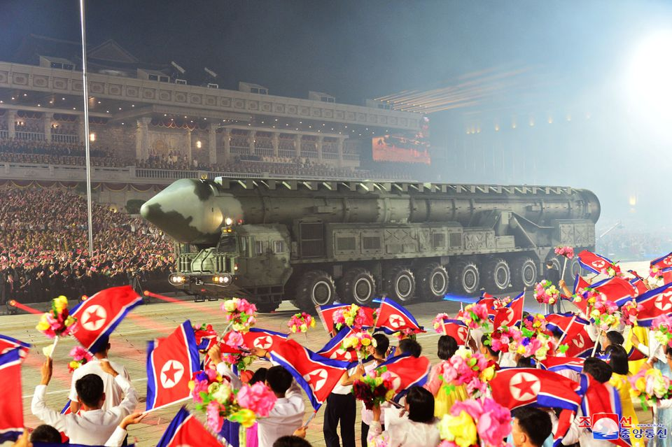

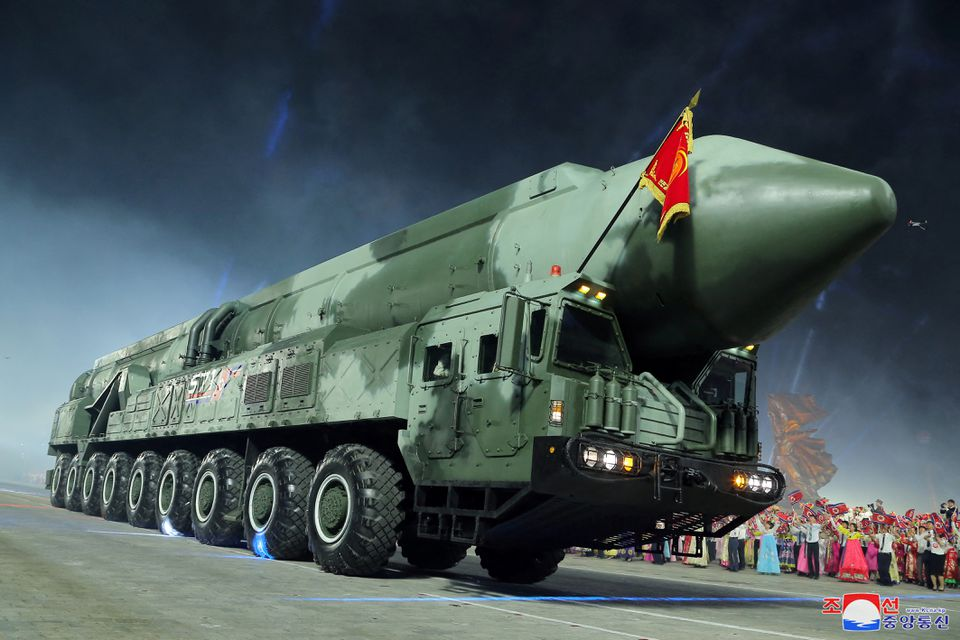

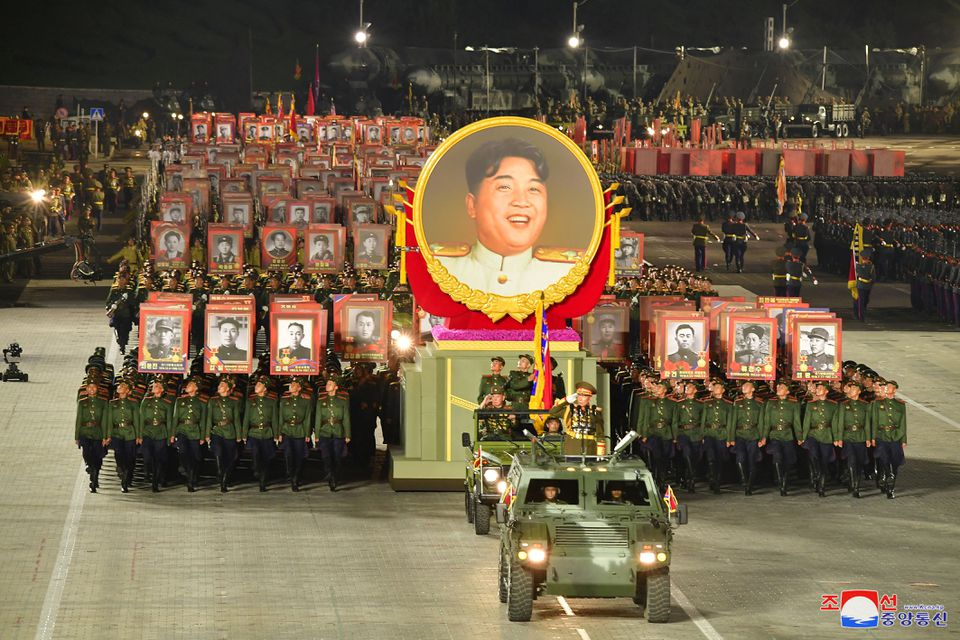

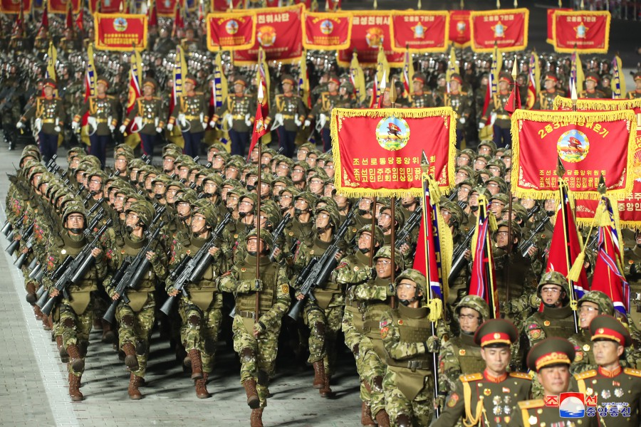

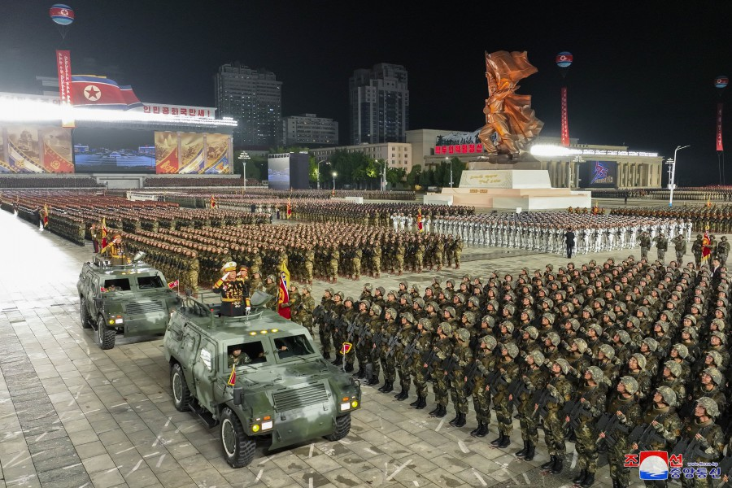

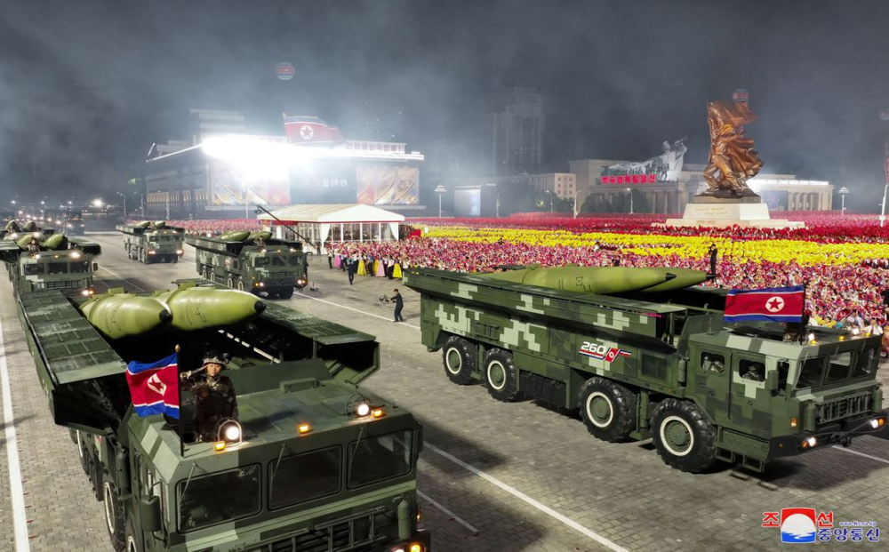

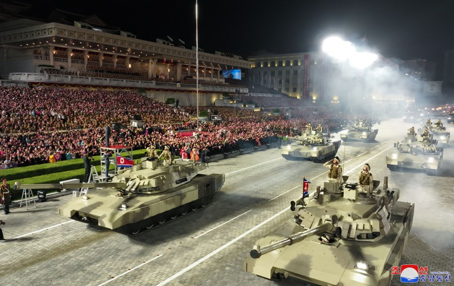

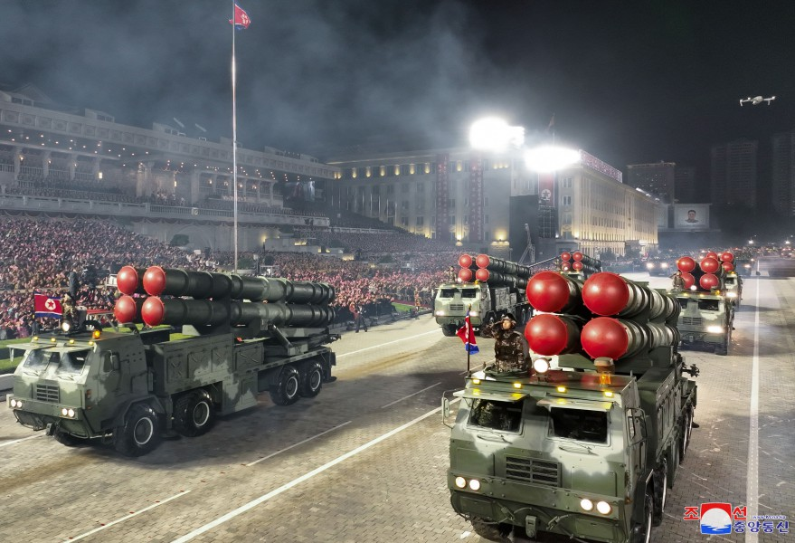

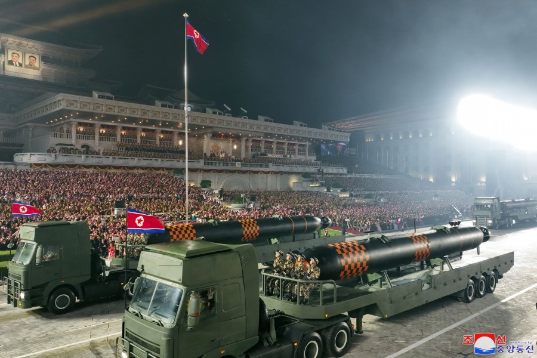

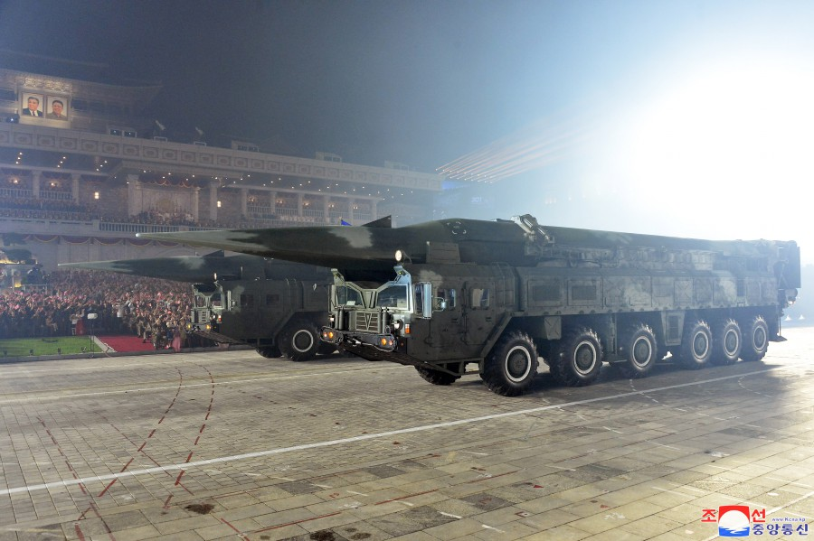

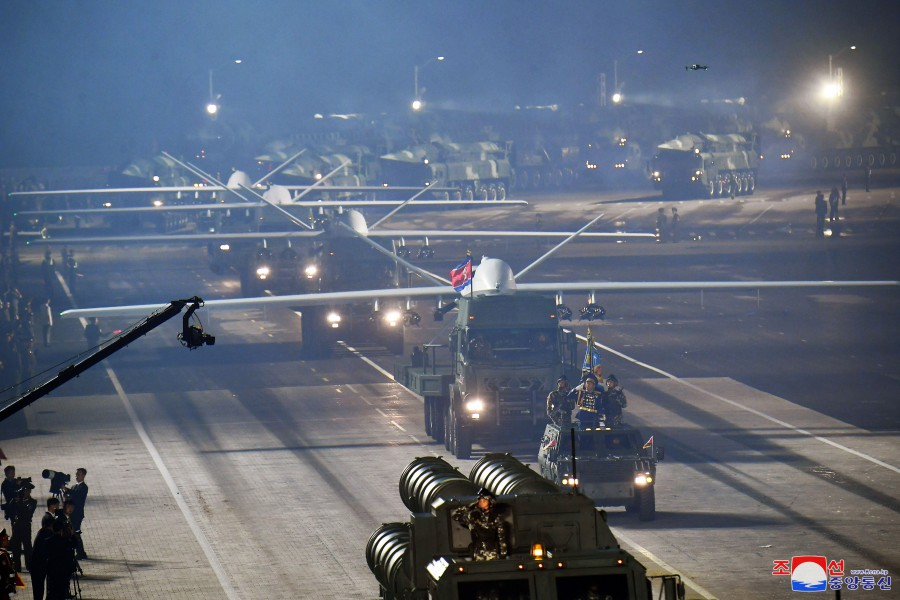

朝鲜7月27日举行阅兵式，纪念朝鲜祖国解放战争胜利70周年，朝鲜在阅兵式上展示新型武器装备。 图源：朝中社

路透社援引朝中社报道称，朝鲜最新型“火星炮-17”型、“火星炮-18”型洲际弹道导弹在此次阅兵式中亮相。路透社称，这些导弹具备打击美国全境目标的能力。此外，报道还称，新型无人侦察机和无人攻击机在此次阅兵式中进行空中受阅飞行。

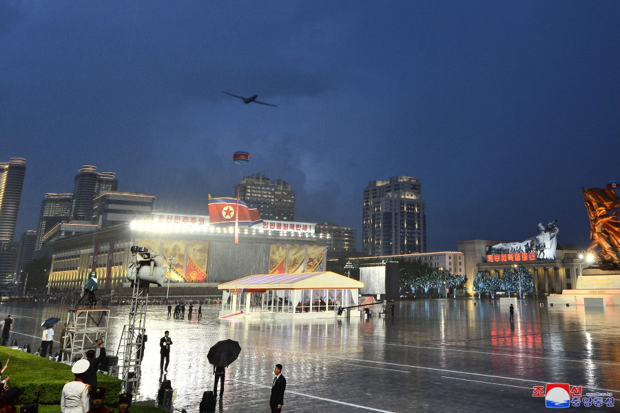

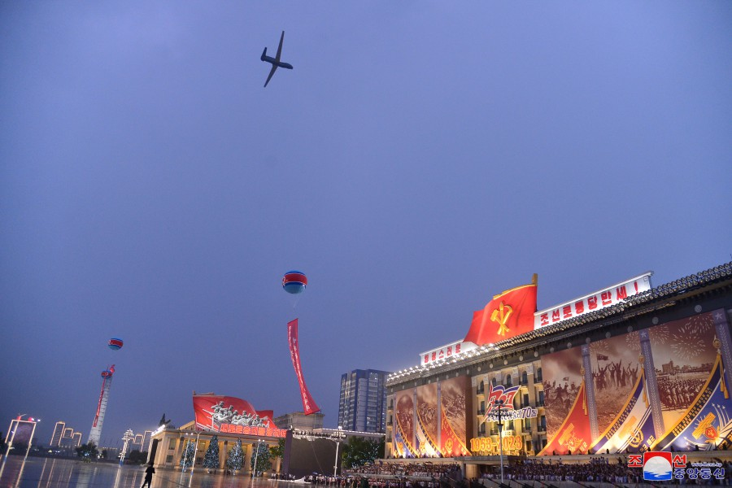

新型无人侦察机和无人攻击机进行空中受阅飞行。 图源：朝中社

7月27日在朝鲜被称作“祖国解放战争胜利纪念日”，也称“战胜节”。法新社称，在美国和韩国情报部门的密切监视下，朝鲜27日晚在平壤金日成广场举行阅兵，纪念祖国解放战争胜利70周年。法新社称，阅兵式上出现的新武器引发美韩军方和媒体的极大兴趣。

