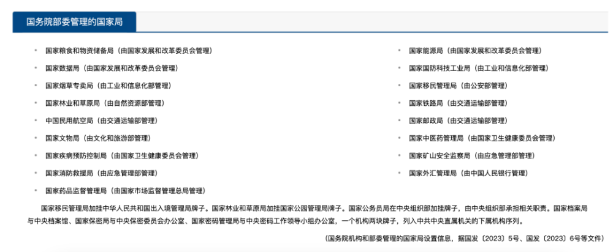

# 新组建的国家局，首任“一把手”是他

**撰文 | 董鑫**

7月28日，人社部网站发布国务院任免国家工作人员消息，任命刘烈宏为国家数据局局长。

刘烈宏是二十届中央候补委员，此前担任中国联通党组书记、董事长，招联消费金融董事长。

国家数据局是最新一轮国务院机构改革中新组建的国务院部委管理的国家局，由国家发展和改革委员会管理。

**长期从事信息工程相关工作**

中国联通官网的简历显示，刘烈宏出生于1968年10月，在职研究生学历，管理学博士，研究员级高级工程师，享受“国务院政府特殊津贴”。

1990年参加工作后，他长期从事与信息工程相关的工作，先后在机械电子工业部、电子工业部、信息产业部工作，担任过中国电子信息产业集团有限公司董事、总经理、党组副书记，中国电子科技集团有限公司董事、总经理、党组副书记。

2018年7月，刘烈宏任中央网络安全和信息化委员会办公室副主任、国家互联网信息办公室副主任。

2020年6月，他调任工业和信息化部副部长，任职期间，负责信息通信业的发展、管理、安全及离退休干部等工作，分管信息通信发展司、信息通信管理局、网络安全管理局、离退休干部局，地方通信管理局，中国信息通信研究院、应急通信保障中心。

2021年8月，刘烈宏任中国联通董事长、党组书记。

2022年5月，招联消费金融在中国债券信息网披露，刘烈宏担任该公司董事长。这是一家由招商银行与中国联通共同组建的持牌消费金融公司，注册资本100亿元。

**从网络大国到网络强国**

政知君注意到，刘烈宏任职的中国联通是数字信息基础设施运营服务“国家队”，在工业互联网创新应用方面有着独特优势。

尤其在大数据方面，中国联通一直致力于IT系统和数据的集中统一，在三大运营商中率先实现了全国31省公司数据的一点集中，并在此基础上，为国家信息中心、交通部、文化和旅游部、教育部等部门和省份、地市提供大数据支撑，并打造了多款大数据和人工智能产品。

今年2月，刘烈宏在求是杂志社主管、主办的《红旗文稿》杂志刊发署名文章《以数字化网络化智能化助力中国式现代化》。

他在文中表示，发展数字经济是把握新一轮科技革命和产业变革新机遇的战略选择，推动数字经济和实体经济融合发展是推动我国经济高质量发展的重要组成。

目前，我国高水平数字科技自立自强取得突破性进展。在信息通信领域，5G、光通信、集成电路等领域“卡脖子”问题不同程度得到缓解，5G应用等具有世界先进水平的重大成果不断涌现。

中国的5G基站数占到全球60%以上，连接数超过全球70%，数量遥遥领先西方各国。信息通信产业实现从“1G空白、2G追随、3G突破、4G并跑”到“5G领跑”的跨越。

刘烈宏指出，我国数字信息基础设施整体水平实现跨越式提升，建成了全球规模最大、技术领先的网络基础设施，正从网络大国向网络强国阔步迈进。

**“加强对数据的管理、开发、利用”**

中国政府网显示，目前由国务院部委管理的国家局共17个。

其中，国家数据局为今年新组建。

2023年3月，中共中央、国务院印发《党和国家机构改革方案》。根据方案，组建国家数据局，负责协调推进数据基础制度建设，统筹数据资源整合共享和开发利用，统筹推进数字中国、数字经济、数字社会规划和建设等。

关于国务院机构改革方案的说明中指出，当今社会，数字资源、数字经济对经济社会发展具有基础性作用，对于构建新发展格局、建设现代化经济体系、构筑国家竞争新优势意义重大，必须加强对数据的管理、开发、利用。

数据也被称为数字经济时代的“石油”。

我国是一个数据大国。根据国家网信办发布的《数字中国发展报告（2021年）》，2017年到2021年，我国数据产量从2.3ZB增长至6.6ZB，在2021年全球占比9.9%，位居世界第二。

据《中国经济周刊》报道，2022年，在全国政协组织召开的“推动数字经济持续健康发展”专题协商会上，十三届全国政协委员、中国证券监督管理委员会原主席肖钢曾表示：“调研中一些企业反映，目前大概有15个政府部门拥有数据管理权限，‘九龙治水’的现象较为突出，管理手段不适应，如何实施数据分级分类管理也存在不少问题，这些问题都需要尽快解决。”

新组建的国家数据局则划入了多个部门的职责，包括：

中央网络安全和信息化委员会办公室承担的研究拟订数字中国建设方案、协调推动公共服务和社会治理信息化、协调促进智慧城市建设、协调国家重要信息资源开发利用与共享、推动信息资源跨行业跨部门互联互通等职责，国家发展和改革委员会承担的统筹推进数字经济发展、组织实施国家大数据战略、推进数据要素基础制度建设、推进数字基础设施布局建设等职责。

**资料｜新华社、中新社、南方都市报等**

**【版权声明】本文著作权归政知新媒体独家所有，未经授权，不得转载。**

