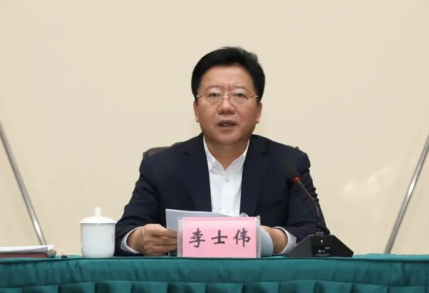

# 曾任辽宁铁岭市委书记市长的李士伟被查，铁岭已有7任市长落马

据辽宁省纪委监委7月28日消息，铁岭市委原书记李士伟涉嫌严重违纪违法，目前正接受审查调查。

 _李士伟 资料图_

公开简历显示，李士伟出生于1964年11月，沈阳人，2018年1月任铁岭市市长，2019年4月任市委书记，2021年6月被免职。

随着李士伟落马，铁岭近年已有7任市长被查。其他6人为左大光、张竞强、吴野松、林强、姜周、方守义。

其中，方守义于2017年12月卸任铁岭市长，继任者正是李士伟。今年6月，离开铁岭后担任省民政厅厅长的方守义涉嫌受贿犯罪，被开除党籍、公职。

此外，李士伟还是近年来落马的第3个铁岭市委书记。此前2人分别为李文科、吴野松。

