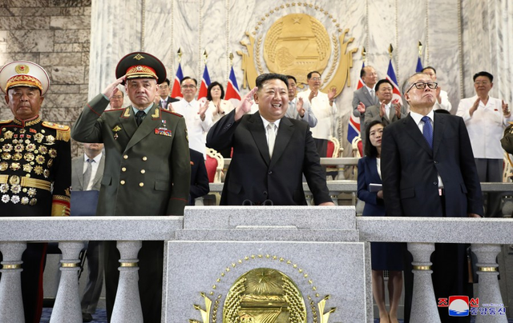
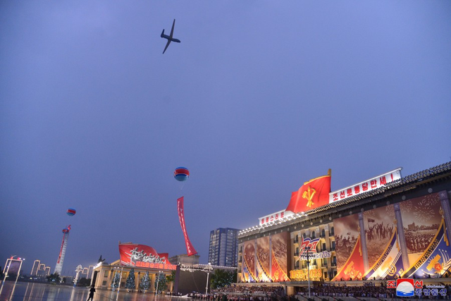
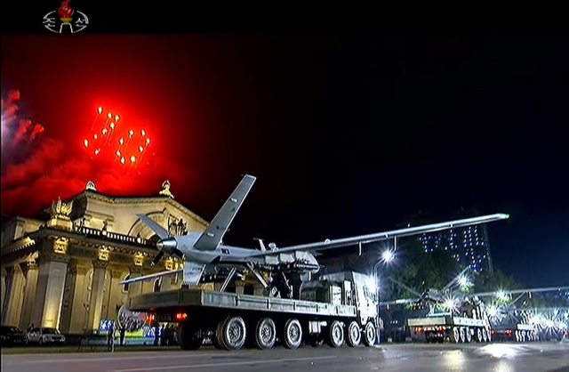
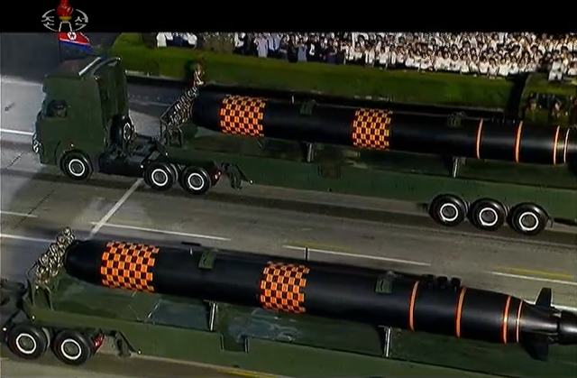
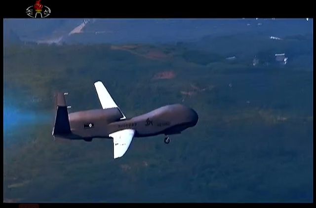

# 朝鲜深夜大阅兵，金正恩突然放飞“全球鹰”？半岛无人机对抗将加剧

据朝中社报道，7月27日朝鲜战争停战70周年纪念日当晚，“战胜节”阅兵式在朝鲜首都平壤的金日成广场上举行。朝鲜最高领导人金正恩出席阅兵式。

和今年2月进行的人民军建军75周年阅兵式等近年来的多次阅兵一样，本次阅兵一改以前白天阅兵的传统，采用了韩美军方及情报机构更难提前侦知的“夜间阅兵”形式。和2月不同的是，本次阅兵式是朝鲜自2020年新冠疫情“锁国”以来，第一次邀请外国代表团访问观礼。

 _7月27日晚，朝鲜举行“胜利节”70周年阅兵式（图：朝中社）_

由中共中央政治局委员、全国人大常委会副委员长李鸿忠率领的中国党政代表团，以及由俄罗斯国防部长绍伊古率领的俄罗斯军事代表团，都出现在阅兵式现场。主席台上，李鸿忠和绍伊古站在金正恩两侧。

三年多来第一次“开放”，朝鲜为来宾准备了多样的活动。据朝中社报道，27日，中国党政代表团还和金正恩一同出席了“胜利节”报告大会及演出，参观了祖国解放战争胜利纪念馆，参谒了友谊塔，参加了欢迎宴会和“胜利节”国宴。

朝鲜劳动党中央国际部长金成男在机场迎接中国客人，劳动党中央政治局常委、最高人民会议常任委员会委员长崔龙海会见了代表团。访问期间，李鸿忠在祖国解放战争胜利纪念馆的留言簿上留言
“携手并肩，捍卫和平”。

三年来首次迎接外国来宾的阅兵式，也成为比今年2月阅兵式规模更大的一次新型武器展示。除了“火星-17”洲际弹道导弹，以及刚刚试射成功的“火星-18”固体燃料洲际导弹外，最为外界瞩目的是，阅兵式正式开始前，全新的大型中远程无人机在阅兵广场盘旋表演，“给一代接一代庆祝主体朝鲜的胜利和光荣的7·27的人民增添了一份欢喜”。

根据朝鲜中央电视台7月28日发布的阅兵式全程视频，在阅兵式中，另一种挂满武器的新型无人机编队在被视为战略武器的无人艇编队之后出场，仅隔一个编队就是压轴出场的“火星-17”和“火星-18”洲际导弹。这充分展现出新型无人机在朝鲜的战略地位。

 _7月27日晚，朝鲜举行“胜利节”70周年阅兵式，新型无人机在金日成广场上空飞行（图：朝中社）_

这两种无人机分别被称作“战略无人侦察机”和“多功能攻击无人作战飞机”的，也亮相于金正恩、绍伊古26日共同参观的2023年朝鲜武器装备展示会。无人机的外观，和美国制造的“全球鹰”“死神”无人机非常相似。西方军事分析人士称，朝方发布的展示会照片中，也有疑似朝鲜新型水下无人艇的身影。韩国军方28日表示，目前正在紧急研判朝方新型无人武器的具体性能。

在仍未成功试射军事侦察卫星的背景下，展示新型“战略无人侦察机”，是否是朝鲜以另一种方式宣示其已经具备了对韩战略侦察能力？这两款无人机，是否是金正恩2021年提出的国防科研目标中的远距离无人机？半年前，朝鲜无人机曾“越境”韩国，新型无人机及无人艇亮相，是否意味着半岛危险的无人武器对抗，又要进一步升级？

**突然造出“全球鹰”？**

涂装朝鲜空军标识、搭载六个武器发射架的大型无人机，在飞行过程中凌空发射两枚导弹。不到两秒钟时间，导弹带着尾焰消失在画面中。7月27日晚8点档的新闻中，朝鲜中央电视台播放了新型无人机的飞行测试影像，其中包括攻击型无人机发射导弹的画面。

就在该晚间新闻播出的同时，新型无人机正在灯火辉煌的金日成广场上空绕飞。这进一步破除了一些分析人士早先的猜测，即26日新型武器展示会上的无人机“只是模型，不能飞”。

 _7月28日，朝鲜中央电视台发布新型无人机影像（图：朝鲜中央电视台直播截图）_

外界首次发现朝鲜已经制造出大型无人机，是今年6月14日。当时，商业卫星拍摄到一架翼展约35米、长约15米的无人机停在朝鲜平安北道芳岘空军基地的跑道上。该型无人机的翼展，是此前外界所知的朝鲜无人机的一倍，而和美国“全球鹰”无人机的规格几乎一模一样。

美国上世纪90年代研发的“全球鹰”无人机，翼展35.4米，长14.5米，巡航半径3000公里，监视范围超过整个朝鲜半岛，可在20千米高空通过雷达和红外线探测装备识别出地面直径0.3米的物体，能在昼夜及恶劣气象条件中工作。当然，“全球鹰”也可以作为武器平台，执行空中打击任务。

入役以来，来自美军日本基地的“全球鹰”一直盘旋在朝鲜上空。本月初，朝鲜国防省发言人等多次抗议美国空军飞临朝鲜海域上空，其中就点名了“全球鹰”。对世界多数国家来说，“全球鹰”的战略侦察能力是一种“降维打击”。韩国军方一直致力于研发有效的无人侦察机，但据韩联社的说法，在2019年引进“全球鹰”之前，韩军影像收集能力“对平壤鞭长莫及”。

朝鲜同样重视无人机研发。按照韩国国情院今年1月的统计数据，朝鲜拥有20余种型号500多架无人机，但大多数是机身长不足6米的小型无人机。韩军此前拦截过的朝鲜侦察无人机，大多搭载索尼等品牌的商用相机，其中一架无人机被拦截时拍摄照片500多张，但都“非常模糊”。这些无人机也没有实时传输数据的能力。

随着半岛局势紧张、美军战略武器向朝鲜方向部署，战略侦察能力成为能否“先发制人”的关键，和朝鲜核威慑能力紧密联系在一起。2021年1月，金正恩首次提出，朝鲜应在2025年之前研发出“可精密侦察前线纵深500公里的无人机”。但在此之后，朝鲜官方再未披露无人机研发进展。今年1月，韩国国情院研判称，朝鲜正在研发中大型远程无人机，但“尚处于起步阶段”。

如今，朝鲜大型无人机“突然”出现并飞行、试射导弹，是否意味着朝鲜无人机研发已从“起步阶段”快进到研发完成？韩美媒体多强调，侦察无人机能力的关键在于拍摄影像和传输数据的能力，基于朝鲜媒体目前展示的内容，无法判断朝方是否在这方面取得新突破。

_7月28日，朝鲜中央电视台发布无人艇影像（图：朝鲜中央电视台直播截图）_

此外，根据朝中社发布的武器展览会图像，这两款无人机旁边的展板上，有金正恩视察无人机及无人机进行飞行测试的图片。然而，朝鲜官方媒体近期未曾发布这些活动和测试的报道。这并不符合当前朝鲜披露武器研发进度的惯例。

以同为无人武器的水下无人艇为例。今年以来，朝中社已多次发布报道，称国防科研部门于3月、4月间对核无人潜水攻击艇“海啸-２”进行潜水和武器系统试验，潜航70多个小时，成功攻击预定目标，“完美无缺地验证了潜水式战略武器系统的可靠性和致命打击能力”。此前，在军事侦察卫星研发过程中，朝鲜媒体也特别报道过国防科研部门在影像拍摄、处理技术上的突破。

分析认为，考虑到朝鲜媒体此前从未披露无人机研发进度，且朝中社在26日、27日的报道中未提及两款无人机的名称，只是预告“将在我国空军服役”，朝鲜新披露的无人机可能尚未完全具备战斗力或侦察能力，距离正式列装部队还有一定距离。

**无人机对抗将加剧**

今年是朝鲜对外公开其无人机武器的第十年。2011年前后，韩美军方披露朝鲜从中东国家引进美制高速无人靶机，并基于此研发自己的喷气式攻击型无人机。2013年3月，成为朝鲜最高领导人不久的金正恩，在视察空军部队时亲自指挥“超精密无人机空袭训练”，这是朝鲜首次对外公开自己的无人机部队。

当时金正恩评价称，朝军无人机“速度惊人、目标识别能力也相当高”，“能精确打击敌方任何对象”。韩方数据称，到2016年，朝鲜已拥有约300架无人机。不过，2014年韩国军方首次发现朝军无人机入境时，发现这些无人机性能不高。

_7月27日，朝鲜中央电视台发布新型无人机影像（图：朝鲜中央电视台直播截图）_

根据韩方数据，被发现的无人机时速约100公里，飞行距离不足300公里，虽然足以覆盖首尔地区，但只能安装2至3公斤的炸药，或安装摄像机进行侦察，拍摄的画面“非常模糊”，且不能及时传输数据。综合评价，韩军认为“无实战价值”。

此后，朝鲜无人机“越境”，逐渐成为半岛对抗的常态。韩军有时驱离，有时拦截；朝方有时予以否认，有时不予回应。就在看似“没有威胁”的频繁对抗中，朝鲜不断提升无人机技术水平。到2017年，韩军发现新拦截的朝方无人机，航程已经“三年翻一倍”，超过了500公里。

2018年半岛各方重启接触对话后，无人机对抗暂停。2022年5月尹锡悦就任韩国总统后，全面颠覆前政府的对话政策，半岛局势进入2017年以来最紧张的时期，朝方无人机也在2022年12月时隔五年再次“越境”。

按照韩军事后的复盘，12月26日上午，5架朝鲜无人机先后进入韩国空域，其中4架在江华岛一带活动，吸引韩军注意力，另一架无人机则直飞首尔北部地区，成功进入龙山总统府禁飞区，随后全身而退。

当天，5架朝鲜无人机在韩国空域共飞行7小时，韩军投入战斗机、轻型攻击机、直升机轮番应对，射弹100多枚，无一命中目标。倒是有一架韩国空军KA-1型轻型攻击机，在起飞执行对无人机作战支援任务时失事坠毁。事后，韩军最高指挥官、联合参谋本部议长金承谦大将等十多名军官遭问责。

显然，相比2014年到2017年的对抗，朝鲜无人机的性能、战术都有较大提升。这是如何做到的？韩国国防研究院曾在报告中指出，朝鲜的国防工业发展并非只追求“政治影响力”。相反，在洲际弹道导弹等核威慑工具的掩盖下，朝鲜一直在“针对韩美军事弱点”研发以精密、轻量、无人和智能化为特征的新型武器，无人机就是其中的代表。

此外，2016年，韩国军方指责朝鲜黑客盗取军事资料4万多份，其中包括美军中高度无人侦察机零部件照片。韩美军方指责朝鲜从多个海外渠道购得了包括美国在内的多国制造的先进无人机，基于此加以改进。这意味着，朝鲜能接触到全球领先的无人机技术。

面对朝方在无人机对抗中能力不断加强的局面，韩国军方进行“两手应对”。一方面，韩军试图加强防御、拦截无人机的能力。今年以来，韩美军方多次以朝鲜无人机为假想敌举行针对性的军事演习。韩国政府今年投入5600亿韩元（约合人民币30亿元）预算专门研发激光防御武器等，以提升应对朝鲜无人机的战力。

另一方面，韩军也反过来向朝鲜派出侦察无人机。2019年，韩国重金引进四架美国“全球鹰”无人机，2020年单独组建侦察飞行团。今年以来，韩军新部署了100多架侦察、渗透朝鲜空域的小型无人机，这些无人机在超出通信范围后仍可自动飞行，若在朝鲜地区坠毁还可自行销毁数据。小型隐身无人机的研发也在进行中。

按照尹锡悦的最新指示，韩军将在今年9月进一步建立无人机作战司令部，以针对朝军无人机行动展开报复，报复原则是“十倍回应”，即以十倍于朝方数量的无人机“前往平壤上空”。

可以预见的是，随着双方对无人机对抗的重视程度提高、无人机武器“鸟枪换炮”，半岛的无人机对抗活动将更加激烈，类似于韩军枪击朝方无人机的“擦枪走火”事件或越来越多。不过，短期内，朝鲜可能仍将占据这场对抗的上风。今年5月，经《华盛顿邮报》确认的美军泄露文件显示，美军官员认为，韩军还需要3到5年时间才能建立有效的应对朝方无人机计划，“至少在未来
6 个月内，韩方很可能无法应对朝鲜无人机入侵”。

记者：曹然

