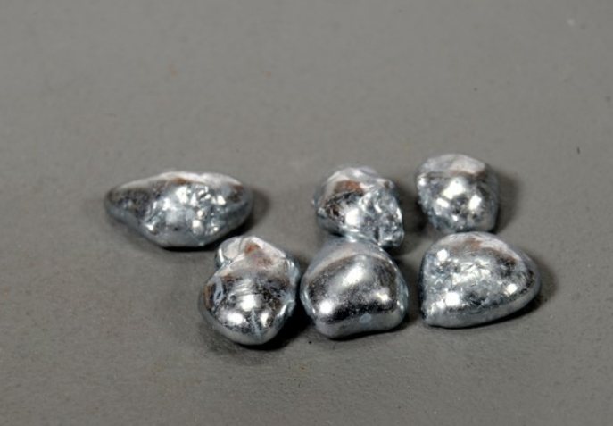

# 美媒：中方对镓锗相关物项实施出口管制，五角大楼拟从废料中回收镓

【环球时报驻美国特约记者冯亚仁】中国7月初宣布，为了维护安全和国家利益，从8月1日起对镓、锗相关物项实施出口管制。彭博社26日报道称，在出口限制即将启动之际，美国五角大楼计划在年底前向美国或加拿大公司首次签订回收镓的合同。

_金属镓（IC Photo）_

镓和锗是半导体关键材料，中国是这两种材料的主要生产国。在中国宣布出口限制后，美国五角大楼表示拥有锗储备，但没有镓储备。彭博社报道称，五角大楼发言人尤根森在一份声明中表示，计划利用其在《国防生产法》下的权利，在12月31日之前“优先安排”合同，关注从其他产品的现有废物流中回收镓。

五角大楼称，拟议的项目类似于常见的对尾矿或精炼废物流进行再处理。“这种回收而非开采是让美国更容易、更快获得这些材料的方法。”不过，《国防生产法》下的资金目前还没有被授予矿物回收项目的先例。

彭博社称，镓用于海军舰艇上的防空和导弹防御雷达，以及陆军和海军陆战队用于探测火箭、火炮、迫击炮等的地面雷达。镓和锗通常是在其他材料的采矿作业中提取的。但加工和提炼它们的成本很高，因此西方公司将其当作废料处理，而中国却一步步主导供应。

