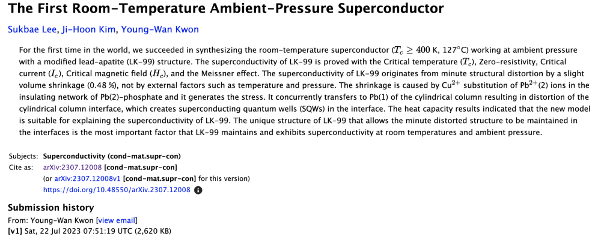
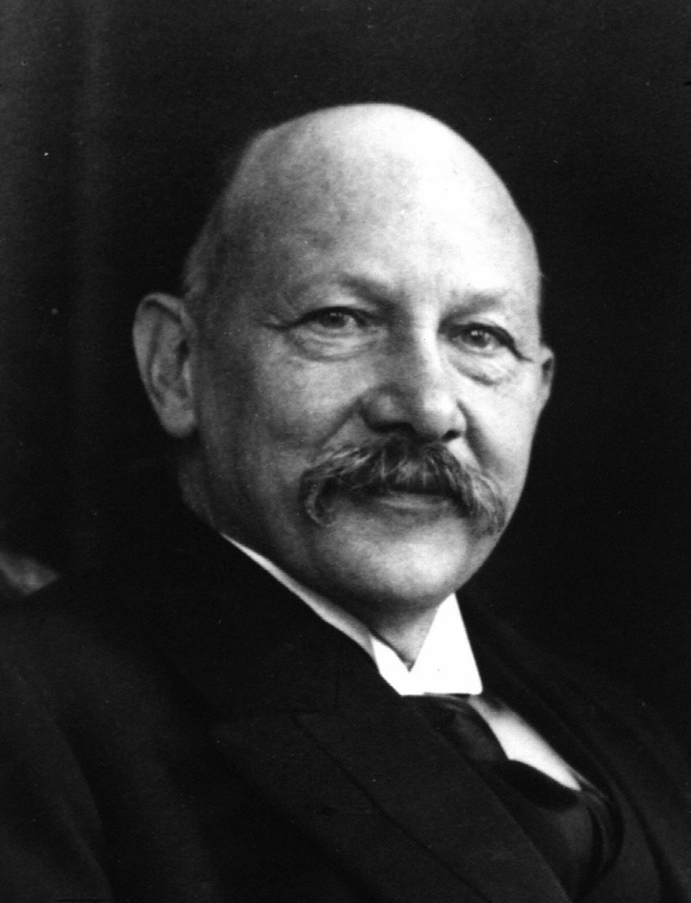

# 韩国团队室温超导开启人类新纪元？3小时内交两篇论文，样品被指瑕疵

美国罗切斯特大学Ranga Dias团队的室温超导研究疑云尚未消散，韩国量子能源研究中心（Q-centre
）、高丽大学等团队的研究人员再次投下一记“尚未经同行评议”的重磅。研究团队宣布成功合成了世界上第一个室温常压超导体，即在常压条件下，一种改性的铅-
磷灰石(命名为LK-99)能够在127℃(Tc≥400k)以下表现为超导体。

鉴于室温超导研究的挑战性和重要性，此类“重磅”每次都掀起广泛关注和讨论。研究团队自己对该研究评价称，“我们相信，我们的新进展将是开启人类新纪元的全新历史事件”。然而，正如此前Dias团队的研究，此次韩国团队的研究也将经受“时间的考验”。

让事件更为扑朔迷离的是，上述新研究实际上关联到两篇论文。从时间线上来看，第一篇提交于7月22日7时51分，第二篇则于7月22日10时11分提交，两篇提交时间相差不足2.5小时的论文均发表在预印本系统arXiv，尚未经同行评议。

两篇文章作者人数不同，但有两位重合。就论文本身内容来看，第二篇更为详尽。其中上述第二篇论文的作者之一、美国威廉与玛丽学院的物理学教授Hyun-Tak
Kim在接受采访时则直接表示，第一篇论文里存在“许多缺陷”，并且未经他的允许就被上传了。

**百年过去，超导何时“接地气”**

100多年前，荷兰物理学家昂内斯（Kamerlingh
Onnes）为人类打开了超导这扇大门。1911年，昂内斯在研究中发现，当温度降到4.2K以下时，金属汞（Hg）的电阻突然降为零，而这并不是任何实验上的纰漏导致的。

自此，汞成为了科学家发现的第一个超导体，其超导Tc为4.2K。所谓的超导Tc即超导转变温度，也就是超导体由正常态进入超导态的温度。

_荷兰物理学家昂内斯 视觉中国 资料图_

总体而言，零电阻是超导体的基本特征之一，此外一个重要的基本特征则是迈斯纳效应。继昂内斯上述发现20余年后，迈斯纳在研究测量中发现，材料处于超导态时，其内部磁场为零，展现出完全抗磁性，这也就被称为迈斯纳效应。

超导现象的发现被认为是20世纪最伟大的发明之一。然而，发展至今，超导体的实际应用基本局限于磁悬浮等少数特定场景下。此次韩国研究团队也提到，自昂内斯发现超导性以来，科学家们一直在寻找室温超导体。

原因不难理解，维持材料超导性的极低超导Tc，这对大规模的应用开发来说是一道极大的障碍。

科学家们在这条改进突破的路上已有过一些重大成果。上世纪80年代，铜基超导体的发现将超导Tc带到了超过40K；进入21世纪之后，日本、中国等科学家在铁基超导体上实现了超导Tc的进一步提升。

韩国团队同样在论文中援引了Dias团队目前尚处于争议中的研究，他们提出的由氢、氮、镥三种元素组成超导体，在大约10kbar（也就是1GPa，约相当于1万个大气压）下可实现约294K（21℃）的室温超导电性。

国际高温超导研究领域的先驱者、著名物理学家朱经武今年3月在接受媒体采访时曾表示，过去，我们以为达到液氮温度77K（-196度）以上就可以应用了，但是在制备材料时，发现有困难，成本太贵了。后来，克服了温度，把温度达到室温后，发现要加很高的压力，这又产生了问题。

可以说，过去的100多年时间里，超导领域始终处于不断探索的途中。一条道路指向超导Tc，使其无限接近便于实际应用的室温；另一条道路则在于持续深入地挖掘超导背后的机理。

**韩国版室温常压超导体，真突破还是“狼来了”**

和3个多月前Dias团队的成果相比，韩国团队的超导体让人“更难以置信”。不仅解决了温度问题，他们的LK-99甚至不需要“高压助手”。而127℃的Tc，不仅仅是数字上比以往研究进一步大幅提高，更重要的是意味着其可应用的温度区间大大拓宽。

LK-99如何获得？上述更为详细的第二篇论文显示，研究团队使用固相法合成了LK-99，合成原料为氧化铅（PbO）、硫酸铅（PbSO4）、铜（Cu）和铅（P）。

目前业内普遍认为，LK-99的制备过程似乎相当简单。样品合成过程具体包括三个步骤：第一步，将氧化铅和硫酸铅粉末在陶瓷坩埚中以各50%的比例均匀混合，混合粉末在725℃的炉中加热24小时发生化学反应。第二步，将铜和铅粉末按比例在坩埚中混合，合成磷化亚铜，让混合后的粉末处于相应的真空封管状态下，然后置于炉内550℃加热48小时。在此过程中，混合材料发生相变，形成磷化亚铜晶体。第三步，将上述两步所得物质磨成粉末，并在坩埚中混合，再将混合粉末真空封管，在925℃的炉内加热5至20小时。

_摘自论文_

研究团队称，在此过程中，混合粉末反应转化为最终材料，一种灰黑色的铜掺杂的铅-磷灰石，这种多晶材料也就是他们命名的LK-99。

他们总结称，LK-99的超导性已经通过超导临界温度Tc、零电阻率、临界电流(Ic)、临界磁场(Hc)和迈斯纳效应得到了证明。

研究团队提出，LK-99结构与铅-
磷灰石非常相似，但由于晶格中出现了铅被铜取代的现象，相关晶胞（反映晶体周期性和对称性的最小重复单元）参数显示LK-99与原始铅-
磷灰石相比有轻微的收缩，缩小率为0.48%。铜离子取代引起的应力传递到圆柱体列的铅，导致界面发生扭曲，从而形成超导量子阱。

研究团队认为，正是这种结构的影响，导致了这种新材料非凡的超导性，而非温度和压力等外部因素。第一篇论文的作者们写道，到目前为止，超导性与材料结构变化之间的关系还没有得到很好的阐明。事实上，目前发现的影响超导体超导性产生的两个主要因素是温度和压力。但温度和压强都会影响材料的体积，似乎在低温或高压下体积减小所产生的应力会引起微小的应变或变形。

研究团队称，虽然很难观察到超导材料微小结构的变化，但这种结构变化似乎带来了它的超导性。

值得一提的是，研究团队还专门上传了一段视频，以证明LK-99在磁铁上悬浮的情况，这也就是迈斯纳效应。不过，这块扁平的、像硬币一样的材料的悬浮情况并不是十分完美，仍有一边似乎接触磁铁。就该情况，Hyun-
Tak Kim称，这表示样品并不完美，只有一部分成为超导体并表现出迈斯纳效应。

尽管Hyun-Tak
Kim目前的态度透露着该项研究背后作者们的“想法各异”，但他对外界的质疑表示接受，认为其他研究人员应该尝试复制他们团队的工作来解决目前的疑问。与此同时，Hyun-
Tak Kim还表示其和其他同事们将继续完善目前的工作，并向大规模生产迈进。

另外值得关注的是，这次的“子弹”或许不用飞太久。按照目前领域内的说法，鉴于上述新材料制备简单，或许已有大批重复工作已在路上。

