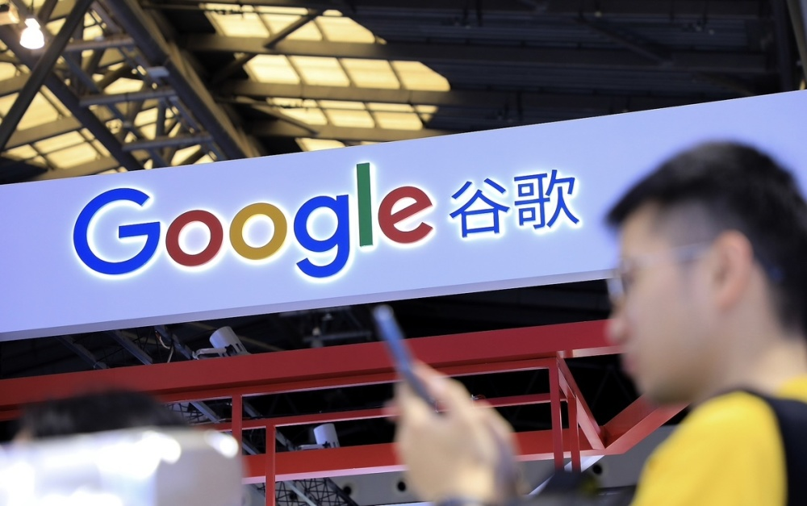
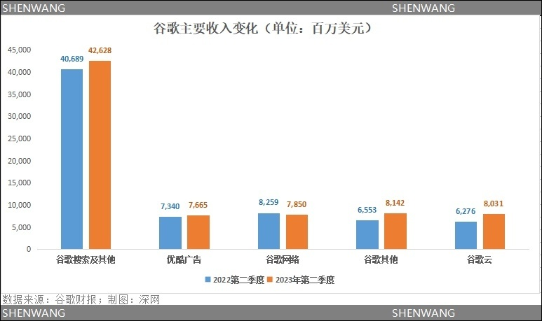

# 三巨头Al斗法：ChatGPT没动谷歌奶酪，Meta等待AI安卓时刻

作者｜张睿

编辑｜康晓

出品｜深网·小满工作室

逐鹿大模型已经成为头部科技公司发展AI业务的必选项。自Meta发布开源且可免费商用的Llama
2后，微软、谷歌、Meta三家巨头在AI领域的较量进一步升级。

美国时间7月25日—26日，谷歌、微软、Meta三家公司相继发布了2023年第二季度财报（自然年）。从季度营收的增速看，三家公司营收及增速都高于预期。其中，微软这一季度营收同比增长8.34%至562亿美元；谷歌母公司Alphabet营收为746亿美元，同比增长7.06%；Meta营收约320亿美元，同比增长11%。

从三家公司公布财报后的盘后股价走势看，资本市场对谷歌、Meta业绩表现更为满意。盘后，谷歌股价涨幅6.08%，Meta股价涨幅6.89%，微软股价跌幅3.7%。

资本市场对三家公司不同的反应，源于市场对其主营业务增长及未来增速的判断。

谷歌主要收入来源是广告。这一季度，谷歌广告收入581.4亿美元，扭转了两季连降的局面；微软主要收入来源是云业务。这一季度，微软云部门营收240亿美元，尽管同比增长15%，但连续多个季度增速放缓。广告也是Meta收入大头，这一季度Meta广告收入315亿美元，同比增长11.9%，扭转了两季连降的趋势。

在AI方面，大模型对三大公司AI业务尚未带来实质性的增收。虽然Bing等微软不少产品已经接入ChatGPT，但这并没有撼动谷歌“搜索一哥”位置。

**Bing并未撼动谷歌“搜索一哥”位置**

谷歌的收入分为两大部分：谷歌服务和谷歌云。谷歌服务主要包括广告、Android、Chrome、硬件、Google Maps、Google
Play、Search 和 YouTube 等产品和服务，其中广告业务占大头。

二季度谷歌服务总收入为662.85亿美元，同比增长约5.5%。其中，谷歌广告收入581.43亿美元，同比增长3.3%。谷歌广告业务包含三分部，谷歌搜索及其他相关业务、视频平台YouTube的广告及谷歌网络业务。在云业务方面，这一季度，谷歌云营收80.31亿美元，同比增长约28%。

需要指出的是，谷歌搜索对谷歌广告收入的贡献并没有受ChatGPT快速崛起的影响。这一季度，谷歌搜索及其他相关业务收入为426.28亿美元，同比增长约4.8%。

过去半年，以ChatGPT为代表的大模型技术引发微软和谷歌两大巨头在AI上的较量。2023年2月，微软推出新一代搜索引擎New
Bing，融入了ChatGPT的AI聊天功能。上线首月，Bing的网页访问量增长了15.8%。

为应对 Bing的挑战，谷歌随后就推出了类 ChatGPT 产品Bard。谷歌CEO桑达尔.皮查伊（Sundar
Pichai）在财报会上表示，“我们在Bard和搜索领域都拥有着不错的经验和进展，目前的用户反馈非常积极。”

据statcounter数据显示，截止至5月，Bing的全球市场份额为6.81%，谷歌的市占比为87.65%。这意味着，接入ChatGPT的Bing并没有撼动谷歌“搜索一哥”位置。

**Meta推动“安卓时刻”的到来**

如果说ChatGPT的成功预示着AI“iPhone时刻”的到来，那么代码全部开源的Llama 2的推出则预示着AI大模型“安卓时刻”的到来。

北京时间7月19日凌晨，Meta发布了最新AI 大语言模型Llama
2系列，包含70亿、130亿和700亿三种参数版本，模型信息和起始代码全部开源，并支持免费可商用，还包含针对会话聊天场景微调的Llama
2-CHAT模型版本。

对于首个开源大模型Llama2，微软立刻表现出合作的态度，并于近日宣布携手Meta为企业提供OpenAI和谷歌模型的平替产品。

不过从收入上看，大模型Llama2还未给Meta带来实质性收入增长，广告依然是Meta主要收入来源。

Meta的收入构成主要分为两部分：一是“应用家族”（Family of Apps），包括
Facebook、Instagram、Messenger、WhatsApp 和其他服务，这部分收入主要来源于广告；二是Reality Labs
(RL)部门收入。其中，广告收入是Meta收入的大头，占比在90%以上。

2023年第二季度，Meta广告收入315亿美元，同比增长11.9%，超过分析师预测的304.3亿美元。承接元宇宙业务的Reality Labs
(RL)部门依然亏损，这一季度的经营亏损为37.39亿美元，去年同期亏损28.06亿美元。

Meta元宇宙业务主要分为AR\VR等相关硬件和软件、内容两部分。在硬件方面，今年6月初，扎克伯格在苹果推出苹果头显Vision Pro之前，抢先发布了
Quest 3，128G起售价为 499美元。

在软件Horizon Worlds方面，据《华尔街日报》报道，2023年上半年，Horizon Worlds月活用户目标为50万，全年有望达到100万。

对于今后业务增速如何，Meta并没有在财报会上给出预期，但表态公司会继续投资AI和元宇宙项目，明年用于推动AI和元宇宙项目的费用也会增加。

**微软AI收入尚未发力 云业务增速放缓**

发布财报后第一天，微软的股价开始下跌。截至7月26日（美国时间）收盘，微软股价报337.77美元/股，股价跌幅3.76%，总市值为25103亿美元。

微软财报后股价下跌部分源于其AI收入尚未发力，但收入大头云业务的未来增速可能放缓。此外，从全财年来看，微软在过去五个财年营收同比增速均超过10%，而这一季度增长放缓至7%。

微软的收入主要由三大块构成：更多个人电脑业务（包括Windows操作系统、广告、设备和游戏等）、智能云业务（包括Azure公共云、GitHub和Windows
server等服务器产品）及生产力和商业业务（Productivity and Business Processes）。

这一季度，微软更多个人电脑业务营收139亿美元，同比下降4%，但表现优于市场预期的135.8亿美元；微软智能云业务营收同比增长15%至239.9亿美元，高于市场预期的238亿美元；微软生产力和商业业务营收同比增长10%至183亿美元。

智能云业务是为微软的第一营收主力。在财报后的电话会上，微软管理层称，Azure在2023财年1100亿美元的云销售中占比超过50%。

作为微软公司的增长引擎，云业务的增速及预期会影响资本市场对其股价和市值的判断。由于对全球经济健康状况的担忧，许多科技客户一直在削减云计算支出。

在财报后的电话会上，微软管理层称，预计2024财年第一季度Azure营收增长率将为25%至26%，这意味着这一微软的“现金牛”业务增速将进一步放缓。

