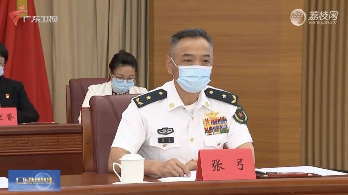
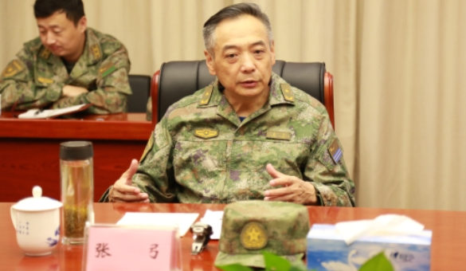
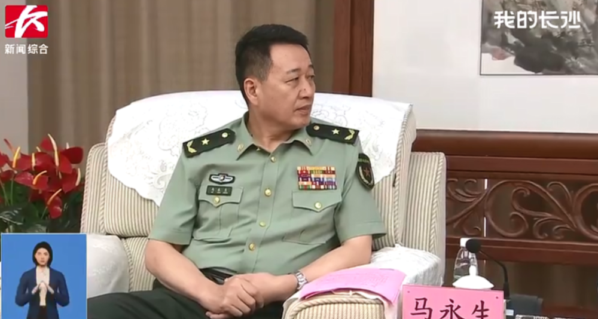
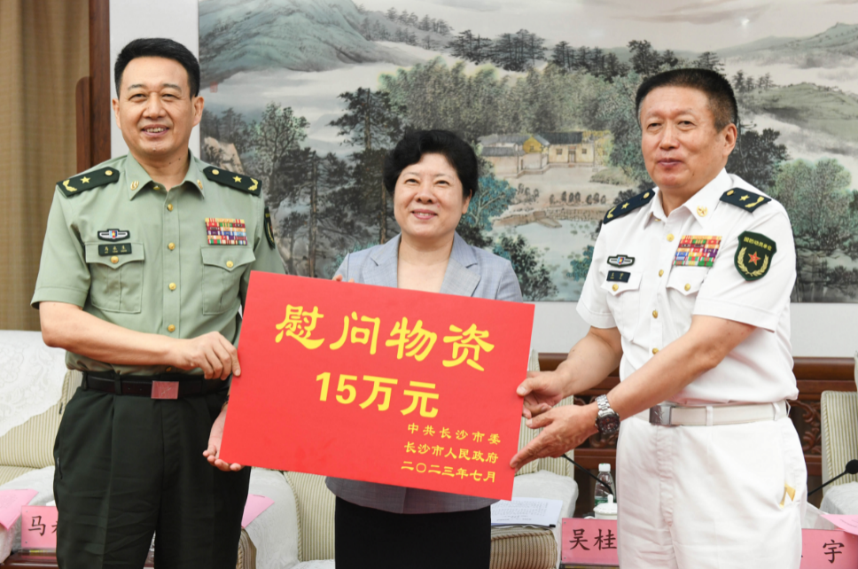
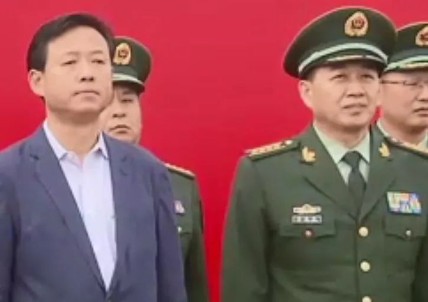

# 两位将军履新，都曾与海“打交道”

**撰文 | 李岩**

近期，两位将军履新的消息披露。

政知道（微信ID：upolitics）梳理发现，这两位履任新职的将军，此前均曾和海“打交道”。

**白色戎装**

据“中国残疾人联合会”微信公众号消息，近日，广东省残疾人联合会第八次代表大会在广州召开。推文提到，广东省军区司令员张弓出席了此次开幕会。

上述消息显示，广东省军区司令员已经易人。此前担任广东省军区司令员的是周河少将。南方网报道显示，今年2月，周河还以广东省军区司令员身份出席广东省民兵建设“十四五”规划推进会。

政知君注意到，张弓身着白色戎装出席活动的画面出现在广东新闻联播中。其肩章显示，张弓目前为少将军衔。

画面中（白色军服）不难看出，张弓出身海军。公开消息显示，张弓曾任北海舰队航空兵参谋长、东海舰队副参谋长等职。

此次履新并非张弓首次担任省级军区司令员。

据江西省退役军人事务厅网站消息，2022年4月2日上午，江西省委常委、省军区政委、省委退役军人事务工作领导小组副组长鲍泽敏，省军区司令员张弓带领省军区机关团以上干部和省退役军人事务厅、省双拥办处以上干部来到南昌市烈士陵园，开展英烈祭扫活动。

**海警出身**

据“湖南军号”微信公众号消息：7月25日上午，湖南省委常委、市委书记、长沙警备区党委第一书记吴桂英专程走访慰问驻长部队。省委常委、省军区司令员王宇，省军区政委马永生参加。

上述消息显示，湖南省军区政委目前已经易人。此前担任湖南省军区政委的是冯毅少将。湖南省政府网站显示，今年1月，冯毅以湖南省军区政委身份出席湖南省军区党委十四届十五次全会。

政知君注意到，长沙新闻联播画面显示，马永生身着戎装参加相关活动，其肩章显示他目前为少将军衔。

公开消息显示，马永生出身武警部队，曾担任中国海警局东海分局政委。

2019年4月30日，“中国海警2019年海洋伏季休渔执法行动启动仪式”在上海等三地同步举行。新民晚报就此发文披露，当天在上海举行的启动仪式由中国海警局东海分局政委马永生主持。

2018年6月，第十三届全国人民代表大会常务委员会通过关于中国海警局行使海上维权执法职权的决定。

《决定》明确，之前由原国家海洋局领导管理的海警队伍，整体划归中国人民武装警察部队领导指挥。调整组建中国人民武装警察部队海警总队，称中国海警局，中国海警局统一履行海上维权执法职责：

**执行打击海上违法犯罪活动、维护海上治安和安全保卫、海洋资源开发利用、海洋生态环境保护、海洋渔业管理、海上缉私等方面的执法任务，以及协调指导地方海上执法工作。**

**资料 ｜ 白鹭洲知政 湖南军号 北京青年报 中国海警等**

**【版权声明】本文著作权归政知新媒体独家所有，未经授权，不得转载。**

