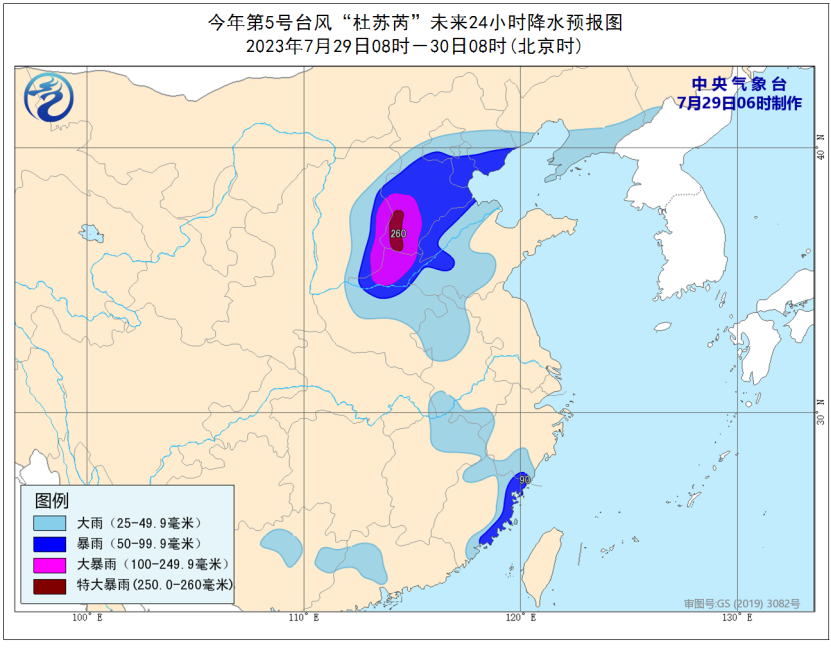
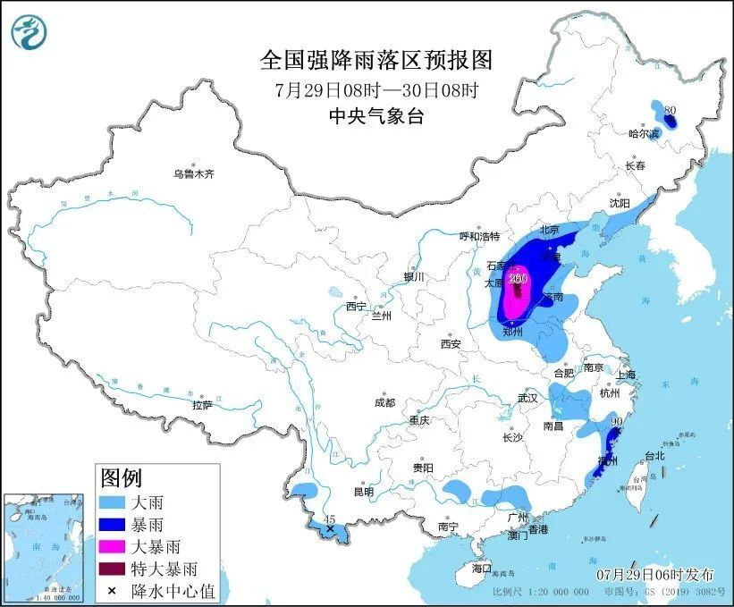

# 中国气象局启动暴雨一级应急响应！京津冀等地需警惕极端强降雨！

来源：中国气象局

@中国气象局
消息，第5号台风杜苏芮强度持续减弱，但影响远未结束。就在刚刚，中国气象局启动暴雨一级应急响应。中央气象台7月29日06时继续发布暴雨橙色预警，预计未来三天，11省份都将出现大到暴雨，其中京津冀部分地区累计降雨量有200～450毫米，
**局地可达600毫米以上** ，极端性强、致灾风险高！公众需提高警惕，远离气象灾害风险较高的地区。

受台风“杜苏芮”影响，昨日（28日）福建东部和北部、浙江东部、台湾岛南部等地部分地区，出现暴雨或大暴雨。

福建泉州、莆田、福州、宁德、浙江宁波等地，局地特大暴雨（250至480毫米）。

福建莆田、福州3个国家气象观测站日降水量突破历史极值。

_受台风“杜苏芮”影响，7月28日，福建莆田市涵江区梧塘镇道路积水严重 图/林钒 文/ 孙蔡亮_

今日（29日），台风“杜苏芮”残余环流北上，将给江淮、黄淮、华北等地，带来强降雨天气。

中央气象台今早三预警齐发，提示公众做好防范

**台风蓝色预警！“杜苏芮”继续向北偏西方向移动**

中央气象台7月29日6时发布台风蓝色预警：

今年第5号台风“杜苏芮”（DOKSURI）已于昨天（28日）晚上23时在江西省抚州市境内由强热带风暴级减弱为热带风暴级，今天（29日）早晨6时其中心位于江西省九江市境内，就是北纬29.8度、东经116.6度，外围最大风力有8级（18米/秒），中心最低气压为998百帕。预计，“杜苏芮”将以每小时30公里左右的速度向北偏西方向移动，即将移入安徽南部地区，强度继续减弱。

**大风预报：**
29日08时至30日08时，黄海西部、东海西部、台湾海峡、长江口及杭州湾附近海域、山东南部沿海、江西北部、安徽、福建东部、浙江、上海、江苏将有5至7级风、阵风8级，其中杭州湾附近海域、台湾海峡部分海域风力有8级、阵风9至10级。

**降水预报：**
29日08时至30日08时，河北大部、北京、天津、山东中西部、河南中北部、辽宁东部以及黑龙江中南部、安徽北部和西南部、江西东北部、浙江南部、福建东部等地部分地区有大到暴雨，其中，河北南部、河南北部、山西东南部等地部分地区有大暴雨，河北南部等地局地特大暴雨（250至260毫米）。

**暴雨橙色预警+强对流天气蓝色预警！京津冀等地需警惕极端强降雨**

7月29日至8月2日，受台风北上环流影响，福建、浙江、江西东北部、安徽、江苏北部、河南东部和北部、山东、河北、山西东部、北京、天津、辽宁、内蒙古中东部偏南地区自南向北先后将出现大到暴雨天气，其中，河南北部、山东西北部、山西东部、河北、北京、天津等地的部分地区有大暴雨，河北中南部、北京南部等地局地有特大暴雨。中央气象台7月29日6时继续发布暴雨橙色预警和强对流天气蓝色预警。

预计，7月29日08时至30日08时，河北大部、北京、天津、山东中西部、河南中北部、辽宁东部以及黑龙江中南部、安徽北部和西南部、江西东北部、浙江南部、福建东部、云南西南部等地部分地区有大到暴雨，
**其中，河北南部、河南北部、山西东南部等地部分地区有大暴雨，河北南部等地局地特大暴雨（250至260毫米）。**
上述部分地区伴有短时强降水（最大小时降雨量30至60毫米，局地可超过80毫米），局地有雷暴大风等强对流天气。

7月29日8时至30日8时，黑龙江中部、吉林西北部、山东中西部、河南东北部、江苏、上海、浙江北部和东部等地的部分地区将有8至10级雷暴大风天气，局地可达11级以上。

内蒙古东北部、黑龙江中部和东北部、吉林西北部和东南部、辽宁南部、甘肃东南部、陕西中南部、山西东部和南部、河北中南部、北京南部、天津、山东中西部、河南、安徽、江苏西部、湖北西南部和东部、湖南西北部和东南部、江西北部、浙江、福建西北部和东部、四川南部、贵州西南部和东北部、云南西部和东南部、广西北部和东南部、广东中西部和东南部沿海、海南岛北部、台湾岛东部等地的部分地区将有短时强降水天气，小时雨量30-60毫米，局地可达80毫米以上。

**预计，强对流的主要影响时段为今天白天至夜间。**

受台风“杜苏芮”残余环流影响，未来三天，北方降雨发展增强，河北、北京、天津、河南等地降雨有极端性，致灾风险高。

**请大家提高警惕，远离气象灾害风险较高的地区，还需重点防范城市内涝以及强降雨可能引发的山洪、泥石流等地质灾害**

**保护好自己和家人**

**来源** ：中央气象台

