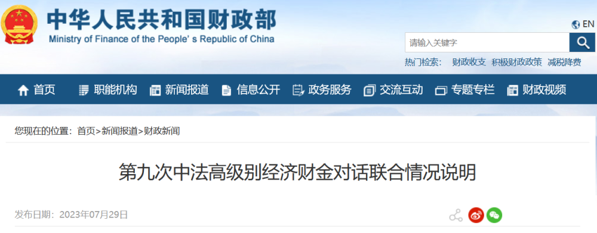

# 中法高级别经济财金对话：中方欢迎法方参与嫦娥七号、八号及天问二号

7月29日，财政部网站发布第九次中法高级别经济财金对话联合情况说明。

**主题：落实两国元首共识，共同深化互惠互利的中法经济财金合作**

为落实2023年4月6日法国总统马克龙对华国事访问期间习近平主席与马克龙总统达成的共识，2023年7月29日，中国国务院副总理何立峰与法国经济、财政及工业、数字主权部部长布鲁诺·勒梅尔在北京共同主持了第九次中法高级别经济财金对话，两国高级官员出席了会议。对话为2024年庆祝中法建交60周年筹备工作凝聚共识作出了贡献。第九次中法高级别经济财金对话期间，双方达成以下共识：

1.双方重申马克龙总统访华期间两国元首联合声明中体现的两国对多边和全球问题采取的共同方针，并将进一步加强在多边和全球领域的合作。

2.关于全球治理、国际金融机构和金融可持续性。

（1）双方赞赏6月22日至23日巴黎新全球融资契约峰会成果，将为加强发展和气候融资架构，满足新兴市场和发展中经济体需求做出贡献。法方欢迎中国高级别代表团的参会。法方将派高级别代表出席第三届“一带一路”国际合作高峰论坛。

（2）双方携手促进全球经济复苏和可持续发展，维护全球金融稳定。双方将加强在G20框架下协调合作，推动G20发挥国际经济合作主要论坛作用。中法愿共同推动新德里峰会释放G20加强团结合作、携手应对全球经济挑战的积极信号。

（3）双方承诺加强在国际货币基金组织（IMF）和包括世界银行（WB）、亚洲开发银行（ADB）、亚洲基础设施投资银行（AIIB）在内的多边开发银行的合作。双方同意改革国际金融架构的治理，使其更高效、更公平、更适合当今世界。特别是对IMF而言，双方期待第16次份额总检查工作的圆满完成和快速落实。双方支持一个强大、以份额为基础、资源充足的IMF及其在全球金融安全网中发挥核心作用。双方支持推动落实有富余资源的国家自愿将特别提款权转借给脆弱国家，推动落实G20可持续金融路线图。

（4）中法两国再次强调以有效、全面和系统的方式解决脆弱国家债务脆弱性问题的重要性。中法两国将与其他G20成员合作，以可预测的、及时、有序、协调的方式一道落实G20债务处理共同框架。双方欢迎中法两国担任联合主席的赞比亚官方债权人委员会近期就赞比亚债务问题达成协议。双方欢迎官方债权人委员会开展良好合作，希望埃塞俄比亚、加纳和斯里兰卡相关谈判顺利推进。

（5）中法两国重申，愿促进高质量和可持续的基础设施投资。双方注意到自愿和非强制性的高质量基础设施指标正在试点应用，期待就根据各国国情进行应用做进一步讨论。

（6）法方欢迎加快实现可持续发展目标的倡议。中法双方将共同努力推动落实2030年议程。

3.关于气候、气候融资、生物多样性和环境保护。

（1）双方致力于推动全球应对气候变化和生物多样保护合作，双方均坚持多边主义，主张在《联合国气候变化框架公约》及《巴黎协定》和“昆明—蒙特利尔全球生物多样性框架”的框架内继续保持高水平雄心并采取积极切实行动。双方强调在《联合国气候变化框架公约》及《巴黎协定》下坚持公平原则、共同但有区别责任原则以及各自能力原则的重要性。双方将与各方携手支持阿联酋推动《联合国气候变化框架公约》第28次缔约方大会（COP28）取得成功，并将保持密切沟通与协调，推动《巴黎协定》首次全球盘点聚焦落实和行动，评估全球实际进展和缺口，并在资金、适应、减缓、损失和损害以及实施手段等议题上取得积极进展。

（2）我们忆及并敦促发达国家履行其承诺，在采取有意义的缓解行动和确保执行透明度的背景下，实现2020年前每年动员1000亿美元并延续至2025年的目标。双方认识到在考虑发展中国家需要和优先领域的前提下，并在发达国家2020年前每年动员1000亿美元气候资金的基础上，制定新的集体量化资金目标的重要性。鉴此，我们认识到有必要根据《联合国气候变化框架》和《巴黎协定》的原则，在新的气候资金集体量化目标方面取得实质性进展。双方期待按照2/CP.27和2/CMA.4决议计划，在损失和损害应对及相关基金的新资金安排运作上取得进展。

（3）双方将继续加强在绿色气候基金（GCF）中的合作，鼓励GCF向发展中国家提供支持，并在可持续发展背景下实现减缓与适应之间的平衡。

（4）双方将按照G20相关承诺，根据《2030年可持续发展议程》《联合国气候变化框架公约》以及《巴黎协定》，持续推动可持续金融，将其作为促进向更可持续经济转型的关键手段。

（5）双方赞赏于2023年5月29日至6月2日在法国巴黎举行的塑料污染政府间谈判委员会（INC）会议取得的成果。双方同意支持即将召开的INC会议的工作，以达成关于塑料污染的一项具有法律约束力的文件。

（6）双方敦促从包括国家和实体在内的所有来源增加资源调动，为包括帮助和支持发展中国家缔约方实施《昆明—蒙特利尔全球生物多样性框架》提供新的和额外资金，并使私人和公共资金流动与生物多样性目标保持一致。我们还承诺支持落实《生物多样性公约》第十五次缔约方大会有关资源调动的决议，包括在全球环境基金下建立“昆明—蒙特利尔全球生物多样性框架基金”。我们呼吁全球环境基金进一步改革其业务运营，包括通过建立简单有效的资金获取模式以确保资金充足、可预测和及时流动。我们将共同努力，推动全球生物多样性框架基金（GBF）于2023年8月在温哥华举办的全球环境基金（GEF）大会上成功启动运营，并注意到所有来源的捐款对于该新基金的重要性。双方将为实现到2030年每年至少减少5000亿美元消除、逐步淘汰或改革损害生物多样性的激励措施（包括对生物多样性有害的补贴）的全球目标作出贡献。

4.双方强调支持以规则为基础、以世贸组织（WTO）为核心的多边贸易体制的重要性。双方支持推进世贸组织必要改革，包括恢复争端解决机制全面运行、提高世贸组织机构运行效率、重振世贸组织谈判功能，维护世贸组织权威性和有效性，加强全球产业链供应链韧性与稳定。双方支持更多国家加入世贸组织。双方支持中欧世贸组织改革联合工作组机制发挥积极作用。双方愿共同努力，推动世贸组织第13届部长级会议取得务实成果。双方支持开放、非歧视和透明的公共采购环境。

5.中方重申愿尽快加入世界贸易组织《政府采购协定》（GPA），并将继续为加入该协定而努力。法方鼓励中方尽快加入 GPA。

6.双方欢迎中国财政科学研究院与法国财金智库之间就可持续发展、绿色转型和气候变化等多边和全球性议题加强沟通交流。

7.双方致力于推动双边贸易便利化。

8.中法两国承诺为企业提供公平和非歧视的竞争条件，特别是在化妆品、农业和农食产品、卫生健康（医疗物资、疫苗）、空中交通管理、金融（银行、保险、资产管理人）以及能源、投资和可持续发展等领域。

9.双方同意在相关合作协议和机制框架下进一步加强两国在专利、商标、地理标志、商业秘密等领域的知识产权合作，包括线下和线上知识产权执法合作。双方承诺保证知识产权的保护和执法，无论权利持有人的国籍如何，并确保不受歧视地利用行政或司法执法机制。

10.在数字经济领域，包括在5G方面，法方承诺在两国包括国家安全在内的法律法规基础上，继续以公平、非歧视方式处理中国企业的授权许可申请。

11.国家标准化管理委员会（SAC）将继续推动与法国国家标准化机构（AFNOR）在生物多样性、循环经济、电子商务、儿童保育用品、民用航空等领域开展标准化合作，推动标准信息交流共享和相关国际标准制修订。

12.双方同意启动商签《中华人民共和国海关总署与法兰西共和国海关与间接税总署2023-2027年技术合作协议》，进一步深化中法海关能力建设合作。

13.双方将根据《中华人民共和国海关总署和法兰西共和国海关与间接税总署关于在新冠肺炎疫情下加强供应链互联互通合作的联合声明》推动海关合作。双方同意开展中法艺术品展览通关便利化试点项目。

14.双方支持两国民航部门协调逐步恢复空中互联互通。两国航空公司在两国之间的航班运营中将享有公平和平等的机会。

15.双方重申在2018年1月9日签署的联合声明框架内深化农业、食品、食品安全、兽医和植物检疫领域合作的承诺。

（1）双方将履行2022年1月20日签署的加强农业高等教育合作协议和2023年4月6日签署的农业职业教育与培训领域合作协议。双方将进一步推动中法农民合作社合作。

（2）双方将通过生态农业、兽医和植物检疫问题（特别是遵循“同一个健康”方针）以及土壤固碳与土壤健康等共同关心的项目促进农业科技合作。双方可探索在农作物、畜禽、果蔬、农机装备、农业遥感等领域的农业合作。特别是，双方将在中法农业及农业食品合作混委会框架内加强生态农业合作。为此，双方将继续支持其研究机构（中国农业科学院，中国科学院，中国热带农业科学院，法国国家农业、食品与环境研究院等）深化农业合作，推动中法小麦育种联合实验室建设，并加快两国农业研究人员之间的交流与合作。法方支持中方举办首届全球土壤健康论坛。

（3）为进一步发展中法葡萄种植和葡萄酒行业，双方将签署《葡萄种植和葡萄酒酿造产业合作协议》，以加强交流与合作。中国将尽快向国际葡萄与葡萄酒组织（OIV）提交加入申请。法方欢迎中国成功举办国际葡萄与葡萄酒产业大会。

（4）双方同意在双边和欧洲框架内加强两国地理标志主管部门之间的合作，并促进对法国和中国地理标志的相互保护。双方欢迎马孔（Macon）和哲维瑞-
香贝丹（Gevrey-
Chambertin）在华异议期顺利结束，并将加快对这些申请的指导，力争尽快得到认定。双方支持在符合中国法律法规的前提下，采取有效方式便利其他勃艮第葡萄酒地理标志认定。

（5）法国和中国将继续开展禽流感技术交流，以便就禽流感区域化管理合作达成一致。双方将确保技术交流尽快取得实际成果。

（6）中法两国欢迎中方开放法国加工猪源性蛋白饲料市场。

（7）中法两国欢迎主管部门共同落实两国元首达成的关于农食产品贸易、动植物疾病防控的共识。

（8）根据“从法国农场到中国餐桌”的倡议，中法两国将继续致力于农食产品市场开放、出口便利化和海关流程优化，并将探讨加强两国农产品企业电子商务合作。短期内双方将开放玉米和脱水苜蓿市场，并拓展猪肉产品市场准入。

16.中法两国回顾双方在核能领域的合作。鉴于两国都愿意实现经济降碳，双方愿在中法两国政府间和平利用核能协定框架下，开展民用核能领域务实合作。

（1）双方将在中国国家原子能机构与法国原子能和替代能源委员会之间和平利用核能协定书框架下，继续推进两国核科技研发与创新合作。

（2）双方高度重视核安全，将继续在透明互信原则下，加强交流合作，确保台山核电厂安全稳定运行。

（3）双方高度认可法国电力公司和中广核集团在英国欣克利角C核电项目建设中的合作质量，并将进一步加强支持该项目完成建设。

（4）双方支持法国电力集团（EDF）和中核集团（CNNC）开展合作，将围绕核能领域技术发展方向和市场发展趋势开展前瞻性研究，共同支撑未来能源转型和低碳发展。双方欢迎中核集团与法国法马通公司续签《全球战略合作发展议定书》，将在全球范围内进一步拓展长期互利合作。

17.双方高度重视航空航天领域的战略合作伙伴关系，同意加强这一伙伴关系。

（1）双方欢迎加强中国民航局和欧洲航空局的合作，以及近期对Y12F飞机和H175直升机颁发适航认证。双方将在公认的国际安全标准的基础上加快适航认证进程，并期待达索猎鹰8X公务机、赛峰Aneto发动机和阿若拉1A发动机尽早完成适航认证。

（2）双方同意加强在空中交通管理系统方面的合作，并同意在公平的经济条件和符合相关法律法规的情况下，确保与交通管理系统有关的招标是透明和向外国公司开放的。

（3）双方重视在直升机方面的合作，呼吁法中AC352直升机及时投产。

（4）双方对中法海洋卫星与天问一号火星探测任务的合作成果表示满意，欢迎两国航天机构向世界气象组织共享中法海洋卫星数据的决定。双方对两国相关机构签署嫦娥六号载荷搭载合作谅解备忘录与地外样品联合分析的联合声明表示欢迎。双方同意按照调整后的计划发射中法天文卫星，继续推进空间科学探测、气候变化监测等领域的合作。双方同意积极推动在月球与深空探测、空间技术应用于气候变化等领域开展新的合作项目。中方欢迎法方参与嫦娥七号和八号等月球探测项目以及天问二号等行星探测任务。

18.两国强调在相关产业领域的历史合作。

（1）双方同意成立技术工作组，就化妆品行业监管差异进行交流。其目标将是找到可行的解决方案，以保护市场准入和产品安全。工作主题包括:化妆品监管法律法规、监管经验和最佳实践的信息交流；监管信息交流，包括化妆品的相关不良事件和安全信息交流；在产品信息等知识产权、打击假冒伪劣化妆品方面开展合作；在标准和检查领域开展合作；在化妆品检测领域开展合作。第一次会议将于今年年底前在法国举行。

（2）双方愿继续就产业政策进行交流，并同意在2024年召开中法工业合作机制联委会第十次会议。双方赞赏中法工业合作平台为三批中法工业合作示范项目的落地和推广提供的支持。双方欢迎中国工业和信息化部国际经济技术合作中心与法国未来工业联盟继续促进企业开展示范项目。

（3）中国和法国认可有必要保护数据，特别是个人数据。双方还同意，数据保护的要求应与所涉数据的敏感性相匹配，且数据监管应可预测，其成本应可控。双方愿就金融、交通、医疗、环境和零售等领域的跨境数据流要求及允许使用母公司的云或在外国银行之间互助云等解决方案进行交流讨论。

（4）双方对2015年以来第三次合作取得的成果表示满意。双方将继续推进第四轮示范项目清单中的第三方市场合作项目。

19.中法两国回顾了两国在金融领域开展过的长期有效合作，并希望进一步加强这种合作。

（1）双方鼓励证券期货监管部门在执法等共同关心的领域开展双边合作及多边框架下合作。双方同意进一步加强银行和保险监管合作，鼓励双方中央银行就跨境支付和数字货币等议题、巴黎欧洲金融市场协会（EUROPLACE）与中国银行间市场交易商协会（NAFMII）开展讨论。

（2）双方还重视两国金融机构之间的合作与交流，包括银行、保险公司、证券公司、基金管理公司、资产管理公司。双方特别鼓励符合条件的金融机构到对方股票、债券、大宗商品、黄金或衍生品市场等市场投资展业，并通过投资、发债等方式参与中国银行间债券市场。中方欢迎法国机构在其活动中推动使用人民币。法方愿支持银联卡在大型连锁商户、餐饮、交通、大学和博物馆的使用。法方支持符合条件的中国金融机构到法方市场投资展业。中方支持符合条件的法国金融机构来华投资展业。

（3）继2021年12月13日举行第八次中法高级别经济财金对话后，中方欢迎法方豁免中国银行在法分行欧元业务资本充足率要求。双方欢迎法国巴黎银行与南京银行通过收购中国消费金融公司进行成功合作，以及东方汇理银行（中国）有限公司获得中国银行间市场非金融企业债务融资工具承销商资格。

（4）中法双方欢迎两国银行机构参与经济发展绿色化。双方鼓励本国银行在其相关项目中遵循国际公认的绿色金融标准，并使用《可持续金融共同分类目录》。中方同意积极考虑东方汇理银行（中国）有限公司加入碳减排支持工具。

（5）双方欢迎法巴租赁集团股份有限公司与江苏金融租赁股份有限公司根据中国法律法规合资设立金融租赁公司。

（6）中方欢迎中航安盟财险公司在中国多个省份扩展一般保险业务和农业保险业务。

（7）鉴于资本市场和财富管理领域的重要性日益增加，双方欢迎一家符合条件的法国银行在中国成立全资证券公司。同时，中法两国支持法国巴黎银行在中国申请“证券投资基金托管牌照”。双方还积极支持东方汇理资产管理公司拓展在华业务，为中国投资行业提供资产管理信息技术系统服务。双方欢迎法国巴黎资产管理控股公司与农银理财有限责任公司合资设立的法巴农银理财有限责任公司开业。中方支持法国东方汇理资产管理公司与中银理财有限责任公司合资设立的汇华理财有限公司通过标准监管制度或试点项目，在中国提供理财养老产品，参与中国养老理财市场发展。

（8）双方愿加强在反洗钱/反恐融资方面的合作，并呼吁两国金融情报部门—中国反洗钱监测分析中心（CAMLMAC）与法国打击非法金融活动行动和情报处理中心（TRACFIN），迅速落实2009年签署的谅解备忘录，在反洗钱、反恐融资或打击相关犯罪活动方面开展积极合作和信息交流。

（9）双方愿意保持两国审计监管部门间的交流合作，就审计监管合作备忘录达成一致，以促进两国财金领域合作。

（10）双方支持中法合作基金加大投资力度，进一步推动两国跨国投资合作。

（11）双方同意加强中国国务院国有资产监督管理委员会（SASAC）与法国国家参股署（APE）的交流合作，分享两国国有企业在改革发展、公司治理等方面的经验做法。

20.双方对中法企业家委员会第五次会议取得的积极成果表示赞赏，愿更好利用这一机制，加强两国商务合作。

21.法国准备接受邀请参加2024年中国国际服务贸易交易会（CIFTIS）和2024年中国国际进口博览会（CIIE）并均担任主宾国。双方同意在有关活动的策划和组织方面密切合作。中方邀请并欢迎法国企业来华参展。

22.中国科技部与法国高等教育和科研部将尽快召开新一届中法科技合作联委会会议，讨论共同感兴趣的领域，共同推进“中法碳中和中心”建设，促进碳中和领域的科技交流合作。

