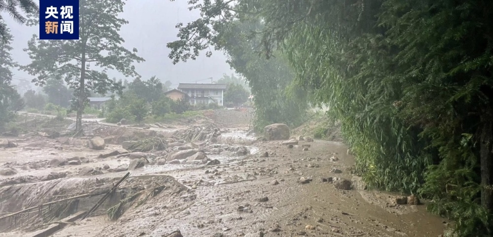
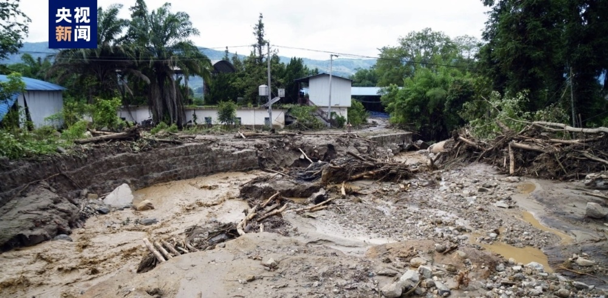
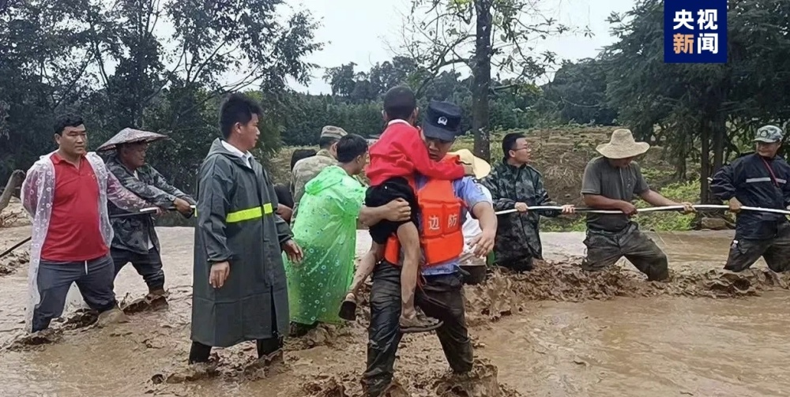
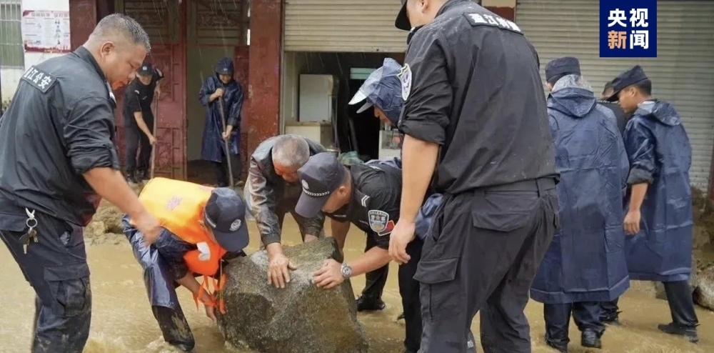

# 云南盈江发生山洪泥石流灾害，造成2人死亡，4人受轻伤

央视新闻客户端 | 作者 刀志楠

受西南气流影响，7月28日云南省德宏州盈江县南部、西部出现强降雨天气，其中太平镇雪梨村20小时降雨量达310.1毫米，暴雨造成严重山洪泥石流灾害。

据初步核查，截至7月28日17:00，灾害共造成盈江县太平镇、弄璋镇、铜壁关乡、昔马镇、那邦镇5个乡镇和1个农场社区1.58万户6.09万人受灾，2人死亡，4人受轻伤；房屋损坏120间；农作物受灾82.11公顷，成灾面积46.39公顷，绝收面积26.6公顷；农村饮水工程受损19件；平原至那邦、太平至洪崩河、芒允至铜壁关等3条干道阻断；灾害还造成部分电力、通信等设施受损。

灾情发生后，德宏州和盈江县迅速启动Ⅱ级应急响应，组织3000余人救援力量开展抢险救灾，共解救被困人员19人，紧急避险转移201户825人。

