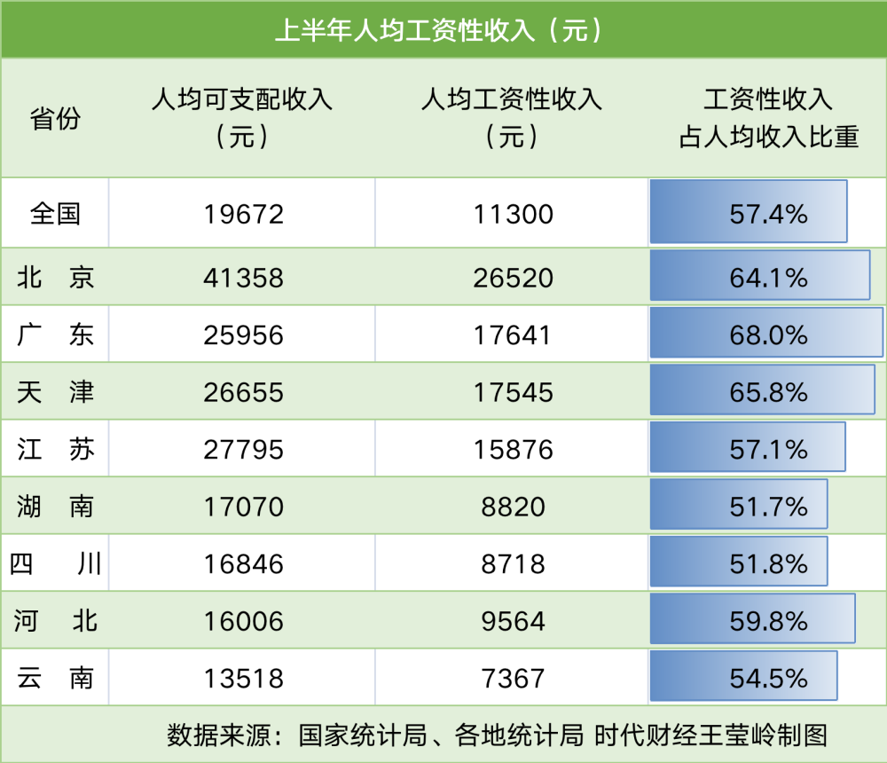
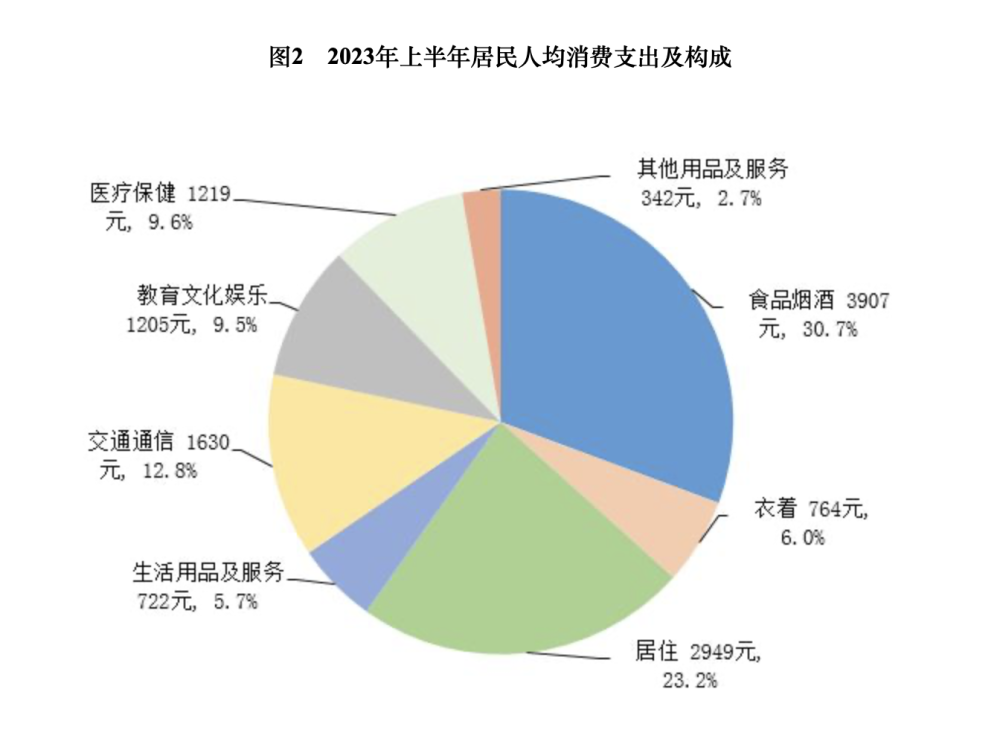
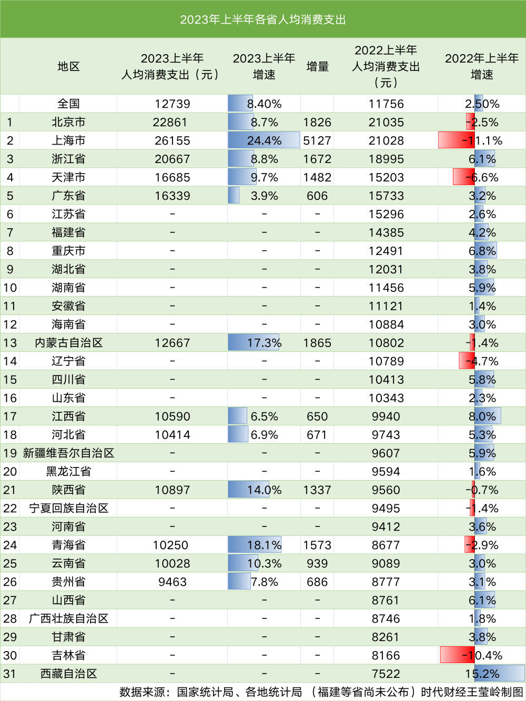
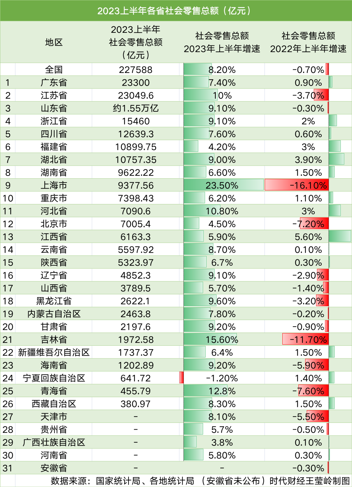

# 哪里的人最有钱？25地居民收入出炉：7省份跑赢全国，上海重回榜首

本文来源：时代财经 作者：王莹岭

近日，各省份陆续公布了2023年上半年居民收入、消费支出数据。

截至7月29日，25省份公布居民人均可支配收入数据，12省份公布人均消费支出数据。

其中，上海、北京、浙江继续排名居民人均可支配收入前三位，北京更是凭借近2000元的增量首次突破4万，上海也重新回归“4”字头。此前，上海居民人均可支配收入曾在2022年跌出4万。而山东居民人均可支配收入则首次突破2万，至此，“2万俱乐部”共有江苏、天津、广东、福建、山东5省份。

从人均消费支出来看，上海、北京、浙江3地“赚得多也花得多”，平均支出在2万元以上。

提振消费信心，是今年的经济稳步复苏的关键词。

“消费是收入的函数，促进消费就必须多渠道增加城乡居民收入。”7月18日，国家发展改革委政策研究室主任金贤东在新闻发布会上指出。7月24日召开的中共中央政治局会议也再次强调，要通过增加居民收入扩大消费。

可见，稳收入和促消费不分彼此，在激发经济活力上，二者缺一不可。

那么，上半年，哪里人的钱袋子鼓起来了？哪里人的开销最大？

**上海重回收入榜首**

首先来看各地的居民收入情况。

据国家统计局数据，上半年，全国居民人均可支配收入19672元，比上年同期名义增长6.5%，扣除价格因素，实际增长5.8%。分城乡看，城镇居民人均可支配收入26357元，增长（以下如无特别说明，均为同比名义增长）5.4%，扣除价格因素，实际增长4.7%；农村居民人均可支配收入10551元，增长7.8%，扣除价格因素，实际增长7.2%。

作为居民的“钱袋子”，居民可支配收入是居民可用于最终消费支出和储蓄的总和，即居民可用于自由支配的收入，既包括现金收入，也包括实物收入。

那么，从各省来看，谁的“钱袋子”更鼓？

数据显示，上半年的居民可支配收入方面，上海、北京两地依旧保持领先，分别以42870元、41358元的人均收入稳居前二。值得一提的是，在去年上半年居民可支配收入被北京超过之后，上海在今年重回榜首，和北京拉开超1500元差距。

增速方面，上半年居民人均可支配收入增长最快的是上海，高达9.9%；其次是甘肃，达8.0%；天津市、广东省则低于5%。在已公布人均可支配收入的25省中，共有上海、海南、甘肃、宁夏、河北、陕西、西藏等7个省份跑赢全国平均线，这个数字与去年同期相比出现了“大洗牌”。

去年同期，江苏、广东、福建、重庆等16省份居民人均可支配收入增速跻身全国线以上，而从今年上半年来看，四川、重庆、江西、广东、江苏、云南等13地居民人均可支配收入均位居全国平均线以下，仅剩甘肃、西藏、宁夏继续保持高位。

事实上，按照收入的来源，居民可支配收入包含四项，分别为工资性收入、经营性净收入、财产性净收入和转移性净收入。整体而言，工资性收入是我国居民的主要收入来源，从全国来看，全国人均工资性收入11300元，占可支配收入的比重为57.4%，超过一半。

截至目前，各省虽未全部公布工资性收入，但从已公布的9省来看，北京工资最高，达到26520元，占北京市人均收入的64.12%；其次是广东，工资性收入达到17641元，占广东省人均收入的67.97%，超出全国10个百分点。天津的工资性收入达到17545元，占人均收入的65.82%。此外，其余省份的工资性收入占比也都超过50%。

**多地消费增速由负转正**

消费是拉动经济增长的重要引擎。随着经济社会全面恢复常态化运行，居民消费支出恢复态势明显。

国家统计局此前7月17日发布的数据显示，上半年，全国居民人均消费支出12739元，比上年同期名义增长8.4%，扣除价格因素影响，实际增长7.6%。分城乡看，城镇居民人均消费支出15810元，增长7.7%，扣除价格因素，实际增长7.0%；农村居民人均消费支出8550元，增长8.5%，扣除价格因素，实际增长7.9%。

居民的钱都花在哪了？从全国情况来看，食品烟酒占大头，人均花费3907元，占人均支出的30.7%，其次则是在居住上消费2949元，占人均支出的23.2%。此外，在增速方面，消费8大项中，人均医疗保健消费支出1219元，同比增长最快，增速达到17.1%，其次是人均教育文化娱乐消费支出，增长16.2%。

**分省份看，各地居民的消费支出情况如何？**

时代财经梳理发现，在已公布的12省份里，人均消费支出均在2023年上半年实现了正增长。其中北京、上海、天津、陕西、青海、内蒙古6地均为由负转正，消费复苏势头可见一斑。有5个省份名义增速超过了10%，分别是上海、青海、内蒙古、陕西、云南。其中上半年上海居民人均消费指出名义增速高达24.4%，暂居第一。

数据显示，上半年有5个省份居民人均消费指支出超过1.5万元，分别是北京、上海、浙江、广东、天津，全部来自东部地区。

其中超过2万元的有上海、北京、浙江，三地上半年的居民人均消费支出分别为26155元、22861元、20667元。天津、广东则均保持在1.6万元区间，不过，天津以16685元、9.7%的增速首次超过了广东。

其中，上海的人均消费支出及增速都位居全国第一，可见，上海正在找回“上海速度”。上半年，全市社会消费品零售总额9377.56亿元，同比增长23.5%。尤其是限额以上汽车类、金银珠宝类、通讯器材类商品增长较快，零售额分别同比增长41.5%、38.3%、26.7%。

排名居于第三的浙江也有亮点。今年上半年，浙江的人均消费首次突破2万元，达到20667元。增速在去年同期基数不低的基础上，又达到8.8%，和北京、上海的差距在持续缩小。

今年以来，各地纷纷出台促消费政策，整体社会消费潜力得到释放。

社会零售数据，是居民内需的主要指标。截至7月29日，有25省份公布了上半年社会消费品零售总额，从数据也可看出，有14地扭转了去年同期的负增长态势，实现由负转正。

其实，从全国来看，提振消费仍是下半年的重中之重。

7月24日，中共中央政治局召开会议，分析研究当前经济形势，部署下半年经济工作。会议明确，要提振汽车、电子产品、家居等大宗消费，推动体育休闲、文化旅游等服务消费。次日，商务部召开全国消费促进工作年中推进会召开，也强调将持续办好“消费提振年”系列活动，提振汽车、家居等大宗消费。

