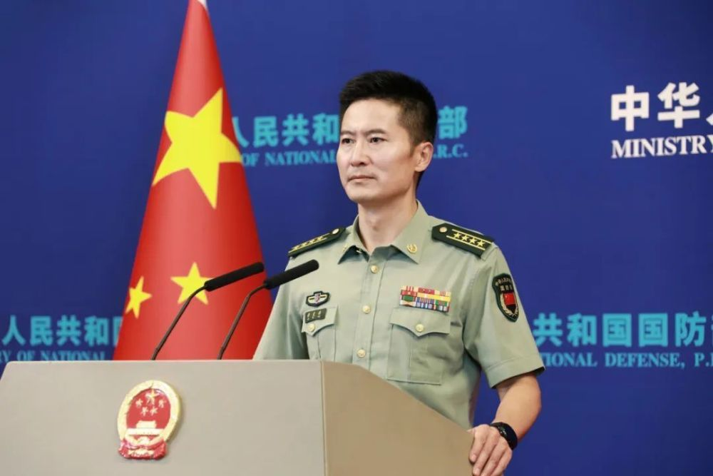

# 国防部新闻发言人谭克非就日本政府通过2023年版《防卫白皮书》答记者问

来源：国防部发布

**记者：**
日本政府通过2023年版《防卫白皮书》，将中国定位为日“前所未有的最大战略挑战”，称中方大幅增加国防费、加快军力发展，在东海、南海“单方面改变现状”，中俄在日周边海空域开展联合行动，并称中国大陆军事活动威胁台海和平稳定。请问对此有何评论？

**谭克非：**
日方新版《防卫白皮书》固守错误对华认知，刻意渲染所谓“中国军事威胁”，抹黑炒作中国军队正常的建设发展和军事活动，粗暴干涉中国内政，挑动地区紧张局势，我们对此表示坚决反对，已向日方提出严正交涉。

中国军队始终是维护世界和平稳定的坚定力量，从未挑战谁，更没有威胁谁。反而是日方近年来不断突破“和平宪法”约束和“专守防卫”原则，大幅增加防卫开支，鼓吹发展所谓“反击能力”，在军事扩张的道路上越走越远，追随个别大国搞有针对性的“小圈子”，给地区和世界和平、安全与稳定带来严重挑战。

中方是国际海洋法治的坚定捍卫者和建设者，在涉海问题上的立场一贯、明确。当前，东海、南海局势总体保持稳定。个别国家为了一己私利，派遣舰机频繁赴相关海域炫耀武力，严重加剧地区紧张局势。中俄防务领域合作建立在不结盟、不对抗、不针对第三方的基础上，致力于维护地区和世界的和平稳定，不对任何国家构成威胁。

台湾是中国的台湾，一个中国原则事关中日关系政治基础，是不可逾越的底线。日方在台湾问题上对中国人民负有严重历史罪责，近年来不但不反躬自省，反而不断干涉中国内政，违反国际关系基本准则，违背中日四个政治文件精神，破坏中日关系政治基础，加剧台海地区局势紧张，这是极其错误和危险的。

我们敦促日方深刻汲取历史教训，停止不负责任的言行，摒弃以邻为壑的零和对抗思维，树立正确的对华认知，在台湾等重大问题上重信守诺，在军事安全领域谨言慎行，以实际行动推动双边关系回到正确轨道。

