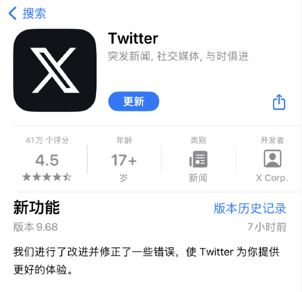
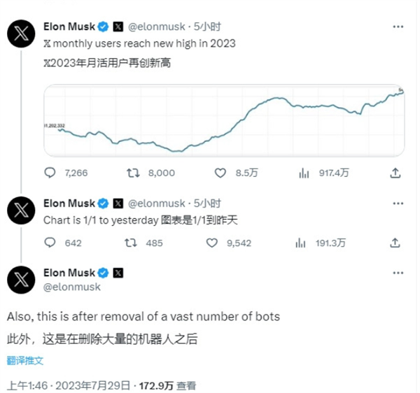

# 推特App图标正式变为X：马斯克宣布月活用户创新高

快科技7月29日消息，推特上周就宣布要改名为“X”，并且官方还换上了X的头像。

**今天，App Store中推特沿用了多年的小蓝鸟图标已经下线，换成了黑白配色的“X”。**

应用内各种“Twitter”的元素也在逐渐被抹去，比如之前名为Twitter blue的订阅服务已经被X blue取代。

**不过，虽然图标等都已经更换完毕，但应用名称依然是“Twitter”。**

对于为何要从推特更换成“X”，此前马斯克表示一方面是为了确保言论自由，另一方面也是为了促进X这个万能应用的发展。

**马斯克就曾表示，希望将推特变成“X”，一个集音频、视频、信息、支付和银行服务于一体，如同微信般无所不能的App。**

马斯克还强调，这是在删除了大量机器人之后的数据，说明真人活跃度是大大提升的。

根据分析机构的数据显示，2022年同期推特月活为3.68亿，同比增长了47%。

