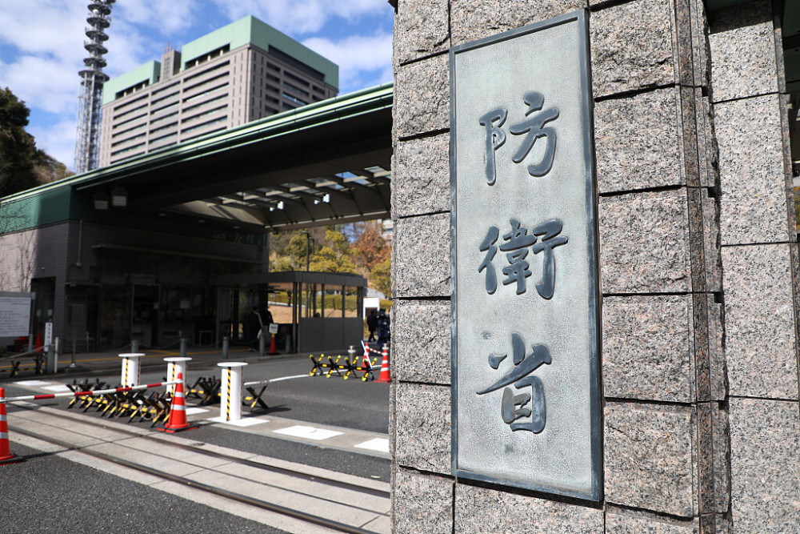

# 日本发新防卫白皮书渲染周边“安全威胁”，中韩批驳

【环球时报记者 邢晓婧 环球时报驻韩国特约记者
林森】“日本新版《防卫白皮书》粗暴干涉中国内政，肆意抹黑中方正常的国防发展建设和海空军事活动，刻意渲染所谓‘中国威胁’，制造地区局势紧张，中方对此表示强烈不满和坚决反对，已向日方提出严正交涉。”28日，中国外交部发言人如此表示。当天早些时候，日本防卫相滨田靖一在内阁会议上发布了2023年版《防卫白皮书》。白皮书宣称中国正在急速强化军事力量，是对国际秩序的“最大战略挑战”。日本共同社称，措辞较去年的“强烈关切”有所加强。

日本防卫省官网信息显示，新版白皮书主要包含安保环境、安保防卫政策、为实现防卫目标可采取的三种方式、强化共同基础等四大部分。增设阐述“国家安全保障战略”“国家防卫战略”“强化同盟调整功能”等相关章节。日本共同社28日报道称，白皮书在卷首对中俄及朝鲜增强军事能力做了专题介绍，强调“正面临战后最为严峻复杂的安全保障环境”，就强化自卫队体制以及到2027年度的5年内投入约43万亿日元（约合人民币2.2万亿元）防卫费寻求理解。

 _日本东京新宿区防卫省，资料图_

白皮书凸显日本军事进攻意图。它称乌克兰遭到进攻的原因在于威慑力不足，主张有必要着眼于对方的能力来建设防卫力量。白皮书对决定拥有的反击能力（对敌基地攻击能力）很重视，称之为“阻止敌方入侵的关键”。

此外，该白皮书不仅公然对台海局势指手画脚，并将中国军事动向称为日本和国际社会“严重关切的问题”，应通过提升综合国力以及与盟友、其他国家的合作共同应对。共同社称，白皮书对中俄军方在日本周边的联合行动表示“严重关切”，其局势认识沿袭了3份文件，提高了对中俄合作的警戒程度。

中国国际问题研究院亚太研究所特聘研究员项昊宇28日在接受《环球时报》记者采访时分析说，日本新版白皮书与以往相比最大的变化在于全面反映去年年底出台的“安保三文件”的内容，不变的是依然通篇贯穿着意识形态色彩和冷战对抗思维。从其基调和措辞表述看，总体上承袭“安保三文件”中的战略理念和政策方针，着力渲染日本面临的外部安全环境日趋严峻，竭力煽动面临中俄朝“三面威胁”，为其推进强军扩武路线制造借口，这也进一步印证日本“专守防卫”的战后防卫路线已名存实亡，其国家发展正严重背离和平主义路线。

项昊宇称，新版白皮书中继续以大篇幅渲染中国军力发展，炒作涉台问题，反映出日本防卫政策视中国为主要“对手”甚至“威胁”的定位已趋于固化，也进一步暴露其“以台制华”的战略企图。继去年以来，新版白皮书继续大肆渲染乌克兰危机对“国际秩序的挑战”，并试图通过炒作中俄军事合作将中俄进行绑定，服务于美西方推动大国竞争和阵营对抗的“新冷战”布局需要。这些都反映出日本国际秩序观和国家安全思维极度扭曲，暴露其谋求挣脱“战后体制”、争当“政治大国”的危险性。

中国外交部发言人毛宁28日在例行记者会上对此表示，中国坚持走和平发展道路，奉行防御性国防政策，中国的国防建设和军事活动正当合理，同有关国家开展联合巡航等军事合作，符合国际法和国际惯例。台湾是中国领土，台湾问题纯属中国内政，不容任何外部势力干涉，两岸之间所谓的“军事平衡”完全是个伪命题。日本在台湾问题上对中国人民负有严重历史罪责，尤应谨言慎行，反躬自省。

韩国外交部28日也以发言人名义发表评论，就日本新版白皮书再次主张独岛（日本称竹岛）主权一事提出严正抗议，敦促日方立即撤回错误主张。韩国外交部亚太局局长徐旻廷28日召见代行日本驻韩国大使职务的政务公使山本文土，就独岛问题进行交涉。

