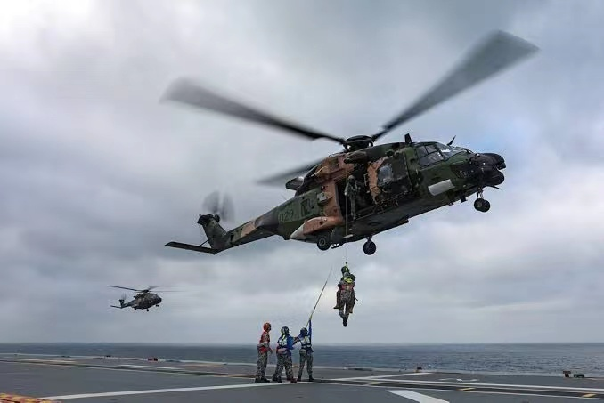

# 澳媒：和美国“护身军刀”军演上，一澳军直升机突然坠毁4人失踪

【环球网报道】据澳大利亚广播公司最新消息，澳大利亚国防部长马尔斯表示，在28日晚上，澳军一架MRH-90直升机坠毁，4名乘员失踪。

 _MRH-90直升机 资料图_

报道称，作为“护身军刀”军演的一部分，这架直升机坠毁时正在圣灵群岛地区参与与美国海军陆战队的演习。五角大楼发言人拒绝回应该媒体就坠毁一事的置评请求，并让其询问澳大利亚国防军。

