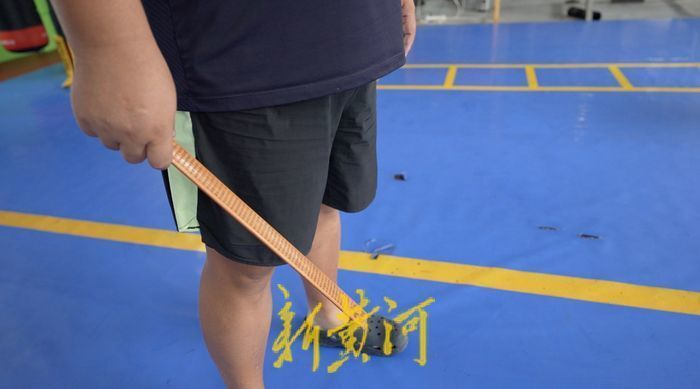
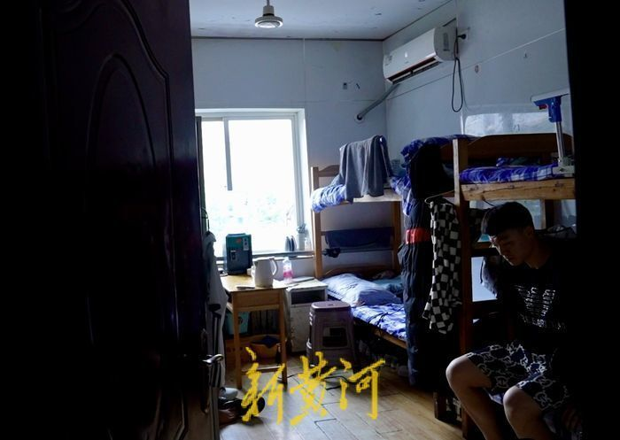
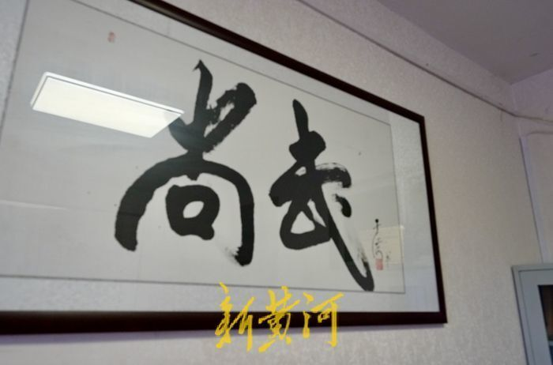
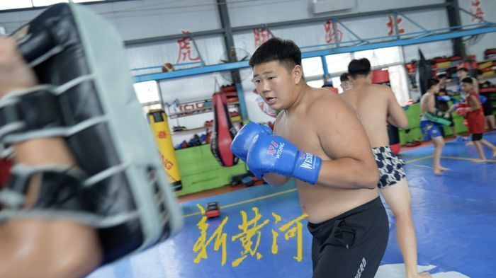
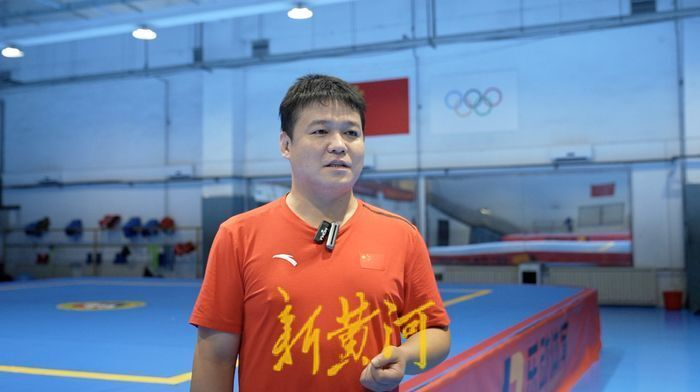

# 真实的“八角笼中”：农村孩子学散打，当学习没天赋，习武成唯一选择

近期，电影《八角笼中》的热映，让综合格斗这项规则开放的搏击运动受到了广泛关注。一直以来，中国武术散打对格斗起到重要引领作用，不少职业选手都是散打运动员出身，比如亚洲首位UFC世界冠军张伟丽，比如名将李景亮、张美煊。

在济南城北的伯乐搏击俱乐部里，学散打的孩子们聚在一起，年龄跨度从4岁到18岁，他们大多数来自农村，逆袭的通道并不宽广，当发现学习没有天赋的时候，习武成了不得已的选择。

 _于向桐正在进行对抗训练_

冬练三九，夏练三伏。跟九年义务教育不同，习武少年的青少年时期伴随着训练、挑战、成败和运动伤病。创伤代言了少年的拼搏精神，汗水凝结成“未来”的一部分。对于他们来说，求武就是求学，更是寻找一条“出路”。

**训练场**

7月盛夏，雨季的济南开启蒸笼模式。14日当天气温达到33摄氏度，天气闷热，却迟迟不见雨来。俱乐部阁楼的训练场窗户大开，现场除了拳脚相向的击打声，只有天花板的吊扇和两台大功率空调扇嗡嗡作响。于向桐汗如雨下，觉得有些喘不过气。不久前，15岁的他刚刚获得2023年山东省武术散打男子锦标赛90公斤级冠军，与他对抗的是代景豪，今年16岁，同期斩获了85公斤级冠军。两人都是济南市体育运动学校散打队的队员，暑假期间在俱乐部继续训练。

一声哨响，对抗训练结束。王猛把戒尺一扔，上前示范：“散打是加分制项目，我们是要拿成绩的。赛场上，一定要动作清晰，看位移、听声音，打出效果来。”刻着《弟子规》的戒尺已经包浆，这是教练的教具，不过它不是用来“打手心”的，而是为了方便指点击打部位和得分点的。王猛是济南市散打搏击运动协会的秘书长，也是伯乐搏击俱乐部的主理人，这家成立20多年的俱乐部是济南市体校的选材基地，每年有上百个孩子来到这里，他们大多数来自农村，尚武之风兴盛的鲁西南地区是热门生源地。

跟普通中小学生的生活不同，体校的日子称得上艰苦。每天早上5点半起床跑操，7点打扫宿舍卫生，8点上文化课；下午集中训练，晚饭后还有一个半小时的训练时间。现在正值暑假，上午没有文化课，全天都要进行训练，“每周一、三、五的晚上休息，周天发一次手机，可以出校门。”代景豪11岁就开始练散打了，他记得自己刚来的时候“累得天天哭”，每隔一段时间都有同学吃不了苦回家。

_俱乐部宿舍_

训练场的墙面上印着醒目的“冬练三九，夏练三伏”“拳打南山猛虎，脚踢北海蛟龙”的习武口号，防撞的软包墙纸已经斑驳。俱乐部的二楼是学员宿舍，要通过户外加装的铝合金楼梯才能到达训练场，透过台阶空隙可以看到孩子们晾晒的衣服，平时，除了在体校，他们吃住练都在这里。“最开始先练了4个多月的基本功，抱架、踢边腿、前后直拳，再练拳腿组合、打靶子。”代景豪觉得，体能训练最痛苦，越野跑、冲圈、力量训练，过程枯燥磨人，感觉没有尽头。

于向桐习武最初是为了减肥，“小时候可胖了，被俺爸送到河南的武校练了好几年‘套路’。”武术套路是一项不算激烈的运动，加上当时年龄小、调皮，于向桐没能减肥成功。现在的他又高又壮，“越野跑要从小清河旁边的训练场跑到黄河边上，每次我都是最后几名，教练就骑个自行车沿着黄河撵我们。”

_场地训练_

**三兄弟**

俱乐部里，大家习惯喊于向桐“于老三”，跟他一起练散打的还有两个哥哥：“于老大”于同博是堂哥，今年17岁，个子比于向桐矮一头，平时比较内敛沉默；亲哥“于老二”因为脚趾骨折正在菏泽老家休养。三兄弟都由于向桐的父亲于倦民抚养，也是受他的影响走上了习武之路。

“老大这个孩子的身世比较坎坷，小时候遭遇家庭变故，不大爱说话。”于倦民回忆，2014年，于同博的生父去河南考驾照，回来的路上遇到了大雾天气，乘坐的面包车与一辆大货车相撞，消防队到达事故现场把车锯开才把人救出来。“当时送到医院抢救过来了，但之后没过几天，我弟弟还是走了。”于倦民找到弟媳，承诺一定会帮她把孩子抚养成人。

或许是承受不了生活的苦难，三年后，弟媳一声不吭地改嫁了，自那之后便鲜少出现。“我就想，要不让孩子们离开家乡这个环境，一起出去锻炼锻炼吧。刚好那时候老三比较胖，学习也一般，怕他在家里养成坏习惯。”

菏泽是“武术之乡”，尚武之风源远流长，于倦民首先想到把三兄弟送去武校。他以前也是练散打出身，没能站上赛场是少时的遗憾：“我很热爱这个项目，但当时年龄到了，在这一行没大有发展，就去参军了。”于倦民在部队工作了10年，转业之后成为一名公安民警，对散打的热爱依然没有消退，“我问他们对散打感不感兴趣，愿意的话我就给仨孩子一样的平台，受一样的教育。”

就这样，三兄弟开始了新的征程。“吃苦”是第一课，老大于同博刚开始训练的头几个月，曾经累得受不了偷偷跑回家，又被返送回来；老二在一次对抗训练中脚趾受伤，硬捱几天后去医院才发现是骨折。于倦民再心疼也不会表露：“受伤在所难免，我走过这条路，知道有多不容易。但也因为经历过，所以更知道现在吃的苦对孩子们以后是好事。”

除了侄子之外，弟弟还留下了两个女儿，再加上自己的两个孩子，于倦民总共要负担5个孩子的教育和成长。“生活压力非常大。但孩子是最重要的，他们还这么小，大人平时不花钱不买衣服也得把他们培养教育好。”

三兄弟中，老大和老二因为年龄限制，几乎没有站在赛场上的机会了，于倦民拿自己的经历激励他们：“好好训练把身体素质搞上去，体校毕业之后去参军当兵，部队对身体好的、有武术特长的也会优先考虑。”老三于向桐刚刚拿了省锦标赛冠军，于倦民很欣慰：“他还有比赛机会，所以对他的要求更加严格。我经常跟他说好好打，将来有希望把他培养成全国冠军。”

**出路**

人无法同时拥有青春和对青春的感受。许锡振是济南市体校散打队的总教练，他开玩笑说，如果不练散打他可能会去当一名厨师。“吃不了学习的苦，就要吃其他的苦。”从运动员到教练，20多年的散打生涯让他对这句话感受颇深：“每个孩子的天赋不一样，学习不好不代表脑子笨，他可能天生对运动更擅长。但不管选择哪条路，都要用十足的努力拼出未来。”

1999年开始，许锡振作为运动员拼搏了11年，拿过大小赛事的多个冠军，在省市专业队和国家队都训练过，“从来没有因为苦累想过放弃，唯一一次动摇是因为伤病，比赛之前还没恢复，怕影响状态发挥不好。”退役后，许锡振当教练13年，培养的队员也拿到了几乎所有青少年比赛的冠军。

而十几岁的孩子，对未来的想象只有模糊的轮廓。代景豪记得小学六年级结束的那个暑假，父亲看着他的成绩单叹气：“去体校吧，将来拼拼还能拿个运动员证。”伴随着无休止的训练和一次次比赛的成败，少年逐渐成长。拿到省锦标赛冠军后，代景豪的目标逐渐清晰：“我想继续打比赛，拿一级运动员证，考上海体育大学。”

王文聪是受武打片影响来练散打的，爷爷奶奶觉得这条路太苦，不如上学是正经事，王文聪很坚决：“我能适应，比起学习，训练更适合我。以后我想去当兵。”汪俊浩今年13岁，只练了一年散打，他在前不久的山东省锦标赛中获得了第二名，“学这个对上大学有帮助，平时训练很累很枯燥，但比赛拿到成绩的时候就全忘了，特别想继续练下去。”

“拿到国家二级运动员证书，相当于一只脚迈入了大学校门。散打搏击有对口的专业，叫做民族传统体育，很多大学都设置了这个专业。”许锡振说，根据等级标准，体校优秀的学生，获得山东省锦标赛前3名可以申请国家二级运动员证，进入全国青少年锦标赛前6名就能申请国家一级运动员证书。今年，济南市体校毕业的学生们，有16位通过体育单招考上大学，被北京体育大学、上海体育大学、山东师范大学、杭州师范大学等高校录取。“更优秀的学生可以被选拔进省市专业队，甚至还能去国家队打比赛。”

王猛说，大多数孩子练散打是为了多找一条出路，“干我们这一行的可能学习不好，但无论是品行、能力还是吃苦耐劳的精神，没有差的。”就他观察来看，除了进专业队和上大学，很多人在体校毕业后选择去当兵，也有人成为体育老师，还有人继续留在行业里，开武馆、当教练。

王猛自己就是例子，年少时得过全省冠军，进入大学主攻体育专业，毕业后当教练，后来接手俱乐部，现在继续为专业散打运动队筛选培养后备人才。“冠军只有一个，这是武术和体育的魅力。但我觉得能在成长道路中经受住锻炼和考验，能够坚持不懈地长久去做一件事情，这种精神对每个人来说都很宝贵。”

新黄河客户端记者：李睿 编辑：郑楚翘

