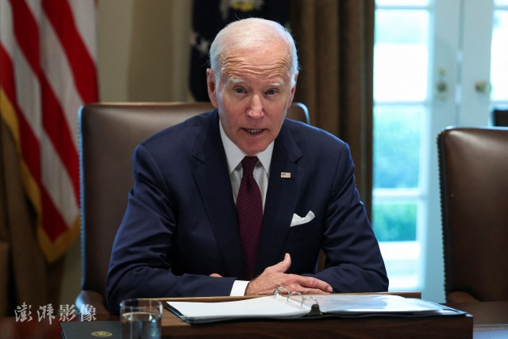

# 美媒又放风：拜登计划8月中旬前签署行政令，限制美对华关键技术投资

【环球网报道】据彭博社当地时间7月28日报道，据知情人士透露，美国总统拜登计划在8月中旬之前签署一项行政令，旨在限制美国对中国半导体、人工智能等领域的关键技术投资。此前，中国外交部发言人毛宁已明确表示，中方一贯反对美方将经贸科技问题政治化、武器化。中方认为，对正常技术合作和经贸往来人为设置障碍的做法违反市场经济原则，扰乱全球产供链稳定，不符合任何一方的利益。

_当地时间6月6日，拜登在华盛顿召开政府会议。资料图 图源：澎湃影像_

报道称，预计上述行政令会限制美国在中国芯片、人工智能、量子计算领域的交易，其不会对现有投资产生任何影响，但会禁止开展特定交易，其他交易须向美国政府汇报。报道还称，该行政令所规定限制措施具体要到明年才会生效，其适用范围将在措施制定过程中确定。

报道还提到，预计该行政令具体会在8月第二周签署，美国此前多次推迟签署该行政令，这次也无法保证不会再推迟。但匿名消息人士称，美国内部已从讨论限制措施的主要内容转向讨论推出行政令及对应规定。

报道称，美国国家安全委员会发言人拒绝对上述消息置评。

彭博社称，上述行政令所规定措施是白宫为限制中国发展新一代技术能力所作努力的一部分，预计这些技术会在国家安全和经济安全领域发挥核心作用。报道还称，美方此前在这方面所作工作已使拜登政府与中国之间本已紧张的关系变得更加复杂，中方认为，美方采取这些限制措施是在寻求遏制和孤立中国。

近来，外媒多次放风称拜登政府计划对美国向一些中国企业进行投资作出限制。在中国外交部本月18日举行的例行记者会上，彭博社记者提到，消息人士称，拜登政府限制对华投资的计划将限于尖端技术和新投资，且很可能明年才生效。美国政府官员计划于8月底出台计划，很可能禁止对中国半导体、量子计算和人工智能领域的投资，而生物技术和能源领域预计将不在受限行列。对此，中国外交部发言人毛宁表示，中方一贯反对美方将经贸科技问题政治化、武器化。我们认为，对正常技术合作和经贸往来人为设置障碍的做法违反市场经济原则，扰乱全球产供链稳定，不符合任何一方的利益。她还说，希望美方将拜登总统无意对华“脱钩”、无意阻挠中国经济发展、无意围堵中国的承诺落到实处，为中美经贸合作创造良好环境。

本月10日，财政部相关负责人就美财政部部长耶伦访华情况答媒体询问时表示，近年来，美方出台一系列对华经济制裁打压措施，损害了中国市场主体的正当权益，破坏了两国关系的民意基础。在与耶伦的会见会谈中，中方再次重申了在取消对华加征关税、停止打压中国企业、公平对待两国双向投资、放宽对华出口管制、取消涉疆产品禁令等问题上的关切，希望美方切实采取行动，回应中方在两国经济关系中的重大关切。

