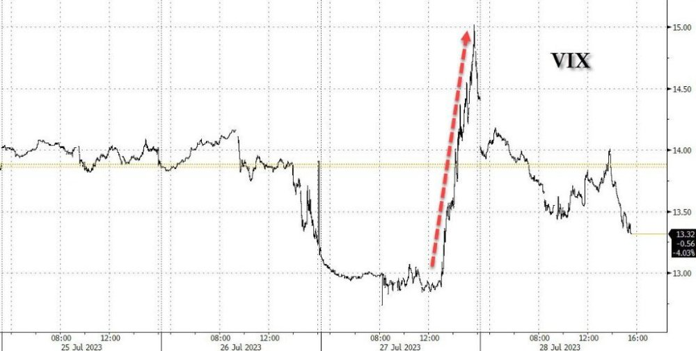
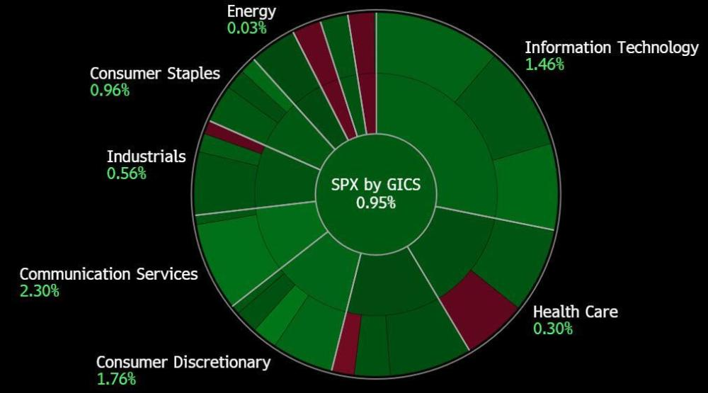
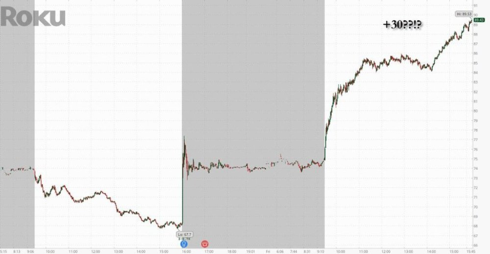
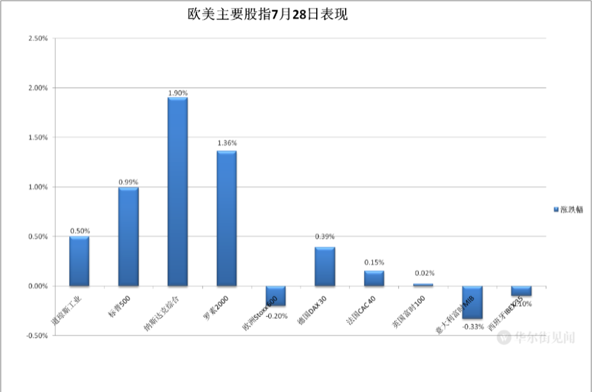
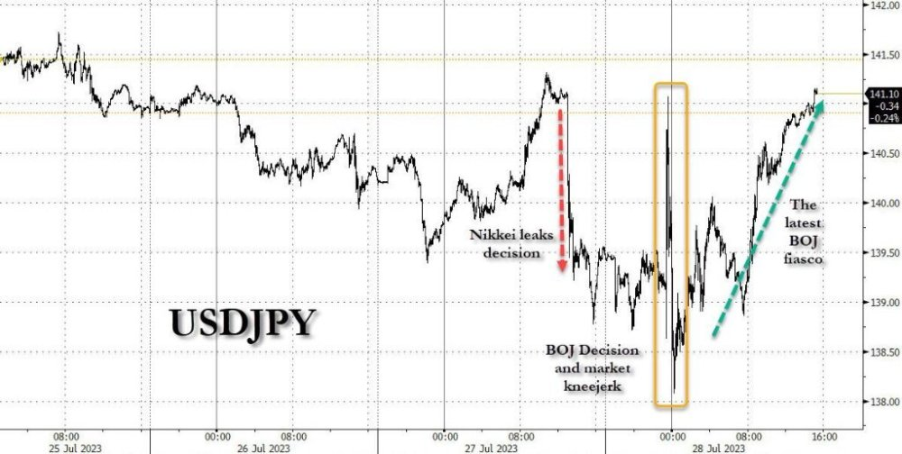
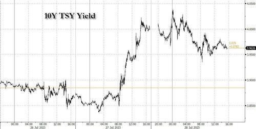
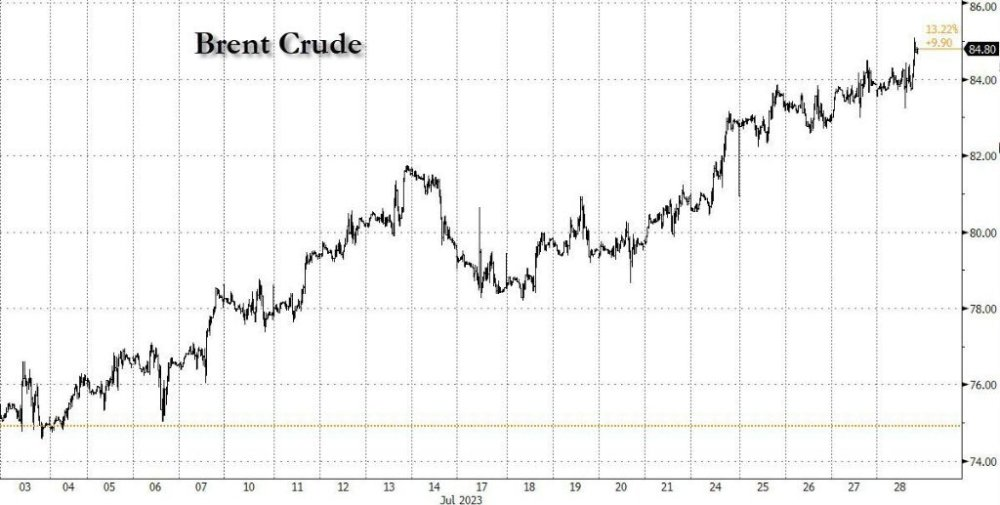

# 超级央行周日本“突袭”仅插曲，科技股力挺美股反弹，中概指数大涨7%

在欧美日三大央行密集公布货币政策决议的超级央行周，日本央行意外调整收益率政策的冲击并未持久。在这段日本“突袭”的小插曲过后，得到经济利好支持的美股迅速反弹，锁定全周涨势，中概股更是强势跑赢欧美股指，惊艳收官。

继周四的GDP等数据后，周五又有一批美国数据传出美联储更有希望软着陆的好消息：

美联储青睐的通胀指标PCE物价指数与核心PCE物价指数6月双双增长放缓，PCE创2021年3月以来最低同比增速，核心PCE同比增长还超预期放缓至4.1%，创2021年9月以来最低增速；二季度劳工成本指数环比增长1%，创两年来最低增速。

关键指标体现通胀继续降温的同时，密歇根大学公布的7月美国消费者信心终值创2021年10月以来新高，反映通胀继续放缓提振消费者信心。调查显示，抱怨通胀影响生活水平的消费者减少。

数据助长了投资者对经济处于冷热适中状态——既有韧性又有通胀放缓的信心。美股摆脱周五亚市盘中日本央行“突袭”冲击，周四就因媒体爆料东京“突袭”而“惊吓”转跌的主要美股指全线反弹，风险偏好周四受创后又提升。获科技股力挺的纳指更是凭借周五大反弹，摆脱连续两周累跌的危险。

_衡量美股波动率的VIX“恐慌指数”周四涨超9%，周五大幅回落，跌超7%_

科技股周五为美股立下头功，周三盘后公布向好业绩的Meta和谷歌加速走高，芯片股继续跑赢大盘。英特尔公布的二季度业绩和三季度指引均优于预期，或暗示期待已久的行业复苏将至，和三星、SK海力士和美光均发出下半年芯片需求复苏的信号。中概股更为出色，继定调下半年经济工作的中央政治局会议召开当天周一之后，本周第二日狂飙，中概股指数创仅次于年初的今年第二大日涨幅。

日本央行周五“突袭”落地：宣布收益率曲线控制（YCC）政策的10年期日债收益率目标区间保持±0.5%不变，但措辞改为目标上下限仅作参考、将更灵活控制，且每日购买10年期日债的收益率水平从0.5%上调至1.0%。

 _十年期日本国债收益率创2014年来新高_

日本央行行动也震动日元汇率，央行官宣调整YCC灵活性后，日元亚市盘中暴拉超1%，但涨势未能保持，后持续回落。尽管美国PCE通胀放缓，数据公布后美元指数仍未能转涨，继续跌离周五稍早日央行冲击市场后所创的两周多来高位。人民币等非美货币反弹，而PCE数据公布后日元跌势不改，日元兑美元加速下行，较日高回落逾1%。

评论称，美元下跌是因为投资者相对并不在意继续显示通胀放缓的新数据，他们还在梳理本周欧美日央行的决策，判断货币政策前景。几个月前，即使是通胀增速比共识预期低一点也能搅动市场，而今市场已基本摆脱通胀的影响，周五的反应证明汇市并未担心通胀。

大宗商品中，得到美元和美债收益率回落的助推，贵金属金银反弹，但因周四公布美国经济数据向好后盘中跳水，黄金一个月来首次单周累跌；中国释放支持房产市场等经济利好，包括经济风向标“铜博士”在内，伦铜等多种基本金属本周反弹，受益于新能源车需求的伦镍高涨超7%。

周五国际原油有惊无险盘中转涨，继续创4月以来新高，延续一个月来单周连涨的势头。而且，涨幅超过沙特和俄罗斯宣布减少供应新举措的7月首周，刷新当周所创的三个月来最大周涨幅。本周原油大涨得益于夏季需求强劲时沙特和俄罗斯新增减产，同时，美国更有可能避免衰退，中国又出政策利好，都令油市对需求的前景更乐观。

纳指创两月最大涨幅 Meta和谷歌财报周涨超10% 芯片股连日跑赢大盘 中概指数创今年第二大日涨幅

三大美国股指早盘高开高走，午盘涨势有所缓和。早盘尾声刷新日高时，开盘即涨超1%的纳斯达克综合指数涨近2.1%，标普500指数涨近1.2%，道琼斯工业平均指数涨超230点、涨0.8%。最终，三大美股指第三日集体收涨，周四终结13日连涨的道指和连跌两日的标普及纳指均成功反弹。

纳指收涨1.9%，创5月26日以来最大涨幅，报14316.66点，反弹至7月19日以来高位。标普收涨0.99%，报4582.23点，刷新周二所创的去年4月以来收盘高位。道指收涨176.57点，涨幅0.5%，报35459.29点，逼近周三所创的去年2月9日以来高位。

_E-迷你标普500期货在周四媒体爆出日央行调整后跳水，周五持续反弹_

科技股为重的纳斯达克100指数收涨1.85%；价值股为主的小盘股指罗素2000收涨1.36%，均反弹至7月19日以来高位。

本周主要美股指集体累涨。周五大涨的纳指和纳斯达克100分别累涨1.6%和2.11%，抹平上周回落的跌幅。在连日创1987年6月以来最长连涨日的本周，道指累涨0.66%，未能像前两周那样涨超2%，受累于周四一日跌超200点、创7月6日以来最大跌幅。标普累涨1.01%，罗素2000累涨1.29%，和道指均连涨三周。

标普500各大板块中，周五只有跌近0.3%的公用事业和金融收跌，Meta和谷歌所在的通信服务涨超2%，连续第二日表现最佳，特斯拉所在的非必需消费品涨近1.9%，芯片股所在的IT涨近1.5%，尽显科技股力撑大盘之势，其他板块均未涨超1%。

 _周五标普各大板块中仅两个收跌，Meta所在板块领涨_

本周有七个板块累涨，通信服务涨近6.9%，其他板块涨不足2%，材料、能源和IT涨超1%；四个累跌的板块中，公用事业跌超2%，房产跌1.8%，医疗跌近0.9%，金融跌超0.2%。

周五龙头科技股全线上涨。特斯拉收涨4.2%，脱离连跌三日所创的6月28日以来收盘低位，因周五大反弹，得以本周累涨近2.5%。

FAANMG六大科技股中，Facebook母公司Meta收涨4.4%，持平周四所创的三个月来最大收盘涨幅，在财报公布后连续两日涨超4%，连涨四日至去年1月以来高位；亚马逊收涨近3.1%，连涨两日至7月19日以来高位；奈飞收涨略超3%，走出连跌三日所创的6月8日以来低谷；谷歌母公司Alphabet收涨近2.5%，连涨六日，继续创去年4月以来新高；周四连跌两日至6月26日以来低位的微软收涨2.3%，有望在公布二季度云业务持续放缓、AI尚未带来新业绩增长点后首次收涨，周四回落的苹果收涨近1.4%，刷新上周三所创的收盘历史高位。

本周这些科技股多数累计上涨，Meta和Alphabet在发布财报后持续走高，均一周涨超10%，分别累涨约10.6%和10.5%，苹果涨约2%，亚马逊涨1.7%，而同样本周公布财报的微软跌近1.6%，奈飞跌0.4%。

芯片股总体连续两日跑赢大盘，费城半导体指数和半导体行业ETF
SOXX均收涨约2.2%，本周分别累涨3.7%和4.4%。个股中，截至收盘，周四盘后公布季度业绩向好的英特尔涨6.6%，领涨道指成份股，应用材料涨近4%，高通涨近2.9%，周四公布季度业绩和指引均优于预期后涨超9%的拉姆研究（LRCX）涨2.8%，英伟达涨近1.9%，AMD涨1.7%，博通涨0.7%，美光科技涨0.2%。

AI概念股齐反弹，且跑赢大盘。收盘时Palantir（PLTR）涨10.3%，SoundHound.ai（SOUN）涨逾8%，BigBear.ai（BBAI）涨近7%，C3.ai（AI）
涨超4%，Adobe（ADBE）涨2.9%。

继周一之后，热门中概股本周第二日狂飙。周一涨超4%的纳斯达克金龙中国指数（HXC）午盘涨超7%，收涨近7%，创1月4日以来将近七个月来最大涨幅，本周累涨13.3%。个股中，收盘时HXC的成分股亘喜生物涨近25%，好未来涨24%，老虎证券涨近20%，小鹏汽车、蔚来汽车、B站、万国数据、达达、金山云、高途教育、爱奇艺都涨超10%，理想汽车涨超9%，京东涨超6%，腾讯粉单涨近6%，阿里巴巴、拼多多涨超5%，百度涨近5%。

银行股指数集体反弹，本周继续累涨。银行业指标KBW银行指数（BKX）收涨0.8%，本周累涨1.2%；地区银行指数KBW Nasdaq Regional
Banking Index（KRX）收涨1.3%，刷新周三所创的3月9日以来高位，本周涨近4.8%，地区银行股ETF
SPDR标普地区银行ETF（KRE）涨超1.4%，和BKX都开始靠近周三刷新的3月10日以来高位，本周涨超5%。

多家大银行逆市下跌，摩根士丹利跌超1%，花旗跌近1%，高盛跌近0.4%，美国银行跌超0.1%，而富国银行涨0.8%，摩根大通涨近0.6%。地区银行中，被摩根大通将评级从中性上调至增持、称其为中短期内拥有大量市场份额后，New
York Community Bancorp（NYCB）收涨5%，西太平洋合众银行（PACW）、Keycorp（KEY）、Zions
Bancorporation（ZION）涨超2%，阿莱恩斯西部银行（WAL）涨近2% 。

公布财报的个股中，二季度亏损低于预期、营收高于预期的流媒体公司Roku（ROKU）收涨31.4%；季度营收高于预期的宝洁（PG）收涨2.8%，在道指成份股中涨幅仅次于英特尔；季度收入和利润均高于预期的酒类公司Boston
Beer（SAM）收涨16.8%；称电动汽车应用速度慢于预期、预计电动汽车业务今年将亏损45亿美元的福特汽车（F）收跌3.4%；二季度营收高于预期但盈利低于预期的埃克森美孚（XOM）收跌1.2%；公布二季度营收低于预期后被德银、富国银行和Roth
MKM下调评级的光伏股Enphase Energy（ENPH）收跌7.5%。

欧股方面，周四欧洲央行暗示9月可能暂停加息后强劲反弹的泛欧股指回落，但蓝筹股指保住涨势。欧洲斯托克600指数跌落周四刷新的去年2月以来收盘高位。蓝筹股指欧洲斯托克50指数连续两日创2007年12月以来新高。

主要欧洲国家股指周五多数继续上涨，德股连续两日创收盘历史新高，和法股、英股连涨两日。而连涨八日的意大利股指跌落2008年中以来高位，连涨两日的西班牙股指也回落。各板块中，领涨的化工涨超1%，汽车涨0.9%，而传媒、基础资源、公用事业均跌超1%，周四大涨超4%领涨的科技跌近0.5%。

本周斯托克600指数涨超1%，连涨三周，涨幅仍远逊涨近3%的上上周。各国股指连续第三周累涨，意股涨超2%领跑，上周涨超3%领涨的英股涨幅垫底。

虽然周五回落，但科技板块全周表现出色，累涨超3%，抹平上周跌4.6%领跌的多数跌幅，上周跌幅居前的矿业股所在板块基础资源也强劲反弹，累涨超2%，抹平上周大多数跌幅。而上周涨超4%领涨的房产本周小幅跌约0.5%，上周涨3.8%的油气跌近0.8%。

日央行“突袭”后日元盘中暴拉超1% 后一度回落逾1% 美元指数创逾两周新高后转跌

追踪美元兑欧元等六种主要货币一篮子汇价的ICE美元指数（DXY）在亚市盘中多次短线转涨，欧股盘前一度涨破102.00，7月10日上上周一以来首次盘中突破102.00、刷新7月10日以来盘中高位，日内涨近0.3%，欧股开盘后持续下行，早盘转跌后再未能转涨，欧股盘中跌破101.40刷新日低，日内跌逾0.4%，美国PCE公布后曾抹平大部分盘中跌幅，美股开盘后跌幅有所扩大。

到周五美股收盘时，美元指数处于101.70下方，日内跌约0.1%，本周累涨超0.5%；追踪美元兑其他十种货币汇率的彭博美元现货指数跌约0.1%，本周涨不足0.1%，和美元指数均在周四反弹后小幅回落、并在连跌两周后连涨两周。

非美货币中，日元周五波动最大，盘中拉升后大幅回落，未能连涨五日。美元兑日元在亚市早盘曾短线涨破141.00刷新日高，日央行宣布调整YCC后，迅速跌穿140.00，并一度跌至138.70，继续刷新7月18日以来低位、盘中跌超1%，后持续反弹，欧股盘中几度转涨，美股盘前美国经济数据公布后重上140.00并保持上行，美股尾盘涨破141.10，日内涨超1%，也较日低回涨超1%。

 _美元兑日元在周四媒体爆出日央行考虑调整后跳水，周五日央行调整落地后先跳水、后持续回涨_

欧元兑美元在欧股盘初曾跌破1.0950，继续刷新7月10日以来低位，后持续反弹，美股早盘曾接近1.1050刷新日高，日内涨近0.7%；英镑兑美元在亚市盘中曾跌破1.2770，也继续刷新7
月10日以来低位，美股盘中刷新日高时接近1.2890，日内涨超0.7%。

离岸人民币（CNH）兑美元在亚市早盘刷新日低至7.1778，后很快转涨，美股开盘后涨幅扩大午盘刷新日高至7.1444，日内涨261点，和周四涨破7.12所创的6月16日以来高位仍有距离。北京时间7月29日4点59分，离岸人民币兑美元报7.1526元，较周四纽约尾盘涨179点，扭转两日连跌，本周累涨355点，悉数抹平上周止步两周连涨的跌幅。

高风险的加密货币追随美股反弹。比特币（BTC）在欧股早盘曾跌破2.92万美元刷新日低，美股早盘曾涨破2.95万美元刷新日高，较日低回涨约400美元、涨超1%，未继续靠近周一跌破2.90万美元所创6月21日以来低位，美股收盘时处于2.93万美元上方，最近24小时涨0.6%左右，最近七日跌近2%。

欧债收益率冲高回落 PCE公布后十年期美债收益率一度回落10个基点 全周仍升超10个基点

欧洲国债价格周五表现不一，收益率总体在盘初受日央行调整YCC“突袭”影响拉升，后持续回落，欧股盘中、美股盘前公布德法通胀放缓和GDP好转后，收益率刷新日低。

到债市尾盘，英国10年期基准国债收益率收报4.32%，日内升1个基点，在欧股盘初曾上测4.39%，刷新7月18日以来高位；2年期英债收益率收报4.92%，日内降6个基点，欧股盘初曾上测5.10%，也刷新7月18日以来高位；基准10年期德国国债收益率收报2.49%，日内升2个基点，欧市盘初曾接近2.59%，刷新7月13日以来高位；2年期德债收益率收报3.04%，大致持平周四水平，欧股开盘时曾升至3.1%刷新日高。

本周欧债价格在风险偏好升温之际下跌，尽管欧洲央行放鸽、德法通胀均降温，部分欧债的收益率仍反弹，结束两周连降势头。上周降约18个基点的10年期英债收益率累计升约6个基点，上周降约29个基点的2年期英债收益率升约4个基点；上周降约5个基点的10年期德债收益率升约3个基点，而上周降约10个基点的2年期德债收益率本周继续下降，降约4个基点。

相比欧债收益率的冲高回落，周五美债收益率在美国PCE通胀放缓后降幅更大，日本央行“突袭”的冲击昙花一现。

美国10年期基准国债收益率在日本央行宣布调整后，迅速接近4.04%，连续两日刷新7月10日上上周一以来高位，日内升近4个基点，后震荡下行，欧股盘中回到4.0%下方，美国PCE公布后下破3.94%刷新日低，日内降超6个基点、较日高回落略超过10个基点，到债市尾盘时约为3.95%，日内降约5个基点，本周累计降约12个基点，在上周止住大幅下行后重回降势。

_十年期美债收益率周五日央行官宣调整后先冲上两周多来高位，后大幅回落，回到4.0%下方_

对利率前景更敏感的2年期美债收益率在亚市盘中曾升破4.94%，逼近周四升破4.95%所创的7月10日以来高位，美股盘前下破4.88%刷新日低，到债市尾盘时约为4.87%，日内降近6个基点，本周累计升约3个基点，结束两周连降之势。

原油连涨五周 全周涨近5% 创三个多月最大涨幅

国际原油期货在欧股盘中和美股早盘均曾不止一次短线转涨，美股盘初刷新日低时，美国WTI原油失守80美元关口至79.07美元，日内跌近1.3%，布伦特原油跌至83.22美元，日内跌1.2%，美股午盘转涨后保住涨势。

最终，原油连续两日、本周第四日收涨，收涨的四日均创至少约三个月来新高。WTI
9月原油期货收涨0.61%，报80.58美元/桶，连续两日刷新周二所创的4月18日以来收盘高位；布伦特9月原油期货收涨0.89%，报84.99美元/桶，在周二和周四创4月18日以来新高后，又刷新4月14日以来收盘高位。

本周美油累计上涨4.55%，布油累涨4.84%，连涨五周，刷新7月7日一周所创的4月6日以来最大单周涨幅，继7月7日一周之后，再度一周至少涨超4%。

_布油冲上4月中以来高位，众多利用布油对冲衰退的空头承压_

美国汽油和天然气期货齐涨。NYMEX
8月汽油期货收涨0.18%，报2.9558美元/加仑，继续刷新去年10月以来收盘高位，在周二结束五连涨后连涨三日，本周累涨约5.5%，连涨五周；NYMEX
9月天然气期货收涨1.66%，报2.6380美元/百万英热单位，走出周四跌超3%所创的7月19日以来低位，本周累跌3.4%，在上周结束三周连跌后回落。

伦镍涨近3%两连涨 一周涨超7% 黄金告别两周低位 仍止步三周连涨

伦敦基本金属期货周五齐涨。领涨的伦镍涨近2.9%，连涨两日，收盘重上2.2万美元，逼近周二涨破2.23万美元所创的6月下旬以来高位。伦铅勉强两连阳，小幅靠近周二所创的1月末以来高位。连跌两日的伦铜、伦铝和伦锌反弹，伦铜和伦铝靠近周二所创的一周多来高位，伦锌刷新周二所创的两个多月来高位。周四止步四连阳的伦锡也反弹，开始靠近周三所创的两周来高位。

本周基本金属全线累涨，上周跌约4%领跌的伦镍涨超7%，表现最佳，伦锌涨超5%，伦铜涨超2%，伦锡涨近0.9%，伦铝涨逾0.8%，均在上周回落后反弹，伦铅涨超0.8%，连涨三周。

周四盘中跳水的纽约黄金和白银期货小幅反弹。COMEX
8月黄金期货收涨0.75%，报1960.40美元/盎司，告别周四刷新的7月11日上上周二报1937.1美元以来收盘低位。

本周期金累计下跌0.31%，在连涨三周后回落，主要源于周四跌超1.2%创6月2日以来最大跌幅。

纽约期银小幅反弹。COMEX
9月白银期货收涨0.52%，报24.495美元/盎司，脱离周四刷新的7月12日以来收盘低位，因周四跌超2%，本周仍累跌1.45%，连跌两周且每周都跌超1%。

