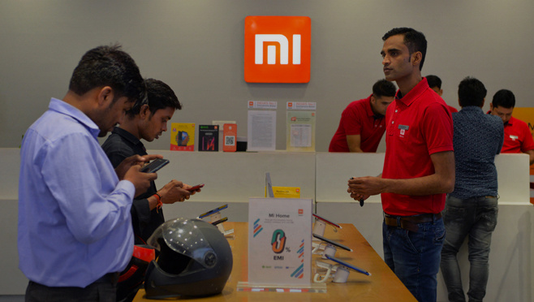
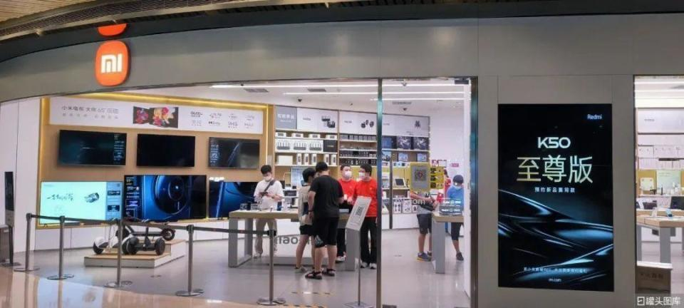
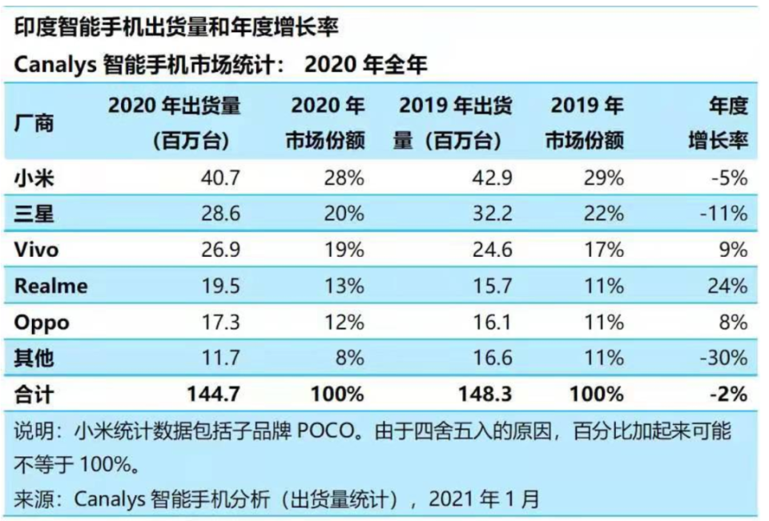
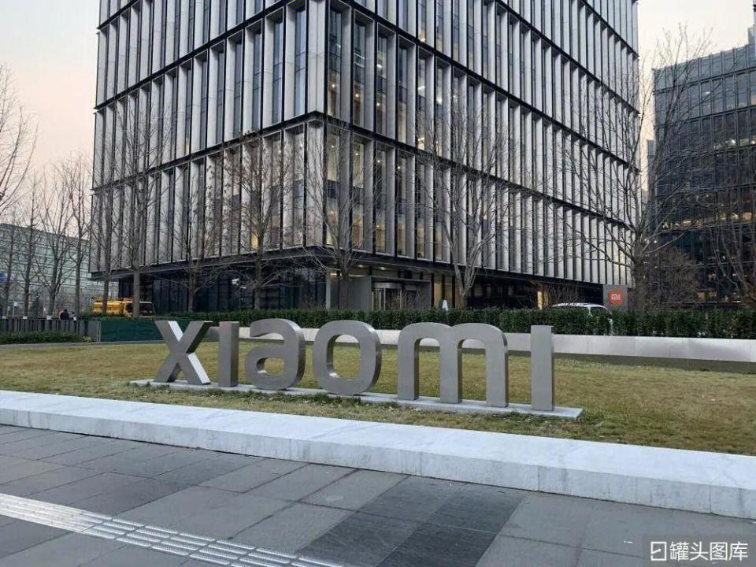
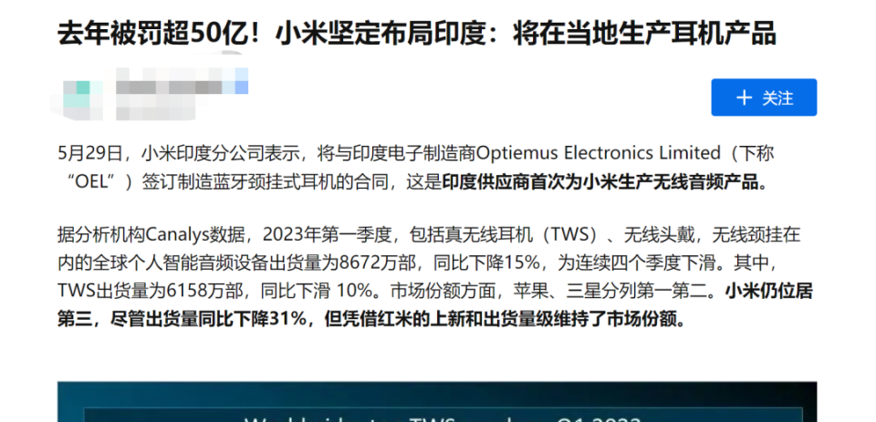

# 郭台铭撤出印度，雷军还远吗？

作者 | 张凯旌

编辑丨高岩

连续两个月遭到指控，小米在印度还要搭进去多少钱？

近日，据媒体报道，印度电子和信息技术部长宣称，中国智能手机供应商在过去几年逃避了数十亿美元的税收。
**其中小米已发现的逃税金额为85.11亿卢比，包括关税68.25亿卢比、商品及服务税16.86亿卢比。仅按照当前汇率计算，这部分累计的逃税金额约7.4亿元人民币。**
根据当地法律，小米很可能面临被追缴相应逃税金额、并且被罚款的情况。

_来源：罐头图库_

看似是一笔巨款，但如果与6月印度针对小米的另一项指控相比，只能算小巫见大巫。当时印度监管机构以“向外国实体非法转移资金”为由，冻结了小米印度公司555.13亿卢比，约合人民币48亿元。

值得注意的是，小米2022全年的经调整净利润为85亿元。而如果过去两个月来自印度的指控落地，小米去年利润的三分之二将“化为乌有”。面对这样的不利局面，小米还会留在这片已经奋斗了近十年的海外热土吗？

印度“盯上”小米？

因为营商环境和政策的多变，印度一向被称为“外企坟场”。但对于小米来说，这片土地却有着不同的意义。

小米第一款手机发布于2011年8月，此后仅过了三年，小米就已经进驻印度市场；又过了三年，小米成为了印度市场智能手机出货量第一，市场份额达到26.8%。

可以说， **印度市场的增长在小米崛起的过程中起到了关键性的作用。**
甚至有观点认为，是印度加速了小米IPO的进程。数据显示，2015年小米海外销售占收入比重为6.1%，至2017年这个数字已提升至28%。

雷军“Are you OK？”的经典名场面，也是小米在印度举办小米4i手机发布会时诞生的。

**为了能在印度卖好产品，小米在本地化方面投入了大量的时间、精力。**
其先是选择了在印度互联网圈颇有名气的马努作为小米印度负责人；随后又在印度直接建厂，并广泛搭建基础服务设施，在各种广告中强调其零部件“75%产自印度本土”；此外，小米还是印度手机市场中为数不多可提供当地定制功能的品牌。

与此同时， **小米此前联合顺为资本，围绕智能手机和MIUI生态在印度进行了深度投资。**
印度最大的影音版权方之一Hungama、最大的校园贷和新兴的白领贷Krazybee、最大的二手手机回收和维修公司Cashify等的股东中都有“小米系”身影。2017年小米还称将在未来5年向印度的100家创业公司投资10亿美元，以增加印度移动互联网的应用。

一系列组合拳下来，部分印度人甚至大有将小米认做本土品牌之势，印度之米（Mi from India）的口号深入人心。

**小米对印度情有独钟，可从7年前开始，印度收拾起小米来却一点不手软。**
2016年，印度曾把对手机零部件降了的关税，从5%加到了最高20%；2022年初，印度先是指控小米偷税漏税，后又指责其违反当地外汇法，并冻结了其价值555.1亿卢比（约合人民币48亿元）的资产。

**两件事的核心其实都与交税有关。** 小米在印度本土生产销售的商品中，含有境外其他公司的授权技术，因此需要向技术提供方上缴一部分专利授权费。

不过，这套流程也能用来合理避税，做法是在有税收优惠的国家指定一家技术公司为本地企业提供支持，再将本地企业收入的一部分以版税形式向该技术公司转移。印度方面就认为，小米印度一直向三个外国实体缴纳大笔版税，实质是以此为由转移收入，规避缴纳所得税，因此需要重新征税。

**事实上，近两个月小米印度遭遇的黑天鹅，正是上述两项指控的延续。6月，印度负责打击金融犯罪的机构向小米印度、公司负责人及银行发出通知，称小米涉嫌违反外汇管理法的指控成立；而最近两天的税收追缴金额，也是从印度电子和信息技术部长口中传出的。**

 _来源：罐头图库_

“之前就有这些指控，但是具体得算账，就算到现在了，不是新鲜事。”有业内人士表示。

对此，小米的回应也一以贯之：小米印度所有运营活动严格遵守当地法律法规；将致力于与政府密切合作，澄清任何误会。
**其还曾强调，自己支付的版税完全用于旗下印度产品授权技术和知识产权费用，是合理的商业安排。**

但仅是如此似乎不足以解决问题。上述业内人士认为，这些诉讼都会持续很长时间，即便有了阶段性结果，也可以继续上诉，而且税务局不同于国内刑事案件的强制执行。“没个三五年都没戏。”

**更何况，印度对小米的监管还在加码。**
最新的规定是，小米等手机制造商的CEO、CFO、CTO、COO等关键高管职位，必须由印度籍人士担任，且公司供应商必须是印度本地公司等。

小米在印度的处境颇有点进退两难。

深耕印度9年，小米成“出头鸟”？

小米并不是印度监管处罚的孤例，无论是中资还是外资企业，智能手机厂商还是其他类型的品牌，不少在印度都曾有过类似的经历。
**不过，印度的追查也并非毫无章法，至少从时间线上来看，其动作是有迹可循的。**

2020年年中，印度曾对在本地流行的59个中国App采取全面封禁措施，其中包括人们熟知的TikTok、快手、微信、微博等，理由是“它们从事的活动不利于印度的主权和完整，印度防御，国家安全和公共秩序。”不久后，脸书、推特等美国App也被纳入了印度的监管范围内。

**在封禁之前，中国和美国的社交App占据了大部分印度市场；封禁后，印度大力扶持本土的社交平台，后者也就此迈入发展快车道。**

如印度短视频平台Chingari，成立几年也只有百万级的下载量，禁止中国59个App的2020年，下载量超1100万次；另一家印度短视频平台Moj，TikTok被禁后两天在Google商店的下载量就达到了5万次。

在通过监管的雷霆手段尝到甜头后，印度将目光对准了中资聚集的手机行业。 **而小米作为常年占据印度手机市场份额第一的外企，自然更易成为重点照顾对象。**

数据显示，2020年以出货量计算，小米在印度智能手机市场份额为28%，第一季度甚至一度超30%。同期，中国厂商对印度智能手机市场总出货量的贡献达到77%，同比增加5%，且很可能会继续增长。

_来源：Canalys数据_

在此背景下，2021年印度开始突击审查小米税务问题，连带其他中国手机厂商也卷入风波中。比如去年7月，印度曾称vivo涉嫌洗钱；几乎是在同一时间，OPPO也被指控逃税。

**不过，这次印度本土手机品牌并没有趁机崛起**
，包括Lava、Micromax和Reliance等品牌市场份额一直不足1%，而直到今年一季度，中国智能手机厂商在印度的市场份额仍高达70%以上。
**这很大程度上和中国手机“香”有关系，在同等价位下，中国手机的质量和性能均超越印度本土品牌，用户体验更好，消费者选择用脚投票。**

当然，纵使印度在网友们心中留下过“不讲道理”、“脑回路清奇”的印象，其想进行指控，也要先考虑证据。就这点而言，
**长期为中国企业赴印度投资提供法律服务的律师李钦认为，与印度选择性执法有关。**

李钦曾在《新京报》撰文，其中提到印度的法律可以用“高标准立法，普遍性违法，选择性执法”来概括。

简而言之，印度法律要求守法者达到的标准非常高，而执法部门一般又不会主动通知企业更正不合规行为，但违规行为一旦被发现，就会从违规第一日起计算罚金。如果有企业头铁坚持去法院硬刚，首先会惊叹于其审判效率，其次针对复杂的法律条款，企业和执法者的理解可能出现偏差。比如企业认为是合理税务筹划，执法机关认为是偷漏税、违法。
**那么最终如何认定，印度司法的自由裁量权很大。这就让企业摸不着头脑，产生不安全感。**

郭台铭先行撤退，雷军还远吗？

艰难的营商环境下，已经有不少企业选择全身而退。

印度官方公布的数据显示，2014年至2021年11月，有2783家在印度注册的外国公司关闭了其在印度的业务，约占在印跨国公司的六分之一，撤离的公司包括法国零售巨头家乐福、美国汽车巨头福特等。

**最近的一个例子是富士康。投资1亿多美元后，7月10日富士康声明称，已退出与印度韦丹塔集团价值195亿美元（约合人民币1410亿元）的半导体合资企业。**

在此之前，富士康也曾被印度指控涉嫌隐瞒收入和避税、做假账；而且印度政府也一直没有履行在2021年底宣布的芯片产业激励计划，这项计划本可以向符合条件的企业提供最高达项目成本50%的财政支持。

_来源：罐头图库_

不过，雷军想要做出撤退的选择，显然要比郭台铭难上许多。2022年，小米手机在印度市场的出货量还占到全球出货量的20%，即使同比有所下降，也仍对营收有重要贡献。

**但小米在战略布局上，已经做出一些变化。**

**6月底，小米在印度进行了大规模裁员。**
据印度《经济时报》，今年年初小米印度尚有1400-1500名员工，未来预计将减少至约1000人。对此小米的回应是，会根据市场状况和业务预测做出员工数量的规划。

**此外，小米方面表示，其实过去的这些年里都没有在印度继续投资。而近期市场上一些有关“小米寻求在印度市场扩大线下零售”“小米印度公司表示正大力投资10000-15000卢比的设备市场，从而夺回失去的市场份额”的报道也并不是真实情况。**

**野马财经注意到，这些报道的来源主要是外媒对“小米印度业务负责人”穆拉里什南(Muralikrishnan
B)的采访。而小米表示，该“负责人”只是第三方的外包促销工作人员，这种说法是对业务和发展最乐观和理想的预估，实际上距离目标还有很大的挑战。**

_​来源：罐头图库_

不久前，小米与印度电子制造商签订制造蓝牙颈挂式耳机的合同，同样被解读为“加大投资”。而实际情况是，这类耳机在国内已经淘汰，没有代工厂愿意生产，而印度还有需求，因此小米便找国内的合作伙伴委托了一个印度的工厂代工。

_来源：知乎_

Omdia移动终端首席分析师李泽刚表示，不友好的政策肯定会影响企业的战略布局。但从市场的角度来讲，印度的消费者是需要我们的产品的，
**目前看厂家在印度的经营偏向稳健和保守，受宏观环境的影响未来应该不会有激进的投入，而是把资源投入其他的机会市场寻求增量。**

当前的小米，并非处在最好的时期。手机业务触到瓶颈，造车进展悬而未决……但公司依然需要拿出稳定的业绩，让市场恢复信心。在此背景下，确定性和谨慎对小米而言格外重要，而一个不稳定的印度市场，又能对公司提供多少帮助呢？

**而这一点，雷军也未尝想不明白，只是在印度投入太大，壮士断腕一时还下不了决心。**

