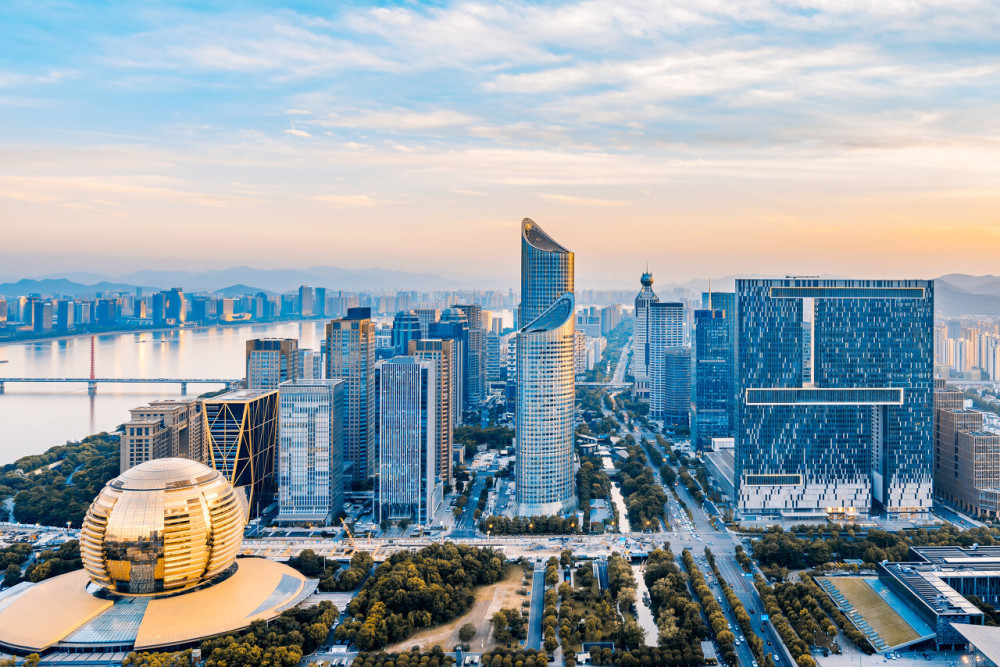
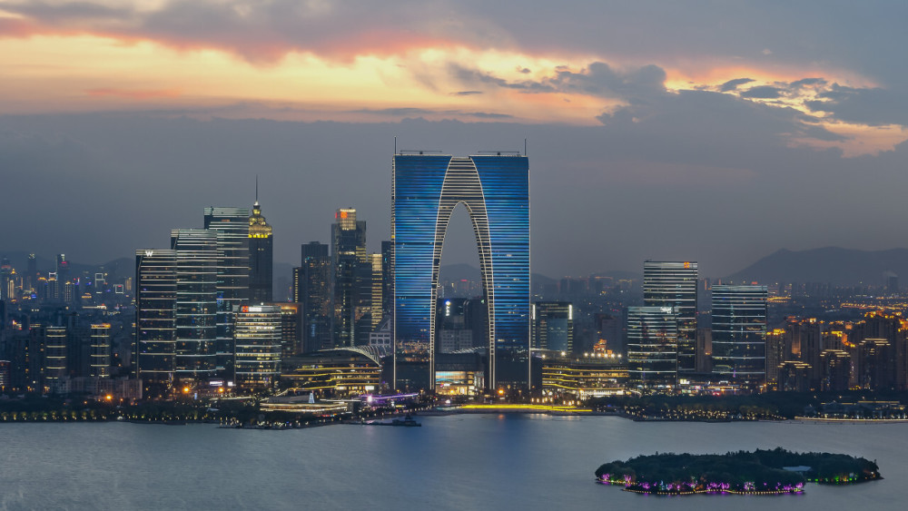
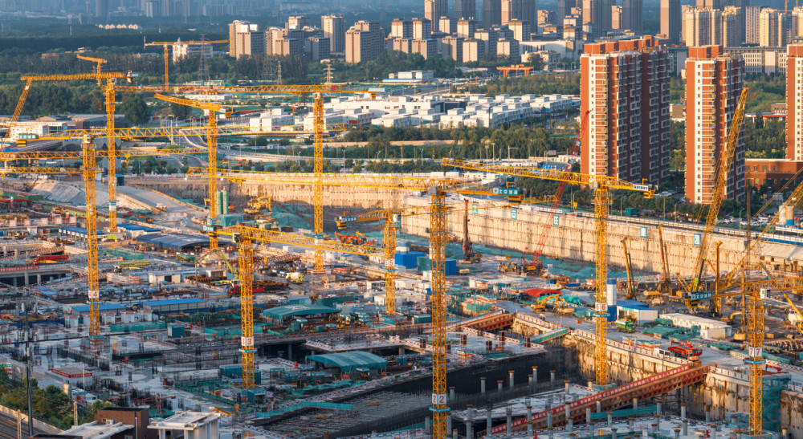

# GDP十强城市半年报：长三角占四席，上海重回首位，南京守住第十

本文来源：时代周报 作者：阿力米热

城市之间的竞争，愈发激烈。

作为国民经济发展中的“排头兵”，在国家统计局公布上半年的经济数据后，各城市的经济“成绩单”也随之揭晓。

和往年一样，2023年上半年，十强城市阵容依然是熟悉的面孔。依次为上海、北京、深圳、重庆、广州、苏州、成都、杭州、武汉、南京。

从增速来看，上海、北京、深圳、成都、杭州、南京的GDP增速均超过或追平“国家线”（5.5%）。其中，上海以9.7%的增速排在了首位，经济总量排名的位次也重回第一。分区域来看，长三角地区继续挑起大梁，在GDP十强城市中，占据四席。

这一次，身处西南地区的成都表现相当亮眼。上半年，成都首次突破万亿大关，GDP实现了10705.5亿元，同比增长5.8%。

与此同时，今年上半年，南京仍旧是GDP十强城市守门员。经过了两年多的追赶，天津仍未能完成突围，目前与南京的差距还有474.09亿元。并且，天津还面临着宁波、青岛的奋力追赶。

长三角挑大梁

长三角地区作为国内重点打造的经济圈，拥有众多发展潜力的城市。今年上半年，上海、杭州、南京、苏州经济复苏明显提速，几乎占了全国十强城市的“半壁江山”。

从GDP总量上看，受疫情影响，上半年数据统计会有一定的基数效应，但上海作为经济头部城市的地位仍难以撼动。上半年，上海GDP达到21390.17亿元，同比增长9.7%，明显高于全国平均水平。

上海经济延续恢复态势，尤其表现在第二、第三产业。其中，第二产业增加值5082.60亿元，增长15.1%；第三产业增加值16272.45亿元，增长8.2%。

在第二产业之中，工业战略性新兴产业总产值增长较快，新能源汽车、新能源和高端装备产值分别增长69.8%、57.8%和33.1%，且高于其他的制造业增长。这意味着，上海的产业结构正迭代升级。

作为长三角地区的核心城市之一，上半年杭州顶住了压力。

_杭州钱江新城 图源：图虫创意_

实际上，一向是“优等生”的杭州，2022年GDP增速却回落至1.5%。这个增速，不仅在浙江省内11个城市中落后，在2022年全国GDP十强城市中也被武汉反超，仅位居第九。

2023年，在杭州提出“打好经济翻身仗”的背景下，经济运行呈现回升向好。数据显示，上半年杭州GDP总值达9602亿元，同比增长6.9%，比一季度回升了2.3个百分点。从产业来看，服务业是杭州的优势所在。

具体来看，上半年杭州服务业增加值6748亿元，同比增长9.3%，比一季度加快2.4个百分点。其中，以信息传输、软件和信息技术服务业为主体的营利性服务业增加值增长10.5%；房地产业、金融业、住宿餐饮业增加值分别增长8.4%、8.3%和20.1%。

浙江大学国际联合商学院数字经济与金融创新研究中心联席主任、研究员盘和林在接受时代周报记者采访时表示，随着政策效应逐步显现，正常经济秩序将快速恢复，消费也将逐步回升，带动服务生产快速增长。“此外，数字经济及电商平台已成为拉动城市经济的新兴力量，通过数字化赋能，很好的在引领发展、增加就业、国际竞争中发挥作用。”

上海、杭州之外，同处经济强省江苏的两大中心城市——南京、苏州，上半年的经济总体平稳向好，发展质效持续提升。

_苏州东方之门 图源：图虫创意_

从GDP总量来看，上半年，苏州GDP实现11458.4亿元，同比增长4.7%，排名全国第六。

其中，工业对苏州经济提升作用功不可没。规模以上工业增加值增速由一季度的-2.7%，提高至上半年的4.1%。工业35个大类行业中，29个行业产值增速比一季度加快，行业回升面达82.9%。

对于南京来说，与去年同期相比，整体的经济数据一直呈回升态势，但作为经济强省江苏的省会城市，这份成绩单并不算特别突出。上半年，南京GDP实现8316.92亿元，同比增长5.6%，其增速低于全省（6.6%）。

不过值得一提的是，南京对高新技术产业的投入力度在加大。具体来看，南京全市高技术制造业实现工业总产值2196.78亿元，同比增长5.3%，对规上工业增长贡献率为87.6%。

从投资增速也能看出南京对高新技术产业的投入力度。上半年，南京高新技术产业投资同比增长9.0%，其中，高技术制造业、高技术服务业投资分别增长12.4%、2.3%。

这也表明，南京正锚定“建设具有全球影响力的产业科技创新中心主承载区”目标，不断推动产业升级和创新发展，为其经济发展注入新的动力。

成都突破万亿

2023年上半年，GDP十强城市的另一大看点，是成都首次突破万亿大关。

看经济总量，上半年，成都GDP总值达到10705.5亿元，位列全国第七，同比增长5.8%，比全国增速高0.3个百分点。

具体到各产业上，第一产业增加值203.1亿元，增长2.4%；第二产业增加值3189.1亿元，增长1.2%；第三产业增加值7313.3亿元，增长8.1%。由此看到，以服务业为代表的第三产业，占比高达68.3%。

其中，现代服务业增势良好，信息传输、软件和信息技术服务业增加值增长9.2%，金融业增加值增长7.9%，6月末金融机构本外币存、贷款余额分别增长9.7%、14.1%。传统服务业加快复苏，住宿和餐饮业增加值增长17.0%，交通运输、仓储和邮政业增加值增长13.2%。

要知道，第三产业占比高，一方面说明成都的产业结构得到优化升级。而另一方面，也意味着居民的消费能力强，愿意付费提升生活品质。

_夜幕下灯火通明的成都锦里古街 图源：图虫创意_

2023年上半年，成都全市实现社会消费品零售总额4960.2亿元，同比增长8.8%，比一季度加快5.5个百分点。按消费类型分，商品零售4009.1亿元，增长6.3%；餐饮收入951.2亿元，增长20.8%。

中国国际经济交流中心宏观经济研究部副部长刘向东在接受时代周报记者采访时表示，上半年，旅游经济催热了城市消费，成都餐饮住宿火热爆满，社零消费同比增速高于全国0.6个百分点，展现出成都这一区域消费中心城市发展的韧劲和活力。“但也要看到，当前居民的消费潜力并没有完全释放。”

为持续释放成都全域消费潜力，前不久，成都市国际消费中心城市领导小组办公室印发实施《成都市推动消费提振升级建设国际消费中心城市行动方案》通过打造十大特色消费场景、培育十大新型消费平台、推进十大领域消费创新，不断增强新消费创生环境，推动消费数字化绿色转型，创新消费友好型制度供给。

然而，在成都上半年消费恢复态势向好的同时，上半年，成都投资增速表现却不及预期。

统计数据显示，今年1-6月，成都固定资产投资同比下降2.7%，降幅比一季度扩大0.6个百分点。其中，第一、二、三产业完成投资占全部固定资产投资比重分别为0.6%、11.6%、87.8%。房地产开发投资占全部固定资产投资比重为46.2%。

 _房地产开发 图源：图虫创意_

厦门大学经济学系副教授丁长发告诉时代周报记者，今年上半年，楼市回暖不及预期，房地产企业开发新项目意愿低迷，因此造成了房地产投资下滑。“但除房地产之外，成都电力、热力生产和供应业增长了1.4倍，以及在大运会的加持下，文化、体育和娱乐业投资上升的比较快，同比增长了39.8%。”

一般来讲，除了恢复和扩大消费，投资也是扩大内需、稳经济的重要抓手。成都固定资产投资增长动力放缓，也意味着要进一步增强投资对优化供给结构的关键作用。

那么，步入下半年，成都扩内需应从哪些方面发力？

刘向东认为，近年来，成都持续提升城市交通、物流枢纽建设水平，拥有国内功能最全的铁路货运口岸，也有双机场以及中西部功能最齐全的空运口岸，这些良好的通道优势和供应链环境也吸引了一大批企业落地成都。

“下半年成都要围绕中央经济工作会议和中央政治局会议要求，充分利用好已有交通物流等综合优势，推动工业、投资、消费、外贸等一体化联动发展。同时也要把提振消费摆在优先位置，持续优化消费环境，丰富消费场景，多渠道增加居民收入，激发市场主体活力，持续释放居民消费潜力。”刘向东说道。

