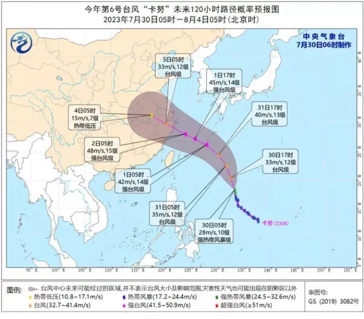
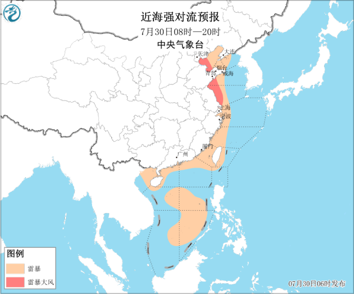
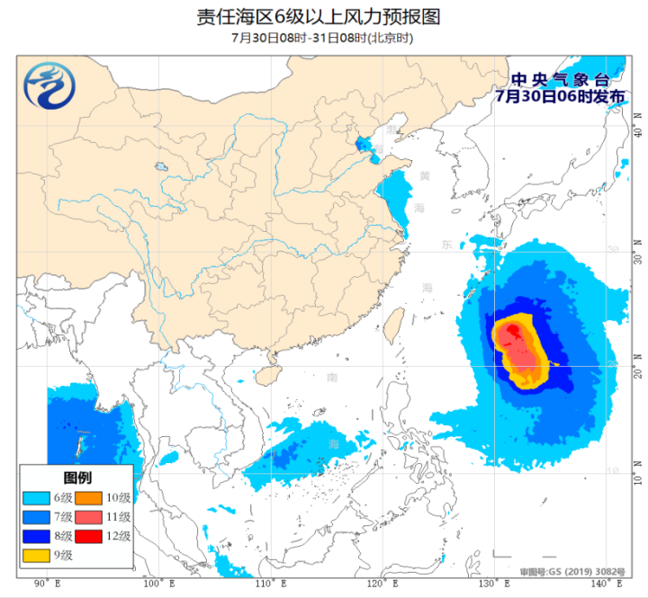
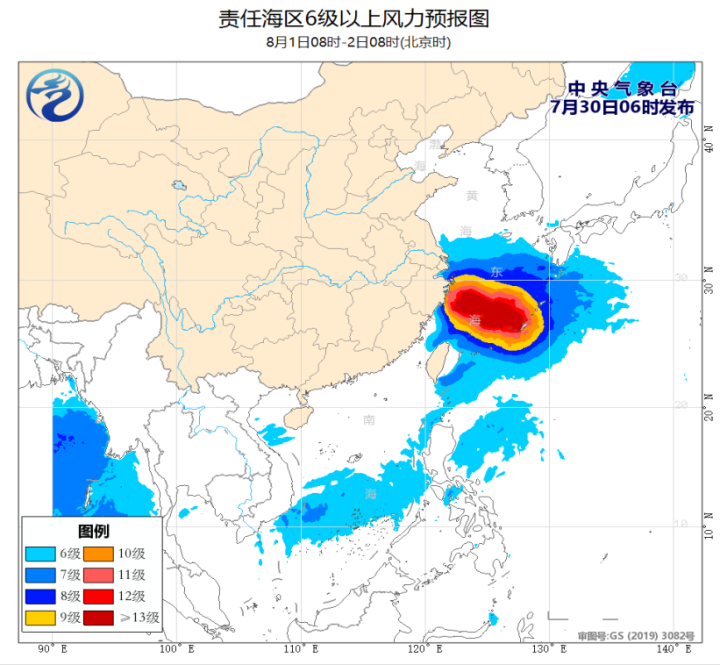

# 中央气象台：“卡努”最大强度可达强台风级，逐渐靠近浙江沿海

**一、“卡努”位于菲律宾以东洋面**

今年第6号台风“卡努”（热带风暴级）已于今天（30日）凌晨（北京时，下同）加强为强热带风暴级，早晨5点钟其中心位于菲律宾马尼拉东偏北方向约1370公里的菲律宾以东洋面上，就是北纬18.3度、东经133.2度，中心附近最大风力有10级（28米/秒），中心最低气压为982百帕，七级风圈半径280-360公里，十级风圈半径40-90公里。

**二、“卡努”将逐渐增强**

预计，“卡努”将以每小时20-25公里的速度向北偏西方向移动，31日在琉球群岛附近海域转向西北方向移动，31日夜间至8月1日早晨进入东海，逐渐向浙江沿海靠近，强度逐渐增强，最大强度可达强台风级（45-50米/秒，14-15级）。

 _我国东部海域将受台风“卡努”影响_

**一、近海海域天气实况**

29日14时至30日02时，黄海中部和南部海域、东海北部海域、南海中西部海域出现了5~6级、阵风7级的东南风或偏南风，南海南部海域出现了5~7级、阵风8级的西南风。

**二、近海海域重点天气预报**

1、我国近海部分沿岸海域将有雷暴大风

7月30日白天至夜间，渤海湾、莱州湾、山东半岛南部沿岸海域、江苏沿岸海域将有8~10级雷暴大风。

2、我国东部海域将受台风“卡努”影响

7月31日夜间至8月1日夜间，黄海南部海域、东海大部海域、台湾以东洋面将有6~7级、阵风8~9级大风，其中东海南部部分海域将有8~11级、阵风12~13级大风，台风“卡努”中心经过的附近海域风力可达12~15级、阵风16级。

**三、未来三天具体预报**

橙柿互动·都市快报 记者 毛迪

综合中央气象台

