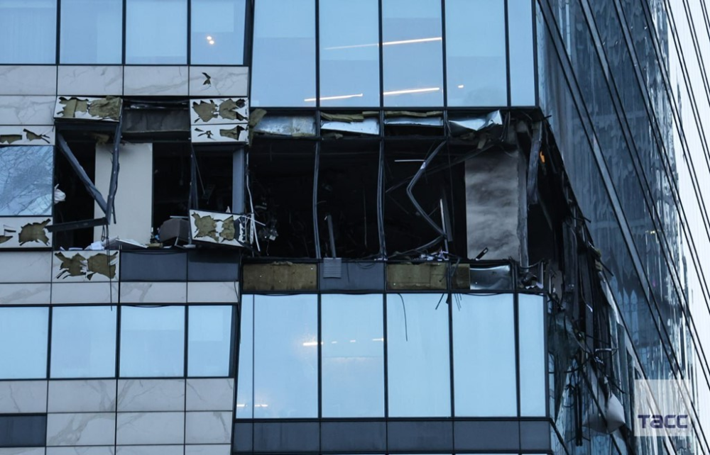

# 俄国防部通报：3架乌无人机袭击莫斯科，1架被击落，2架被压制

【环球网快讯】据法新社、俄罗斯卫星通讯社30日消息，俄罗斯国防部当天发布通报称，有3架乌克兰无人机袭击莫斯科。

莫斯科30日凌晨袭击中受损的建筑 图源：英国天空新闻网援引塔斯社

“基辅政权试图利用无人机对莫斯科市目标发动恐怖袭击的企图被挫败，”俄国防部在社交平台Telegram上称，一架无人机被击落，两架无人机“被电子战压制”，随后撞向该市一座建筑。

据塔斯社30日稍早前消息，莫斯科市长索比亚宁在社交媒体表示，乌克兰当地时间30日凌晨用无人机袭击莫斯科，没有造成人员伤亡。此外，莫斯科执法机构通报称，两架参与袭击的乌无人机在莫斯科西部被击落。

