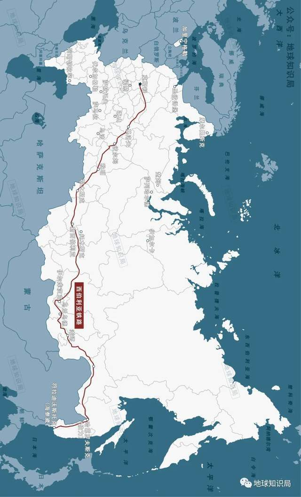

# 俄罗斯，高铁太拉胯了 | 地球知识局

(⊙_⊙)

每天一篇全球人文与地理

微信公众号：地球知识局

NO.2502-俄罗斯高铁

文字：冷夜寒星

校稿：辜汉膺 / 编辑：果栗乘

今年5月30日，俄罗斯卫星通讯社在中国各大社交媒体上发布了一篇题为《俄铁将建高铁，第一辆高铁列车将于 **2027年**
问世》的文章。该文直面惨淡的现实，指出俄罗斯还没有“运行时速200至400公里的列车”。

▲图注：眼下虽事实惨淡

但俄铁已经跃跃欲试要建设高铁了

（图：sputniknews）

不少去过俄罗斯的朋友，兴许都曾乘坐过莫斯科至圣彼得堡的游隼号（Sapsan）动车组。然而事实上，这款源自德国西门子技术的动车组在俄罗斯老旧的铁路线上，
**很难跑出理想的最高设计时速250公里** ，莫斯科至圣彼得堡约650公里的路程都至少需要3个半小时。

▲图注：好比是优秀的跑步运动员穿上了破旧的运动鞋...

（图：img-fotki.yandex.ru）

俄罗斯继承了苏联的绝大部分遗产，拥有着全世界里程第三的庞大铁路网，在各国高铁技术不断突飞猛进的今天，却在高速铁路建设方面却鲜有进展呢？是先天不足？还是当下拉胯？

今天的文章将带你了解 **俄罗斯高铁的前世今生** 。

另辟蹊径的尝试

▲图注：对于领土广袤的俄罗斯来说，铁路在 **国家建设、战争运输、商品流通** 等方面一直发挥着重要的作用。

从沙俄时期不惜巨资修建 **西伯利亚铁路** ，到苏联斯大林时期 **铁路网的覆盖和延伸**
，俄罗斯人民一直在铁路建设的规模和技术上不断追赶。早在1913年，俄国的铁路总里程就已跃居世界第二位和欧洲第一位。

▲图注： **横屏** -西伯利亚铁路

通往俄罗斯远东地区的重要通道

二战后的50年代末，苏联展开了对国内主要铁路干线的提速改造工程。在1958至1963年期间，苏联通过线路改造，将莫斯科至列宁格勒（今圣彼得堡）的铁路时速提升至了
**160公里** ，并于1963年3月在两大城市间开通了“阿芙乐尔号” **特快旅客列车** 。

▲图注：“阿芙乐尔”号特快旅客列车

取名自十月革命时炮击冬宫的阿芙乐尔号巡洋舰

然而1964年，世界上第一个高速铁路系统—— **日本新干线的成功运营**
，让世界上最早使用和普及铁路运输的欧洲国家感到了深深的危机感。而作为当时世界的两大超级大国，美苏两国自然都不甘心在高速铁路技术上落伍。

▲图注：沉浸在争霸中的美苏两国

着实没算到海的那一边“子弹头”会横空出世

（图：壹图网）

在技术路径的探索上，美苏两国都打算另辟蹊径，来一场火车的 **动力革命**
。鉴于当时的民用航空亚音速喷气式客机的成功，两国都打算把喷气式飞机的发动机装在列车上，研制喷气式高速列车。

▲图注：喷气式飞机不错，不知道喷气式火车如何？

（1971年《TM》杂志封面对喷气载具的畅想）

日本新干线开通的第二年，美国国会便通过了 **《高速地面交通法案》** 着手研制喷气式高速铁路车辆。

他们以一列RDC-3柴油机车为原型，改造成了有着倾斜式 **流线车头** ，并配有两台B-36H重型轰炸机上的 **涡轮喷气发动机**
的新高速列车，将其命名为M-497，绰号“黑甲虫”。

在1966年夏天，“黑甲虫”在冲高试验中跑出了 **时速295.54公里** 的美国铁路试验最高速度记录，这一记录美国至今尚未打破。

▲图注：黑色的机身配上顶端的喷气发动机

无论是外形配色还是动力设计都脑洞大开

▲图注：M-497的设计图纸

（图：General Electric）

美国冲高试验成果使得苏联大为紧张， **不甘于落后的苏联**
也于1969年上马了喷气式高速列车项目，由位于俄罗斯联邦特维尔州的加里宁车辆厂负责主体研制，全苏车辆制造科学研究院、雅科夫列夫航空设计局等单位都被调来研发。

最终这款使用雅克-40飞机的 **AI-25涡轮喷气发动机** ，呈独特 **流线型车头**
设计的SVL喷气式高速列（又称“俄罗斯三件套”）车在1970年问世。在1972年的冲高试验中，SVL机车通过分步加速的方法，实现了 **时速249公里**
的苏联铁路最高速度记录。

▲图注：SVL高速试验列车，可以看到头上的2台涡轮风扇发动机

但是，在接下来的研发中，苏联工程师发现喷气式高速列车的不少问题根本难以解决。

首先喷气式推进这种粗暴的加速方式 **能耗高，经济效益极低** 。其次，这种头顶加喷气式发动机的 **结构很不安全**
，一旦进入隧道，会造成进气量下降，向后喷出的废气甚至会使乘客缺氧。

而且，无论是苏联还是美国，其冲高试验都是在很平直的铁路线进行的，一旦弯道行驶时，车辆的轮轨反而会对喷气式发动机的 **前进带来阻力**
，其行驶的稳定性和安全性难以保障。

▲图注：现实运行可比理论测试要复杂得多

喷气式发动机还是还给飞机去用吧

因此美国在1966年冲高试验后不久，便悄咪咪地 **放弃了“黑甲虫”的后续研发** ，而后知后觉的苏联却在这个“天坑”上却继续投入了不少的人力和财力。

追赶潮流的突破

其实在追赶世界高速铁路潮流中，苏联一直未曾放弃过 **传统电力牵引列车** 的研发。

早在1967年，苏联交通部便通过了 **动力分散型电动列车**
设计方案的技术评审，即后来的ER200。该车流线型车头下部的圆弧形包裹设计极具辨识度。列车采用 **直流牵引电动机**
，由12辆动车和2辆拖车的编组构成，设计最高运营时速 **达200公里** 。

▲图注：苏联硬核式流线型车头

（图：pikabu.ru）

1973年，拉脱维亚的里加车辆厂成功研制出首列 **ER200动力分散型电动车组** 。之后里加车辆厂根据试验数据对该车的制动、传动等系统作出了改进。

▲图注：ER200的设计图纸

（图：pikabu.ru）

1975年，在汉斯卡亚至别洛列琴斯的冲高试验中，该车的最高时速达到 **210公里** 。此后通过技术验收的ER200型动车组于第二年开始在
**莫斯科至列宁格勒** 间投入运营考核。

1979年该车开始载客试运行，但是由于车辆调试和技术改进等多种因素，直到1984年，ER200型动车组才 **投入商业运行** 。

▲图注：1980年，运行的载客ER200列车内

和我们今天坐的动车还挺像

（图：pikabu.ru）

ER200型动车组虽然最高运营时速能达到200公里，但受 **既有线路条件限制** ，该车莫斯科至列宁格勒间运行时间达4小时59分，
**平均时速约140公里左右** 。

▲图注：行驶中的ER200动车

在当时的条件下这速度已经很不错了

虽然，ER200型动车组运行时速不及同期的法国、日本所研制的高速列车，但是作为苏联唯一成功运营的高速列车，放眼当时的世界，ER200型动车组也是出色的佼佼者。因此自投入运营的，ER200型动车组时常会出现在苏联发行
**邮票** 和 **宣传海报** 中。

▲图注：作为苏联的第一列也是最后一列高速火车

ER200不止一次成为苏联邮票的主角

（图：shutterstock&壹图网）

从1973年第一列ER200型动车组问世，到拉脱维亚独立后的1995年，里加车辆厂共制造了 **3列ER200型动车组** 。

虽然 **苏联解体**
后，里加车辆制造厂许多工程师和技术人员迁移至俄罗斯的杰米霍沃机器制造厂，但是这也使得里加车辆厂的生产能力和技术大幅度下降，加之俄罗斯与波罗的海三国的关系逐渐恶化，里加车辆厂
**基本无法** 再为俄罗斯运营中的ER200型动车组提供维修等技术支持。

▲图注：检修库中的ER200，有一种等不来检修的孤独

2006年，由于ER200型动车组转向架的裂纹问题没有彻底解决方案，出于安全的考虑，俄罗斯开始 **逐步退役3列ER200型动车组**
。2009年，在ER200型动车组投入运营的第25周年，俄罗斯宣布ER200型动车组 **正式退出运营** 。

▲图注：如今若还想一睹ER200型动车组的真容

只能去俄罗斯的博物馆里找了

（图：壹图网）

困难重重的当下

苏联解体后，经济遭受空前震荡的俄罗斯，其铁路运输生产也遭遇严重的滑坡。尽管如此，1991年时任总统叶利钦仍签署命令，决定修建俄罗斯第一条高速铁路，并成立了“高速干线联合股份公司”，其任务便是
**规划及修建莫斯科至圣彼得堡高速铁路** 。

▲图注：俄罗斯联邦总统叶利钦第120号令

“关于建立圣彼得堡-莫斯科高速客运铁路线”

（图：yeltsin.ru）

从1992年起，高速干线联合股份公司通过与俄罗斯交通部及其下属科研机构，为制定高速列车的技术任务书做了大量工作，新列车定型为ES250型电力动车组，并被命名为“雄鹰号”。“雄鹰号”电力动车组是
**动力分散式列车** ，采用4动8拖的12辆编组。

▲图注：“雄鹰号”车厢设计图

（图：railtrain.pro）

▲图注：ES250一等座 图：railtrain.pro

2000年，ES250型电力动车组开始了一系列初步试验。第二年，俄罗斯交通部批准了该车的正式验收试验大纲和日程安排。这一年“雄鹰号”动车组在多罗希哈站至利库斯拉夫尔站之间的最高试验速度达到
**时速237公里** 。

虽然该车大部分性能指标均已经达到了设计要求，但仍然存在一些较明显的设计缺陷，部分设备的 **安全性、可靠性和可维护性亦未如理想** ，需进一步改进。

▲图注：ES250在仓库维修期间

经过一年多的改进调整，俄罗斯交通部评估认为该车的性能和技术要求相比仍然 **存在着差距** 。到2002年，俄罗斯决定放弃ES250型动车组的研发。

▲图注：“雄鹰号”最终也没等来运营的那一天

尘封多年后，它于2012年被移交到了博物馆

（封存于机务段内的“雄鹰号”列车）

2003年，随着俄罗斯铁路改革的进行，俄罗斯交通部作出了在高速列车的研制方面，从西方公司引进技术及合作生产的决定。

2006年5月，俄罗斯铁路与 **德国西门子公司** 签订了采购8列“Velaro
RUS”高速列车的协议，Velaro是德国西门子成熟的高速铁路技术平台。2009年底，新一代的“游隼号”高速列车在莫斯科和圣彼得堡之间正式接力ER200动车组，投入商业营运。

▲图注：自2009年12月投入运营以来

它一直是俄罗斯联邦铁路唯一盈利的客运服务

（在莫斯科-圣彼得堡线路上的“游隼号”）

俄罗斯的游隼号动车组外形上与德国的极为相似，采用4动6拖的10辆编组， **最高运营时速250公里**
，不过该车根据俄罗斯铁路的标准，采用1520毫米宽轨距，并且可以承受 **-40℃** 的低温环境。

▲图注：西门子是基于ICE3开发的Velaro系列

所以"游隼号"与德国ICE3简直像一个模子里刻出来的

2010年，游隼号动车组又在 **莫斯科至下诺夫哥罗德** 间投入运营，不过受限于线路条件，列车 **最高运营时速仅为160公里** 。

均速慢、运行时间长、行驶颠簸，是游隼号动车组在既有的 **低标准线路** 上行驶造成的结果，这也使得最高设计时速300公里的Velaro技术平台
**难以发挥技术优势** 。

▲图注：来感受一下"游隼号"驾驶室的视角

因此，俄罗斯想要拥有真正意义上的高速铁路，就必须得新建高标准的客运专线。

而在当前，俄罗斯高铁“ **有车无路** ”的现状，明显与诸多高铁大国有着较大的差距。

今年5月俄罗斯卫星通讯社表示，俄将“ **建设莫斯科-圣彼得堡铁路** ”，未来“火车将在 **2小时15分钟**
内行驶完两座城市之间的距离”。此前俄罗斯就曾计划在2023年之前建成莫斯科至喀山的高铁，但该计划早已经暂停。

▲图注：前面的坑还没填完又开新坑……

（莫斯科-喀山高铁线路效果图）

（图：FAA Glavgosexpertiza）

对于俄罗斯来说，特别是其欧洲部分人口密度较大的地区，要想实现 **高速的旅客运输** ，就必须得兴建 **标准更高的高速铁路** 。

但是以俄罗斯目前有限的中央财政，在大规模的军费开支面前，难以向高铁研发和建设投入足够的资金。而部分国家的制裁，亦将为其引进高速铁路技术的设置重重障碍。

一面是苏联解体后难以再次协调统一的破碎的 **工业体系** ，另一面是地缘政治角力下处处受限的 **技术引进道路**
，对于经济体量和财政支出较为有限的俄罗斯来说，想在高速铁路方面向前迈进，仍然 **道阻且长** 。

参考资料：

1.高铁见闻：《高铁风云录》，湖南文艺出版社，2015年

2.罗春晓：《世界高速列车图鉴》，中国铁道出版社，2020年

3.维基百科：ES250型“雄鹰”电力动车组

4.双鱼何笙:《【火车科普贴】S14E40：《苏联高铁》——苏联铁道部ER200（ЭР200）》，哔哩哔哩

*本文内容为作者提供，不代表地球知识局立场

**封面：壹图网**

**END**

