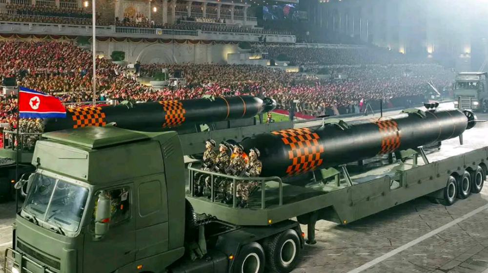
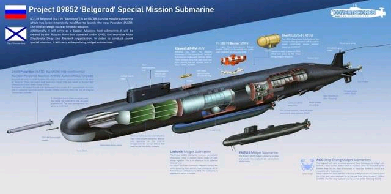
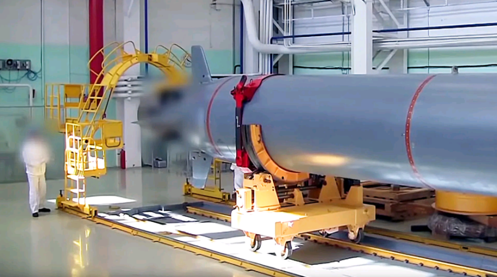

# 全球第二种“末日核武器”，是它？！

朝鲜于27日夜间举行的大型阅兵式再次震动了美日韩。在这次阅兵式上，朝鲜不但公开了“火星17”“火星18”等“射程足以覆盖美国全境”的洲际导弹、朝鲜版“全球鹰”“捕食者”无人机等先进武器，而且还展出了另一种让美国猜测纷纷的水下装备。

美国“动力”网站28日称，朝鲜在这次阅兵式上展出了一种新型无人潜航器，“它的功能与核鱼雷非常相似”。报道称，
**外界将这种神秘的无人潜航器称为“无人核攻击艇”、“无人水下航行器”或“远程/长航时核鱼雷”，大多数西方观察家都认为它的特殊之处在于能携带核弹头。**

能携带核弹头的无人潜航器，这个可怕的描述立即让美媒联想到 **俄罗斯著名的“波塞冬”核鱼雷——这种无限续航能力的超级武器被西方称为“末日核武器”**
，它能从水下突破对手的防御，携带大当量核弹头掀起海啸、毁灭对手的海港并导致大范围放射性污染。

报道认为，朝鲜新型无人潜航器的后部有泵喷推进器，并有十字形舵面，这些特性与“波塞冬”核鱼雷非常类似。根据西方情报机构的评估，朝鲜早就对“波塞冬”核鱼雷充满兴趣。今年早些时候，朝鲜曾发布了一款外形类似、但体积更小的无人潜航器，当时西方分析人士就认为它是“朝鲜对波塞冬的模仿”。海军情报分析家萨顿将其描述为“很可能是一种远程核武器鱼雷。或者更确切地说，是一种具有无人水下航行器特性的鱼雷。”据估计，它的航程可达
540 海里，平均速度为4.6 节，明显比常规鱼雷慢，其作业深度为 260-300
英尺。而这次在阅兵式上公开的新型无人潜航器外形与之前曝光的型号有许多共同之处，但新型号的后部进行了重新设计，而且体积更大，预计操纵性和航程也有明显提升。

_俄海军为“波塞冬”专门建造了“别尔哥罗德”号核潜艇_

西方媒体认为，相比采用核动力提供动力的“波塞冬”，朝鲜无人潜航器在性能上应该仍有差距。它很可能是依赖电池提供有限的动力，而不是核反应堆的无限动力，因为“没有证据表明朝鲜拥有足够小型的核反应堆”。朝鲜无人潜航器的体积也明显小于“波塞冬”，据估计它长约
65 英尺，直径约 6.5
英尺。此外，为携带“波塞冬”核鱼雷，俄罗斯专门建造了“别尔哥罗德”号大型核潜艇，而朝鲜方面还没有足够大的潜艇能携带这种尺寸的大型无人潜航器。

但另一方面，报道认为朝鲜研制这种核鱼雷的战略意图也与俄罗斯的“波塞冬”不同。相比需要横跨大洋威慑美国本土的“波塞冬”，“朝鲜类似装备更多是针对韩国或日本”，因此它对航程的要求不高，不需要像“波塞冬”那样追求“无限续航能力”。

 _“波塞冬”核鱼雷的体积明显大于朝鲜这次公布的无人潜航器_

让美日韩担忧的是，如果朝鲜这种无人潜航器如西方猜测的那样配备有核弹头，它的作战方式很可能与“波塞冬”类似，即从水下穿越反潜网络后，在没有预警的情况下打击对手的港口等重要目标。

值得注意的是，美国近来频繁向朝鲜半岛派遣战略武器，包括出动战略核潜艇40多年以来首次停靠韩国港口等，以向朝鲜施压。同时韩国正在大力发展所谓“杀伤链”系统，试图在朝鲜导弹发射前就将其摧毁。日本也以朝鲜导弹威胁为由发展攻击性武器，在必要时“先发制人摧毁朝鲜导弹基地”。而可以携带核弹头的朝鲜无人潜航器显然就是针对这些举动。尤其是它还提供了一种避开美日韩现有导弹防御系统的战略核弹头投送方式。报道还警告称，可携带核弹头的水下无人潜航器为朝鲜提供了另一种“第二次核打击”能力，作为潜射弹道导弹的补充。

无论朝鲜无人潜航器是否真的如西方炒作的那样“充满威胁”，但不可否认的是，在当前美韩政府对朝极限施压的背景下，朝鲜半岛局势正持续紧张。

