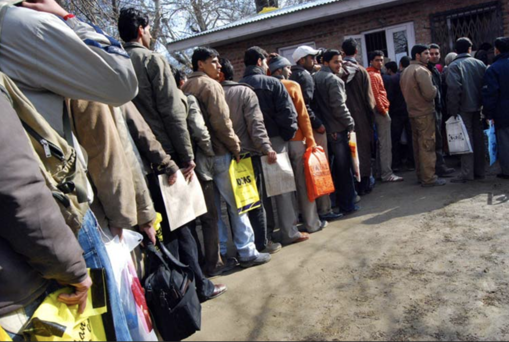
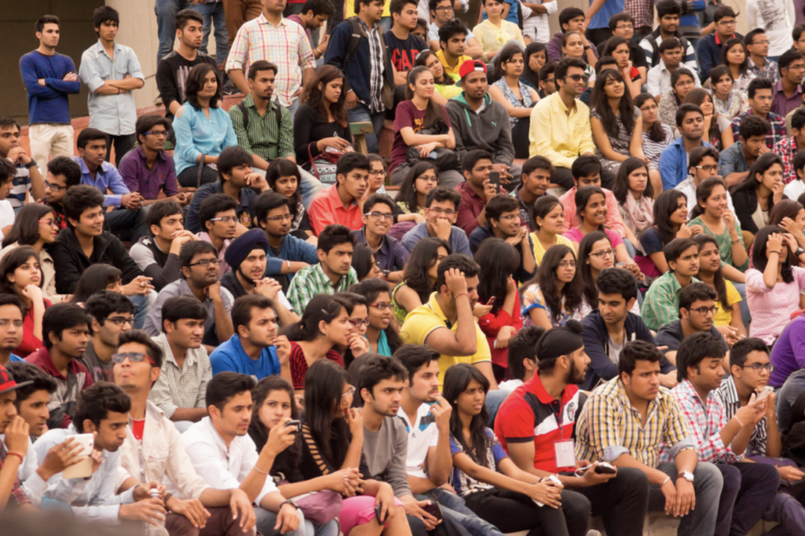

# 印度问鼎人口第一大国背后：学历越高越找不到工作，每年百万人考公

本文来源：时代周报 作者：马欢

28岁印度小伙儿库玛尔，已经拥有一个学士学位和一个硕士学位，但他准备再拼一个博士学位。

他坚持读书倒不是为了在学术上有什么造诣，只是想通过学历提升，尽快找到一份能养活自己的工作。

“我努力学习就是为了换一份好工作，我相信，只要通过不懈努力，就可以找到一份好工作。” 库玛尔说道。

在这之前，库玛尔确实找到了一份工作，是在一个村里的学校当扫地工，他还兼职当家教，但两份工作的收入加起来，每月收入仅有85美元（约合607元）。这么点收入完全不够库玛尔生活，更不要说供养年迈的父母和妹妹了。

“说起来有点悲哀，读了这么多年书，我还得靠体力劳动挣钱。”库玛尔说，他的尴尬处境，也是当下千千万万印度年轻人所面临的困境。

毫无疑问，印度是世界上经济增速最快的国家之一，但该国青年失业率一直居高不下，近十年来，印度青年失业率一直徘徊在20%之上。

_印度青年失业率高居不下（图源：社交媒体）_

来自世界银行和国际劳工组织的数据显示，2022年印度15-24岁青年群体失业率已经达到了23%。印度今年的官方数据显示，受过教育的青年失业率达18%，相当于2400万人。

美国CNN形容这种情况无异于一颗“定时炸弹”，并警告称，除非印度能创造更多就业机会，否则印度总理莫迪创造的经济奇迹随时有可能下坠。

抢破了头

在印度，年轻人找工作有多难？

乌迪帕耶大学学的专业是计算机，毕业3年了都没找到合适的工作，无奈之下，他只能摆起了路边摊，靠卖传统的油炸小吃为生。

“我没有放弃找工作，每隔一段时间都会去尝试，但就是找不到合适的职位，没办法，先摆摊养活自己吧。”
乌迪帕耶说，他甚至想去加拿大办签证，因为听说那边的工作好找。

根据在职训练公司Wheebox的数据，2023年印度的毕业生有将近一半(49.7%)“无法雇用”，即便是印度最热门的科技和计算机专业毕业生，也仅有六成左右属于“能够聘用”的程度。

对于很多印度年轻人来说，市场上除了体力劳动外，大部分工作领域的竞争都十分激烈。

2022年，在印度北方邦和比哈尔邦，曾有愤怒的年轻人因为铁路招聘僧多粥少，而爆发示威活动。

据路透社报道，当时有600多万人报名应聘比哈尔邦和北方邦铁路部门的约15万个岗位。然而，这些年轻人随后发现招聘存在猫腻，不同岗位的录用结果中看到了相同的名字。还有年轻人表示，将高学历应聘者与低学历者放在同一平台上竞争，是不公平的。

随后，多个学生团体举行大规模示威，他们封堵交通、焚烧轮胎，甚至点燃火车，疯狂倾泻着对印度铁路系统招聘考试的愤怒。

这场抗议最终以印度铁道部门暂停招聘收场，但印度年轻人对于就业的不满，从来都没有真正散去。

_图源：社交媒体_

早在2018年，印度铁路公司曾在全国范围内招聘6.3万个低薪岗位，吸引了1900万人申请，中间不乏很多高学历毕业生，竞争异常激烈，也引发了关于不公平竞争的争论。

现实就是如此残酷：在当下的印度，学历越高可能找到合适工作的几率更小，相比之下，在学历最低的人群中，只有3.6%的人找不到工作。

“印度的人力资本没有得到有效利用。”印度商学院教授钱斯里帕达认为，目前印度的工作岗位远远少于求职者，年轻人别无选择，只能从事低薪工作以维持日常生计。

争进体制内

还有大量的年轻人选择了其它赛道，那就是考国家公务员。

28岁艾格拉瓦已经参加过4次公务员考试了，都没有成功，今年是他第5次备考。

印度公务员考试（CSE）号称难度世界第一，每年都有大约100万人申请，最终只有不到1%的人入选。

尽管如此，公务员仍然是最受印度年轻人欢迎的工作，当公务员不仅社会地位高，而且收入待遇也相当可观。在他们看来，政府公务员意味着稳定的就业保障、住房保障，为家庭提供的免费医疗保障，还有其他一些福利。

“在印度，每次考试都有竞争，竞争无处不在。” 艾格拉瓦说，为了备战考试，他这几年来几乎没有什么社交生活，也不敢谈恋爱。

_正在进行公务员考试培训的印度年轻人（图源：社交媒体）_

家里每年给艾格拉瓦的补习费用和食宿费达到了3000美元（约合人民币2.14万元），艾格拉瓦感叹道：“他们花在我身上的钱可以买3、4辆汽车了。”

艾格拉瓦心有愧疚，他觉得自己别无选择，只能继续努力，“我的人生只剩下这一个目标了。”

在这个竞争最激烈的环境中，即使是最乐观的人也会受到极限考验，而等待他们的，有可能是无尽的失望。

失望之后，有些人干脆不找工作，在家躺平。

独立智库印度经济监测中心(CMIE)的数据显示，印度适龄劳动人口当中，现在只有40%有工作，或者愿意找工作。

人口难以转换红利

与此同时，印度正在成为世界第一人口大国。

印度也是一个非常年轻的国家。数据显示，47%的印度人是25岁以下。

庞大的人口，一般意味着国家在发展过程中能享受到较好的人口红利，但印度目前还未能如愿。

法国兴业银行经济学家昆杜说：“印度有大量灰心丧气的工人，这表明，印度不太可能获得年轻人口所提供的红利。印度可能仍将处于中等收入陷阱中。”

印度总理莫迪已经将增加就业岗位作为优先事项，但面临的挑战可谓不小：根据麦肯锡全球研究院2020年的一份报告，为了跟上青年人口暴增的步伐，印度需要在2030年前创造至少9000万个非农就业新岗位。同时，这将需要每年8%至8.5%的GDP增长。

_图源：社交媒体_

专家警告，随着人口增加和就业竞争变得更加激烈，问题只会变得更糟。

印度政府前首席经济顾问巴苏表示，印度目前的青年失业率是惊人的，特别是近几年来，都显示就业机会严重不足是印度长年以来的问题。如果不能有效解决，“人口第一国家”这个头衔将会不再是红利，而是负担。

当然，印度人认为，这种情形并不全是沮丧。

越来越多的印度经济学家表示，印度还有许多选择来解决这些人口问题，其中最重要的，就是发展具有全球竞争力的劳动密集型制造业。

根据Capital
Economics的数据，制造业占印度就业人口的比率还不到15%。这是一个相对较低的数字，同时也意味着潜力巨大，莫迪政府如若能提高这个比率，必能创造更多的工作岗位。

当然，这一切只是印度专家对未来宏观层面的展望，对当下正在苦苦找工作的印度年轻人来说，这种预测几乎毫无帮助。

