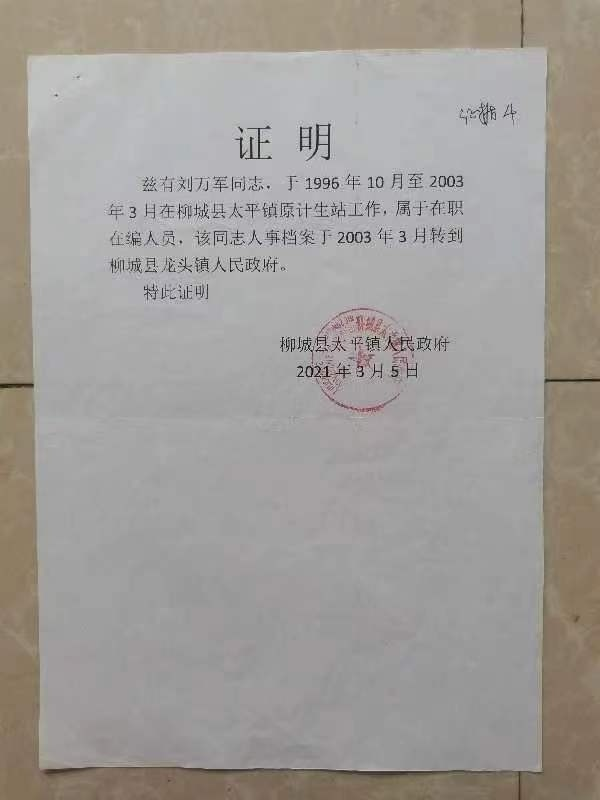
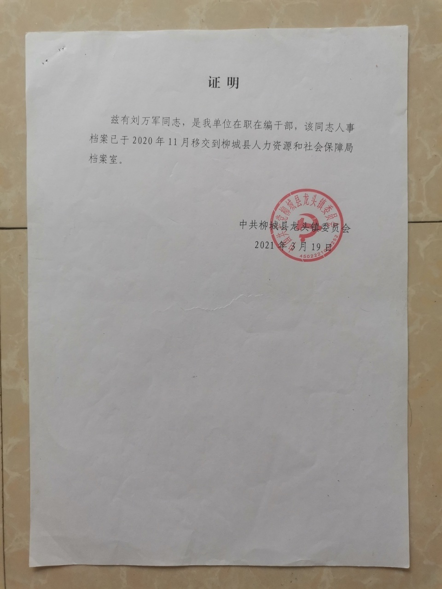
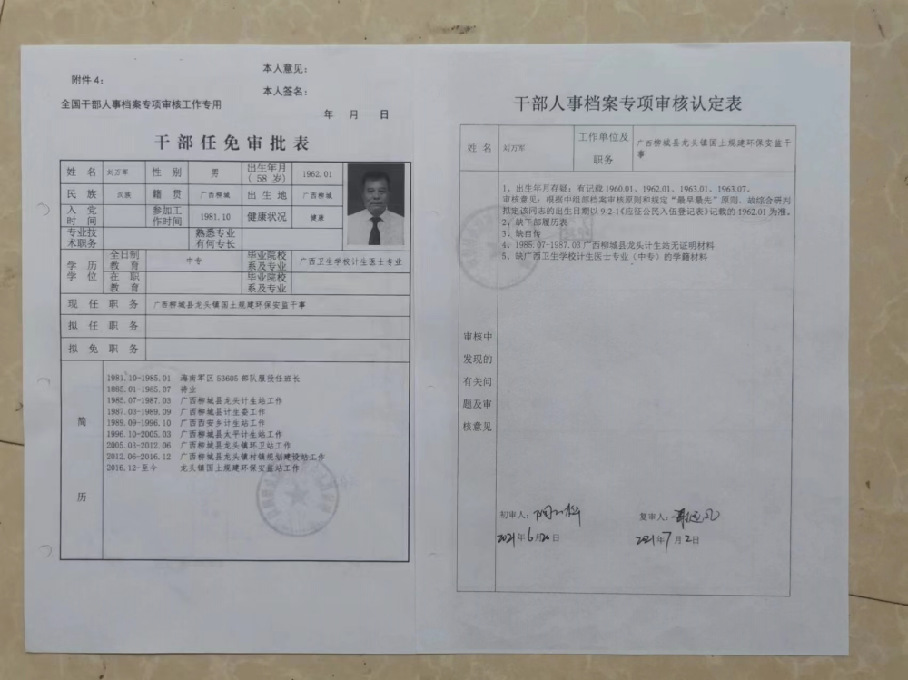
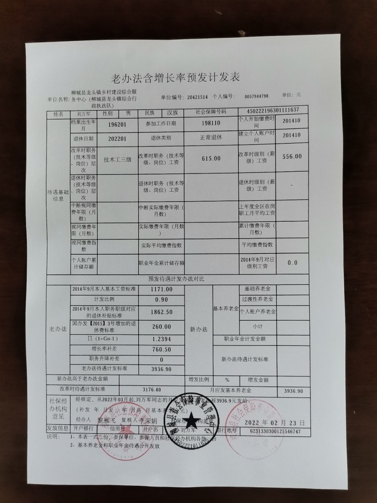
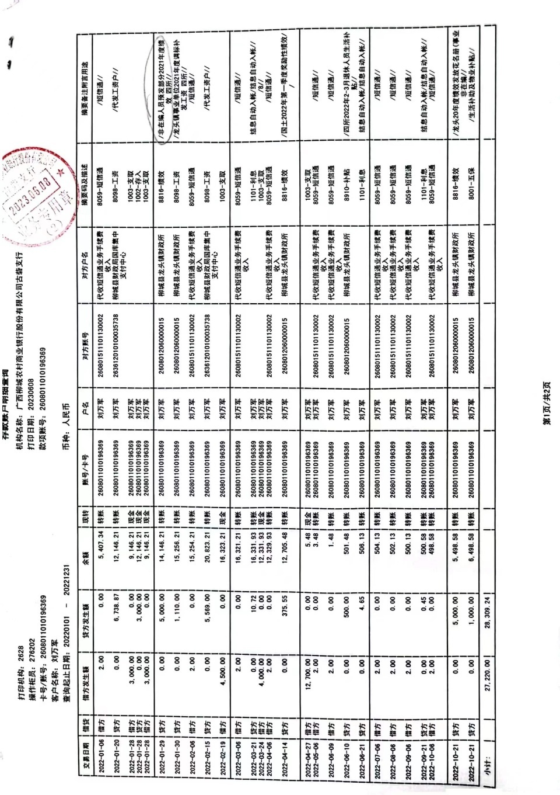
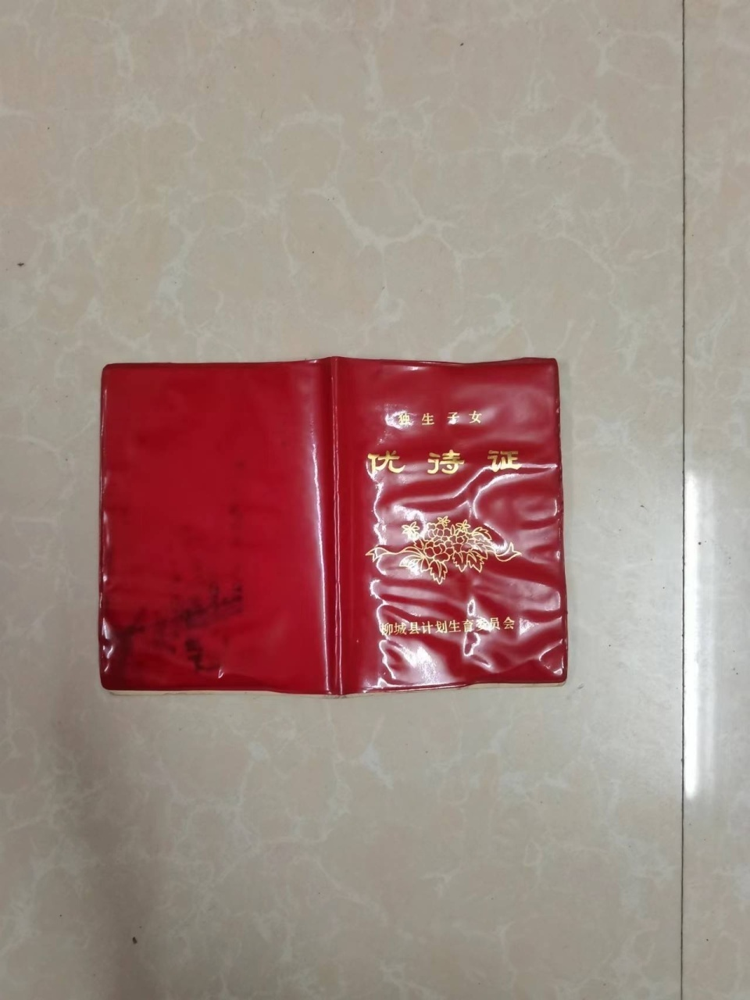
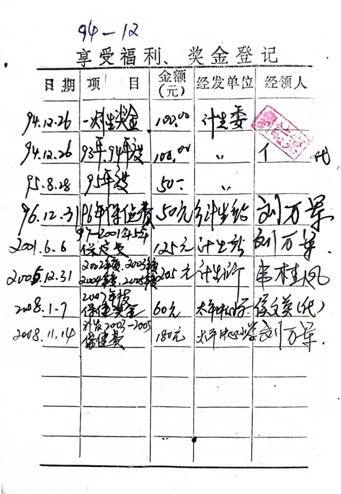
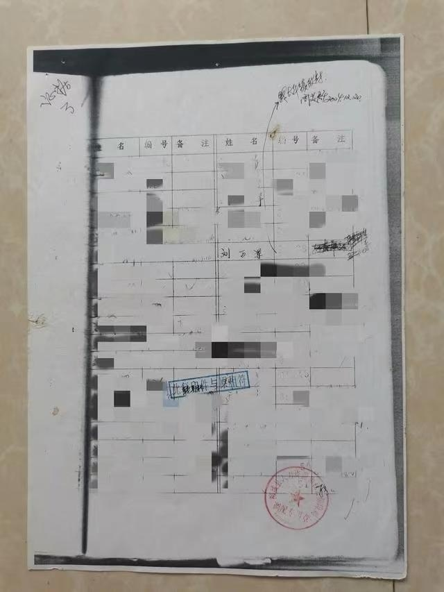

# 广西丢失档案无法办退休当事人谈“被通报”：没按在编人员待遇给我办

7月29日，针对有网友反映“在编人员档案丢失”情况，广西柳城县政府发布情况通报。

经查，刘某某现为柳城县龙头镇乡村建设综合服务中心事业单位退休工勤人员。其先后在柳城县西安乡、太平镇、龙头镇工作，2022
年1月退休前为柳城县龙头镇事业单位工勤人员。由于工作调动，在档案移交过程中，不慎造成部分档案缺失。

其在申请办理退休手续时，针对缺失的部分档案，相关部门通过多方努力为其查找到相关工作经历的佐证材料，依据政策规定，并经其本人签字确认，已于 2022 年
1月以事业单位工勤人员身份为其办理退休手续，并足额发放其退休金、独生子女费。

其退休前的绩效奖按规定发放。没有因部分档案缺失而影响其工龄认定退休办理以及其他退休待遇的兑现。

通报还称，网传“档案丢失无法办理退休”“还有一笔独生子女费没拿到”“根据平时考核等次按季度发放，这笔钱他也从未领取”等信息为不实言论。

当晚，九派新闻联系到当事人刘万军，也即通报中的刘某某。

**【焦点1】退休办理细节**

**问：《情况通报》中提到“档案丢失无法办理退休”为不实言论的说法，你怎么回应？**

**刘万军：**
我之前没讲详细，我刚满30年工龄那年去办的时候，确实因为没有档案办不了退休，去年，虽然办了退休，但是退休有正常的退休，有不正常的退休（即没有按照在编人员来退休），真正的问题是他们没有按正常（在编人员）的待遇给我办退休。

_柳城县太平镇和龙头镇都曾出具《证明》，指出刘万军属“在职在编人员”。图/刘万军提供_

_干部任免审批表。_

我是一个在职在编人员，我这里有一张《老办法含增长率预发计发表》（根据表上信息，其参加工作日期为1981年10月，个人开始缴费时间为2014年10月），我的社保计算年限是从公务员的社保改革，也就是2014年开始算，相当于之前的工龄都是没有计算在内的。

_《老办法含增长率预发计发表》。图/刘万军提供_

这张表上还缺了很多信息，退休时的职务工资、退休时的级别工资这些信息，正常来说都是应该有的，但我是没有的。还有“视同缴费年限”，如果我的档案没有丢的话，这一栏上的年限应该是可以确定的，从我1981年进部队的时候开始算，一直到2014年。

而且我的银行流水，也是按照没有编的人员来发放的。

_刘万军的银行流水上注明了“非在编人员”。图/刘万军提供_

**【焦点2】独生子女费问题**

**问：《情况通报》中还提到，你还有一笔独生子女费没拿到属于不实言论。**

**刘万军：** 我的小孩是1992年出生的，文件规定要发到18岁，他们只发了一部分，还有一部分没发完。

_刘万军提供的独生子女证。图/刘万军提供_

_独生子女费用发放的相关证明。图/刘万军提供_

**【焦点3】绩效发放和档案问题**

**问：《情况通报》中提到，你未领取到平时绩效属于不实言论。**

**刘万军：**
绩效这件事，人家拿了，我没拿，这个从工资里可以体现出来，我的工资都没拿够，就是什么东西他都发，但是发不够。（根据刘万军提供的银行流水，其摘要备注为“非在编人员预发部分2021年度绩效”。）

**问：《通报》并没有提及柳城县太平镇在没有保管档案的资质情况下，时任组委周美群，在你调离该镇一年多后的2004年12月20日，持什么手续，以什么理由调取你的档案，并最终导致你的档案丢失，作出一个详尽回应。**

**刘万军：** 我不太清楚。

**问：你曾经就此事向柳城县纪检部门举报过吗？**

**刘万军：**
举报过，但柳城县纪检部门之前一直没有受理，说不属于他们管。后来，我把这件事反映给媒体，当时媒体记者将我的材料向柳州纪检部门反映以后，今年7月12号，我又交了举报材料，他们才同意受理，但是没有给我出具回执。（刘万军提供的与柳城县纪委信访室通话录音内容显示，纪委已受理其举报的“个人档案丢失”一事。）

我希望纪检部门认真调查清楚我举报的问题。

根据刘万军提供的登记簿复印件，在写有他姓名那栏，一个箭头延伸出来，写着“转太平镇政府”，署名是“周美群”，落款时间为“2004年12月20日”。登记簿复印件/刘万军提供

九派新闻 彭茸雯

【来源：九派新闻】

版权归原作者所有，向原创致敬

**此前报道**

广西一在编人员档案丢失无法办退休？通报：没因档案缺失影响退休待遇

广西一在编人员档案丢失无法办退休，发现19年前被提走，当地正调查中

