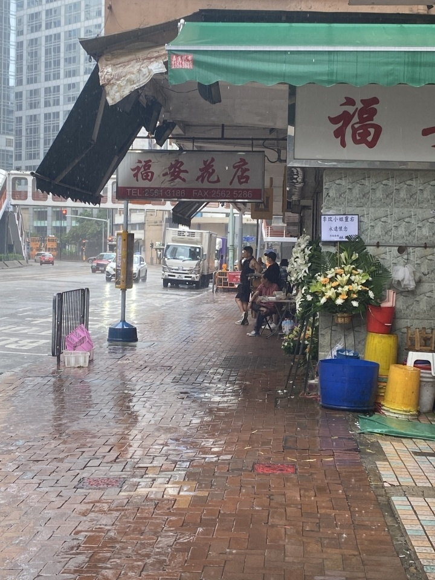
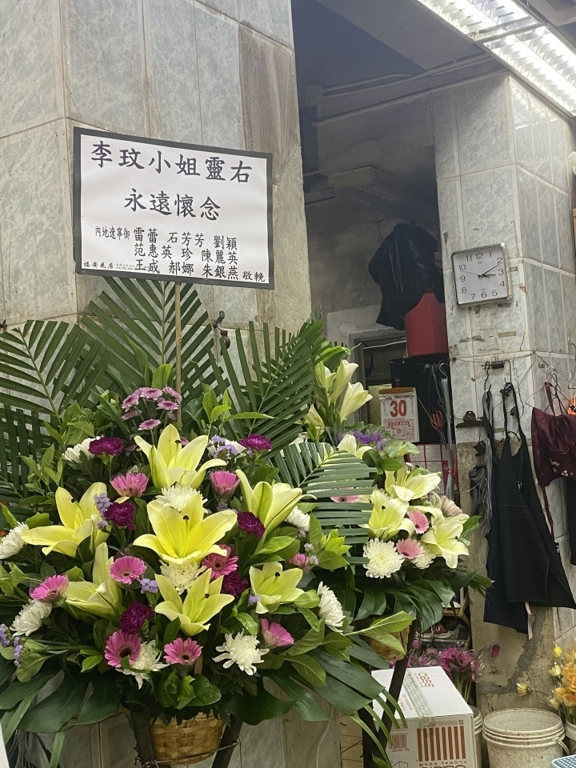
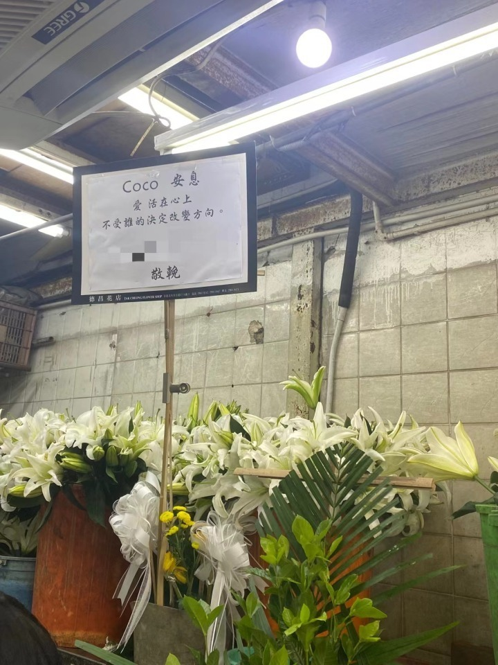
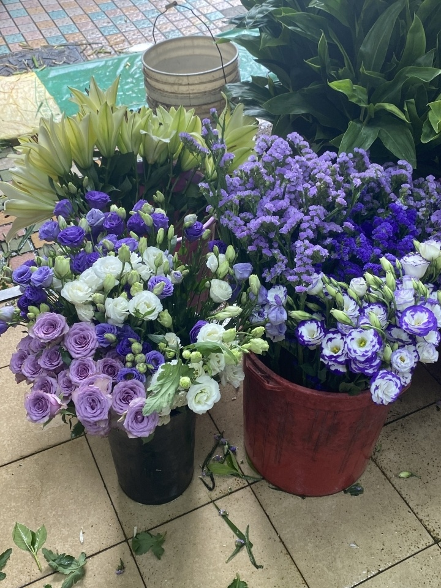
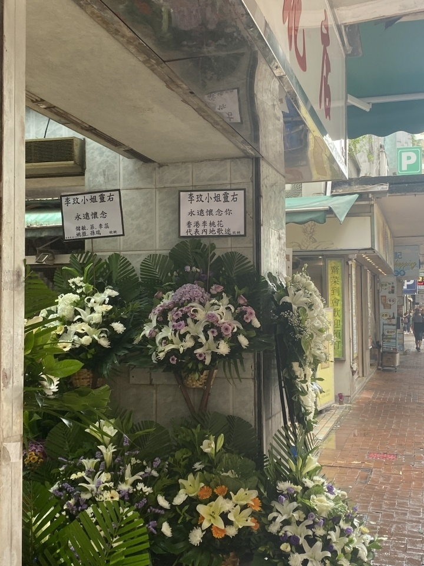
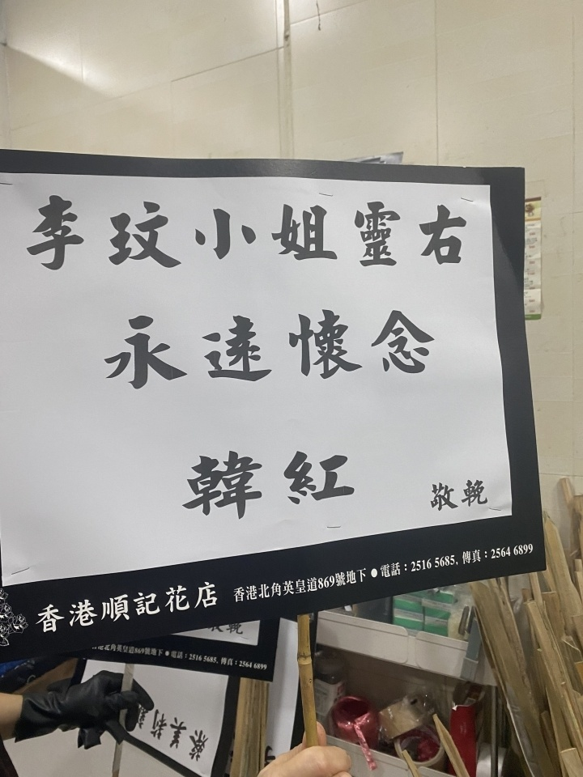

# 李玟追悼会31日举行，记者现场直击：附近花店堆满了挽联

潮新闻客户端 记者 汤霁英 陈新怡

李玟的丧礼将于7月31日在香港殡仪馆举行，现场设灵供歌迷拜祭。今天，潮新闻记者来到殡仪馆附近发现，已有不少歌迷冒雨前往花店预定花束。殡仪馆附近的花店门口，摆放着不少印有“永远怀念
李玟小姐”挽联的花篮、花圈。

路上，遇到香港媒体在采访歌迷，潮新闻记者也被当作歌迷拦下询问：“听说内地有许多粉丝过来送CoCo？歌迷会一起集资买花吗？”

此前据媒体报道，来自内地、新加坡、马来西亚、美国等地的歌迷都已定机票、住宿，飞往香港送李玟最后一程。

在知道追悼会消息的第二天，香港歌迷VIVI第一时间去花店预定了花篮，从《Di Da
Di》开始，李玟的歌声一直陪伴了她的整个少女时期：“认识CoCo才知道，原来女生也可以这样健康、自信、性感，所以必须来送她一程。”

潮新闻记者询问了周边几家花店，花篮、花圈的价格在500-1200不等，购买者可以先将自己的挽联内容以及姓名写在纸上，花店会提前制作好，并在31日下午统一摆放到场内，传照片给顾客确认。“今天定最好，这样我们可以早一点送过去。如果明天定的话，到时候怕没地方摆这么多花。”花店老板说。

在一众白色菊花和百合中间，深浅不一的紫色玫瑰和满天星吸引了大家的视野。

“CoCo喜欢紫色，不少歌迷在订花时会特意叮嘱我们多加点紫色的鲜花。”老板说。在先前的歌迷地方追思会中，也常见歌迷用花布置的“紫色海洋”，熟悉的歌迷似乎还能哼起那首《等爱降落》：“蓝色橘色紫色满城霓虹，点缀荒凉的夜空。背影越拉越远的你我，祝福凝结在空气中。”

在聊天的间隙，又有从重庆过来的歌迷咨询订花的相关事宜，老板指了指后面的仓库，里面有许多已经制作好的花篮和挽联。

“22号我又来了一趟花店，很多到不了的朋友都托我帮忙买花送上一份心意。当时已经有非常多的订单了。”VIVI告诉潮新闻记者。

在花店老板的带领下，记者看到，挽联里还出现了一个熟悉的名字：韩红。

韩红和李玟通过综艺节目《中国梦之声》彼此结识，得知噩耗时，韩红曾发文怀念：“想你，我最好的哥们。你没走，就在我们身边，我心里永远的阳光女神。”

“转载请注明出处”

