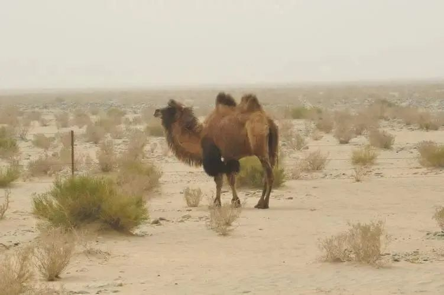
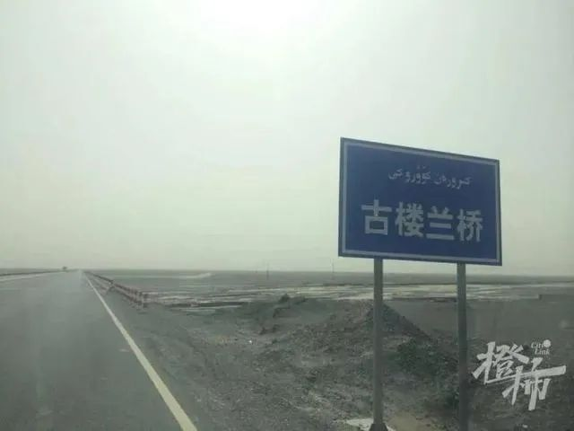
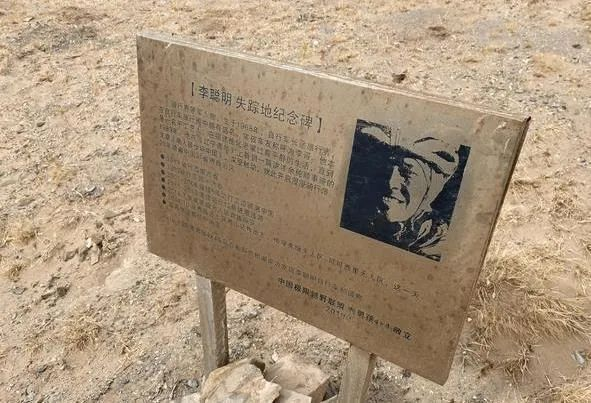

# 4人私闯罗布泊遇难 救援人员：找到时严重脱水，面部几乎无法辨认

近日，一起自驾车队进入新疆罗布泊期间失联事件引发社会广泛关注。7月29日，失联者被当地警方找到，但不幸的是，4人均已遇难。

业内人士称，新疆罗布泊国家级野骆驼自然保护区夏季高温，地表最高温度可达70摄氏度左右。在户外圈，一直流传着“国内四大无人区”的说法，罗布泊就是其中之一，它们到底有多危险？据统计，截至目前已有多人丧生或失踪。

**“严重脱水，面部几乎无法辨认”**

有疑似知情者在微信群聊中透露，遇难的自驾车队为四川籍，包含多辆越野车和皮卡车，原计划路线为罗布泊的北线——穿越470公里的大海道无人区，不知为何走了南线，奔彭加木碑去了，而且只带了两天的食物和油。

根据知情者讲述，失联者身份为领队，该车辆失联原因疑似为加错了油导致车辆抛锚，因车内物资不足，领队失联前曾尝试徒步寻找救援人员，但不幸遇难。救援人员曾讲述了找到失联人员的现场，“严重脱水，面部几乎无法辨认”。

据救援人员讲述，搜救队先是在沙漠中发现了那辆蓝色皮卡车，在车子周围，散落的东西随处可见，又走了一段距离，远远发现一名男子躺在沙漠中一动不动。走近后发现，这名男子已经遇难。

据了解，罗布泊地区气候异常干燥、炎热，年平均气温11.6℃，夏季最高气温>40℃，冬季最低气温-20℃以下，年降水量20毫米。曾多次穿越罗布泊的越野爱好者说，罗布泊是国家级野骆驼自然保护区，穿越罗布泊应尽量避开5—8月，且野骆驼保护区有醒目警示牌，没有报备属于非法闯入。

事发后，有媒体连线若羌县12345，工作人员说，县辖区内的野骆驼国家级自然保护区归相关管理局管辖,外地游客在没有批准的情况下肯定不能私自进入。

据公开资料，罗布泊位于中国新疆塔里木盆地东部，中国最大沙漠塔克拉玛干沙漠的最东缘，若羌县北部，是世界上著名的干旱中心，海拔780米左右。

上世纪60年代，在罗布泊还没有彻底干涸之前，我国的第一颗原子弹、氢弹均是在罗布泊地区试爆成功。之所以选择这里，就是因为罗布泊及周边都是无人区。罗布泊干涸后，周围的生态环境发生巨变，各种植物全部枯死，很快罗布泊就和塔克拉玛干沙漠融为了一体，变得极度干旱，从此成为了寸草不生的地方，被称作“死亡之海”。

**对自然没有敬畏心**

资深户外达人罗煜在接受采访时表示，罗布泊的危险主要来自两点，一是沙尘暴，沙尘暴会让人迷失方向；二是流沙，车子一旦陷进去的话会很麻烦，只能等待救援。至于狼群等等，罗布泊不像可可西里，很少见，“藏羚羊是野狼的长期饭票，罗布泊除了戈壁就是荒漠，除了野骆驼外，很少能见到动物”。

_罗煜_

2014年，罗煜带着14岁的儿子，穿过三大无人区。在北纬30度至40度之间画了一个圈。“当时儿子在路边捡了一块蓝莹莹的石头，他以为是蓝宝石，被说这是钾盐，一听是盐，儿子不相信，舔了两口，说了一句果然是咸的，钾盐有毒，几个小时后儿子开始腹泻，拉了20多次，脸色发青。”

罗煜赶紧带着儿子往最近的1000多公里外的敦煌狂奔，基本上是砂石路。“罗布泊没有信号，但卫星定位可以用，我们提前下载了路线图，就看着路线跑。早上9点多出发，晚上12点半到了敦煌人民医院，中饭晚饭都没空吃。”

另外，就是各种意外，罗煜表示：“现在这么热的天，如果车辆遇险的话，车上不能待了，得找个避阳光的地方，不然人体水分蒸发量大，脱水后很容易死亡。”他说：“这些年，去罗布泊自驾游的人多了，对大自然没有敬畏心，也出了一些事情，可能也是因为这些原因，后来罗布泊就禁止进入了。”

不能私自进入的原由，还有一点，为了保护罗布泊保护区动物。

据了解，罗布泊野骆驼保护区面积6.12万平方公里，当前，保护区野骆驼数量为680峰左右，约占世界野骆驼总数的3/5。

“这个保护区，有我们保护的野骆驼，数量很少，之前都快灭绝了，属于我们的濒危野生动物，这几年才慢慢数量增加了一点点，它们胆子很小，很怕人，它们生活范围在无人区，所以我们当地人从来不去，怕打扰它们，破坏它们的生态环境。”

作为典型的沙漠动物，野骆驼有许多特殊的生存技能。它能适应极大的温差，20多天不喝水照常活动，一个多月不吃草照旧奔走。它不怕风沙，可以喝咸水，嗅觉极灵敏，能嗅出1.5公里以外的水源。最简单的辨认方法就是看它怕不怕人，看见人拔足狂奔的一定是野骆驼，而近距离接触仍不理不睬的就是家骆驼了。

事实上，近三年，户外探险、徒步遇险遇难的消息不时见于媒体，有些纯属意外，有些则属于明显的决策失误，甚至违反相关法规。

遇难者也并非都是“菜鸟”。比如，35岁的姜野骑行6年，到过30多个国家，骑行里程数万公里。这个履历大体可以证明他的能力。户外探险者从一开始就在计划之中，他们会有意提升风险阈值，比如离开团队单独行动，这必将导向“一个人有没有将自己置于危险之中的自由”这样的终极之问。

在普通人看来是常识的束缚与界限，可能恰恰是探险者迫切想去突破和战胜的目标。基于这个角度，对于户外探险，既不应“污名化”也不该“浪漫化”。

尽管探险者个体有选择面对危险的自由，但若涉及团队行动，就需要为他人的生命负责，不能打着冒险精神的幌子躲避责任。人可以选择面对危险，但应该基于其对危险程度的了解基础上；人不一定能做到排除一切危险因素，但这个群体理应有更强的专业性要求。

**国内其他无人区——**

**羌塘无人区：海拔最高、面积最大的自然保护区**

2014年10月4日，李聪明从西藏日土县界山达坂出发，开始骑行横穿羌塘无人区至可可西里无人区沱沱河，之后失踪。

位于西藏那曲地区和阿里地区的羌塘，国内徒步最危险和艰难的路线之一，被称为“生命禁区”。第一个是气候恶劣，海拔5000米以上，风雪交加；第二个是野生动物，比如狼、棕熊之类的猛兽、公的野牦牛，危及人身安全；第三个是保护区太大，一旦断粮、断水，容易有饿死或者冷死的现象。

**可可西里无人区：一年两位年轻人在此殒命**

位于青海省玉树藏族自治州西部，总面积450万公顷。是21世纪初世界上原始生态环境保存较好的自然保护区。保护区平均海拔4600米以上，气候干燥寒冷，严重缺氧和缺淡水，自然环境险恶，非法穿越、探险，存在极大安全隐患。

**阿尔金无人区：恐怖传闻指向寒冷、磁矿、沼泽**

阿尔金无人区位于阿尔金山南部，是一个四周被高山环绕的封闭性盆地，气候寒冷，干旱多风，蒸发强烈，全年没有无霜期，被称为“死亡谷”的那陵格勒山谷就在阿尔金无人区内。

听说当地的牧民宁愿让牛羊饿死也绝不会进山谷中放牧，因为曾经有人在山谷中追寻羊群时，再也没有出来，被发现时，他衣衫完整，身上没有任何伤痕，死因非常蹊跷，至今是个谜。

**文 | 竹里**

**资料来源：新京报、上观新闻、华商报、鲁中晨报**

