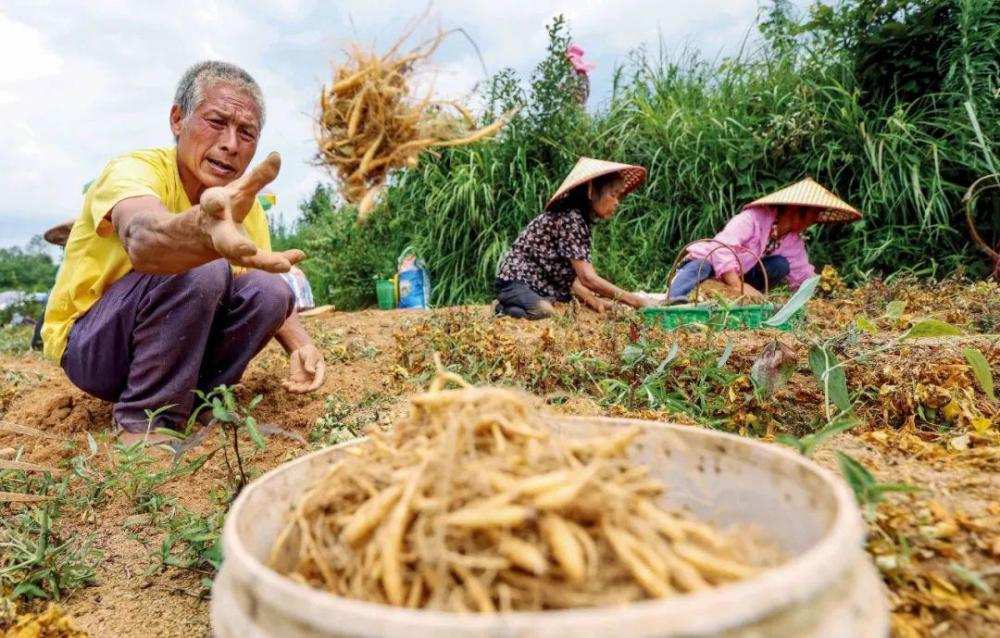

# 中药材价格为何失控？个别品种涨幅900%

往年随着天气变热，中药材销售本该进入淡季，但今年6月以来，中药材价格却在一路狂奔。据报道，近期，国内超过200个常规品种年涨幅超过50％，100个常规品种年涨幅超过100％，25个常用大宗药材年涨幅超过200％，鸡骨草等个别品种年涨幅甚至达到400％~900％……

“我从事经营中药材销售20多年，从未遇到过这么大涨幅。”长期居住在广西玉林的张黎向《中国新闻周刊》表示。今年53岁的张黎主要从事甘草销售，1998年开始，张黎和丈夫就开始从河北省安国市进购中药材转售至广西玉林。张黎表示，去年没涨价前，一公斤甘草售价20元左右，现在同样重量的甘草售价已涨到四五十元。

中国中药协会种养殖专委会副秘书长、中康科技中药大数据中心首席分析师贾海彬告诉《中国新闻周刊》，这次中药材价格的上涨幅度和上涨周期，在有数据记载的中药材商品史上极为罕见。他解释说，一般中药材价格3年一个小周期，9年一个大周期。本轮周期已经持续11年，连涨3年。

6月，江苏省医药协会中药饮片专业委员会、广东省医药行业协会等先后发布文件，呼吁国家尽快出台相关政策管控药材价格。中国中药协会于2023年7月8日发布倡议书，指出本轮药材价格异常上涨，势必给中药行业健康稳定发展带来不利影响，中药行业必须予以高度关注。

 _河北安国市中药材批发交易市场的摊位上，摆满了各种中药材。摄影/本刊记者 牛荷_

**价格“一路高歌”但实际卖不动**

安国市是国内北方最大的中药材集散地。7月下旬，《中国新闻周刊》走访了安国数字中药都、安国国际会展中心的中药材批发交易市场。

数据显示，截至2021年，安国市拥有中药材商贸公司1087户，个体工商户4500余家，经营中药材2800多种。

安国数字中药都的中药材经销商林皓告诉《中国新闻周刊》，他的店铺主要经营药食同源滋补类的中药材成品，比如陈皮、冬虫夏草等。陈皮的价格因药龄而不同，在260元/公斤～1400元/公斤之间变动。“冬虫夏草涨价明显，其他产品基本没太多变动。”林皓说。

冬虫夏草主要产自中国青藏高原的高山峡谷地带，产量极少，因此其价格较为昂贵。林皓介绍说，其门店销售的虫草，今年每公斤平均涨价4万多元，现在平均一公斤已经涨到9万多元。“优质的虫草品种，一公斤的价格高达十几万元，比如源自青海的虫草，现在售价16万元/公斤。”

陈芸是安国国际会展中心1号馆的一名中药材销售商，从事中药材销售超过30年。在陈芸的摊位上，摆放着十几种中药材，这些中药材都源自外地。陈芸表示，酸枣仁的价格目前已突破了历史最高纪录，最低价格950元/公斤，去年上半年，酸枣仁的售价只有目前的三分之一左右。

据了解，2020年至今，中药材价格总体处于上涨态势。据中药材天地网统计数据，2020年1月1日至2022年12月1日近3年中，沙苑子、龙骨、关黄柏、酸枣仁等多种中药材品种价格翻倍上涨。其中，龙骨从最初的55元/公斤涨至280元/公斤，酸枣仁从最初的205元/公斤涨至860元/公斤，沙苑子从最初的24/公斤涨至150元/公斤。

贾海彬表示，往年6月，原本应是中药材市场的淡季，因为夏季天气热、雨水多，储存和运输成本大，药商与企业采购量减少。但今年，中药材涨价的品种数量和幅度大幅增加，中药材价格上涨呈现加速态势。他表示，鹿角霜、当归、天然牛黄等国家基本用药品种核心原料的价格暴涨，反映出中药材市场行情已接近失控，严重影响到国家中药战略安全和医保体系稳定。

对经销商而言，涨价后的中药材，卖得并不顺畅。陈芸表示，自从涨价后，酸枣仁的销量就一直很低，买家减少了很多。此外，一种中药材并非无可替代，比如党参的价格涨得很高，一些人可能会购买太子参等更便宜的中药材作为替代，太子参的售价一公斤只有几十元。张黎表示，涨价前，她的店铺每年能销售几十吨甘草，行情好时甚至超过100吨。涨价后，今年上半年，店里所有中药材的销量只有二三十吨。

安国市多名中药材批发零售商告诉《中国新闻周刊》，因为中药材的价格上涨，导致销量明显减少。这些卖不动的中药材，都被堆在了冷库。冷库类似于“药材银行”，当药材价格上涨就出库，价格跌落就入库。价格频繁波动时，经营者能更好地把握出售时机。

在张黎印象中，从去年下半年开始，很多原本便宜的中药材，价格被“炒”得很高，很多人开始高价买入这些涨价的中药材。“现在很多被高价买入的中药材，至今没卖出去，都堆在各地冷库中。”张黎说，不只安国的冷库，全国四大药材市场和中药材产地的冷库基本都被中药材堆满了。据中康科技中药大数据中心调研数据，国内中药材市场及周边冷库的库存爆满，甚至一些原本储存蔬菜、水果的冷库也纷纷转存中药材。

《中国新闻周刊》致电安国市多家冷库公司，得到的答复大都是没有剩余位置。高展是安国市一家冷库公司的工作人员。据其介绍，其工作的冷库面积约2000平方米，提供低温和常温两种存储。高展向《中国新闻周刊》表示，今年好多人买了中药材后，都囤到了冷库。他所在的冷库基本囤满了中药材，现在只能囤几吨的货。他说，“冷库每天有药材的出库和入库，这点空余是否明天还有未可知。”

张程是安国当地的一名中药材基地种植农户，20多年前就开始跟着父亲学习中药材种植，他的种植基地占地约600亩。张程告诉《中国新闻周刊》，诸如丹参等一些中药材可以在冷库囤放很久，但对防风等中药材来说，至多囤在冷库一年多，就需要流通出去，否则防风的内芯会变黑，会被兽药公司收购，用作兽药，价格与人用药品的价格相差十几倍。

张程表示，以前的冷库很多并不盈利，甚至亏损。不过，随着冷库变得紧俏，存储价格开始水涨船高。据张黎介绍，她隔壁的中药材经营商家拥有总面积上千平方米的冷库，已经爆满，存储费用从之前每月105元/吨，涨至现在的150元/吨。高展工作的冷库存贮中药材价格，目前一般是每月50元/吨，诸如红花等比较占地方的中药材，存储价格每月达80元/吨，甚至超过100元/吨。

**游资涌入与中间商囤货炒作**

中药材是整个中药生产的源头。中药材既可经过复杂生产工艺，被直接制成中成药，也可被加工成中药饮片，中药饮片是临床汤剂和中成药生产的原料，还可被加工成中药材提取物，再进一步制成配方颗粒或中成药。中药材饮片、配方颗粒、中成药均可由中药材销售公司、连锁药店及医院等进行销售，各个环节，相互影响，又相互关联。

“在多因素推动下，2020年以来，多种中药材持续涨价。”北京中医药大学医药卫生法学教授邓勇告诉《中国新闻周刊》，首先，药品质量标准提高，监管日趋严格，符合标准的药品变少，对中药材的要求随之提高，使得中药材价格水涨船高。其次，国家虽然鼓励并推进中药材种植基地建设，但推进过程中难免会有种植户转投其他产业，导致部分药材种植减少，种植成本上涨。再者，受气候影响，多种药材普遍减产，中草药种植面积有所萎缩，如青翘、酸枣仁、柏子仁、沙苑子、白术等药材因干旱与洪涝交替出现减产。此外，中药材种植加工工艺难度增加、国家对进口中药材的管制导致一些中药材原料缺乏、劳动力流失等因素也是药价普遍上涨的原因。

邓勇表示，2019年，《药品管理法》第二次全面修订后，被誉为最严药品监管法规，对违法企业规定了更为严格的处罚措施，导致企业不断提升经营标准。之后，2020年版《中国药典》对中药材要求的标准更高，不少中药材因种植、管理、采收等流程不规范产生农药残留超标、有效成分过低等问题，被药企退货或减少进货。

安国市一家中药饮片公司的工作人员告诉《中国新闻周刊》，他所在的中药饮片公司和产地的商户、农民专业合作社有长期合作，一般产地的中药材加工好后，公司才会进购，进购后公司会负责中药材含量等各项指标检测，只有符合《中国药典》标准的药材才能最终流通到市场。这名工作人员表示，他所在的公司主要对接医院和药企。

在贾海彬看来，涨价的根本原因是中药材产业链不合理的利益分配和多种中药材的盲目生产后的一地鸡毛。他介绍说，中药材产业链包括生产环节、贸易流通环节、工业及终端环节，其中工业及终端环节的市场规模与营收水平远高于种植端，工业企业为整个产业链的获利主体和话语权掌握者，但长期不重视源头和供应链保障。

在盲目生产方面，贾海彬举例，2018年前，在扶贫资金支持下，国内栀子产区的农户盲目扩大种植该品种，最终造成该品种价格连续暴跌，售价最低时只有5.5元/公斤，无法覆盖采收的劳力成本，造成大量种植栀子的土地荒芜，甚至栀子树遭砍断，为本轮栀子价格暴涨到38元/公斤以上埋下伏笔。

邓勇分析说，由于长期对种植端的不重视，中药企业对种植基地的建设推进缓慢，使得药材供给一方的保障能力变得脆弱。如果再面对游资炒作、中间药商囤积居奇，便不堪一击。此外，由于信息交流的加速，医药企业与种植商的对接更加便捷，中间商越来越难以赚到差价，因而其利用自身仓储资源、对信息的把控能力转做压货商，囤货惜售，不断推高市场行情。

张黎有20多年的销售经验，她很清楚每年甘草的正常需求量是多少。她会经常和周围认识的中药材销售商互通信息，比如哪种中药材不适合售卖，哪些药材适合立马出手。去年一整年，她注意到，很多中药材都在涨价，但最初大部分中药材实际上并未流通到药厂，而是像她这样的销售商彼此互相购买，或外来投资者趁机买入，想借此机会赚钱，导致大量中药材被囤起来。张黎称，中药材价格每被拉高一次，游资和散户就会售出一些药材。

以当归为例，张黎回忆，去年，当归的价格涨到200元/公斤时，市场上流通的当归数量并不少。随着资本涌入，炒药者收购市场上成熟的当归压货。第二年，当农户春季要种植新的当归幼苗时，炒药者直接从种植户手中高价收购当归幼苗。这样一来，市场上以往的旧当归被收购，又缺乏新的当归流通，价格就会被持续推高。

“今年中药材持续涨价的直接原因是游资涌入与中间商囤货炒作。”邓勇告诉《中国新闻周刊》，游动资本自身难以精准进行中药材囤积，实现低价购入、高价卖出。现实中，他们倾向于与掌握中药材生产信息、价格信息、交易信息的经销商、咨询公司等合作，在充分把握产业信息的基础上，利用自身资金优势大量囤储中药材，通过炒作与垄断来控制价格，谋取暴利。

邓勇表示，国内某些中药材信息咨询公司的功能开始变质，从刚开始从事价格发布、交易撮合、提供仓储、买方采购、代卖方销售转变为利用自身信息优势进行中药材炒作，甚至于引进资本对中药材市场进行操控，推动药材涨价。

国内上一次中药材的集中涨价，大约在13年前，当时的集中涨价也剑指背后的囤积炒作行为。以党参为例。2009年下半年至2011年7月，党参价格一路上涨，从2009年8月的9元/公斤左右上涨至2011年6月的90元/公斤左右。2011年，国家发改委会同有关部门，对甘肃陇西地区20多个中药材存储仓库全面检查，发现有10户经营者在2010年12月前囤积党参20多万公斤，44户经营者2011年之后存有党参80多万公斤。

2011年，国家发改委发文指出，党参价格的大幅上涨，除产量下降供求紧张外，少数不法经营者囤积炒作起了推波助澜的作用。对部分经营者，国家发改委下达了价格行政执法告诫书，同时，责令其出售储存的党参。

 _7月16日，贵州黔东南苗族侗族自治州岑巩县，药农们在天马镇雷公田村采挖药材。图/视觉中国_

**越集采越上涨“怪相”**

作为中药材销售者，张黎不希望中药材价格出现这么大的波动，但是当巨额资产涌入这个行业时，作为从业者，似乎没有更多选择。

她注意到，今年加入这一行业的人明显变多了。他们这一代人的孩子，之前大多不愿从事中药材生意，这两年，很多人开始考虑回家帮忙经营中药材生意。

“很多人其实没那么了解中药材，也许只想借着这波热度分一杯羹。”张黎说。去年年底，一名从事物流运输的人曾向她咨询，甘草是否容易卖。张黎说，这名物流工作人员自己手里压了十几吨甘草，但他并非中药材行业内的人，因此很难把握中药材销售价格的合适度。

她认识的一名甘肃经营中药材的商户，曾以40多元/公斤的价格高价买入100吨甘草。这名商户告诉张黎，之所以买这么多，是因为相信甘草的价格还会再涨。经营20多年甘草销售的张黎却不敢出手。她说，“没涨之前是20元/公斤的价格，现在翻了一倍，我并不看好后续还会再涨。”

一名资深中药材业内人士向《中国新闻周刊》分析说，近30年，每一轮中药材价格上涨前，都伴随着通货膨胀。通货膨胀意味着，国内资本没有投资产品，开始把中药材当作金融产品炒作。千万级别的资本就可能导致一个中药材品种价格翻倍上涨。“近两年进行中药材炒作的资本规模累计至少数十亿元，甚至更高，中药材价格怎可能不暴涨？”这名资深中药材人士分析说。

值得关注的是，6月21日，湖北省医药价格和招标采购管理服务网公示全国中成药采购联盟集中带量采购拟中选结果。该结果显示，全国共有86家企业、95个报价代表品参与现场竞争，其中63家企业、68个报价代表品中选，中选率达71.6％，中选品种价格平均降幅49.4％。

此次集采于2022年9月正式启动，由湖北牵头，北京、天津等30个省级行政单位参与。集采涉及16个品种，共296款剂型、规格不一的药品，被业内认为是中成药的“国采”。中选企业包括益佰制药、吉林敖东、众生药业、科伦药业等多家上市药企。

中药集采从2021年便开始推进，形式从跨省联盟发展到全国集采，范围逐步扩大到中成药、中药饮片、配方颗粒等领域。在贾海彬看来，在原料保障体系尚未成熟之前，这样的集采可能会使中药材价格进一步上涨，出现越集采、越上涨的“怪相”。他解释说，中药材集采一方面给炒作提供了明确目标，另一方面能刺激投标企业和中标企业提前加大中药材储备，还能给前期囤货商提供出货通道，使其变现出更多现金，进行再度炒作。

贾海彬提供的“湖北19省联盟、广东联盟以及山东中成药集采前后原料成本变化”表格显示，相较去年6月，不少招标品种所需原料价格今年6月出现较大幅度上涨，前胡、麦冬、白芍等原料消耗前20位的品种的价格平均涨幅近四成，其中，前胡、麦冬的涨幅分别达到160％、106％。邓勇表示，部分药商与医院、药店、医药企业等签有长期供货合同，供货价格固定不变。中药材涨价后，这些药商面临进货减少、进货成本增加、因价格变动频繁来不及与医疗机构协商变价等问题，导致其无法供货，违约赔款与赔钱出货风险增加。

河北省石家庄一家中医诊所的医生已从事中医20多年，她告诉《中国新闻周刊》，所在诊所从中药饮片公司进货。这名中医表示，一般诊所不会随意增加药价，但一公斤中药材的价格如果翻倍甚至更高，他们也不得不涨价。

在邓勇看来，这次价格暴涨最大获利者是进入的游资和一些投机取巧、恶意囤货的中间商。种植户和寻常中间商可能会获得短暂的收入增加，医药企业与医疗机构也将承担一部分压力，但受影响最大的是需要用中药治病的患者，尤其那些需要长期服用中药来调理身体的慢性病患者。

中国中药协会在前述7月8日的发文中提到，对药材市场行情尤其是所需采购药材品种的市场行情等进行密切跟踪，及时调整中药饮片和中成药生产计划。同时，建议大中型企业尤其是品牌、优质企业应率先行动，打造中药全产业链质量管控体系，建立中药材质量追溯体系，促进产销直接对接，尽量减少中间炒作环节。

“说到底药材涨价是供需失衡问题。”邓勇分析说，实际上国内目前中药材种植标准与质量还达不到规范化、标准化、高质量化建设的要求，在供给上仍会出现某些缺漏，集体性涨价仍不可避免。中药材种植标准化规范化发展、中药材产业链营收分配优化是一个长期过程，需逐步构建。目前，若要稳定药价，需要政府强制力推动，尽可能实现中药材的直供直销，避免哄抬药价、恶意囤储等不正当行为。

（文中张黎、林皓、陈芸、高展、张程均为化名）

发于2023.7.31总第1102期《中国新闻周刊》杂志

杂志标题：中药材价格狂飙背后

记者：牛荷

