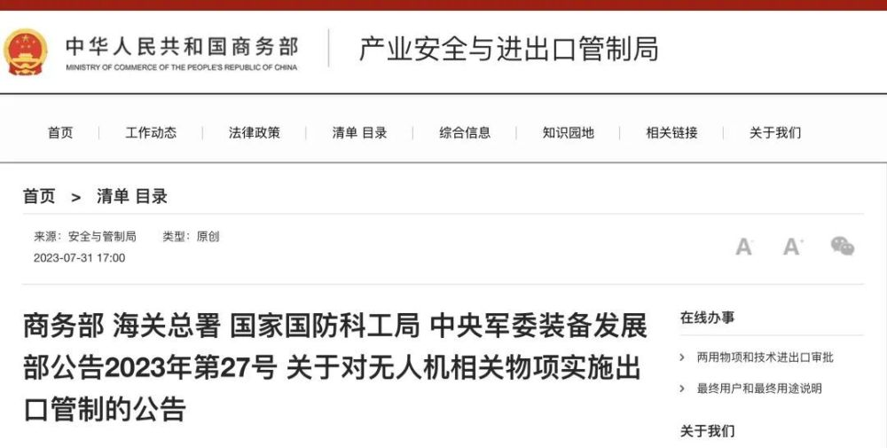

# 为何中国首次对反无人机系统实施出口管制？媒体解读

7月31日下午5点，商务部官网公布了两个公告，主题是对无人机相关物项实施出口管制。

出台这两个公告的部门，一共有四个：商务部，海关总署，国家国防科工局和中央军委装备发展部。

细读公告，谭主发现了一个细节，中国首次明确对反无人机系统实施出口管制。为什么专门提到反无人机系统？这个首次，释放了怎样的信号？

谭主找到了国家无线电监测中心副总工程师王俊峰。他和谭主分享了其中的原委。

谈反无人机系统，首先需要了解无人机的发展趋势。

这两年，随着消费级无人机和工业级无人机应用的不断增长，民用无人机技术和产业得到了快速发展。不过，与此同时，各种“黑飞”现象带来的安全风险日益凸显，而制止“黑飞”的反无人机系统也伴随而生并迅速发展。对无人机进行有效探测与反制，防范无人机带来的安全风险已成为安防等领域的关注重点。同时，在军事战场上，反无人机系统的使用已屡见不鲜。

王俊峰告诉谭主，
**需要关注的是，任何反无人机系统在保障合法安全需求的同时，如果不当使用，也可能引发严重的危害后果，包括影响民用航空安全，加剧军事冲突风险等。**

这意味着，我们先要客观了解反无人机系统的功能。

反无人机系统，又称无人机反制系统，是一种专门用于对抗无人机的装置或系统。其目的是通过技术手段干扰、破坏无人机的操作功能或飞行能力，实现对无人机的驱离或毁伤。无人机反制系统的工作原理，是利用发射的无线电信号来阻断无人机的通信、导航链路使其无法保持稳定飞行能力，或者利用发射的高能激光束来破坏无人机的电子设备使其丧失飞行能力，最终实现在特定区域驱离或毁伤无人机的目的。无人机反制系统的应用场景包括重要场所和重点设施保护、安全保卫和军事防御等。

另一方面，我们也需要了解什么叫不当使用反无人机系统。利用无线电技术进行反制是目前国内外无人机反制的重要手段之一。根据设备技术参数的不同，无人机无线电反制系统的有效作用距离从几百米、几公里到几十公里不等。

王俊峰介绍：
**由于无人机无线电反制系统的本质是电磁对抗装备，其发射的无线电干扰信号在开放空间传播，作用范围和影响边界很难实现非常精准的控制，难免对周边电磁环境以及其他合法无线电系统造成干扰。所以，确保反无人机系统的合法规范使用也非常关键。**

总而言之，无论在民用还是军用领域，无人机和反无人机系统的对抗，就好像矛和盾，各显神通。两者的应用不仅关系到人民生命财产安全，也涉及到国防安全和国家安全。

因此，加强对无人机和反无人机系统的管制都非常必要。此前，中国政府已经将无人机纳入了出口管制范围。此次又将民用反无人机系统纳入出口管制，这非常及时，也很精准。

