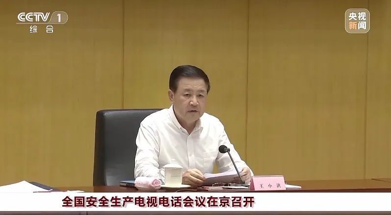
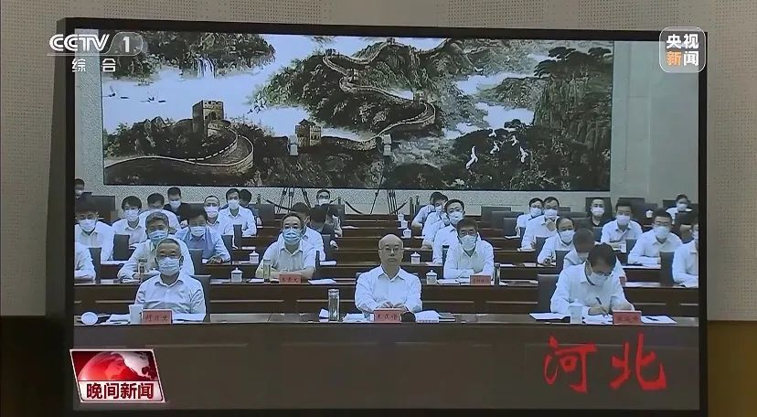
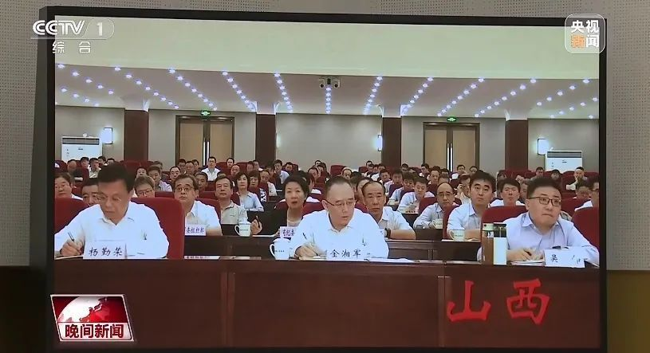

# 国务院副总理张国清，首次以这一身份部署工作

**撰文 | 余晖**

据新华社消息，7月30日，全国安全生产电视电话会议在京召开， **国务院副总理、国务院安委会主任张国清** 出席会议并讲话，
**国务委员、国务院安委会副主任王小洪** 主持会议。

上述消息显示， **张国清已任国务院安委会主任，王小洪已任国务院安委会副主任。**

会议提到，要 **重拳出击** “打非治违”，对性质恶劣、社会影响大、冲击人民群众安全感的事故以及瞒报谎报事故等 **提级调查** ，严查快办。

**国务院副总理担任安委会主任**

国务院安全生产委员会成立于2003年。

2003年10月，国办发布了《关于成立国务院安全生产委员会的通知》。

通知中提到，为 **加强对全国安全生产工作的统一领导** ，促进安全生产形势的稳定好转，保护国家财产和人民生命安全，经国务院同意，成立国务院安全生产委员会。

首任国务院安委会的主任是时任国务院副总理黄菊。

当时的通知中提到，安委会的职责包括在国务院领导下，负责研究部署、指导协调全国安全生产工作；研究提出全国安全生产工作的重大方针政策等。

在过去的这些年，国务院安委会组成人员几经调整。

2018年7月，国办发布通知称， **根据机构设置、人员变动情况和工作需要** ，国务院决定对国务院安委会作相应调整。

通知显示，国务院安委会的主任由时任国务院副总理刘鹤担任；副主任有五人，包括时任国务委员王勇、时任公安部部长赵克志、时任应急部党组书记黄明等。

上述通知还提到， **安委会办公室设在应急部，承担安委会的日常工作。**

去年8月，国务院安委会发布了《关于调整国务院安全生产委员会副主任的通知》。

调整后，应急管理部党委书记王祥喜（2022年9月任应急部部长）接替黄明，担任国务院安委会副主任，兼任国务院安委会办公室主任。

2023年7月30日的全国安全生产电视电话会议显示，国务院副总理张国清已担任国务院安委会主任；王小洪已任国务院安委会副主任。

多说几句。

政知君注意到，这并不是今年首次召开全国安全生产电视电话会议。

1月11月，国务院召开全国安全生产电视电话会议，当时出席会议的是时任国务院副总理、国务院安委会主任刘鹤。

**现场**

7月30日的全国安全生产电视电话会议，对安全生产工作作出了最新部署。

新闻画面显示，多地政府一把手通过视频参会，包括河北省省长王正谱、浙江省省长王浩、山西省省长金湘军等。

这次会议强调，要坚决贯彻习近平总书记重要指示批示精神，落实李强总理要求， **深刻汲取近期事故教训**
，精准排查整治事故风险隐患，扎实做好安全生产各项工作， **切实防范遏制重特大事故发生** 。

会议还进行了详细部署。

会议要求， **杜绝“事后发力”思想**
，坚持眼睛向下、紧盯一线，下沉监管力量，严格监管执法，以事故多发行业领域、高风险点位等为重点，狠抓终端末梢主体责任落实、风险起底排查、隐患治本除根。

会议还特别强调了责任倒查机制。

要严格执行责任倒查机制，推动追责问责向前延伸，确保排查整治全面覆盖、深查真改。

要重拳出击“打非治违”， **对性质恶劣、社会影响大、冲击人民群众安全感的事故以及瞒报谎报事故等提级调查，严查快办** 。

会议强调， **要全面开展燃气安全大起底、大整治**
，针对问题气、问题瓶、问题阀、问题软管、问题管网、问题环境等关键环节，明确责任、直捣病灶，坚决遏制燃气事故多发势头。

就在这次会议召开当天，山西省联合调查组发布了《关于代县精诚矿业矿工死亡瞒报事件调查处置情况的通报》。

通报显示， **到2022年发生“9·1”滑塌事故前，精诚矿业先后瞒报生产安全事故40起、死亡矿工43人。**

截至目前，已对16名涉嫌严重违纪违法的公职人员立案审查调查并采取留置措施。

**多地政府一把手部署**

在国务院召开会议之后，7月30日，多地省级政府一把手部署了本省份的安全生产工作，包括北京市市长殷勇、河北省省长王正谱、山西省省长金湘军、上海市市长龚正、安徽省省长王清宪、江西省省长叶建春、湖北省省长王忠林、海南省省长刘小明、西藏自治区主席严金海等。

多位省级政府一把手对 **燃气安全、建筑施工** 等提出了要求。

北京市的会议要求，抓好燃气安全全链条、大起底整治，加强质量监管，强化用气场所消防管理，确保不留死角；着力抓好建筑施工安全，针对校园、体育场馆等开展施工质量安全专项检查，严厉打击违法违规行为。

海南省的会议要求，要保持高度警惕，紧盯重点领域、关键环节，强化违规施工行为处理，加强旅游景区安全管理。

山西省的会议强调，突出抓好燃气安全专项整治，加大燃气安全设施检查力度，严格燃气经营、配送、使用等环节安全监管。

另外，山西还特别提到，坚持“四不放过”追责问责，对生产安全事故穿透式责任倒查，做到失职必追责、追责必严肃， **坚决杜绝安全生产事故迟报瞒报漏报。**

另外，多地还就国务院安委办督查整改工作作出部署。

江西的会议提到，要抓实国务院安委办在江西省督查暗访所查出问题和隐患的整改，举一反三开展全方位、全覆盖的排查整治。

上海的会议提到，对国务院安委会督查组指出的问题，要举一反三，严格监管，绝不能在同样的问题上反复摔跟头。

**资料 ｜ 央视 人民网 新华社 各省党报等**

**【版权声明】本文著作权归政知新媒体独家所有，未经授权，不得转载。**

