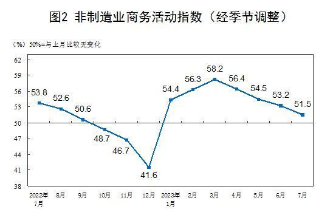
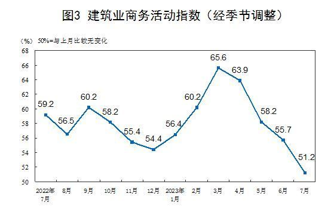
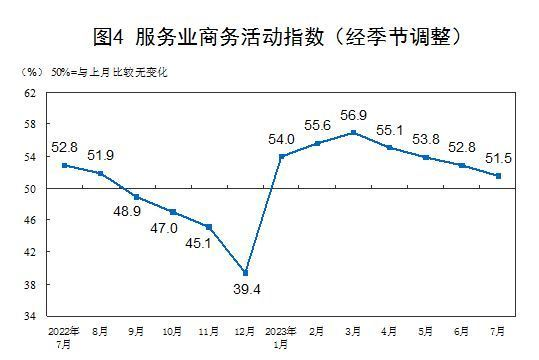
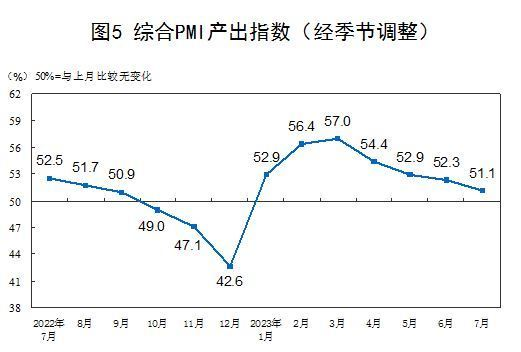

# 国家统计局：7月中国制造业PMI为49.3%，连续两月回升

国家统计局服务业调查中心

中国物流与采购联合会

**一、中国制造业采购经理指数运行情况**

7月份，制造业采购经理指数（PMI）为49.3%，比上月上升0.3个百分点，制造业景气水平持续改善。

从企业规模看，大型企业PMI为50.3%，与上月持平；中型企业PMI为49.0%，比上月上升0.1个百分点；小型企业PMI为47.4%，比上月上升1.0个百分点。

从分类指数看，在构成制造业PMI的5个分类指数中，生产指数、供应商配送时间指数高于临界点，新订单指数、原材料库存指数和从业人员指数低于临界点。

生产指数为50.2%，比上月下降0.1个百分点，仍高于临界点，表明制造业生产保持扩张。

新订单指数为49.5%，比上月上升0.9个百分点，表明制造业市场需求景气度继续改善。

原材料库存指数为48.2%，比上月上升0.8个百分点，表明制造业主要原材料库存量降幅收窄。

从业人员指数为48.1%，比上月下降0.1个百分点，表明制造业企业用工景气度变化不大。

供应商配送时间指数为50.5%，比上月上升0.1个百分点，表明制造业原材料供应商交货时间持续加快。

**二、中国非制造业采购经理指数运行情况**

7月份，非制造业商务活动指数为51.5%，比上月下降1.7个百分点，仍高于临界点，非制造业继续保持扩张。

分行业看，建筑业商务活动指数为51.2%，比上月下降4.5个百分点；服务业商务活动指数为51.5%，比上月下降1.3个百分点。从行业看，航空运输、邮政快递、电信广播电视及卫星传输服务、互联网软件及信息技术服务等行业商务活动指数位于60.0%以上高位景气区间；资本市场服务、房地产等行业商务活动指数低于临界点。

新订单指数为48.1%，比上月下降1.4个百分点，表明非制造业市场需求景气度有所下降。分行业看，建筑业新订单指数为46.3%，比上月下降2.4个百分点；服务业新订单指数为48.4%，比上月下降1.2个百分点。

投入品价格指数为50.8%，比上月上升1.8个百分点，表明非制造业企业用于经营活动的投入品价格总体水平上涨。分行业看，建筑业投入品价格指数为50.7%，比上月下降1.1个百分点；服务业投入品价格指数为50.8%，比上月上升2.2个百分点。

销售价格指数为49.7%，比上月上升1.9个百分点，表明非制造业销售价格总体水平降幅收窄。分行业看，建筑业销售价格指数为52.0%，比上月上升0.4个百分点；服务业销售价格指数为49.3%，比上月上升2.1个百分点。

从业人员指数为46.6%，比上月下降0.2个百分点，表明非制造业企业用工景气度略有下降。分行业看，建筑业从业人员指数为45.2%，比上月下降2.0个百分点；服务业从业人员指数为46.8%，比上月上升0.1个百分点。

业务活动预期指数为59.0%，比上月下降1.3个百分点，仍位于较高景气水平，表明非制造业企业对近期市场恢复发展信心稳定。分行业看，建筑业业务活动预期指数为60.5%，比上月上升0.2个百分点；服务业业务活动预期指数为58.7%，比上月下降1.6个百分点。

**三、中国综合PMI产出指数运行情况**

7月份，综合PMI产出指数为51.1%，比上月下降1.2个百分点，仍高于临界点，表明我国企业生产经营总体继续保持扩张。

**7月份制造业采购经理指数继续回升 非制造业商务活动指数仍在扩张区间**

**——国家统计局服务业调查中心高级统计师赵庆河解读2023年7月中国采购经理指数**

2023年7月31日国家统计局服务业调查中心和中国物流与采购联合会发布了中国采购经理指数。对此，国家统计局服务业调查中心高级统计师赵庆河进行了解读。

7月份，制造业采购经理指数为49.3%，比上月上升0.3个百分点；非制造业商务活动指数和综合PMI产出指数分别为51.5%和51.1%，均连续7个月位于扩张区间，我国经济延续恢复发展态势。从市场预期看，制造业生产经营活动预期指数和非制造业业务活动预期指数分别为55.1%和59.0%，均位于较高景气区间，企业信心总体稳定。

**一、制造业采购经理指数继续回升**

7月份，制造业PMI连续两个月小幅回升，调查的21个行业中有10个位于扩张区间，比上月增加2个，制造业景气水平总体持续改善。

（一）生产指数保持扩张。生产指数为50.2%，与上月基本持平，保持在扩张区间，新订单指数为49.5%，比上月上升0.9个百分点，表明制造业生产经营活动稳定，市场需求景气度有所改善。从行业看，石油煤炭及其他燃料加工、化学纤维及橡胶塑料制品、专用设备、铁路船舶航空航天设备、计算机通信电子设备等行业生产指数和新订单指数均高于临界点，产需同步扩张。

（二）价格指数继续回升。主要原材料购进价格指数和出厂价格指数分别为52.4%和48.6%，比上月上升7.4和4.7个百分点，其中主要原材料购进价格指数升至扩张区间，制造业生产用原材料价格总体水平有所上升。从行业看，农副食品加工、石油煤炭及其他燃料加工、黑色金属冶炼及压延加工等行业主要原材料购进价格指数升至60.0%以上，部分原材料采购价格上涨明显。

（三）小型企业景气水平有所改善。大型企业PMI为50.3%，与上月持平，继续位于扩张区间，对制造业总体支撑作用显著。大型企业生产指数和新订单指数分别连续7个月和3个月位于扩张区间，产需保持增长。中型企业PMI为49.0%，比上月上升0.1个百分点；小型企业PMI为47.4%，比上月上升1.0个百分点，景气水平有所改善。

（四）预期指数升至较高景气区间。生产经营活动预期指数为55.1%，比上月上升1.7个百分点，表明随着促进民营经济发展壮大、扩内需促消费等一系列政策出台，市场发展积极因素不断增多，企业信心有所增强。特别是消费品行业生产经营活动预期指数今年以来始终高于55.0%，本月升至58.0%，企业对近期行业发展预期向好。

从全球范围看，7月份美国和欧元区制造业PMI初值分别为49.0%和42.7%，继续位于临界点以下，欧美等主要经济体制造业持续收缩。虽然本月我国制造业PMI回升至49.3%，但调查中一些企业反映，当前外部环境复杂严峻，海外订单减少，需求不足仍是企业面临的主要困难。

**二、非制造业商务活动指数仍在扩张区间**

7月份，非制造业商务活动指数为51.5%，比上月下降1.7个百分点，非制造业继续保持扩张。

（一）服务业延续恢复发展态势。服务业商务活动指数为51.5%，比上月下降1.3个百分点，仍位于扩张区间，服务业业务总量继续增长，但增速有所放缓。从行业看，在暑期消费带动下，居民休闲消费和旅游出行有所增加，铁路运输、航空运输、住宿、餐饮、生态保护及公共设施管理、文化体育娱乐等行业商务活动指数均位于55.0%以上较高景气区间，市场活跃度明显提升；服务业新动能持续释放，电信广播电视及卫星传输服务、互联网软件及信息技术服务等行业商务活动指数均高于60.0%，企业经营活动加快，业务总量持续扩张。从市场预期看，业务活动预期指数为58.7%，保持较高运行水平，在调查的21个行业中，除房地产业外，其他行业业务活动预期指数均位于景气区间，服务业企业信心较为稳定。

（二）建筑业保持扩张。建筑业商务活动指数为51.2%，比上月下降4.5个百分点，仍位于扩张区间，表明受高温多雨等不利因素影响，近期建筑业施工进度有所放缓。从市场预期看，业务活动预期指数为60.5%，比上月上升0.2个百分点，表明虽然建筑业景气水平有所回落，但多数企业仍对建筑业发展保持乐观。

**三、综合PMI产出指数持续扩张**

7月份，综合PMI产出指数为51.1%，比上月下降1.2个百分点，仍位于扩张区间，表明我国企业生产经营活动总体继续保持扩张。构成综合PMI产出指数的制造业生产指数和非制造业商务活动指数分别为50.2%和51.5%。

**附注**

1、主要指标解释

采购经理指数（PMI），是通过对企业采购经理的月度调查结果统计汇总、编制而成的指数，它涵盖了企业采购、生产、流通等各个环节，包括制造业和非制造业领域，是国际上通用的监测宏观经济走势的先行性指数之一，具有较强的预测、预警作用。综合PMI产出指数是PMI指标体系中反映当期全行业（制造业和非制造业）产出变化情况的综合指数。PMI高于50%时，反映经济总体较上月扩张；低于50%，则反映经济总体较上月收缩。

2、调查范围

涉及《国民经济行业分类》（GB/T4754-2017）中制造业的31个行业大类，3200家调查样本；非制造业的43个行业大类，4300家调查样本。

3、调查方法

采购经理调查采用PPS（Probability Proportional to
Size）抽样方法，以制造业或非制造业行业大类为层，行业样本量按其增加值占全部制造业或非制造业增加值的比重分配，层内样本使用与企业主营业务收入成比例的概率抽取。

本调查由国家统计局直属调查队具体组织实施，利用国家统计联网直报系统对企业采购经理进行月度问卷调查。

4、计算方法

（1）分类指数的计算方法。制造业采购经理调查指标体系包括生产、新订单、新出口订单、在手订单、产成品库存、采购量、进口、主要原材料购进价格、出厂价格、原材料库存、从业人员、供应商配送时间、生产经营活动预期等13个分类指数。非制造业采购经理调查指标体系包括商务活动、新订单、新出口订单、在手订单、存货、投入品价格、销售价格、从业人员、供应商配送时间、业务活动预期等10个分类指数。分类指数采用扩散指数计算方法，即正向回答的企业个数百分比加上回答不变的百分比的一半。由于非制造业没有合成指数，国际上通常用商务活动指数反映非制造业经济发展的总体变化情况。

（2）制造业PMI指数的计算方法。制造业PMI是由5个扩散指数（分类指数）加权计算而成。5个分类指数及其权数是依据其对经济的先行影响程度确定的。具体包括：新订单指数，权数为30%；生产指数，权数为25%；从业人员指数，权数为20%；供应商配送时间指数，权数为15%；原材料库存指数，权数为10%。其中，供应商配送时间指数为逆指数，在合成制造业PMI指数时进行反向运算。

（3）综合PMI产出指数的计算方法。综合PMI产出指数由制造业生产指数与非制造业商务活动指数加权求和而成，权数分别为制造业和非制造业占GDP的比重。

5、季节调整

采购经理调查是一项月度调查，受季节因素影响，数据波动较大。现发布的指数均为季节调整后的数据。

