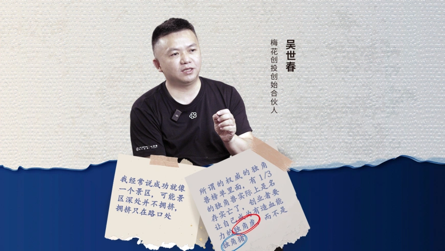

# 对话投资人吴世春：创投圈从前玩德州，为何现在打掼蛋、喝白酒？

作者丨叶蓁

编辑丨康晓

出品丨深网·腾讯新闻小满工作室

今年5月，梅花创投创始合伙人吴世春的一个脱口秀视频在创投圈走红，"为了抢项目学会了喝酒，为了募资学会了掼蛋……以前出差去北上广深，现在去县城。”调侃的背后，是国内整个大的创投逻辑的变化。

创投行业进入了新的周期。“现在大家都有一个共识，太难了。有几个难，募资难、退出难、投资难，然后创业也难。”吴世春对《深网》诠释。据清科近日发布的股权投资市场数据，2023上半年，国内投资金额下降42%，投资案例数下降了37.5%。

“募资要打掼蛋、喝白酒，脱口秀里有开玩笑的成分，其实我的潜台词是现在整个资金的比例发生了巨大的变化，政府类的资金占了一级市场的百分之六七十，社会类的资金，特别是个人LP的资金大幅下降，这个变化意味着什么？”

**吴世春告诉《深网》，政府类资金的诉求是招商、产业落地、税收和带动产业创业；而个人LP占主导的时代，财务回报优先，逻辑是不一样的。**

梅花创投成立于2014年，十年来参与了超过600多家企业的早期投资，其中囊括了大掌门、趣店、理想汽车、小牛电动、唱吧等多家企业。

**在创投周期的更迭中，吴世春发现这些年VC们曾疯狂追逐的独角兽，一部分蜕变成了独角虎，而一部分则成了独角猪。他认为，独角虎和独角猪，看起来都很庞大，但是独角虎是能够去捕食的，独角猪只能靠VC的投喂。**

“可以这么说，现在我们看到的所谓的权威的独角兽榜单里，有1/3的独角兽实际上是名存实亡了。有的独角兽可能在2018年融了一笔钱，估值10亿美金以上，到现在勉强还活着，也一直在独角兽的榜单里。但这个榜单的意义在哪里？”吴世春反问。

吴世春建议未来创投行业用独角虎的概念来代替独角兽，他希望投资人不要被所谓的市场份额、规模效应和估值虚高所影响。

“
**独角虎是那种能够自我造血、有科技含量、可持续、然后有规模化、且在一个行业里是龙头的企业，它可能估值上没到10亿美金独角兽的标准，但它的营收可能达到5亿，利润达到5000万。”**

从阳明心学出发，吴世春建立了一套自己的投资逻辑，力求在投资上做到知行合一。他最重要的一个认知是，在周期的更迭中，永远要相信常识。

**“造车新势力的这三个人，在创办的企业中，除了李想，别人都没有真正赚到过钱，另外两个创始人可能打造了好几个独角兽，但属于击鼓传花的游戏，最终无疾而终。”吴世春用最简单的逻辑来解释当初为什么选择投资理想，“吴世春说，独角虎拼的不是估值，拼的是好的商业模式，让商业回归到常识，拼的是公司健康的可持续的状态，且不依靠VC的投资，也可以活的很好。**

**以下是《深网》对话吴世春实录整理，在不影响其原意的基础上有所调整删减。**

**“德扑是西方文化，掼蛋是中国文化”**

**《深网》：你的脱口秀引起很多讨论，做这个的初衷是什么？**

**吴世春：** 大家都有一个共识，现在太难了，有几个难——募资难、退出难，投资难，然后创业也难。现在募资要打掼蛋、喝白酒，脱口秀里有开玩笑的成分。

**《深网》：从德州扑克到掼蛋，这背后投资趋势环境的变化？**

**吴世春：**
其实我的潜台词是现在整个资金的比例发生了巨大的变化，政府类的资金占了一级市场的百分之六七十，社会类的资金，特别是个人LP的资金大幅下降，这个变化意味着什么？政府类资金的诉求是什么？招商、产业落地、税收和带动产业创业；而个人LP占主导的时代，财务回报优先，这是不一样的。

**《深网》：抛开环境因素，你觉得掼蛋好玩儿吗？**

**吴世春：掼蛋是一个蛮好玩的游戏，首先有配合，有攻击，也有技巧，还有对人性的理解。德州扑克从价值观上来说，更偏向西方文化，而掼蛋偏中国文化。**

**《深网》：整个逻辑都发生变化了，如何在事与难中精进？**

**吴世春：**
只要做事就会遇到困难。首先得有足够的使命感，你知道自己的人生为一件大事而来，要做成这件事情，一定会遇到各种各样的困难和挑战，首先你得比你的同行迭代和进化的更快。

我们经常提到一个词叫内卷，内卷一个很重要的特点就是同质化，要么是信息同质化、努力同质化、资源同质化、工作量同质化，都是985毕业，都在996工作，都能够看到互联网的一些信息，都能用好现在中国的供应链，很难分辨出谁是优秀的。

精进的话要从这个同质化层突破出来，摆脱这种红海竞争，你就必须有非常明显的长板。我提出了心力、认知、格局和心态这几个维度，是每个人的暗牌，这些不容易被量化和描述，而同质化的东西一定都可以写在简历上。

**打个比方当时我们有机会投李想，也有机会投威马，单纯看履历，一个是跨国的汽车高管团队出来创业，豪华团队，另外一个高中没毕业，没造车经验；一个一开始融到的钱很多，但另外一个则钱很少。**

仅从外在因素看，威马这个团队更容易成功，但实际上创业是一场长跑，能让创业者成功的真正因素是心力、认知、格局和心态。

**“1/3独角兽已死，秘不发丧”**

**《深网》：梅花创投目前已经投了600多家企业，你在投资的时候，如何把独角猪和独角虎分开？**

**吴世春：**
独角虎的概念是我在2016年提出的，这个概念提出以后，我觉得我对投资的认知又到了另外一个高度。独角兽这个概念，引领了过去整个VC市场，成为一个标签，也是一个风向标，创业者希望成为独角兽，投资人希望投到独角兽，然后LP希望投资人能投到独角兽。

但有一个很致命的问题，独角兽的估值完全由一级市场决定，然后大多数企业自身的造血能力偏差，盈利模式不行。

现在我们看到的几大所谓的权威的独角兽榜单里，有1/3的独角兽实际上是名存实亡了。有的独角兽可能在2018年融了一笔钱，估值10亿美金以上，到现在还活着，也一直在独角兽的榜单里，这样的独角兽充其量就是个独角猪。那这个榜单的意义在哪里？

我提出独角虎的概念，希望它成为中国创投圈的一个新标准，创业者要以成为独角虎为目标，投资人要投到独角虎。

**独角虎是那种能够自我造血、有科技含量、可持续、然后有规模化、且在一个行业里是龙头的企业，它可能估值上没到10亿美金独角兽的标准，但它的营收可能5亿、利润可能5000万。**

过去很多年我一直在找寻独角虎，寻找的过程中，就不会被所谓的市场份额、规模效应和估值虚高所影响。因此，我也被业内称为独角虎捕手，我希望整个社会去推广独角虎这个概念，这个概念可以使得一级市场上少很多资金的浪费，少很多的内卷。

独角虎拼的不是估值，拼的是公司健康的可持续的状态，且不依靠VC的投资，也可以活的很好。

**《深网》：独角虎这个物种，商业模式和现金流，对创业者来说前置了？**

**吴世春：** 独角虎和独角猪，看起来都很庞大，但是独角虎是能够去捕食的，独角猪只能靠VC的投喂。

**《深网》：能不能成为独角虎，对创业者来说，在一开始创业的时候就应该考虑盈利模式，而投资人在投企业的时候也应该回到商业本身？**

**吴世春：**
对。要回归到商业本身。创业者不应该过多考虑VC的感受，让创业成为一个投资人击鼓传花的游戏；而更应该考虑用户的感受，让企业获得源源不断的订单，然后获取利润，让企业健康的发展。独角兽在一级市场资金充足的时候，很受欢迎，但是当下，一级市场的资金很紧张，然后去美股和港股上市的通道也比较紧张，这个时候，独角兽的概念其实没有价值了。因为独角兽很多都没利润，没利润在国内上不了市，去海外又没有通道。因此独角虎对投资机构来讲，能更好的退出，对企业来讲，更加专注于核心价值的创造上。

**《深网》：给创业者一些建议，如何成为独角虎？**

**吴世春：** 我给创业者的建议是，你的奋斗目标是服务客户而不是TO
VC，把获取订单的能力变成你公司的核心科技。获取订单的能力是综合性的一个能力，包括方案、产品力、销售能力，交付能力，把这些综合性的能力变成一个公司的核心科技。

获取订单的能力对应的是企业的自我造血能力，也有长期迭代的能力，这比什么都重要。企业有了这个能力就会往独角虎去进化。

**“投中理想，因为相信常识”**

**《深网》：从独角兽到独角虎，是你在创投周期下的反思，你对下一个周期的预期是什么？**

**吴世春：**
周期是一个非常宏观的概念，包含了政策市场、资金的流向，还有美元加息减息的影响等诸多因素。从我创业到现在为止，经历过四个周期。对创投机构来说，必须意识到周期的涨跌是一种常态，因为没有永远的繁荣，也没有永远的低谷，投资人的投资理念和投资项目要经得起周期的考验——上一个周期里投的项目，能不能顺利到下一个周期。

很多投资人在前三个周期里投的项目，看起来很好，也都活着，一旦潮水退去，发现都在裸泳，企业没有造血能力，且估值虚高，无法穿越周期。周期就是基于对宏观经济的理解，要做时间的朋友，而不是看投的项目有没有接盘者，估值有没有涨，这些带来的都是短期繁荣。

**《深网》：投资人如何穿越周期？如何发现独角虎？**

**吴世春：**
在周期的更迭中，永远要相信常识。造车新势力的这三个人，除了李想，他们都没有真正赚到过钱。另外两个创始人可能打造了好几个独角兽，但击鼓传花的游戏，最终无疾而终。

李想过去的经历来看，他是个非常务实，非常理性的人，不会被市场的虚假和泡沫所影响。我们不仅在新能源汽车领域去寻找这样的创始人，在商业航天领域也在寻找这样的创始人。理解创始人，必须理解他创业的源动力，是要做一个估值很高的独角兽，还是要创造一个有价值的独角虎，时间会最终给出答案。

**《深网》：所以理想最初的路线和产品定位，其实你并不在意？**

**吴世春：**
可以这么理解。其实李想一开始考虑的产品是两人坐的那种很小的车，但对我来讲，我看的还是这个人，因为在整个赛道还没有定型的时候，其实纯电还是混电的都不重要，因为创始人会在创业的过程中，一边实践一边提升认知。

张一鸣创业的时候，最初的产品和现在的抖音，看起来毫无关联，但从整个过程来看，所有的产品都是一代一代迭代出来的。

**《深网》：如何回归到常识？对于一个创业者而言，务实和理想之间同样需要平衡？**

**吴世春：**
回到常识需要智慧。以史为鉴，才能更好的理解当下，最终都会回到常识，就像现在的AI大模型，跟当年浏览器出来，iPhone出来的时候一样，浏览器大火的2011年，整个泡沫忽然破灭了，花了很长的时间去修复，移动互联网也是。只有与历史对照的时候，你才知道当下的哪些是噪音，回归到价值。

我认同知行合一，对一个优秀的创业者来说，理想主义一定是他的内核，外在一定要有现实主义的逻辑。

**《深网》：如何做到知行合一？如果你的认知错了怎么办，会不会怀疑自己？**

**吴世春：**
一个研究阳明心学的人必须内观，有时候一个念头出现了，它可能不对，都要去内观和反省自己，是不是我的判断和当下的市场是脱节的，这里面到底是市场的噪音，还是我的判断出了问题，如何找到最优解？可能很多人会盲从于市场而随波逐流，但我可能要想想，如果把时间拉长到10年，或者回到历史周期来看，这时候做的决定可能更加理性和客观。目前市场波动带来的噪音，有可能是短暂的，我会更加坚持我的判断和认知。

**“阳明心学是价值观的胜利”**

**《深网》：你人生的哪个节点，阳明心学触动了你？**

**吴世春：**
我在后来的多次创业中，发现没有什么东西能够支撑思维系统的成长，我焦虑过也痛苦过，就想在书本里去找答案，后来发现阳明心学包罗万象，是一个实践的科学。阳明心学不只是讲一个高深的道理，它讲的是在事情中反复磨练，然后不断的去提升认知，然后指导你下一个实践，拿到新的结果。

在这个过程中，阳明心学就变成了我的核心思维和观念，这个内容我也不断的教给别人，我在黑马讲创业心学的课程，教别人的过程也完成了自己对这个体系的建构，包括后来我写《心力》的书，也是基于我对阳明心学的理解，对投资的理解，对创业理解，就形成了一个自洽的理论。这个理论也用于指导自己的投资，我发现变得很顺畅，投到李想这样的公司，也是理论指导的胜利。

**《深网》：阳明心学讲心比物重要，作为必须追求资金回报的投资人，是不是回到了理想和现实的矛盾？**

**吴世春：**
阳明心学有个很核心的理论叫致良知，翻译成现代的话就是你需要创造社会价值。对于我们投资人来讲，就是你去追求财富增值的时候，一定要有社会价值，没有社会价值的物质财富是要大打折扣的，甚至没有意义的。反过来它又指导我们投资项目，如果按照致良知的标准，一个项目值不值得投，它长期对这个社会是不是一个正输出。因此阳明心学也可以认为是价值观的胜利，它用价值观就是致良知来统帅他所有的心法。作为投资人，首先你价值观得正，然后再去讲知行合一，再去讲如何看待心和物的关系。

因此对价值的判断很重要，现代科学每天计算值不值，而阳明心学讲的是对不对。对不对放在一个长的时间下去考量，比如我写一本书，从稿费的收益来看可能是不值得的，但从对不对的维度去看，它梳理了我的思想体系，帮助到更多的创业者，这是值不值和对不对的一个区分。

**《深网》：内观需要安静，你如何降噪？**

**吴世春：**
这个社会上噪音是无处不在的，每天只要打开朋友圈或者微信群，各种各样的同行，各种各样媒体的报道，比如有些有头有脸的投资人投拉面了，有头有脸的投资人去新加坡了等等。每天看到的都是各种各样的噪音，降噪很重要一点，就是看本质的能力，知道本质是什么。

比如投资的本质是什么，创业的本质是什么？举例来说，本质主要三个东西，事情的终局，事情的赔率和事情的规律。投资的话，本质是低买高卖，10块价钱投到，过几年也许以一千块钱价格卖掉，中间增值在哪里，风险是什么，赔率的折扣是什么，都要去衡量，能看到本质，就会像筛子一样，把很多无效的信息筛除出去；而看到同频的同维度的一些认知，很快的去学习和吸收。

**因此，降噪这个事情首先是你自己要升级和迭代成为一个不容易受干扰的人，能看到本质的人。对我来说降噪来自于内心，来自于阳明心学的训练。**

**《深网》：你刚才谈到你的人生为一件大事而来，这个大事是什么？**

吴世春：这件大事是跟我内心的价值判断和标准相关的，对我来说，我要把早期投资这件大事做好，我希望梅花创投或者吴世春成为早期创业者的不二之选，这是我想达到的目标，就是人和事高度统一，且这个标签是市场给的，这样的话梅花创投跟市场之间就建立了一个低消耗的状态，有自己的品牌。

**每个时代都有每个时代的显学，在这个时代，显学就是创业，创业最核心因素之一，就是创投体系。**

**“小镇青年向上的欲望”**

**《深网》：你说小镇青年向上的欲望是中国经济长期发展的动力，为什么？**

吴世春：我认为小镇青年就是从小村小镇小城出来，到大城市去读书，然后在大城市立足，而后进入创业赛道，他们本身从一个小地方来，很渴望在大城市打拼出自己的天地。

小镇青年，背后没有资源，没有可以依赖的东西，他必须每天殚精竭虑，如履薄冰，才能够在竞争非常激烈的大城市立足。因此，我常讲小镇青年的向上的欲望，是中国经济成长的动力。他们是很有野心和动力，希望取得成功的。像我们看到的张一鸣，王兴。我自己也是小镇青年，也可以叫小村青年，我来自于江西省大邑县非常小的村庄。

小镇青年想过上好生活，他们的这种动力和欲望是非常强烈的。

**《深网》：你刚才也谈到了内卷，小镇青年通过努力上了大学，来到城市，而后去了大厂，然后35岁就失业了，这种内卷对整个社会来讲是一种人才的巨大的浪费，35岁的中年就真的没用了吗？**

**吴世春：** 内卷其实就是同质化，不稀缺。如果一个岗位上面只有你一个能干，一点都不内卷，如果这个岗位很多人都可以干，很多人都可以替代你，就会非常卷。

**我经常也问我同事一个问题，你觉得你被替代的可能性有多大？一定要时时刻刻问自己这个问题。**
我在这个岗位上会不会被刚毕业的学生替代掉，甚至会不会被AI替代掉，不被替代，就意味着要积累一些与年龄正相关的一些东西，比如你的人脉，攒局的能力，非知识层面的东西。

为什么说35岁危机，因为没积累到跟年龄相关的这些技能。

**《深网》：你对当下的小镇青年有什么建议？**

**吴世春：**
书本上的知识，放到整个社会不确定性的这种大海里，其实是很渺小的，确定性的东西，知识都是有限的，不确定的东西，它就非常的大。比如德州扑克，它是有限信息下的多人动态博弈，围棋是两个人所有的信息都摆在桌面上，看起来很复杂，但AI可以在围棋上打败人类，但在德州扑克上很难打败人类，只要是非完全信息，又是多人动态博弈的话，其实规则很简单，但是德州扑克的复杂程度要比围棋复杂很多，因为要考虑到人心、动态、位置等各种各样的因素和角度。

我们的年轻人应该更早的去理解阳明心学，阳明心学的核心要义做一个吸收。把知和行等同起来，过往我们太强调知，但从个人的维度来讲，心力，认知、格局和心态，这些都会形成个人的容器，容器太小，这些知识即使装进去，也很难变成真正的价值。

**现在的教育体系都是把知识灌输给你，让你变成一个人才，但你自己的容器得足够大，放得下这些知识，才会变成一个知行合一内方外圆的人。**
否则就会变成一个精致的利己主义者，每天都在计算这个事情值不值，对自己有没有收益，这样就很难成为一个能够会社会创造正向价值的人。

**《深网》：当下，你认为年轻人要想成功难在哪里？**

**吴世春：** 我经常说成功就像一个景区，可能景区深处并不拥挤，拥挤只在路口处，大家都会拥挤在路口处，因为每个人都想进去。

**《深网》：PC互联网和移动互联网都已经众神归位，未来小镇青年的机会在哪里？**

**吴世春：**
未来不太可能有互联网和移动互联网那样明确的大赛道的机会，但在细分赛道还是有机会的，比如新能源、汽车领域，还有AI带来的新的机会，在重塑很多行业，带来了降本增效的机会。我们投的一些企业，就围绕这些细分赛道的机会，比如中国的新材料，智能制造，AI应用和商业航天等领域。

目前两三千万不好找工作的学生，能否把他们培养成AI应用型人才。我们投的一家企业叫奈学科技，就想瞄着这个目标去做，中国缺几千万AI技工，这些人很多都是来自小镇的青年。

**《深网》：未来这种万亿赛道的机会还多吗？**

吴世春：我们现在说的出口新三大件，新能源汽车、电池、光伏，都是万亿赛道。然后
AI有可能把整个互联网原来做的东西重做一遍，这带来的我觉得可能是一个比互联网更大的机会，前景特别广阔。

**《深网》：大模型今年特别热，很多人认为ChatGPT是AI的iPhone时刻，今年创投圈对此整体是个什么状态？**

**吴世春：**
整个市场看起来的确非常热，甚至提出了百模大战，但现在基本是大厂在做这个事情，我认为这个过程就像移动互联时代，需要大厂先建好标准，把高速公路铺好，周边的生态才会繁荣起来。大模型需要的资金是巨大的，也需要很多的人才，对于初创企业是很难去做的。我也接触过很多创业者，他们打算在这个生态里创业。这个时候，出手的投资机构少，是因为一些机构整体就偏谨慎，接下来我觉得VC和创业者，都会陆续做好准备。

