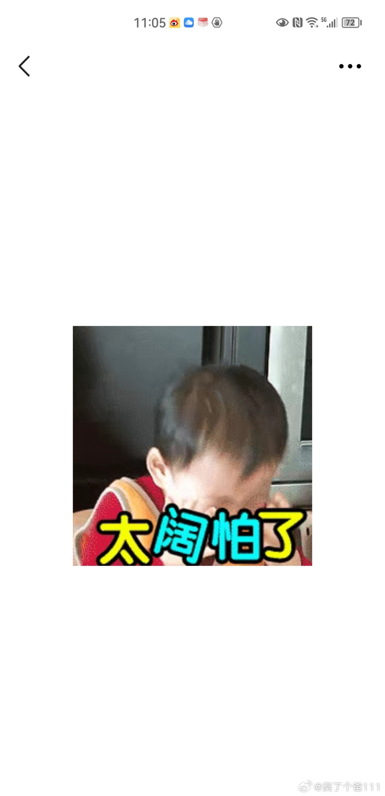

# 张继科将执教日本？其父发布七律《辟谣》：妖言惑众何时休

7月31日，张继科父亲发布七律《辟谣》：

妖言惑众何时休

天方夜谭谁推手

雾里看花水中月

误领网民迷途走

七尺男儿华夏诞

骨髓血液中国流

坚如磐石拳立誓

岿然不动母亲留

注：母亲——意指祖国

传铭诗

**【来源：当事人微博】**

**此前报道：**

年薪百万！网传深陷赌博风波的张继科，接受日本乒协邀请出任教练

