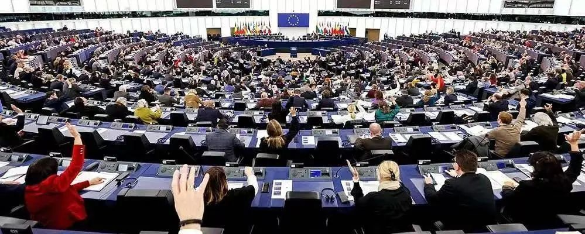
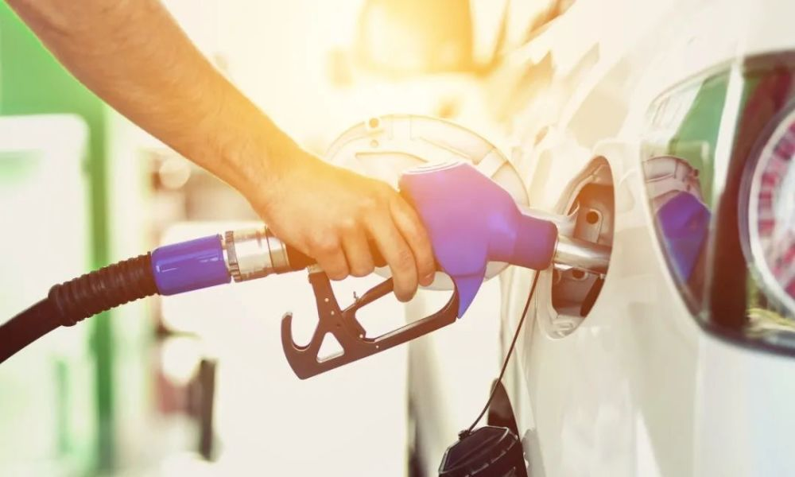
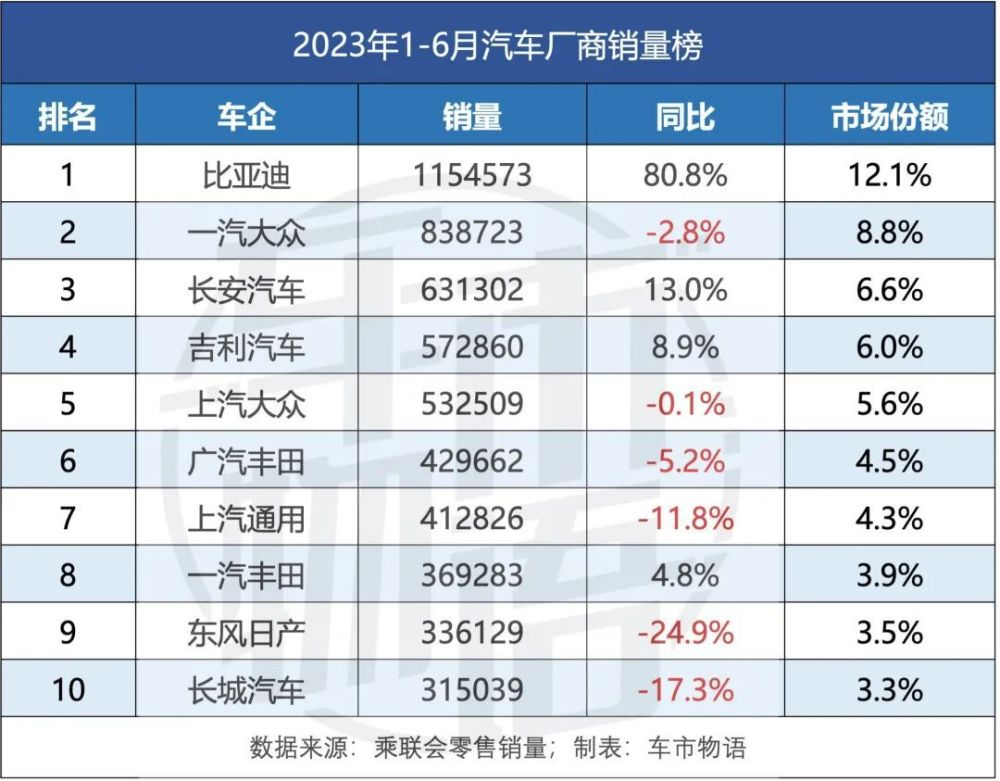
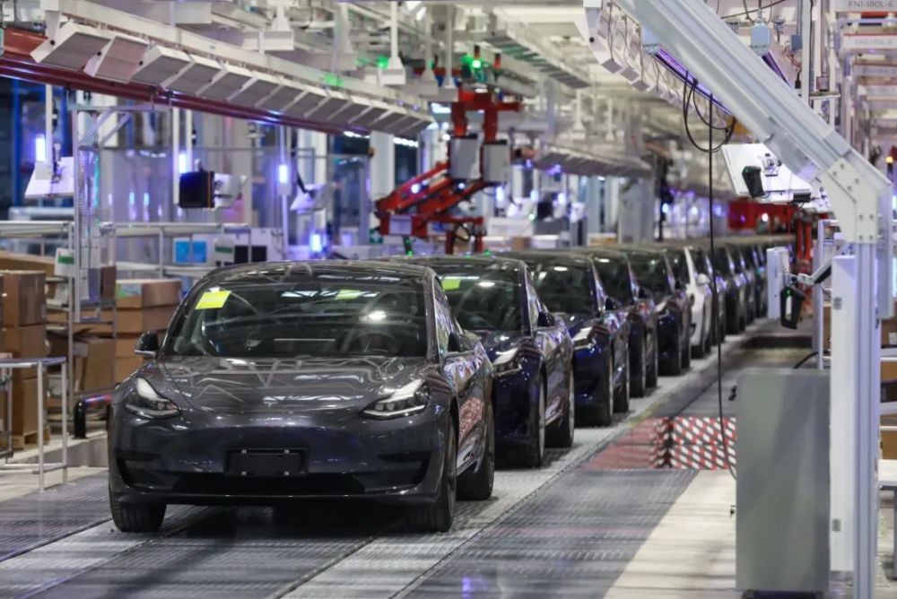
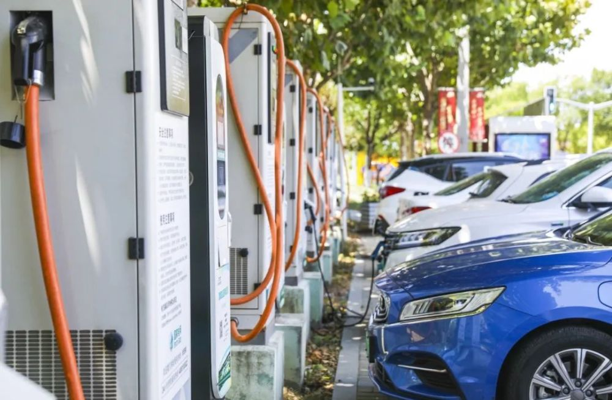

# 燃油车被下“病危通知书”

_头图来源：IC Photo_

近日，兰博基尼卖掉了自己最后一辆内燃机跑车。“所有面向Huracan以及Urus订单已经关闭，不再接受对这两款车型的订购。”这家隶属于大众集团旗下的超跑品牌在7月初对外宣布。

在过去长达一百多年的时间内，燃油车都是汽车工业的“明珠”。但在电动化浪潮下，就连超跑品牌也在给燃油车“判死刑”。这意味着消费者再有钱，以后也无法从兰博基尼下单纯燃油车了。

不仅如此，最近一年可以看到越来越多的传统车企宣布停产燃油车的时间。7月中旬，东风本田宣布，2025年前电动化比例达到50%以上，2027年后不再投放燃油新车；此前也有比亚迪、广汽、长城、长安等都公布了停产燃油车的时间表。

即使燃油车被一些爱好者们狂热追求，但似乎也阻挡不了车企转型电动化的决心。在市场需求仍在的情况下，为何越来越多的车企提前给燃油车下“病危通知书”？这是否意味燃油车的“倒计时”会比大众预想得更快？

**#01**

**不可逆转的趋势**

“想不明白，为什么还有人买油车，这是多怀旧才会买油车。”“决定花40万购买燃油车的用户，很无奈，说得过分一些叫很悲惨。”“这个时代再买燃油车，像智能手机时代买功能机。”近些年，造车新势力掌门人不断地对传统燃油车发起了言论攻击。

从数据看，新能源汽车销量在国内不断攀升。2023年上半年，我国新能源汽车产销量分别达378.8万辆和374.7万辆，同比分别增长42.4%和44.1%，市场占有率达28.3%，提前完成《新能源汽车产业发展规划（2021—2035年）》提出的2025年发展目标。

电动汽车大潮正在改写汽车市场的竞争规则，传统车企也不得不跟进。早在2022年3月，比亚迪就已停止燃油汽车的整车生产；广汽集团初步计划，到2025年停产纯燃油车；到2028年，不再销售纯燃油车；长城汽车旗下哈弗品牌自2030年起全面停售燃油车；长安汽车在2017年就已宣布2025年将全面停售传统燃油车。

国内新能源汽车的高歌猛进也被海外视为威胁。“我们需要快速制造更多的电动汽车。中国已经在全球范围内推出了超过80款电动车型，我们必须跟进，不能把这个关键行业留给其他人”。欧盟委员会副主席弗兰斯·蒂默曼斯在欧洲议会上奋力呼吁。

2月14日，欧洲议会在斯特拉斯堡以340票赞成、279票反对和21票弃权，通过了2035年欧洲停售燃料发动机车辆议案，以此加快向电动汽车的转变。换句话说，只要有发动机的车辆都不能在欧洲27个国家销售，包括HEV、PHEV以及增程式电动车。

 _来源：网络_

“从宏观角度来看，碳中和碳达峰的双碳目标成为不可逆转的趋势。欧美日韩各国制定出了2035年大限，即在这一年里，欧美日韩各国要么不再生产燃油车，要么尾气排放必须为零。坦率地讲，这些国家对燃油车的期限，不可谓不激进。”中国汽车流通协会新能源分会秘书长章弘称。

车企停产燃油车或只是时间问题。大众汽车称，将在2033-2035年间退出欧洲内燃机市场；奥迪则计划从2026年起，只推出纯电动汽车；日产将在除美国以外的所有地区停止开发新的内燃机。韩系车的代表现代宣布关闭内燃机研发中心，大部分人重整成电动车研发团队，少部分继续为现有的内燃机进行技术服务和优化。

与欧盟对燃油车的“一刀切”不同，我国对混动车型存在着一定的包容性，也没有明确颁发具体的禁售燃油车时间表。近些年，主管部门或专家曾多次表态研究禁售燃油车时间表，随即就会引发巨大争议。大众的质疑是，只要充电不便、成本过高等问题没有根本解决，禁售燃油车就不现实。

**#02**

**燃油车正在丢失消费者**

在中国，纯电动车还扛不起重任，但纯燃油车正在丢失消费者。2022年，对比新能源汽车零售567.4万辆，同比净增268.7万辆，燃油车零售1486.8万辆，同比减少230.2万辆。尽管电动车仍有很多弊端，但消费者不得不接受一个现实——未来能买到的纯燃油车越来越少了。

_来源：网络_

首当其冲的是传统车企的燃油车产能过剩。据乘联会数据显示，截至2022年底，车企产能TOP20产能合计为3749万辆，占总量近九成，整体利用率却低于五成。其中，吉利、长城、上汽大众、长安福特、北京现代、悦达起亚等燃油车比重较大的车企，产能利用率均低于四成。

“长安福特削减百万产能”、“广汽三菱长沙工厂停产数月”、“大众、通用在华传统汽车产能到2030年或有三分之一闲置”……今年以来，这类消息屡见不鲜。

绿色和平组织（Greenpeace）日前发布了一份报告，称如果到2030年新能源汽车占新车总销量的40%，那么大众汽车、丰田汽车和通用汽车等十家主流车企，将有三分之一的内燃机汽车产能可能会最终闲置。

全国乘用车市场信息联席会发布的数据显示，2023年6月，中国乘用车新车零售销量中有35.1%是新能源汽车，而主流合资品牌销量中，新能源汽车仅占3.7%。

以往在中国市场呼风唤雨的德系、日系和美系品牌风光不再。比如在德系方面，今年1-6月，南北大众已经失去了全国销量第一的宝座。

近日，上汽大众位于安亭的三座整车厂正进行产线调整：第一工厂（始建于1984年）永久关停，部分产线搬迁至江苏仪征；二厂（始建于1992年）启动合班，将两个生产轮班合并为一班；三厂大概率也将在今年下半年启动合班。这场调整的目的是将需求减弱的燃油车搬到沪外基地，安亭基地则转向新能源车生产。

而在美系方面，上汽通用跌幅超过2位数排名第7；日系的广汽丰田跌出了半年销量榜的前五，而东风本田和广汽本田在中国汽车市场前十名不见踪影。

除了碳中和碳达峰的双碳目标，给燃油车敲响丧钟的还有特斯拉的步步紧逼。知情人士称，特斯拉代表将于本月与印度商务部长会面讨论建厂计划，以生产“目标售价200万印度卢比（约合15万元）的全新汽车”。该人士透露，特斯拉已表示有兴趣在印度建厂，为当地市场和出口生产低成本电动汽车。

实际上，特斯拉今年初引领的降价潮，已经彻底带动国内新能源车企跟进，而这样的现象也让新能源车与传统燃油车的价格差距进一步缩小，进一步加剧了燃油车市场的萎缩。新能源整体降价的现象，对广大消费者而言是一大利好，但对燃油车来说，这也可能是压死骆驼的某一根稻草。

虽然目前特斯拉关于Model
2的具体计划和上市时间还没有公布，关于15万元特斯拉的上市时间还是个谜，但业内人士估计，最多不会超过3年（2027年），纯燃油车企业将在市场上遭受极大痛苦。

_图源：IC Photo_

在近日举办的2023中国汽车重庆论坛上，多位汽车企业掌门人预测了2030年中国市场新能源汽车的渗透率，奇瑞汽车董事长尹同跃最保守，他认为是70%左右，理想汽车总裁兼总工程师马东辉给出的数字是95%以上。标普全球汽车动力总成与合规高级分析师张文娟此前的判断是55%。

**#03**

**让消费者自行选择**

尽管趋势不可逆，多家车企宣布停售燃油车，但这并不意味着燃油车要全面彻底进入历史博物馆。

主要原因是：一、当前的新能源汽车技术还不成熟，最大的短板电池问题始终没有得到解决，车上高速之后或者冬天，出行效率拉低，常常“续航五百当二百五开”。从使用来看，电动车并不能满足所有家庭的需求。

二、目前纯电动车现出来的竞争力并不完全真实，背后有很多支持性的政策，比如免购置税，一些地区可以免费拿到牌照。但随着电车数量的增加，这些政策大概率会在不远的将来退出。乘用车联席会议秘书长崔东树之前就提出“合并蓝绿牌”的建议，那时才能真正看出新能源车的竞争力和市场定位。

_图源：IC Photo_

三、虽然新能源汽车发展得如火如荼，但纵观全球主流新能源汽车企业，能盈利的只有特斯拉和比亚迪，理想近期刚踏入盈利门槛，其它车企都是卖一辆亏一辆。

在电动化转型和盈利压力下，传统车企一个比较现实的应对思路是尽快混动化。

比亚迪通过推出“DM-i”混动技术解决了人们出行难题——短途用纯电，长途用混动，像比亚迪秦PLUS的DM-i
2023冠军版车型，能低至当初燃油车型一样价格。达到的效果也显著，2022年比亚迪的插电混动车型的销量同比增长247%，远高于纯电车型的184%。

 _图源：车市物语摄_

同样的，理想目前产品线单一，只有SUV、没有轿车，只有增程、没有纯电，但在刚刚过去的2023年Q2，理想汽车交付量达8.65万台，比蔚来+小鹏两家之和高了将近一倍。

长安汽车董事长朱华荣曾在2022世界新能源汽车大会判断，“中国汽车产业已经初步具备了停售燃油车的条件，停售燃油车可以纳入研究议事日程。”但他很快补了一句：“插混和增程是要持续的，停售纯燃油车的事情可以研究了。”

只要“未来的大趋势”是纯电动车，那就让消费者自行选择。而对于车企而言，背后则是商业和利益，他们更倾向于禁燃油车，而不是禁“油箱”，保留混动/增程车，这样既享受了电动化舆论热点的红利，又给自己转型留有余地。

当然，只要充电便利，纯电动汽车仍具有明显优势。电动车使用成本较之燃油车便宜，驾乘体验便捷舒适，与智能化功能天然适配，消费者也会倾向于购买智能化体验更好的纯电动汽车。

总之，新能源汽车要从销量上打败燃油车，并取而代之，一定是个漫长无比的渐进式过程。一个产品的好坏，要让市场本身去验证。燃油车不该终结于政策，而应该交给市场，遵从消费者的个人选择。

