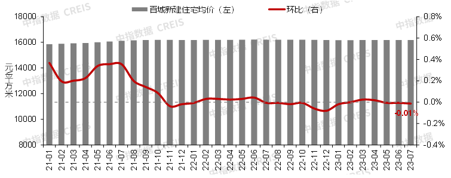
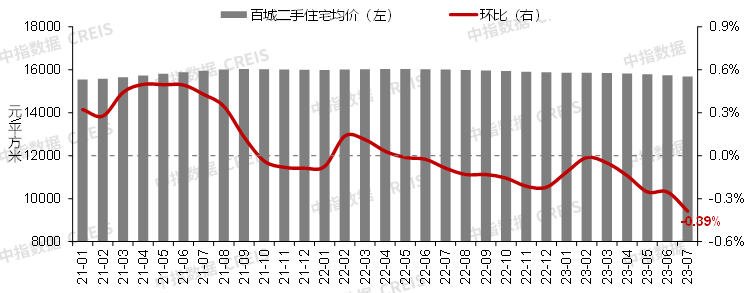

# 7月百城一二手房价均下跌，二手房价格环比已连降15个月

8月1日，根据中指研究院发布的《百城价格指数报告》，7月，百城房价继续下跌，其中，二手房价格已连续15个月环比下跌。

根据《百城价格指数报告》，7月份，百城新建住宅平均价格为16177元/平方米，环比下跌0.01%，跌幅与上月持平；同比跌幅继续扩大至0.17%。百城二手住宅平均价格为15685元/平方米，环比下跌0.39%，已连续15个月环比下跌，跌幅较6月扩大0.14个百分点；同比跌幅扩大至2.04%。

中指研究院指出，从市场表现看，7月重点城市新建住宅整体推盘量较6月减少，多数城市楼市交易呈持续疲软态势，新房供需两端均表现低迷。二手住宅方面，部分城市二手房挂牌量仍处高位，业主主动降价以促进成交，二手房价格跌势加深。

从房价涨跌城市数量看，根据中国房地产指数系统百城价格指数，7月份，百城新房、二手房价格环比下跌城市数量分别为45个和96个，其中，二手房价下跌城市数量连续2月突破90城。

具体而言，7月份，各梯队城市新房价格表现各异。具体来看，一线城市新房价格环比上涨0.02%，北京、上海和广州均受高于城市均价项目入市带动，新房价格实现微幅上涨；二线及三四线代表城市新房价格环比跌幅分别扩大至0.02%和0.04%。

_图：2021年1月至2023年7月百城新建住宅价格及环比变化_

按照中指研究院数据，2023年7月，新建住宅价格环比上涨城市个数为35个，较6月减少2个。具体来看，西安新建住宅价格环比上涨0.06%；成都、宁波新房价格环比均上涨0.05%；北京、杭州等32个城市新建住宅价格环比涨幅均在0.05%以内。7月，泰州、宿迁等20个城市环比持平。

2023年7月，新建住宅价格环比下跌的城市个数为45个，下跌城市数量与上月持平。具体来看，哈尔滨、扬州新建住宅价格环比跌幅较大，分别为0.48%和0.34%；长春、重庆（主城区）等10个城市跌幅均在0.1%（含）-0.3%之间；郑州、威海等33个城市跌幅在0.1%以内。

从同比情况看，2023年7月，新建住宅价格同比下跌的城市个数为79个。哈尔滨、中山等6个城市跌幅均在2.0%（含）-5.0%之间，其中哈尔滨跌幅最大，为4.83%；芜湖、株洲等14个城市跌幅均在1.0%-2.0%之间；桂林、威海等29个城市同比跌幅在0.5%-1.0%之间；菏泽、汕头等30个城市跌幅则均在0.5%以内。

_图：2021年1月至2023年7月百城二手住宅价格及环比变化_

二手住宅方面，7月，各梯队城市二手房价环比显著下跌且跌幅均扩大。具体来看，一线城市二手房价格环比下跌0.24%，跌幅较6月扩大0.11个百分点，北京和深圳二手房价持续回落；二线及三四线代表城市二手房价格环比分别下跌0.43%和0.39%，跌幅分别较6月扩大0.16个百分点、0.09个百分点。

7月份，二手住宅价格环比上涨的城市个数为4个，较上月减少4个。具体来看，三亚涨幅最大，为0.34%；北海、衡水、秦皇岛涨幅均在0.1%以内。二手住宅价格环比下跌的城市个数为96个，较上月增加5个。具体来看，盐城跌幅最大，为1.17%；温州、芜湖等36个城市跌幅在0.5%-1.0%之间，苏州、连云港等50个城市跌幅在0.1%-0.5%之间，济南、邯郸等9个城市跌幅相对较小，在0.1%以内。

同比而言，7月份，二手住宅价格同比下跌的城市个数为88个，较上月增加5个。盐城、淮安等14个城市二手住宅价格跌幅在5.0%以上，其中盐城跌幅最大，为7.85%；昆明、哈尔滨等27个城市跌幅在3.0%-5.0%之间，西安、湘潭等30个城市跌幅在1.0%-3.0%之间；成都、天津等17个城市跌幅在1.0%以内。

中指研究院指出，在中央政治局会议定调房地产供求新形势，住建部释放积极信号的背景下，近期各地楼市支持政策出台节奏有望加快，政策力度有望加大。考虑到目前普通二线和三四线城市楼市限制性政策已基本放开，未来政策优化的空间主要在核心一二线城市，政策优化方向或涉及优化认房认贷、下调首付比例及贷款利率、降低交易税费、放松区域限购等多个方面。未来，若核心一二线城市政策能及时优化调整，短期内楼市恢复节奏有望加快。

