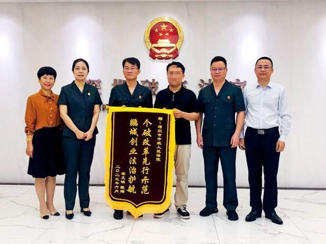

# 中国第一个被允许破产的个人，还完债了

6月20日，深圳市中级人民法院深圳破产法庭庭长曹启选将一份民事裁定书递到了梁文锦手中。

“今天向你送达民事裁定，依照《深圳经济特区个人破产条例》（下称《条例》）的规定作出裁定，免除你对债权人在重整计划载明的债务范围内未清偿债务的清偿责任。”曹启选说。

这是中国境内首宗个人破产案件，也是首宗执行完毕的个人破产重整案件。曹启选回忆说，2021年4月他在法庭上首次对梁文锦进行面谈辅导时，梁文锦“低着头，脸色蜡黄，没有笑容”，这次他“胖了一些，人也非常精神”。

今年37岁的梁文锦是一名工程师，2020年创业失败后，背负上76万元债务，并被多次催债。2021年3月1日，被称为保护“诚实而不幸的债务人”的《条例》施行，9天后，他向深圳中院申请，想通过“个人破产”的方式缓解经济压力。

根据梁文锦与债权人达成的个人破产重整计划，他只需归还借款本金，在3年内分期还清，债权人可为其免除其余的利息和滞纳金。最终，他比约定时间提前15个月完成了计划。

中国政法大学破产法与企业重组研究中心主任李曙光曾参与《企业破产法》《国有资产法》等立法起草工作，他告诉《中国新闻周刊》，在我国传统文化中，对破产尤其是对个人破产的认知还存在误区，很多人“谈破色变”，甚至对个人破产污名化，“从这起全国境内首宗个人破产重整案件在深圳顺利执行完毕看，在我国推行个破制度是切实可行的”。

**从被催债到“个破案第一人”**

从创业到债务缠身，只有一年半。2018年6月，已在深圳打拼10年的梁文锦不想过一辈子打工人的生活，计划创业。他学工业设计，此前一直从事消费电子类产品的设计工作，还拥有两项设计相关的专利。

2019年3月，他和前同事成立了深圳某科技有限公司，希望开发出具有创新专利的蓝牙耳机产品。五个月后，他带着产品去香港参展，但客户寥寥无几。他一边完善产品，一边在2020年增加了对额温枪的开发，但市场反应仍不理想。

梁文锦是典型的技术思维，他以为把产品设计好就行了，对后续的销售和推广等工作没有太费心思。再加上疫情的影响，公司逐渐举步维艰。2020年9月，成立仅一年半的公司倒闭，梁文锦背上了债务，并逐渐滚雪球般增加。

梁文锦告诉《中国新闻周刊》，为解决公司运营资金问题，他向金融机构贷过款，先后办理了八张信用卡，也向亲朋好友借过钱。公司倒闭后，亲友体谅他，但金融机构的压力立刻来了。一些自称代表某金融机构的人给他打电话催债，“几乎每隔一两天，我就会收到一个账单，压力特别大”。

2020年10月，梁文锦找到一份新工作，仍然是消费电子行业，他担任公司的产品结构设计工程师。

工作以后，催债电话依然源源不断，有时一天有七八个。他不敢在办公室接听，但又怕不接的话，这些人会找到单位，被领导知道，导致丢工作。

2个月后，他迎来一个机会。2021年3月1日起，《条例》施行。其中规定，在深圳经济特区居住，且参加深圳社会保险连续满三年的自然人，因生产经营、生活消费导致丧失清偿债务能力或者资产不足以清偿全部债务的，可以依照本条例进行破产清算、重整或者和解。

9天后，梁文锦向深圳中院申请，尝试通过“个人破产”的方式缓解危机。因为个人破产还是新生事物，梁文锦分不清《条例》中提到的破产清算、重整、和解的区别，他申请的是破产清算。

破产法庭的法官了解到，梁文锦创业失败后很快找到了工作，说明他有就业能力。每月工资2万元上下，收入也比较稳定。同时，他也有较强的偿债意愿。因此，法官告诉他，相比破产清算，他其实更适合走破产重整程序。

李曙光告诉《中国新闻周刊》，选择破产清算，意味着被法院裁定后，其全部债务可能被“一笔勾销”，这往往是债务人走投无路、未来很长一段时间都看不到转机才被迫走的一步棋。破产清算对个人信用影响很大，许多机构、个人可能都不再愿意与其合作。

而破产重整的债务人，虽然也有沉重的负债压力，但能在较短时间内看到转机，债务人可以在法院批准其重整方案后，在一定期限内按方案每月按期归还部分债务。李曙光说，本案中，梁文锦如果在有稳定收入的前提下，仍然选择破产清算，别人恐怕会怀疑他在逃债。

2021年4月27日，梁文锦向法院提交了《变更个人破产类型申请书》，将申请个人破产清算变更为申请重整。法院审理查明，截至破产申请提出当日，他的债务总额约76万元，自身仅有36120元存款、4719.9元住房公积金，无房产、车辆等大宗财产，每月有固定收入。

5月11日，深圳中院裁定受理梁文锦个人破产重整一案，并指定广东经天律师事务所担任梁文锦破产管理人。管理人，即破产案件中，在法院的指导和监督之下负责办理清理债务人债权债务，接管、调查、处置、分配债务人财产，监督重整计划执行等破产事务的中介机构。

经天律所是广东省高级人民法院破产案件管理人名册中的机构管理人之一，该所合伙人、律师杜艳芝是该案的管理人负责人。杜艳芝告诉《中国新闻周刊》，个人破产不比企业破产难度小。企业作为经济实体，经过工商登记注册，有严格的财务制度、审计程序，基本情况看得见摸得着。自然人财务状况就没有那么透明了，个人财产申报的“误差”不容易被发现。而且个人破产除了涉及商法关系，还有很多民法关系需要处理，比如分家析产、离婚结婚、遗产继承等，增加了财产调查处理难度。

2021年5月，接手该案后，她和同事去梁文锦家走访、核查相关财务状况。当时梁家“很压抑”，“那天，我们去他家，梁文锦的母亲和妻子自始至终没说一句话，愁容满面。梁文锦情绪也很低落。他正在读小学的子女都很懂事，主动下楼来接我们”。

该案主办律师刘胜军是《广东省破产案件管理人名册》中深圳地区个人管理人之一，全程参与办理该案。他向《中国新闻周刊》回忆，当时，梁文锦一家五口租住在龙华区35平方米的房子里。他每天早出晚归，坐公交车通勤，全程一小时。

管理人多次上门，核实梁文锦夫妻二人银行流水、房屋租赁合同、两个孩子的学杂费单据等。全面调查后，他们发现调查结果跟梁文锦申请个人破产时的描述是相吻合的。

按照《条例》，个破案件被法院裁定受理破产申请之日起停止计息，但也要对债务人做出《限制消费行为决定书》。

根据规定，除确因生活和工作需要并经法院同意外，梁文锦不得有下列消费行为，包括乘坐交通工具时，选择飞机商务舱或者头等舱、列车软卧、轮船二等以上舱位、高铁以及其他动车组列车一等以上座位；在夜总会、高尔夫球场以及三星级以上宾馆、酒店等场所消费；供子女就读高收费私立学校等。

梁文锦的情况都明晰了，管理人将重点工作转到了债权人身上。

 _管理人律师到梁文锦（左二）家中走访，核查了解情况。图/受访者提供_

**说服债权人**

在个破重整案件中，管理人协助债务人制作偿债方案，即重整计划草案，需提交债权人会议表决。

2021年6月22日，深圳中院组织召开梁文锦个破案的第一次债权人会议。在会上，管理人对梁文锦的重整计划草案进行了解读，并对其偿债方案和偿债能力进行了分析。假如梁文锦选择破产清算程序，债权人的受偿率约为31％，如果选择破产重整程序，债权人的受偿率约89％。显然重整程序更为有利于债权人，亦是债务人诚信的直接体现。

另外，根据《条例》规定，他可以要求在五年内清偿债务，但梁文锦一心想还清欠款、尽快解脱，他提出要在三年内还清所有的借款本金。

曹启选告诉《中国新闻周刊》，在《条例》施行的第一个月，深圳中院收到了263宗个破案件的申请，大多数申请人提交的材料不齐、申报的信息也有很多遗漏，他们经过认真筛查，选择了申报信息、提交材料比较全面，且因创业导致负债的12名申请人进行了面谈辅导。“12名申请人都是我进行面谈辅导的，梁文锦是其中一名申请人。经过面谈，法院受理了5件破产申请。在这5件案件中，仅有梁文锦案进展顺利。他和他的家属积极配合法院和管理人的调查工作，特别是他提出的三年内还清本金的重整方案诚意十足。”

按照重整计划，梁文锦将在三年内偿还借款本金（大约67.5万元），所有利息（大约8.5万元）被免去。如果不能按重整计划执行，债权人依法有权向其追索未归还的所有借款本息，其提出破产申请后的利息也还要继续计算。

根据《条例》规定，个人破产重整计划草案要经过债权人会议的表决，出席会议的债权人过半数同意重整计划草案，并且其所代表的债权额占该组债权总额的三分之二以上的，即为通过重整计划草案。债权人会议通过的重整计划草案，还要报法院审查批准，才能生效。

刘胜军说，第一次债权人会议召开时已经审查确认10家债权人的债权，9家债权人到场参会，其中有8家债权人对重整计划草案投票赞成，代表的债权额超过90％。“因为重整计划草案获得一次性表决通过，所以该案只召开了一次债权人会议。”

他告诉《中国新闻周刊》，会后，那家未投赞成票的债权人也主动表示赞成。事实上，也可以理解成全票通过重整计划草案。后来，又有共5家债权人向管理人补充申报债权。据了解，该案中的15家债权人均为金融机构。

刘胜军说，深圳的个破条例在我国境内尚属首次，而该案作为境内首宗个人破产案件，债权人尚需一个理解消化过程。一开始有的债权人对免除利息的债务有所犹豫，但通过对债务人偿债能力的分析，多次沟通交流后，债权人亦都能逐步理解，重整计划草案所列的偿债方案对债权人是最为有利的选择。

杜艳芝说，在该案的债权人中，除了深圳当地的银行，还涉及四川、山东、重庆等外省银行。她联系某省一家银行时，该行一位负责人表示，该行所在的城市没有个人破产条例，不受深圳的《条例》拘束，“他们不理解，我就多次打电话过去沟通交流，慢慢地他们的态度也发生了转变，后来他们觉得这个方案可以更好地维护债权人权益后，就开始配合了”。

不过，李曙光表示，在个破案件中，如果管理人把证实债务人符合个破条件的所有信息都出示了，债权人还是不同意债务人进入破产程序，也会反过来影响债权人的信用。在这种情况下，法院可以强制裁定。

2021年7月16日，深圳中院发布公告，裁定批准梁文锦的个人破产重整计划。根据该重整计划，未来三年，梁文锦夫妻除了保留基本生活费之外，其他收入均用于偿还债务。

梁文锦一家五口人，母亲、妻子和两个小孩，每月需支出1900元房租水电费、2500元家庭生活费、700元孩子生活费、1300元本人生活费等。另外，梁文锦身体不好，还需要支出大额医疗费。

根据《条例》规定，如果梁文锦不执行重整计划，债权人还有权向法院申请对其进行破产清算。曹启选说，“个破制度目的就是救助诚实而不幸的债务人，不会允许债务人故意不执行法院已批准的重整计划而让他恶意拖延还债的情况发生。出现不执行或不能执行重整计划的情况，重整计划无法执行的，法院会裁定终止执行。”

不过，《条例》也考虑了债务人可能出现因客观原因不能如期还钱的特殊情况。假如梁文锦因公司晚发三个月工资没法及时还债，法院也会允许他推迟三个月还债，但要补偿债权人的相应损失。

梁文锦的重整方案通过后，他的消费限制也被取消了。曹启选介绍，“《条例》规定，法院依法批准重整计划后，应解除对他的消费行为限制，这是为了便于债务人工作，顺利执行重整计划，尽快实现经济再生。”

广发银行股份有限公司深圳分行的委托代理人毕扬参加过梁文锦案的债权人会议。毕扬告诉《中国新闻周刊》，通过法院对梁文锦的破产条件进行调查，广发银行也认为梁文锦属于“诚实且不幸的”债务人。基于此，银行愿意给予其一次（经济重生）的机会。

她还表示，在涉及信用卡逾期的案件中，银行即使按照法院的诉讼程序去起诉执行，最终能清偿的概率也很小。从信用卡不良诉讼案件来看，很多信用卡持卡人逾期后会处于失联状态，这让银行更被动。因此，破产重整方案对债权人与债务人来说是双赢的。

_梁文锦（右三）给深圳中院送来锦旗。图/受访者提供_

**提前15个月脱离泥淖**

从2021年7月该案进入重整计划执行阶段，梁文锦过上了按时还款的日子。每个月，他都要将收入、支出、偿债情况等在“i深圳”App上填报，深圳市破产事务管理署予以指导和监督，管理人每月进行核实。

梁文锦说，进入还款计划后，他的心理压力一下子小了很多，催债电话不再轮番轰炸，他的日子终于又有了奔头。

因单位工资有了大幅度的提高，2023年4月14日，他清偿了所有的债权本金，比原计划提前了足足15个月。当时，他的账户只剩下不到500块钱，但因为没有债务压力了，他反而生出了一种无法言说的感觉。

6月20日，深圳中院依法裁定免除他剩余未清偿的利息和滞纳金。至此，“全国境内首宗个人破产案件”画上了句号。从各个角度看，该案形成了多赢的局面。

按照个破条例，法院受理债务人的破产申请后债权即停止计息。此前，梁文锦因负债产生的利息和滞纳金已有约8.5万元，重整计划执行完毕后，法院裁定免除了这部分欠款的清偿责任。刘胜军给他算了一笔账，如果不停止计息，如今梁文锦将再产生超过30万元的利息和滞纳金。如果没有个破制度，他的债务越来越重，不但个人难以翻身，而且还会拖垮整个家庭。

梁文锦也感慨，如果没有《条例》，他恐怕会很难脱离债务泥淖。“以后如果有机会，我还会创业。毕竟现在有了这些遭遇后，已变得更加成熟，也积累了更多的工作经验。即便再次失败也不会让家庭陷入困境。”

而从债权人的角度看，深圳破产法庭法官张睿告诉《中国新闻周刊》，梁文锦的案子也给了债权人信心，毕竟他们在这么短的时间之内，取得这么高的债权回收率。今后对于个人破产重整类案件，债权人应该会给予更大的支持。

曹启选说，在重整案件中，债务人如果愿意偿还借款全部本金，重整计划草案就能较快得到债权人会议的表决通过。目前深圳中院已裁定批准的重整计划，债务人的重整计划草案都是清偿100％的借款本金，分期偿还债务。

2023年6月，深圳破产法庭公布《关于审理个人破产重整案件的工作指引》。其中提到，在个人破产重整案中，债务人已按照重整计划清偿债务且法院准许免除其未清偿债务的，经债务人申请，法院可以向征信管理部门出具诚信履约证明，推动债务人信用修复。

这意味着梁文锦的个人信用可以被修复。不过，曹启选说，深圳试点期间，征信管理部门对个人破产信用修复的规定尚属空白。在重整计划执行完毕并且裁定免责后，法院仍需要推动这项工作，“需要征信管理部门和债权人等方面的支持”。

另外，从梁文锦以及法院收到的更多申请来看，破产风险监测和前端债务纾困工作仍然缺位。梁文锦先后办理了八张信用卡，“借新还旧”加大债务窟窿。事实上，他在达到法定破产条件前，已陷入经济困境一段时间。法院只能在其申请破产后提供救济措施，难以事前主动去施加影响。

曹启选介绍，很多国家建立了通过破产行政职能机构主导的破产风险监测机制，并提前开展债务纾缓工作。如法国设立了独立的过渡负债委员会，该机构负责甄别困境中的债务人，记录他们的债务清偿申请，开展破产程序前的庭外债务磋商机制，促进债权人、债务人等多方共赢局面。

目前，深圳破产事务管理署还处于试点摸索阶段，尚未开展破产风险监测和前端债务纾困工作。“这项工作在全国层面推开个人破产制度时，就更有意义。建议相关部门充分调研，积极推动改革探索。”曹启选说。

不过，该案的执行完毕仍然有着极大的意义。刘胜军说，个人破产立法传导的是自然人的诚信理念，一个“诚实而不幸”的债务人陷入困境后，需要一个制度让他们得到喘息的机会。个破制度就为他们开辟了这样一条路，并设置了栏杆，债务人须小心谨慎不去翻越栏杆，积极地走完这段路，最终完成蜕变重生。

刘胜军说，每个自然人都是社会的细胞，如果他们因某些遭遇导致负债，社会需要给他们一个解决路径，否则会让这部分人长期处于恶性循环中，反而加大社会治理成本。

他认为，当这些“诚实而不幸”的债务人回归正常生活后，社会个体得到了拯救和激活，长期来看大大降低了整个社会的治理成本。这是政府、司法、债权人等对他们创业失败持宽容态度的体现，某种程度上说改善了营商环境，在制度上给他们提供了“售后服务”的保障。

曹启选也表示，深圳民营经济发达，小微企业和个体户众多，创业有成功也有失败。梁文锦的案例，可以让社会各界充分理解这个制度。法院裁定免除债务人的部分负债不是无条件的，要根据债务人的“诚实”表现，以及是否已通过努力清偿债务获得债权人的谅解。

“希望这个制度能够不断完善，让有需要的债务人可以通过这个制度及时处理债务问题，从困境中解脱出来，让制度发挥其最大的价值。”曹启选说。

发于2023.7.31总第1102期《中国新闻周刊》杂志

杂志标题：全国境内首宗个人破产案始末

作者：周群峰

