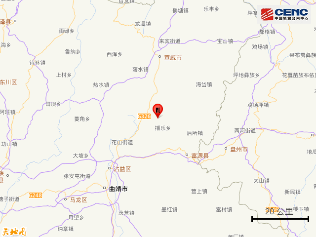
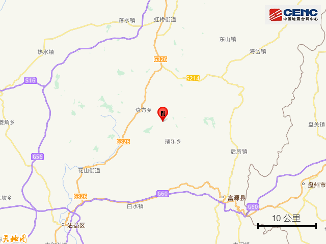
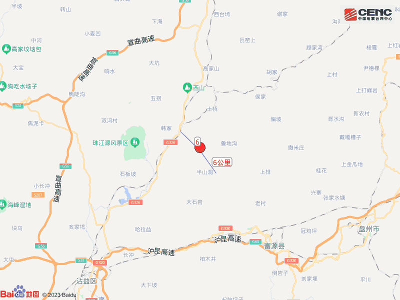
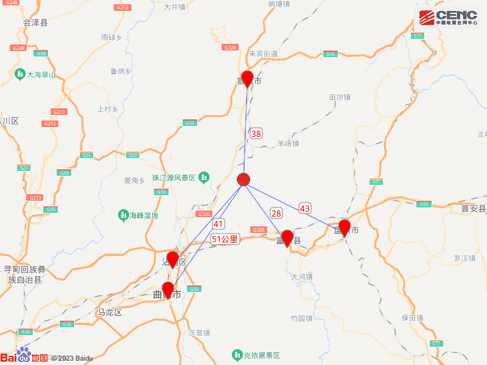
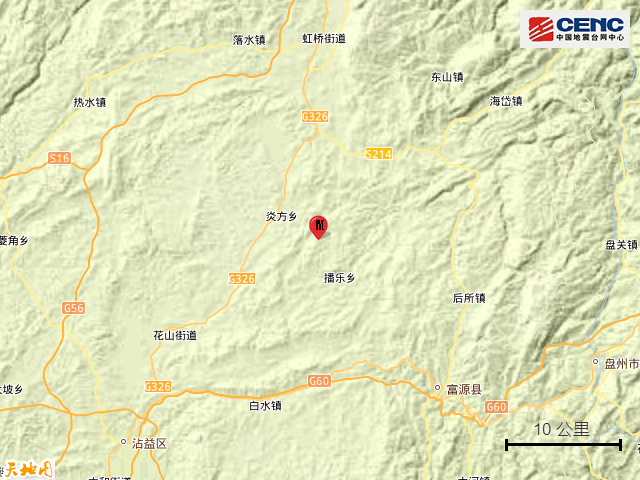
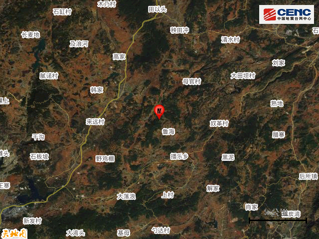
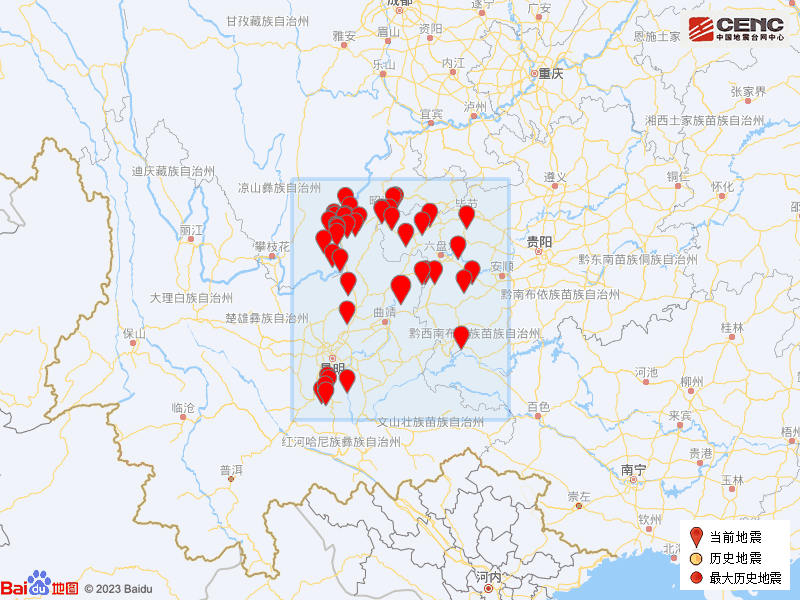

# 云南曲靖市沾益区发生4.4级地震

据中国地震台网正式测定，8月1日1时56分在云南曲靖市沾益区发生4.4级地震，震源深度9公里，震中位于北纬25.88度，东经104.09度。

本次地震周边5公里内的村庄有豹子槛、被卡、鸭团村、老撇坡、鲁海、张发村、团山村、上庄子、麦地北村、小口子，20公里内的乡镇有炎方乡、播乐乡。

震中距富源县28公里、距宣威市38公里、距沾益区41公里、距贵州盘州市43公里、距麒麟区51公里，距曲靖市52公里，距昆明市167公里。

震中5公里范围内平均海拔约2166米。

根据中国地震台网速报目录，震中周边200公里内近5年来发生3级以上地震共52次，最大地震分别是2020年5月18日在云南昭通市巧家县发生的5.0级地震（距离本次震中172公里）和2018年8月14日在云南玉溪市通海县发生的5.0级地震（距离本次震中234公里），按震级大小前50次历史地震分布如图。

