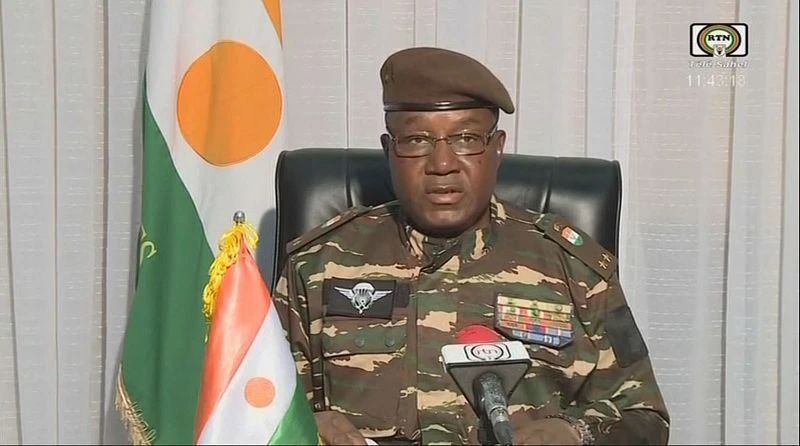
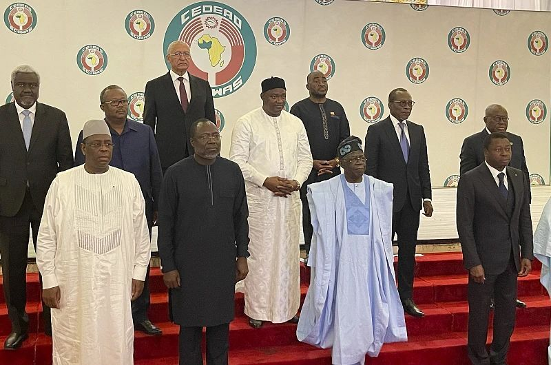
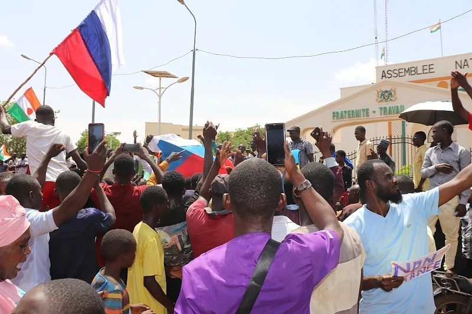

# 在政变、示威、武力威胁背后，多方势力搅入尼日尔乱局

自总统被扣押、政府被军人推翻后，非洲国家尼日尔“乱成了一锅粥”。西非国家经济共同体（西共体）警告尼日尔政变军人在一周内交权，否则不排除武力干预。尼日尔政变军人还指责法国试图军事介入该国局势，但遭法国否认。分析人士担忧，尼日尔陷入乱局，可能为当地“圣战者”的发展提供间隙。

**曾挫败政变的总统卫队发动了政变**

尼日尔是西非一个内陆国，面积约127万平方公里，目前人口约2500万。直至1960年，尼日尔才从法国的殖民统治中获得独立。之后的数十年间，尼日尔几乎一直困于政变循环之中，该国的政体多次在军政权和共和国之间摇摆。

2010年，随着新宪法颁布，尼日尔进入第七共和国时期，一年后，穆罕默杜·优素福（Mahamadou
Issoufou）被选为尼日尔第七共和国第一任总统。2021年，穆罕默德·巴祖姆（Mohamed Bazoum）当选新一任总统。

就在巴祖姆宣誓就职的前两天，尼日尔首都尼亚美发生了一场未遂政变。2021年3月31日，尼日尔总统府附近传出了枪声，一支驻扎在尼亚美的部队试图冲击总统府。尼日尔总统卫队挫败了政变企图，并逮捕了多名参与政变的人士，巴祖姆在两天后顺利就职。巴祖姆也成为了尼日尔首位和平权力交接的总统。

_当地时间2023年7月28日，尼日尔总统卫队负责人奇亚尼通过国家电视台宣布自己为尼日尔“新领导人”。图/视觉中国_

讽刺的是，曾经挫败政变的总统卫队在两年后成为了另一场政变的主角。当地时间7月26日，部分总统卫队军人扣押巴祖姆。当天深夜，政变军人宣布解除巴祖姆总统职权，暂停第七共和国宪法，由军政权接管国家事务。总统卫队负责人阿卜杜拉赫曼•奇亚尼（Abdourahamane
Tchiani）将军宣布自己为尼日尔的“新领导人”。

外界对奇亚尼知之甚少。他50多岁，自2011年起领导总统卫队。这支总统卫队的规模达700人，且装备精良。“他在军人圈子之外不太出名，属于幕后人物，非常有权势。”国际危机组织的研究人员Ibrahim
Yahaya Ibrahim说。

奇亚尼与尼日尔前总统优素福的关系密切，他受优素福任命成为总统卫队负责人。巴祖姆继任后，继续让奇亚尼担任同一职务。但是，最近几个月，巴祖姆和奇亚尼的关系恶化。

据法新社援引消息人士的说法称，巴祖姆最近正在考虑找人替代奇亚尼的职务。奇亚尼则开始避免出席公开活动，而让他的副手阿马杜·阿巴斯特拉内（Amadou
Bacharou）上校代表他参加活动。阿巴斯特拉内随后也成为军政府主要成员之一。

政变第二天，尼日尔陆军司令部发表声明，宣布支持总统卫队发动的政变。陆军司令部在声明中称，其首要任务是避免破坏国家稳定，并确保总统及其家人的安全，同时避免“致命冲突和血腥屠杀”。尼日尔外交部长哈苏米·马苏杜（Hassoumi
Massoudou）同日通过社交媒体表示，并非所有军队都参与了政变，他呼吁“民主人士和爱国者”挫败政变。

**西共体发出警告，不排除武力干预**

在尼日尔发生政变当天，数百名抗议者走上尼亚美街头，高喊“不要政变”。“我们对政变不满，军人不能就这样夺取权力。”一名抗议者称。在抗议人群接近总统府时，总统府传出枪声驱散了人群。据美联社报道，现场传出多轮枪声，但没有见到人员伤亡。

在政变第二天，尼亚美再次发生示威活动，但这次的示威者支持政变。7月30日，数千名支持政变的示威者再次聚集，但这次的示威主题变成了“反对法国”。

“这或许是尼日尔史上最令人困惑的时刻，一切发展得太快了，现在很难知道是谁在掌控局势，有很多截然不同的声音。”《德国之声》记者阿玛卡·奥克耶（amaka
okoye）对此表示。

与此同时，越来越多的外部势力开始卷入尼日尔局势。

_当地时间2023年7月30日，尼日利亚阿布贾，西共体领导人合影。图/视觉中国_

当地时间7月30日，西共体在尼日利亚首都阿布贾召开紧急会议，要求尼日尔政变军人在一周内释放遭扣押的总统巴祖姆并恢复其总统职权。尼日尔为西共体15个成员国之一。

西共体发表声明称，相关要求如在一周内得不到满足，西共体将采取一切措施恢复尼日尔的宪法秩序，“这些措施中包括使用武力。”西共体还称，相关军事负责人将立即会面，制定干预计划。

据BBC报道，西共体上一次批准军事干预是在2017年。当时，冈比亚时任总统贾梅在败选后拒绝交权，西共体进行干预，以塞内加尔军队、尼日利亚军队为首的西共体联军开入冈比亚，迫使贾梅进行了权力交接。

西共体还对尼日尔实施严厉制裁，制裁措施包括关闭西共体成员国与尼日尔之间的空中和陆地边界，禁止商业航班往来尼日尔，暂停西共体成员国和尼日尔之间的商业和金融活动，冻结尼日尔政府和国有企业在西共体央行以及相关商业银行的资产，对参与政变的军人及相关人员实施旅行禁令并冻结他们的资产等。

乍得总统穆罕默德·伊德里斯·代比（Mahamat Idriss
Deby）7月30日作为西共体特使到访尼日尔，分别会见了巴祖姆和奇亚尼。但西共体和尼日尔尚未开展正式谈判。

奇亚尼此前曾发表声明警告西共体和西方国家不要介入尼日尔局势。“我们再次对西共体和其他企图采取冒险措施的势力重申，我们坚决保卫祖国。”奇亚尼说。

在西共体发出警告之后，同为西共体成员国的布基纳法索和马里7月31日发表联合声明称，对尼日尔的任何军事干涉将被认为是“对布基纳法索和马里宣战”。

布基纳法索和马里是尼日尔的邻国，马里在2020年和2021年发生两次军事政变，布基纳法索在2022年发生两次军事政变，目前两国均由过渡政府执政。

**反法势力抬头，法国大使馆受冲击**

据法新社报道，7月30日，部分在法国驻尼日尔大使馆外围抗议的示威者高喊，“打倒法国”。另有人喊，“俄罗斯万岁”，“普京万岁”。一些示威者当场焚烧了法国国旗，并挥舞起俄罗斯国旗。一些人对大使馆的围墙纵火，并试图进入使馆。示威人群最终被催泪瓦斯驱散。

据英国广播公司（BBC）报道，尼日尔、布基纳法索和马里以前均为法国殖民地，在独立之后，这些国家仍存在着大量法国利益和法国驻军。但是，近几年，这些国家部分民众的反法情绪高涨，他们认为法国没有采取足够措施来帮助他们实现安全和发展。

在布基纳法索和马里发生军事政变后，法国与这两个国家的关系恶化。法国从布基纳法索和马里撤出驻军，并将尼日尔作为在该区域的军事总部。与此同时，马里政府则欢迎俄罗斯雇佣兵进驻，帮助该国打击“圣战者”势力。布基纳法索也提升了与俄罗斯的关系。

巴祖姆则被认为是一名亲西方的政治人物，尤其与法国保持良好关系。在巴祖姆执政时，政府多次禁止或镇压国内的反法抗议活动。2022年，巴祖姆批准法国原来在马里的驻军重新部署到尼日尔。此举在尼日尔引发抗议。

2022年8月，尼日尔M62运动成立，他们抗议生活成本上升、治理不善和法国在尼日尔的军事存在。但该组织领导人阿卜杜拉耶·赛杜 (Abdoulaye
Seydou) 于 2023 年 4
月因“扰乱公共秩序”被判入狱九个月。巴祖姆被政变军人扣押后，M62运动重新抬头。BBC称，M62运动和其他较小的民间团体共同组织了7月30日反对法国的示威活动。

_当地时间2023年7月30日，尼日尔尼亚美，尼日尔人举着俄罗斯国旗参加游行。图/视觉中国_

俄罗斯《观点报》7月30日称，尼日尔的示威者高喊反法口号，并挥舞着俄罗斯国旗，这让法国人感到痛苦。不过，俄罗斯政治学家谢尔盖·斯坦科维奇称，俄罗斯与尼日尔正在发生的事情无关，在尼日尔军事政变问题上，俄罗斯的态度与非洲联盟保持一致，非盟反对一切暴力夺权。

尼日尔政变军人7月31日更是指责法国试图军事干预尼日尔局势。据路透社报道，作为政变策划者之一的阿巴斯特拉内7月31日在国家电视台表示，被推翻的尼日尔政府已授权法国对总统府进行打击，以使总统巴祖姆获释。

另外，阿巴斯特拉内还表示：“在一些尼日尔人的共谋下，法国与尼日尔国民警卫队参谋长举行了一次会议，寻找军事手段介入尼日尔局势的方法。”

法国否认上述说法。不过，法国外长卡特琳·科隆纳(Catherine Colonna)近日表示，巴祖姆仍然有可能重新掌权。

**“这将给恐怖分子在该地区扩张提供更多空间”**

观察人士认为，尼日尔政局陷入混乱，可能给频繁滋扰当地的极端主义和恐怖主义势力提供发展空间。

尼日尔的蒂拉贝里大区是一片广袤的干旱地区，面积相当于韩国的大小。这片区域是尼日尔受“圣战者”攻击最严重的地区。据法新社报道，蒂拉贝里大区已连续8年受到与“基地”组织、“伊斯兰国”有关的武装分子袭击以及其他“圣战者”的袭击。据联合国统计，蒂拉贝里大区约有15万人流离失所。

联合国秘书长特别代表兼西非和萨赫勒办事处主任莱昂纳多·桑托斯·西芒（Leonardo Santos
Simao）表示：“尼日尔在打击恐怖主义方面发挥着关键作用。如果尼日尔停止扮演这一角色，这将给恐怖分子在该地区扩张提供更多空间。”

另外，国际制裁恐怕令尼日尔陷入更大的困境。尼日尔经济依赖国际援助。据国际可再生能源机构的数据，尼日尔约90%的电力依赖从邻国尼日利亚进口。

7月29日，法国宣布暂停所有对尼日尔的发展援助和预算支持。另外，西共体、欧盟、美国宣布对尼日尔实施经济制裁或暂停援助。

尼日尔总理乌胡穆杜·穆罕默杜（Ouhoumoudou
Mahamadou）7月30日对法国国际广播（RFI）表示，制裁可能是灾难性的，尼日尔需要找到方法避免灾难。穆罕默杜说，尼日尔每年下半年的政府预算通常都是在欧盟、世界银行、国际货币基金组织以及法国开发署提供的预算援助下完成的。

“尼日尔是一个极其依赖国际社会的国家，当货物禁运、边境关闭、领空关闭，这个国家将无法承受此类制裁。”穆罕默杜说。

新京报记者 陈奕凯

编辑 张磊 校对 付春愔

