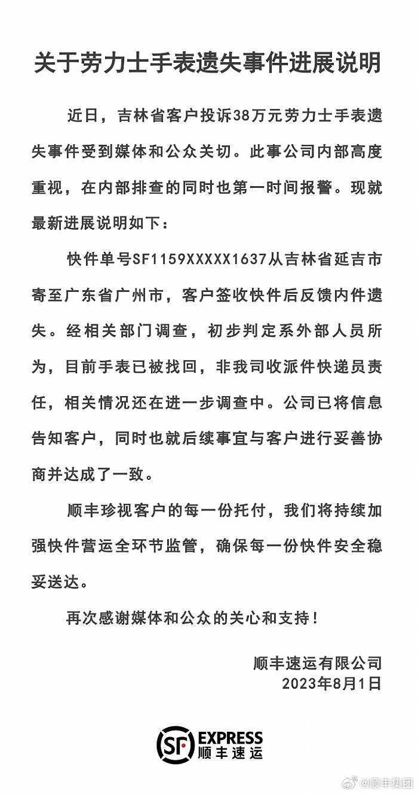

# 客户寄38万元劳力士手表后遗失，顺丰：已找回，初步判定外部人员所为

据顺丰集团官博，8月1日，顺丰速运有限公司通报劳力士手表遗失事件进展：快件单号SF1159XXXXX1637从吉林省延吉市寄至广东省广州市，客户签收快件后反馈内件遗失。经相关部门调查，初步判定系外部人员所为，目前手表已被找回，非我司收派件快递员责任，相关情况还在进一步调查中。公司已将信息告知客户，同时也就后续事宜与客户进行妥善协商并达成了一致。

