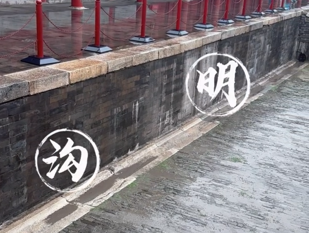

# 故宫辟谣600年不积水 工作人员：历史文献中经常发现被雨侵袭

日前，有网络短视频拍摄了故宫博物院慈宁宫暴雨时积水的画面，对故宫的排水系统功能提出质疑。

7月31日，北京遭遇暴雨天气，故宫的排水系统处于怎样的状态，是否出现了视频中的严重积水呢？故宫沿用了600多年的排水系统是怎样工作的呢？

故宫博物院世界遗产监测部主任狄雅静介绍，故宫的排水系统是一个非常复杂的系统。

首先，雨水降到屋面上，从屋面导到了台基。院落的整体是北高南低的情况，而且是中间高两边低，所以水会通过院落中间向两边导出到明沟，之后汇流到金水河。有的院落会直接通过“钱眼儿”落到下面的暗沟，再到院落外的支沟，支沟再汇入干沟，最后流到金水河。

_图源：视频截图_

那么，故宫是否出现了视频中的严重积水？是现代科技惹的祸吗？

明清两代都会在每年三月时，打开暗沟进行清淤，目前故宫每年春夏秋进行三次清淤，清淤的次数并不少。为什么慈宁宫还会积水，可并不是现代科技清淤不行，而是工作人员在暗沟里发现了只有现代社会才有的产物：塑料瓶、塑料袋，还有毛巾，甚至衣物，这些东西堵住了暗沟的排水。疏通后，目前已经排水顺畅。

网上所说的故宫建成600多年没有过积水，是真的吗？

在历史文献中经常发现，故宫整个区域出现屋面漏雨、墙垣倒塌，还有院落积水这样的一些记载，比如光绪十一年的阴历四月，从东华门到西华门这一带积水“数尺不等”，但是积水积完了以后大家的做法都是尽快的找到堵点，把它清理了，就能快速地恢复它的排水功能。

【来源：北京新闻广播、九派新闻】

