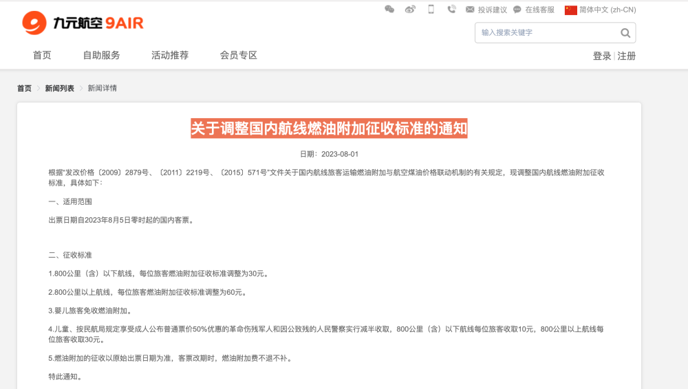

# 机票燃油附加费今年年内首次上涨，8月5日起单程最低30元

机票燃油附加费今年年内首次上涨。

8月1日，澎湃新闻记者获悉，在线旅游平台“去哪儿”收到中国东方航空公司、九元航空公司等航司消息称，自2023年8月5日（出票日期）起，成人旅客：800公里（含）以下航线每位旅客收取30元燃油附加费，800公里以上航线每位旅客收取60元燃油附加费。

澎湃新闻记者发现，九元航空已于8月1日在官网发布关于调整国内航线燃油附加征收标准的通知公告。

 _九元航空官网_

8月有出游需求的旅客，在5日前订票可节省10/30元燃油附加费。

为在一定程度上降低航油价格波动风险，保障航司经营，航司在规定范围内可自主确定国内航线旅客燃油附加费收取标准。此前，航空方面相关人员向澎湃新闻记者表示，国内航线的燃油附加费征收采取的是与航空煤油价格联动机制，受油价波动影响，各家航司都会相应调整。

此次调整为2023年以来燃油附加费首次上涨，较上月涨了10/30元，但与年初的60/120元相比，依然较低。在燃油附加费征收标准调整（8月5日）前，燃油附加费仍为20/30元，有出游需求的旅客可尽快购票。

去年8月5日起，在国内航班机票燃油附加费征收标准上调多月后迎来下调，调整至80元/140元。紧接着去年9月5日起，燃油附加费去年年内第二次下调，调整至60元/120元。而今年1月5日起，燃油附加费新年首次下调，调整至40元/80元。4月5日起，调整至30元/60元。6月5日起，调整至20元/30元。在持续下调中，今年8月5日起，迎来首次上涨，调整至30/60元。

去年2月5日，航空公司恢复征收国内航线燃油附加费，分为10元和20元两档。此后至去年8月5日前的每个月，燃油附加费持续上调。其中，去年7月5日收取标准再度上调后，燃油附加费涨至100元/200元，为我国自2000年开始征收燃油附加费以来的最高收取标准。（澎湃新闻记者
邵冰燕）

