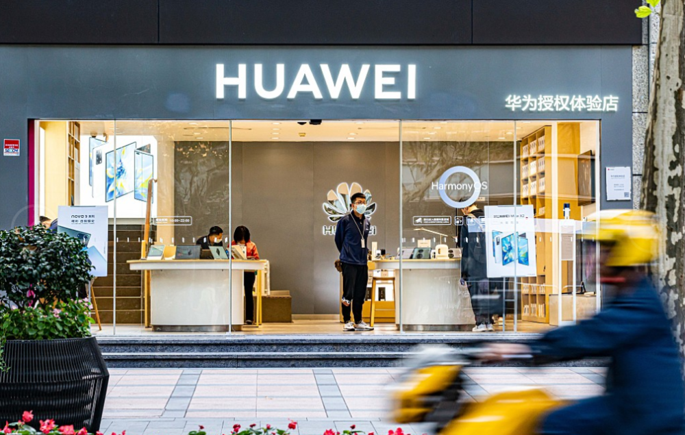
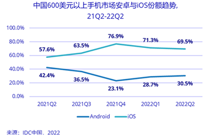

# 渠道商爆料：华为高端5G手机或10月后上市｜深网独家

_来源：视觉中国_

作者丨张睿

编辑丨康晓

出品丨深网·腾讯新闻小满工作室

渠道商章华（化名）第一次得到华为5G手机即将回归的消息是在6月初。

章华向《深网》表示，今年6月，华为终端BG首席运营官何刚在给华为渠道商开视频会议时透露：10月份以后，华为会有重大的消息公布。

何刚并没明确说明这个重大消息是否和5G手机有关，但已有华为内部人士向章华暗示，华为10月份会推出5G手机。如果未来想要分货更多的5G手机，现在需要提货更多的鼎桥M40等华为智选产品。

据《深网》获悉，鼎桥通信技术有限公司是诺基亚和华为的合资公司。鼎桥M40和华为Mate40的外观几乎一致，比较明显的区别是鼎桥M40机身后盖上的Logo是“TD
Tech”，而非“HUAWEI”。

“渠道内有消息称，目前鼎桥还有约10几万台的库存，所以他们需要通过渠道把鼎桥手机的存货消化下去。”章华透露。

由于章华对华为10月份能否推出5G手机存疑，他对是否提货鼎桥M40等华为智选产品一直犹豫不定。

**“6月初，渠道中确实有传华为10月份会有5G手机，但即使有目前也只是小批量生产。预计仅有核心大商才能分到货，和现在华为Mate
X3销售通路类似。”对于华为下半年是否能推出5G手机，华为另外一个区域的核心大渠道商林宁对《深网》表示。**

与章华对华为10月份推出5G手机抱有很大希望不同，林宁对相关传闻并不在意。“去年年中就传出华为今年要量产5G手机，给什么就卖什么吧。”林宁说。

在林宁看来，品牌希望给核心渠道商希望，让渠道商和厂商一起扛过行业寒冬。

对于华为通过5G手机搭售鼎桥M40等华为智选产品的做法，林宁对《深网》解释，华为对核心大商相对强势，他们想向下压货华为智选等商品不需要拿5G手机推动。华为对Mate系列和P系列是按渠道商级别和门店级别来分货的，如果渠道商经营的是旗舰店或者体验店Plus，即使渠道商不主动提货，华为也会主动给分货。

“对于核心大商来说，华为推出的商品都要跟进，后来华为推出的智能家居和问界汽车，满足条件的核心大商都要跟进。”

但与此前主要经营华为手机相比，智能家居和汽车业务并不能保证华为大商的盈利。“今年我公司旗下的门店整体都在亏损。”有华为大商对《深网》透露。

因此，提升华为旗舰手机供货量是渠道商当下的最大诉求。

**华为提升旗舰机出货目标**

因众所周知的原因，华为旗舰手机P系列和Mate系列已经缺席5G手机两年多。华为5G手机何时回归，一直是手机行业及华为核心渠道商关注的焦点。

6月中旬，有消息传出“高通恢复对华为提供5G芯片供应”，对此，华为常务董事、终端BG CEO、智能汽车解决方案BU
CEO余承东对《第一财经日报》表示：“这是假消息。”

对于华为上调2023年手机出货量的消息，华为相关人士表示，由于P60、Mate
X3等手机销量均较为理想，华为确实上调了今年手机出货量目标，但具体数不便透露。

截至目前，华为从未公开透露5G手机和芯片方面的重要进展。

**“我们也希望华为能推出5G手机，毕竟在以前行情好的时候，一个旗舰店一年赚个百万没问题。”**
在林宁等核心大商看来，在华为缺席5G旗舰手机的背景下，仅靠卖车和智能家居业务，短期内难以盈利。

华为手机真正崛起始于2014年，自2017年超过OPPO成为国内第一的手机厂商后，华为一直蝉联至2020年。据Canalys数据显示，华为（包括荣耀）2020年在中国智能手机出货量为1.233亿台，以38%的市场份额位居第一。

因为众所周知的原因，在此后的两年内，华为手机出货量一路下滑。据市场研究机构 Omdia数据显示，2022 年华为手机出货量仅为 2800
万部。由于手机缺货，华为渠道商2021年一度面临无货（手机）可卖的难题。

为了稳住核心大商，华为于2022年开始重推智能家居和问界（华为和赛力斯合作推出的新能源汽车）业务。据《深网》获悉，从去年开始，面积在300平米以上的体验店可以申请智能家居及卖车业务。

但有华为渠道商对《深网》反馈：目前看，智能家居及卖车带来的收益不足以弥补手机销量下滑带来的亏损。“华为手机此前的毛利率在10%-12%之间，卖一台车的毛利率不到8%，一台价格26万左右的车，毛利还不到2万。”去年就上线了问界业务的渠道商对《深网》反馈。

此外，与去年相比，受价格战影响，问界销量明显下滑。“截至到5月份，我们省问界的销量还没去年两个月的多。”有华为渠道商对《深网》透露。

数据显示，赛力斯集团今年5月销量达 16740 辆，同比下降 16.27%，其中新能源车销量为 8562 辆，同比下跌 18.08%；前5月销量 73409
辆，同比下降 26.57%。

**华为5G手机回归 先受伤的是苹果？**

2022年，华为手机出货量已经滑落至Others行列，排名前5的手机品牌分别为vivo（18.6%）、荣耀（18.1%）、OPPO（16.8%）、苹果（16.8%）、小米（13.7%）。

转折点出现在2023年第二季度，华为回归前五，缩小和领先者的差距。据IDC数据显示，这一季度，中国智能手机市场出货量约6570万台。其中，华为以13%的市占率和小米同时位居第五的位置。

**“随着新品发布节奏的正常，华为出货量继续恢复，二季度在TOP厂商中同比增幅最大。虽然依然受到外部限制，但凭借新品P60系列和折叠屏Mate
X3系列的优异表现，华为在600美元以上高端市场上保持在第二位。”IDC分析称。**

华为已经在600美元以上高端市场上位居第二，假如华为5G手机回归，势必造成国内手机市场的重新洗牌。在出货量前五的品牌中，先受到冲击的或是以高端手机著称的苹果。

2020年之前，除线上品牌荣耀外，华为手机涵盖低、中、高三个价位。其中，中低端机型有畅享系列、麦芒系列，中高端机型有Nova系列，高端手机主要是Mate系列和P系列。

2020年9月之后，“被动”撤退的华为除了出售荣耀外，还对手机产品线整体削减，把中低端系列手机交给了三大运营商，仅保留高端的P系列和Mate系列。据报道，畅享给了联通，麦芒给了电信，NOVA
给了移动。

现在华为自有手机品牌为高端的P系列和Mate系列，假如华为5G手机回归，最先搅动的是高端手机市场，这意味着曾经蚕食华为高端市场份额的苹果将面临一场“恶战”。

在2020年第三季度之前，国内手机高端市场一直被苹果和华为把持。据IDC数据显示，2020年上半年，华为以44.1%的份额位居榜首，苹果以44%的占比紧随其后，小米OV加起来还不到12%。

在之后的两年里，苹果蚕食了华为大部分高端手机市场份额。据IDC数据显示，苹果在2021年第四季度占据了70%以上的高端手机市场。

何刚曾在今年春季发布会上透露了一个细节，在5000元以上手机市场中，每当华为发布新机，苹果的市场份额都会下跌。“在高端手机产品上，可能和苹果硬杠只有华为，所以在高端市场上我们应该还是最强的那一家。”何刚说。

当然，华为能否在国内高端手机市场抢回“老大”的位置，关键点在于5G手机何时回归。按照惯例，华为每年3月发布P系列手机，9月份发布Mate系列手机。华为5G手机能否回归，2个月后答案就会揭晓。

