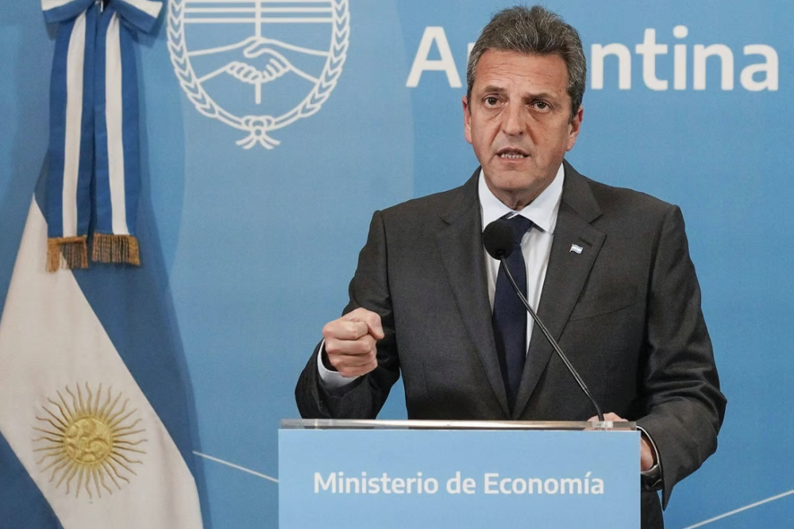

# 用人民币向国际货币基金组织偿还外债，阿根廷经济部长：感谢中国政府

（观察者网讯）据《南华早报》等7月31日报道，当地时间周一，阿根廷经济部长马萨宣布，该国政府将向国际货币基金组织（IMF）偿还即将到期的27亿美元债务。其中17亿美元将动用中国与阿根廷货币互换协议下的等值人民币支付，另外10亿美元为拉美开发银行提供的过渡性贷款。

报道称，6月30日阿根廷政府曾使用特别提款权和人民币向IMF部分还款，此为该国首次使用人民币偿付外债。马萨在讲话中感谢拉美开发银行的支持，并特别感谢了中国政府提供的帮助。

_7月31日，阿根廷经济部长马萨在新闻发布会上就偿还IMF债务发表讲话 图自视觉中国_

综合路透社报道，根据协议安排，阿根廷向中国央行存入比索以换取人民币。如此，布宜诺斯艾利斯方面就能在不动用美元储备的情况下向IMF组织还款。

当地时间周一，马萨在电视讲话中表示：“我想让你们安心——阿根廷今天不会动用外汇储备中一美元来支付到期债务。”他补充说，阿根廷目前面临的挑战是“在保持经济活动水平的同时，继续维持（外汇储备）”。

讲话中，马萨代表阿根廷政府特别向中国政府表示感谢，称中方做出同意授权的决定，此举将确保阿根廷在履行对IMF组织付款义务的同时，仍有能力继续保持出口。

《南华早报》引述《华盛顿邮报》采访一名阿根廷政府知情人士的话称，在IMF承诺的资金到位之前，中国的参与可能起到“临时桥梁”的作用。

阿根廷天主教大学国际关系副教授阿里尔·冈萨雷斯·莱瓦吉（Ariel Gonzalez
Levaggi）表示，对于美元储备不足的阿根廷来说，与中方的货币互换协议避免了该国面临一个“戏剧性局面”，“阿根廷正试图争取时间，中国无疑是助了一臂之力。”

报道还称，这项协议标志着，继今年6月阿根廷宣布允许该国商业银行开设人民币账户业务后，这个南美国家在更广泛使用人民币方面“又迈出一步”。

国际政治科学协会 （IPSA）亚历山大·科埃略（Alexandre
Coelho）指出，虽然这项协议可能并不会给中国带来直接的经济优势，但它“一定有助于扩大人民币作为国际货币的广泛使用”。

他分析称，虽然自2016年以来人民币就被正式纳入IMF组织特别提款权（SDR）货币篮子，但它用于债务结算的情况并不常见，阿根廷的选择开创先例，未来可能有其他处境相似的新兴国家将采用相同策略。

“这项协议或许也能显示出，美国在IMF的影响力已经下降了多少。”科埃略进一步补充道，“过去美国政府曾多次利用在IMF的影响力来指导拉美政策。（但现在）中国正在进步，而美国只是袖手旁观。”

据阿根廷《民族报》早前报道，今年以来，受严重干旱打击，阿根廷经济作物玉米和大豆的出口受创，导致该国外汇储备大幅下降、通胀率涨高至109%，继而威胁到阿根廷的贸易支付和债务偿还能力。

阿根廷货币过去12个月内贬值一半，央行的美元储备处于2016年以来的最低水平。6月19日，阿根廷央行外汇储备降至320亿美元以下，为近6年来首次。

与此同时，受俄乌冲突和美西方对俄制裁等因素影响，美元在全球贸易中的霸主地位受到削弱。

今年3月，阿根廷政府与IMF组织敲定新的债务重组协议。在最后期限的前一天（6月29日），阿根廷经济部长马萨终于与IMF官员达成协议，宣布决定使用特别提款权和人民币向IMF支付部分债务，这也是阿根廷首次使用人民币偿付外债。

_阿根廷经济部长马萨（左）与IMF官员举行谈判 图自阿根廷媒体_

早前官方消息曾表示，偿还这笔到期债务后，IMF将再次赋予阿根廷预计30亿美元的特别提款权，届时阿根廷将返还这笔人民币。

阿根廷咨询公司C&T Asesores主管卡斯蒂廖尼（Maria
Castiglioni）当时对彭博社表示，阿根廷“唯一的选择就是从中国的货币互换额度中获取人民币”。路透社此前也指出，在此背景下，积极推进人民币国际化的中国在南美获得立足点。

阿根廷央行1月表示，阿根廷和中国已正式扩大货币互换协议，此举将强化阿根廷已有1300亿元人民币的外汇储备，并激活350亿元人民币可支配额度。

4月26日，阿根廷经济部长马萨宣布，阿根廷将停止使用美元来支付从中国进口的商品，转而使用人民币结算。6月2日，马萨率团到达北京，与中方签署共建“一带一路”合作规划。《民族报》称，马萨此行目的之一，在于与中方“磋商扩大货币互换协议”。

6月29日，阿根廷中央银行发布公告称，将人民币纳入阿根廷银行系统允许进行存取的币种，批准阿根廷国内银行机构开设人民币储蓄和活期存款账户业务。公告指出，此举是为人民币在阿根廷对外贸易和当地金融市场中广泛使用提供便利。

根据彭博社早前报道，在阿根廷，使用人民币已经成为企业常态。

根据阿根廷海关机构数据，已有500多家阿根廷公司要求用人民币支付进口货款；阿根廷交易所的数据显示，人民币交易在阿根廷外汇市场的占比最近达到了创纪录的28%，而上个月最高仅为5%。

“在阿根廷，人人都有人民币（Yuan for everybody）。”彭博社形容道。

**本文系观察者网独家稿件，未经授权，不得转载。**

