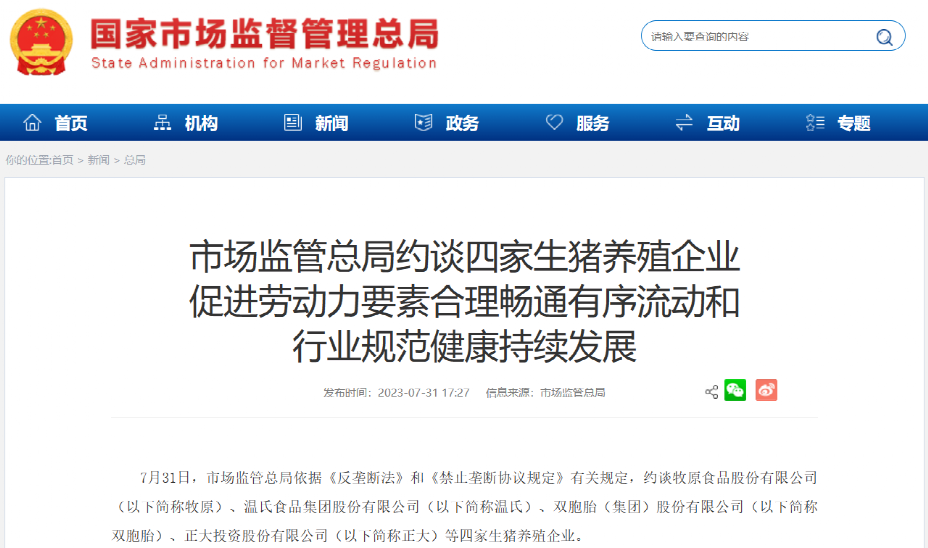
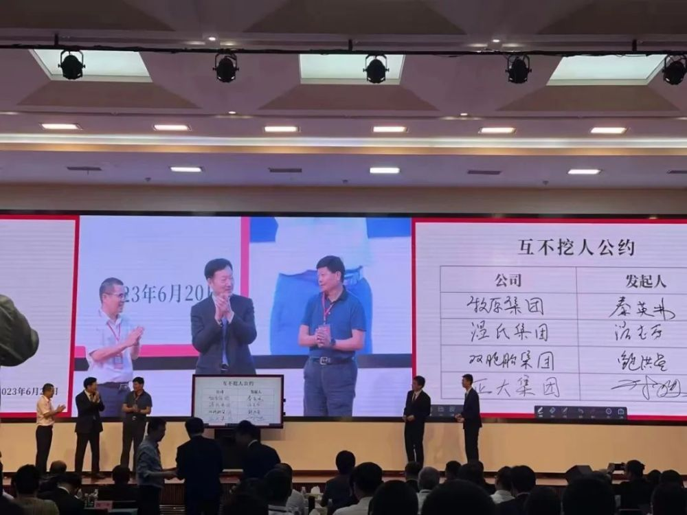

# 联合倡议“不挖人、不拆台”，四大巨头被约谈，最新回应：我们错了

7月31日，国家市场监管总局约谈了牧原股份、温氏股份、双胞胎、正大投资等四家生猪养殖巨头。此前6月20日，上述四家企业作为发起人，签署《互不挖人公约》，倡议不挖人、不拆台等。

被约谈后，牧原股份、温氏股份、双胞胎、正大投资四家公司随即发布联合声明，撤销“互不挖人”倡议。

**有违反垄断法精神**

7月31日，国家市场监督管理总局依据《反垄断法》和《禁止垄断协议规定》有关规定，约谈牧原食品股份有限公司、温氏食品集团股份有限公司、双胞胎（集团）股份有限公司、正大投资股份有限公司等四家生猪养殖企业。

市场监管总局表示，2023年6月20日，上述四家企业作为发起人，签署《互不挖人公约》，倡议不挖人、不拆台等，有违《反垄断法》精神，不利于构建全国统一大市场。

约谈会要求，四家企业要高度重视《互不挖人公约》存在的问题，切实增强责任意识，坚持依法合规经营。

一是立即采取有效措施，主动抓好整改，消除行为危害后果，规范自身经营行为。

二是深刻吸取教训，对照《反垄断法》及配套规定排查反垄断合规风险，全面自查自纠。

三是加强合规管理，完善合规制度建设，切实提升反垄断合规意识和能力。

同时，市场监管总局表示，将密切关注劳动力市场竞争状况，加强常态化反垄断监管执法，及时回应社会关切，切实保护市场公平竞争，维护消费者利益和社会公共利益，促进劳动力要素合理畅通有序流动，推动行业规范健康持续发展。

7月31日，上述四家企业在牧原集团网站发布声明称，6月20日联合发布的关于互不挖人的倡议，旨在促进行业健康文明发展，其中部分表述表意不当，有违《反垄断法》精神，引发社会关注。

公司诚恳接受市场监管总局在约谈中指出的问题，将立即整改，消除行为危害后果。此外，四家企业表示
**，关于该倡议，从未制定具体细则或实施相关措施。为避免造成误解，现决定撤销该倡议**
，并严格遵守《反垄断法》等法律法规，支持行业内人才自由流动，推动行业健康发展。

**“减少内卷不挖人不拆台”**

据每日经济新闻此前报道，今年6月18日—6月21日，养猪巨头牧原集团在河南南阳举行开放日活动。期间，一张“互不挖人公约”的图片在业内传开并引发热议。

牧原集团6月20日发布消息，牧原集团联合温氏、双胞胎、正大向行业发出倡议，尊重行业秩序，打造商业文明，签署互不挖人公约。公约显示：“为减少内卷，文明发展，我倡议：不挖人，不拆台。如有违约，加倍反制。”

当时据澎湃新闻报道，温氏股份相关人员表示，联合发出倡议是真实的，网络流传的图片内容也是真实的，但发起相关倡议的具体背景尚不太清楚。而据券商中国报道，牧原股份相关人士表示，此举主要是向行业发出倡议，尊重行业秩序，打造商业文明。

 _图片来源：澎湃新闻_

此前媒体报道称，一位与会人士透露，牧原作为养猪规模最大的企业，被其他公司从团队挖走不少专业技术人才，才发起了这个公约。

农财宝典新牧网总编辑、农财智库创始人彭进撰文称，大面积挖人确实在行业洗牌期非常流行，引起了行业的反思。但这种公约，对打工人不见得是好事情。它更多具有象征意义，不一定在法律层面具有合法性或可操作性。它可能只是部分老板的美好愿望。

**猪企上半年大面积亏损**

2019-2020年，猪价快速上涨，各大企业迅速扩张抢占市场份额，同一时期人才流动也相对较多。近一段时间，猪价在底部徘徊，猪企面临严重亏损。

据界面新闻报道，2023年上年年生猪均价14.6元/公斤，而当前养猪业的平均养殖成本为15.3元/公斤多一点。这意味着出栏一头生猪亏损约200元。

农业农村部畜牧兽医局负责人陈光华称，出现这种现象的主要原因还是阶段性供大于求。陈光华还称，2023年春节后猪肉消费处于淡季，消费量虽然比去年同期有所增加，但增速低于市场预期，猪肉价格支撑乏力。

反馈到在生产端，生猪出栏越多，企业亏损越大。2023年上半年，牧原股份、温氏股份、新希望、天邦食品、正邦科技生猪出栏量位居前五，虽然目前温氏股份仍未公布业绩预告，但其余四家猪企的预计总亏损数额也接近22家上市猪企整体预亏损数额的一半。

其中，牧原股份的出栏量、亏损数额均系行业最多。该公司7月14日发布的业绩预告显示，预计上半年亏损25.5亿元-32.5亿元。不过，相对于去年同期，牧原股份同比减亏51.37%-61.85%，减亏主要原因是生猪销售均价较去年同期有所上升，且生猪养殖成本有所下降。6月份公司生猪养殖完全成本为14.6元/kg，较4月份下降0.7元/kg，较去年同期下降超过1元/kg。

值得注意的是的，7月底，猪肉价格每公斤升至15元。不过这一趋势能否维持，仍有待观察。

**编辑|** 卢祥勇杜恒峰

**校对|** 汤亚文

每日经济新闻综合自国家市场监管总局、牧原股份官网、界面新闻、澎湃新闻

每日经济新闻

