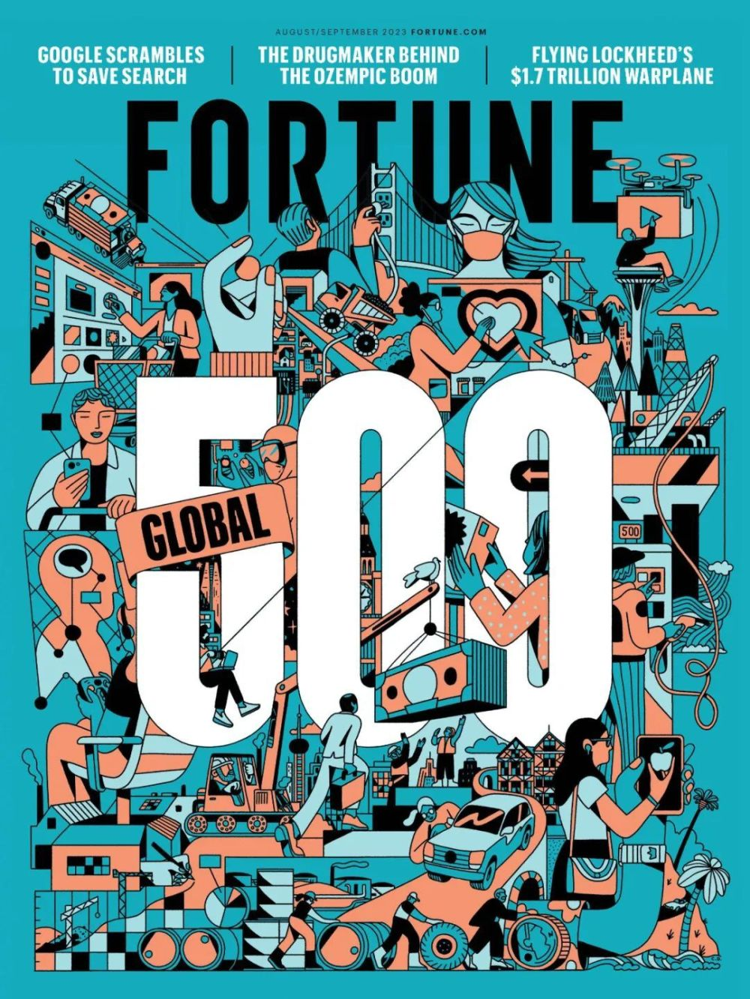
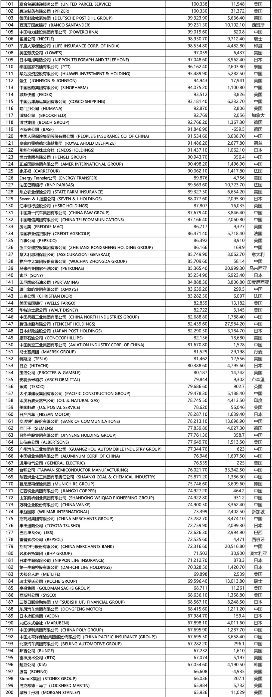
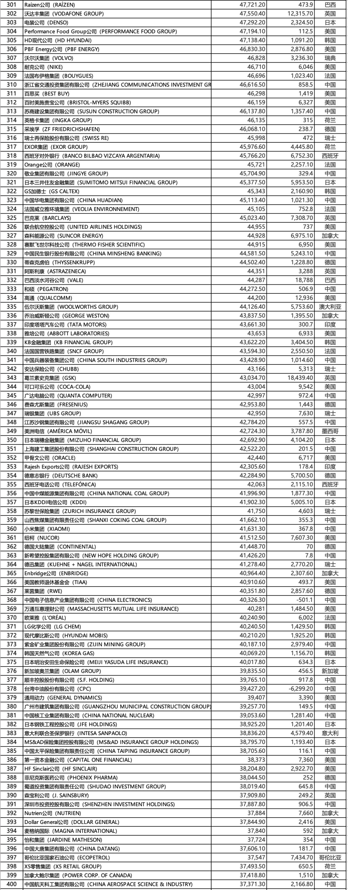
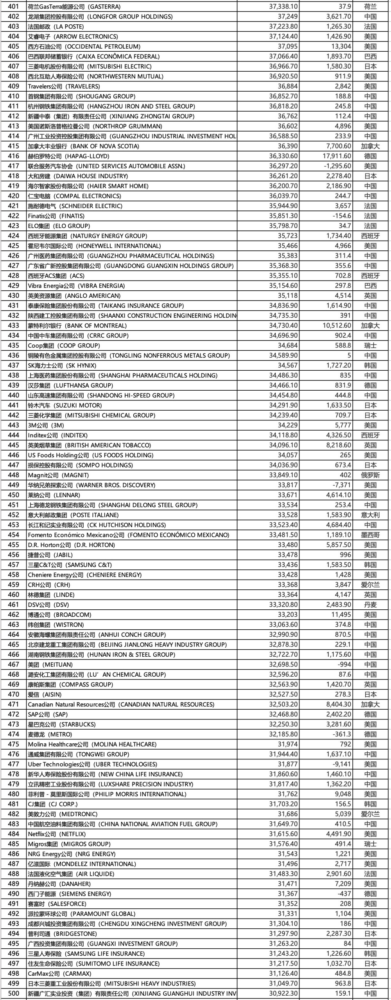

# 2023年《财富》世界500强排行榜揭晓 多数中国企业排位下滑

财富Plus APP于北京时间2023年8月2日与全球同步发布了最新的《财富》世界500强排行榜。
**未来更多榜单和深度商业报道请关注“财富中文网”官方网站和微信。应用商店搜索“财富Plus”，安装官方APP，第一时间获得通知，同时可以免费查询和分析所有历史数据。**

依据这个榜单的数据，人们可以了解 **全球最大企业**
的最新发展趋势。通过纵向年份和横向行业的比较，人们既可以了解不同国家大公司的兴衰，也可以了解公司的销售收益率、净资产收益率、全员生产效率等经营质量的变化。与此同时，深入到国家或地区的研究可以揭示大企业群体分布的变化。对中国读者来说，尤其是可以借此深入了解中国和世界大公司的竞争趋势、优劣势和潜在差距。

今年《财富》世界500强排行榜企业的营业收入总和约为41万亿美元，比上年上涨8.4%。进入排行榜的门槛（最低销售收入）也从286亿美元跃升至309亿美元。但是，受全球经济下行影响，今年所有上榜公司的净利润总和同比减少6.5%，约为2.9万亿美元。

沃尔玛连续第十年成为全球最大公司。沙特阿美首次上升至第二位。中国的国家电网公司继续位列第三。排在第四和第五位的分别是亚马逊和中国石油。

在世界500强整体利润下降的趋势下，仍有很多公司实现了利润大幅增长。在盈利方面，沙特阿美利润增长了51%，以约1,590亿美元的利润位居利润榜榜首。利润榜前五位中有三家科技企业：苹果公司位居利润榜第二位，利润超过998亿美元；微软利润同比大增114亿美元，以727亿美元的利润上升至利润榜第三位；谷歌母公司Alphabet和美国邮政分列利润榜第四、第五位。利润榜前十位中的两家中国公司分别是中国工商银行和中国建设银行，其中工商银行的利润超过535亿美元。

**上榜中国企业数量增长停滞**

**多数排位下滑**

**今年，加上台湾地区企业，中国共有142家公司上榜，大公司数量继续位居各国之首。**
值得注意的是，今年中国大陆（包括香港）上榜企业数量近15年来首次下滑，比上年减少一家，为135家。作为对比，美国今年共计136家公司上榜，比上一年增加12家，重新超过中国大陆的上榜公司数量。但是，两者仍然一起形成双头并进的局面，在大企业数量上共同领先全球其它国家和区域。

贸易、疫情和战争三大事件改变了全球经济，全球产业链开始了全面重构。外部的经济、政治、军事冲突极大地影响了中国经济以及中国企业的发展，并直接影响到进入排行榜的中国企业。

此次，135家中国大陆（包括香港）的企业中，除去7家新上榜企业，以及4家位次不变的公司，有35家企业位次上升，但是89家位次下降。换言之，在可计算变化的128家企业中，69%的企业在排行榜中的位次下降了。其中，行业分类下的所有大陆上榜公司排位均有下滑的包括：商业银行（9家）、保险公司（7家）、航天与防务（5家）、建材（2家）、邮件/包裹及货物包装运输（2家）等。除了新上榜的立讯精密以外的5家电子、电气设备公司，以及除了新上榜的美团以外的3家互联网公司排位也都有下滑。
**整体排位均未下滑的行业仅有公用设施行业（3家）。此外，4家化学品公司及2家运输与物流企业排位都有不小的提升** 。

**新能源车技术的创新与突破：两匹黑马**

2001年加入世界贸易组织时，中国没有汽车工业企业的规模达到上榜标准，2023年《财富》世界500强排行榜上有了9家中国汽车企业，跻身全球最大汽车企业行列。值得注意的是，在这9家企业中，中国企业实现新能源车技术创新与突破，出现了两匹黑马。2022年度，比亚迪以其新能源技术优势，销售收入达到630亿美元，从2021年度排行榜第436位跃升到2022年的第212位，是排名提升最多的中国公司。而宁德时代以其488亿美元的销售收入第一次进入《财富》世界500强排行榜，排名就达到第292位。

**上榜中国企业盈利不及排行榜平均水平**

**仅有4个领域企业销售收益率超过5%**

中国142家上榜公司2022年营收总额超11.7万亿美元，相比去年145家上榜公司，营收总额提升1.7%。但是，美国企业平均利润是80亿美元，上榜中国大陆（包括香港）企业平均数为39亿美元，不到上榜美国企业的一半，也未达到全榜单500家企业的平均利润——58亿美元。

特约作者王志乐的分析文章《中国大公司群体面临“高质量发展”的挑战》指出：从2001年加入世界贸易组织以来，上榜中国大陆（包括香港）企业从数量到质量都出现负面的发展还是第一次。这一情况应当引起我们高度重视。
**（关注“财富中文网”官方网站和微信，应用商店搜索“财富Plus”安装官方APP，免费获得“世界500强上的中国公司”、“最赚钱公司”、“亏损公司”、“行业”、“ROE”、“利润率”等相应子榜单）**

《财富》杂志今年发布的排行榜把所有企业按照其经营领域进行分类。所谓经营领域（sector）包括了若干细分产业。例如，金融领域包括银行、保险公司、多种经营财务公司、房地产企业。上榜135家中国大陆（包括香港）企业分属15个经营领域。在这15个经营领域中，仅有4个领域企业销售收益率超过5%，即金融、运输、电信和高技术领域。更多有关中美行业结构比较，请参考明日发布的王志乐的分析文章。
**（应用商店搜索“财富Plus”，安装官方APP，第一时间获得通知）**

**中美互相依存**

从榜单可以看出：外国企业不可能与中国企业完全断链、脱钩，中国企业同样不可能与全球企业脱钩。中国有20家企业集中在工业材料领域，生产钢铁、有色金属以及建材。美国上榜企业中仅有一家公司在工业材料领域。美国企业显然需要中国企业的金属材料。事实上，中国的金属材料以各种形式（产品或原材料）大规模进入美国市场。

反过来，美国企业的零部件提升了中国企业产业链在全球地位。上榜美国15家高技术企业不少与中国企业有密切的合作，尤以芯片、计算机软件对中国高技术产业发展有重大影响。

王志乐指出：中美双方企业积极促进，双方政府加强沟通，在全球产业链重构过程中，中美双方企业有可能更加理性地继续合作。中国企业和美国企业都应该抓住这个机遇。

此次《财富》世界500强排行榜一共有39家新上榜和重新上榜公司，其中有7家中国公司，它们是：宁德时代新能源科技股份有限公司、广州工业投资控股集团有限公司、广东省广新控股集团有限公司、陕西建工控股集团有限公司、美团、通威集团有限公司、立讯精密工业股份有限公司。39家公司中，15家是能源公司。由于欧洲天然气价格飙升，德国能源公司Uniper重新上榜世界500强，并高居第16位。
**（应用商店搜索“财富Plus”安装官方APP，免费获得往年历史数据。）**

在净资产收益率（ROE）榜上，家得宝公司以超过1,095%的净资产收益率跃升至首位，苹果名列第二，葛兰素史克集团位列第三，两家公司净资产收益率都超过140%。净资产收益率最高的50家公司中，只有两家中国公司——通威集团以42.9%的净资产收益率位列第34位，台积公司则位列第47位。在ROE方面，中国公司中排位前10的是：通威集团有限公司、台积公司、联想集团有限公司、腾讯控股有限公司、中国人寿保险（集团）公司、紫金矿业集团股份有限公司、美的集团股份有限公司、湖南钢铁集团有限公司、立讯精密工业股份有限公司和宁德时代新能源科技股份有限公司。

在利润率榜上，美国邮政凭借高达71%的净利润率高居榜首。受益于海运价格持续高位运行，首次上榜的德国航运公司赫伯罗特位居利润率榜第二位，利润率高达49.3%。台积公司则以43.9%的利润率位居第三。值得注意的是，在中国上榜公司中利润率排前十的公司，除了台积公司和腾讯外，全部是商业银行。

在排名位次的变化上，今年上升幅度最大的是TD
Synnex公司，跃升236位，位列第215位。比亚迪是排名上升幅度第二大的公司。其余上升超过50位的中国公司有：台湾中油股份有限公司、山西焦煤集团有限责任公司、敬业集团有限公司、顺丰控股股份有限公司、台积公司、金川集团股份有限公司。

今年共有32家公司未能实现盈利，亏损榜中排名第一的是伯克希尔-
哈撒韦公司，其亏损额超过228亿美元。另外三家亏损超过100亿美元的公司分别是Uniper公司、韩国电力公司和法国电力公司。能源成本的持续走高，造成榜单中不少能源和公共事业公司出现利润下滑甚至亏损。

今年上榜的互联网公司增加至8家，中美各占半壁江山，分别是：亚马逊、Alphabet公司、京东、阿里巴巴、Meta
Platforms公司、腾讯、美团和Uber。其中美团和Uber均是首次上榜《财富》世界500强。但值得注意的是，前6家互联网公司，除Alphabet保持不变外，今年在榜单上的名次均有下滑。

——本刊编辑部

**榜单看点**

沃尔玛连续第十年成为全球最大公司，也是自1995年以来第18次登上该榜单。

中国（含台湾地区）142家上榜公司2022年营收总额超11.7万亿美元，相比去年145家上榜公司，营收总额提升1.7%。

中国上榜公司利润总和为5,618.6亿美元，美国上榜公司利润总和为10,882.7亿美元。

榜上共有118家国有企业，其中超过三分之二公司的总部位于中国。

日本今年共计41家公司上榜，相比2022年的47家，减少6家。

此次《财富》世界500强排行榜一共有39家新上榜和重新上榜公司，其中，23家为新上榜公司，16家为重返榜单的公司。

中国（含台湾地区）的142家上榜公司、美国的136家上榜公司，以及日本的41家上榜公司，占据上榜企业数量的64%，以及营收总额的68%。

来自北京、东京、纽约、首尔和上海的上榜公司，占据上榜企业数量的1/4。

银行（42家）、保险（42家）、汽车及汽车零部件制造（34家）、石油炼化（32家）、金属（24家）行业的上榜企业数量最多。

三家上榜企业的利润增长超过1,000%，其中，阿斯利康利润增长2,836%。

排名第15位的大众公司连续第二年成为全球最大的汽车制造企业。

辉瑞制药有限公司排名上升35位至第102位，成为全球最大的制药公司。

29家上榜公司的首席执行官是女性，比上年增加5家。

自1995年起，143家企业从未落榜。

**1**

**沃尔玛**

营收（百万美元）：611289

今年，沃尔玛第18次登上榜首，也是连续第十年成为全球最大的公司。在经济放缓和持续高通胀的形势下，消费者将可支配收入的更大一部分用于购买必需品。这一趋势可能会让以低价日常必需品吸引消费者的沃尔玛受益。

**2**

**沙特阿美公司**

营收（百万美元）：603651.4

在原油价格走强、销量增加和成品油利润率提高等因素的影响下，沙特阿美公司成为世界第二大企业和最大的石油公司，并再次位居该榜单利润榜的榜首。

**3**

**国家电网有限公司**

营收（百万美元）：530008.8

国家电网今年保持着去年的成绩。未来，国家电网将加快建立健全适应新型电力系统建设的体制机制，促进能源转型、保障能源安全。

**5**

**中国石油天然气集团有限公司**

营收（百万美元）：483019.2

中国石油今年排名第五位。2022年，中国石油优化调整业务板块划分，四大板块中，油气和新能源业务利润增长迅速。

**8**

**苹果公司**

营收（百万美元）：394328

苹果公司今年在榜单中的排名较去年下降一位。在利润子榜中，苹果公司位列第二，仅次于沙特阿美。今年6月，苹果公司成为全球首家市值突破3万亿美元的企业。

**15**

**大众公司**

营收（百万美元）：293684.7

大众公司是此次榜单上最大的造车企业。2022年，受芯片短缺影响，大众全球销量跌至近年最低点，但新能源转型步伐加快，纯电动汽车销量强劲增长，在中国的新能源车销量同比增长近七成。

**17**

**Alphabet公司**

营收（百万美元）：282836

谷歌的母公司Alphabet的排名与去年持平，但利润较上一年有所下降。在生成式人工智能的浪潮中，谷歌与微软的竞争备受科技界瞩目。今年2月，谷歌推出了其聊天机器人Bard。

**30**

**微软**

营收（百万美元）：198270

微软的排名较去年上升3位，并以强劲的利润增长上升至最赚钱公司的第三位。这家软件、云服务和游戏巨头，凭借对OpenAI的投资与合作，已成为人工智能领域的先行者。

**52**

**京东集团股份有限公司**

营收（百万美元）：155533.3

京东远非曾经的零售电商企业，现在更强调以供应链技术去帮助实体商家降本增效、提升消费体验获取增量价值。

**68**

**阿里巴巴集团控股有限公司**

营收（百万美元）：126812.5

今年阿里巴巴发生了重大组织变革，公司宣布分拆旗下业务，以“1+6+N”的设想，准备推动其云业务、菜鸟、盒马等相关业务或公司独立上市。

**102**

**辉瑞制药有限公司**

营收（百万美元）：100330

随着新冠疫情的结束，相关疫苗与抗病毒药物的收入可能回落，但辉瑞已经有更多新的药物即将为它创造利润，并捍卫其世界最大制药公司的冠冕。

**111**

**华为投资控股有限公司**

营收（百万美元）：95489.9

华为今年的排名下降了15位，跌出前100名。营收和利润均有下滑，其中利润跌幅达70%。但华为的企业业务依然保持较大增幅。

**129**

**Seven & I控股公司**

营收（百万美元）：88077.6

旗下拥有7-Eleven连锁便利店的Seven &
I控股公司，是此次榜上前十大日本企业中排名上升的两家之一。面对线上零售的冲击，它近期宣布将出售旗下的崇光西武百货业务，把经营资源集中于以日美为核心的便利店业务。

**145**

**华特迪士尼公司**

营收（百万美元）：82722

2023年，在世界500强榜单上的名次回升，将让华特迪士尼公司的100岁生日多几分光彩。同时，它也期待在全球经济复苏的进程中收获更多营收，以冲抵股价波动带来的负面影响。

**147**

**腾讯控股有限公司**

营收（百万美元）：82439.6

按照其首席执行官马化腾的说法，未来腾讯会把更多人员和力量投入到新的、有效的业务，而不是重复的、红海竞争的消耗战。

**152**

**特斯拉**

营收（百万美元）：81462

特斯拉的排名较去年跃升90位。为提振销量，特斯拉在全球市场多次降价，但利润率也因此面临压力。从电池、超级充电桩到储能系统，特斯拉正在拓展电动汽车行业的边界。

**167**

**通用电气公司**

营收（百万美元）：76555

2022年是通用电气宣布拆分后的第一年。随着全球航空业逐渐回暖，通用电气航空板块的营收实现双位数增长。

**173**

**万科企业股份有限公司**

营收（百万美元）：74900.5

万科今年排名较去年上升5位。在2022年股东大会上，万科董事会主席郁亮表示，当前市场短期表现确实有压力，但“道路是曲折的，前途是光明的，锚定方向，万科有信心能够穿越周期”。

**212**

**比亚迪股份有限公司**

营收（百万美元）：63040.8

连续第二年上榜的比亚迪，排名上升224位。今年3月，比亚迪首个海外乘用车生产基地奠基仪式在泰国完成。以比亚迪为首的新能源车，增强了中国汽车在全球的竞争力。

**219**

**空中客车公司**

营收（百万美元）：61804.5

空中客车公司虽然在本次榜单上的排名下滑12位，但今年，在中国市场，这家飞机制造商成为了大赢家，获得了包括160架空中客车民用飞机的批量采购协议，并将在天津建设第二条A320总装线。

**264**

**戴姆勒卡车控股股份公司**

营收（百万美元）：53581.9

2023年，人类汽车史上的传奇厂家之一戴姆勒首次进入世界500强榜单，并在所有的新上榜公司中，排名最高。

**292**

**宁德时代新能源科技股份有限公司**

营收（百万美元）：48848.7

宁德时代首次上榜就跻身前300名。我国新能源汽车近年来突进，由宁德时代所引领的动力电池产业功不可没。宁德时代董事长曾毓群近期表示，动力电池行业已从“有没有”迈入“好不好”的下半场。

**377**

**顺丰控股股份有限公司**

营收（百万美元）：39765.1

顺丰控股今年连续第二年上榜《财富》世界500强，名次相较去年上升64位。快递业的竞争已经更加激烈，顺丰也助力加大投入，以巩固自己作为行业龙头的地位。

**449**

**华纳兄弟探索公司**

营收（百万美元）：33817

2022年刚完成合并的华纳兄弟探索公司首次上榜，且在上榜公司中实现了最大营收增幅。但美国流媒体大战日趋白热化，Netflix等对手环伺，令其广告收入和新增用户不如预期，仍然深陷巨额亏损。

**467**

**美团**

营收（百万美元）：32698.5

美团今年首次上榜《财富》世界500强，排名第467位。今年，美团拓展了出境业务，明确香港的业务试点是美团国际化探索的第一步。

**484**

**Netflix公司**

营收（百万美元）：31615.6

作为流媒体播放平台，Netflix已经成为全世界影视作品是否成功的重要风向标之一。“Netflix出品”甚至成为品质保证的代名词。

**491**

**赛富时**

营收（百万美元）：31352

SaaS巨头赛富时今年首次登上榜单。2022年，公司历经董事会和高层换血、大规模裁员、激进投资者挑战、企业客户缩减开支，但仍实现了超预期的营收增长，近期更高调加入AI赛道，面向企业推出“爱因斯坦GPT”服务。

**完整榜单**

